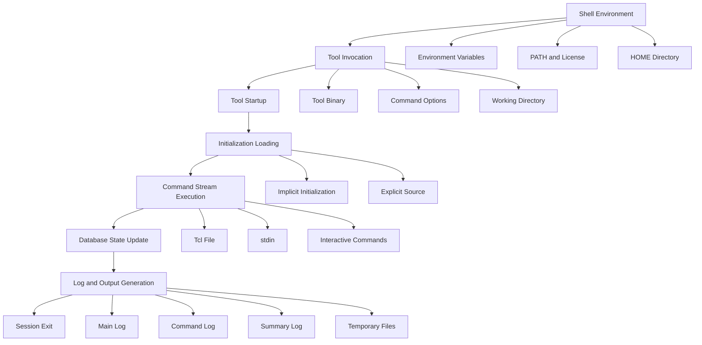

# EDA Flow Engineering Practice 02: The State Space Behind an EDA Tool Session

**Author:** Darren H. Chen  
**Series:** EDA Flow Engineering Practice  
**Topic:** EDA automation, session state, initialization model, command stream, logging infrastructure

---

## 1. Introduction

Starting an EDA tool may look like a single command:

```text
tool run.tcl
```

or:

```text
tool -batch run.tcl
```

But in a real engineering environment, this command is only the visible surface.

A tool run is better understood as entering a **session state space**.

The final behavior of the session is not determined by `run.tcl` alone. It is jointly determined by the executable path, working directory, HOME directory, environment variables, initialization scripts, command stream, execution mode, logging configuration, temporary directory, and license state.

This article models an EDA tool run as a stateful system.

The purpose is not to describe a specific commercial tool. The purpose is to explain why reproducible EDA automation requires explicit control of session state.

---

## 2. A Tool Session as a State Function

A tool session can be modeled as:

```text
Session = F(
    ToolBinary,
    ToolVersion,
    WorkingDirectory,
    HomeDirectory,
    EnvironmentVariables,
    LicenseState,
    InitScripts,
    CommandStream,
    RuntimeOptions,
    LogSystem,
    TempDirectory,
    ExecutionMode
)
```

This model explains why the same Tcl script may behave differently in different environments.

For example:

```text
The same script works for one user but fails for another.
The same script behaves differently in two directories.
The same script works in GUI mode but fails in batch mode.
The same script produces different logs depending on startup files.
The same script fails after the shell environment changes.
```

In many cases, the script is not the only changing variable. The session state has changed.

---

## 3. State Variable 1: ToolBinary

The first state variable is the executable itself.

Calling a tool by name:

```text
tool
```

implicitly depends on `PATH`.

If `PATH` changes, the actual executable may change.

A more reproducible flow fixes the executable explicitly:

```csh
setenv EDA_TOOL_BIN /path/to/release/bin/tool
```

Then verifies it:

```csh
$EDA_TOOL_BIN -version
```

The tool binary determines:

```text
Supported commands
Supported options
Default behavior
Internal bug fixes
Log format
Startup behavior
License mechanism
Database compatibility
```

Therefore, `ToolBinary` is not a trivial variable. It is one of the most important inputs to the session.

---

## 4. State Variable 2: WorkingDirectory

The working directory affects more than where the command is launched.

It may affect:

```text
Relative path resolution
Default log location
Default temporary directory
Project configuration search path
Output file location
Design database location
```

Consider this Tcl code:

```tcl
source ./config/init.tcl
read_netlist ./data/top.v
```

Its meaning depends entirely on the current working directory.

A reproducible flow should therefore set the root directory explicitly:

```csh
set ROOT_DIR = /path/to/project
cd "$ROOT_DIR"
```

If supported by the tool, the working directory should also be passed as a tool option:

```text
-wd /path/to/project
```

The key idea is simple:

> The working directory is part of the session state and should not be implicit.

---

## 5. State Variable 3: HomeDirectory

The HOME directory is another important hidden input.

Many tools support user-level startup files under HOME, such as:

```text
$HOME/.toolrc
$HOME/.eda_tool/init.tcl
$HOME/.eda_tool/gui.rc
```

These files are useful for personal preferences:

```text
GUI layout
Display colors
Personal aliases
Window behavior
Interactive shortcuts
```

However, project-critical settings should not depend on HOME.

Project-critical settings include:

```text
Library paths
Technology files
Design data paths
Run options
Algorithm switches
Output directories
Temporary directories
```

If a project flow depends on HOME-level configuration, it is difficult to reproduce across users.

From a system perspective, HOME should be treated as an external disturbance unless it is explicitly controlled.

---

## 6. State Variable 4: InitScripts

Initialization scripts are among the most influential parts of an EDA session.

They may come from:

```text
Tool release defaults
User HOME startup files
Project startup files
Explicitly sourced scripts
Main run scripts
```

Initialization scripts can set:

```text
Parameters
Search paths
Library variables
Aliases
Flow variables
Logging options
Database options
Algorithm switches
```

There are two common initialization models.

### 6.1 Implicit Initialization

Implicit startup loading is convenient for interactive use.

However, it has several drawbacks:

```text
Dependencies are hidden.
Execution order may be unclear.
Behavior may differ across users.
Batch behavior may differ from GUI behavior.
The flow is harder to review and migrate.
```

### 6.2 Explicit Source

Explicit initialization makes dependencies visible:

```tcl
source $env(PROJECT_INIT_TCL)
```

This approach has several engineering benefits:

```text
Clear dependency
Clear execution order
Version-control friendly
Portable across users
Suitable for batch and CI environments
Easier to debug
```

For production flows, explicit initialization is usually safer than implicit startup behavior.

---

## 7. State Variable 5: EnvironmentVariables

Environment variables connect the shell environment to the tool process.

In `csh` or `tcsh`, it is important to distinguish:

```text
set     : shell-local variable
setenv  : environment variable passed to child processes
```

For example:

```csh
set ROOT_DIR = /path/to/project
```

is useful inside the csh script.

But if a tool or its internal Tcl interpreter must see the variable, use:

```csh
setenv PROJECT_INIT_TCL /path/to/project/config/init.tcl
```

Then the Tcl script can access it:

```tcl
source $env(PROJECT_INIT_TCL)
```

Typical environment variables include:

```text
Tool executable path
License server
Project root
Initialization script path
Library search path
Output path
Temporary directory
Run mode
```

If these variables are inherited from an uncontrolled shell environment, the session may not be reproducible.

---

## 8. State Variable 6: CommandStream

An EDA tool ultimately executes a stream of commands.

The command stream may come from:

```text
Main Tcl files
Standard input
Startup scripts
Generated Tcl scripts
Interactive command line
GUI operations
Tool internal commands
```

A realistic command stream can be modeled as:

```text
CommandStream =
    InitCommands
  + UserScriptCommands
  + GeneratedCommands
  + InteractiveCommands
  + ToolInternalCommands
```

This is why command logging is critical.

The script file answers:

```text
What did the user write?
```

The command log answers:

```text
What did the tool actually execute?
```

In complex flows, these are not always the same.

---

## 9. State Variable 7: ExecutionMode

EDA tools often support multiple execution modes:

```text
GUI mode
Shell mode
Batch mode
stdin mode
View-only mode
Non-graphical mode
```

Different modes may behave differently.

For example:

```text
GUI mode may load GUI preferences.
Batch mode may skip some interactive behavior.
stdin mode may not enter an interactive shell.
Non-graphical mode may disable layout windows.
```

Therefore, execution mode is part of the session state.

A flow intended for automation should verify non-GUI and batch execution early.

---

## 10. State Variable 8: LogSystem

Logs are not just output files. They are the observability layer of the session.

A robust EDA run should preserve:

```text
stdout log
main log
command log
summary log
error log
crash log
```

Different logs answer different questions:

| Log Type | Question Answered |
|---|---|
| stdout log | What was printed to the terminal? |
| main log | What did the tool report? |
| command log | What commands were executed? |
| summary log | What is the high-level run summary? |
| error log | What failed? |
| crash log | Can the failure state be reconstructed? |

Without logs, the session is a black box.

With logs, the session becomes observable, comparable, and debuggable.

---

## 11. State Variable 9: TempDirectory

Temporary directories may contain:

```text
Intermediate databases
Caches
Parallel job files
Generated scripts
Recovery data
Distributed execution metadata
```

If multiple runs share the same temporary directory, they may interfere with each other.

Potential issues include:

```text
Stale data contamination
Cache conflicts
Permission problems
Concurrent run conflicts
Difficult cleanup after failure
```

A better practice is to assign a dedicated temporary directory to each run:

```text
tmp/run_name.tmp
```

This makes the runtime state easier to isolate and inspect.

---

## 12. Session State Transition Model

A tool session can be viewed as a state transition system:



This model highlights an important point:

> The result of a tool run is not produced by the Tcl script alone. It is produced by a stateful session.

---

## 13. Reproducibility Means Reducing Hidden State

Reproducibility is not simply the ability to execute a script.

A reproducible flow means:

```text
Given the same explicit inputs, the session behavior should be explainable and consistent.
```

The engineering task is to reduce hidden state.

| Hidden State | Explicit Alternative |
|---|---|
| Tool found through PATH | Fixed tool path |
| Current directory | Explicit working directory |
| HOME startup files | Explicit project initialization |
| Default log path | Explicit log path |
| Default temp path | Explicit temp directory |
| GUI operations | Saved Tcl command stream |
| Shell environment | Controlled environment variables |

The more hidden state a flow depends on, the harder it is to reproduce.

---

## 14. A Generic Session Template

A generic session template can be written as:

```csh
#!/bin/csh -f

set nonomatch

set ROOT_DIR = /path/to/project
set LOG_DIR = "$ROOT_DIR/logs"
set TMP_DIR = "$ROOT_DIR/tmp"
set TCL_DIR = "$ROOT_DIR/generated_tcl"

mkdir -p "$LOG_DIR"
mkdir -p "$TMP_DIR"
mkdir -p "$TCL_DIR"

setenv EDA_TOOL_BIN /path/to/tool
setenv PROJECT_INIT_TCL "$ROOT_DIR/config/project_init.tcl"

cat >! "$TCL_DIR/run.tcl" << EOF_TCL
puts "RUN_BEGIN"

source \$env(PROJECT_INIT_TCL)

# Real design flow commands start here.

puts "RUN_END"
exit
EOF_TCL

$EDA_TOOL_BIN \
    -wd "$ROOT_DIR" \
    -batch "$TCL_DIR/run.tcl" \
    -session DEMO_SESSION \
    -log "$LOG_DIR/run.log" \
    -cmd_log "$LOG_DIR/run.cmd.log" \
    -sum_log "$LOG_DIR/run.sum.log" \
    -tmp_dir "$TMP_DIR/run.tmp" \
    >&! "$LOG_DIR/run.stdout.log"
```

The exact command-line options may vary by tool, but the engineering model remains the same.

---

## 15. Rethinking EDA Automation

Many EDA automation discussions focus only on command sequences:

```text
read design
create floorplan
place
synthesize clock tree
route
report
```

These steps are necessary, but they are not sufficient.

A mature automation flow must also manage:

```text
Tool entry point
Runtime state
Initialization order
Command source
Logging system
Temporary data
Failure recovery
Session replay
Environment isolation
```

EDA automation is not just command chaining.

It is session state management.

---

## 16. Conclusion

An EDA tool session can be modeled as:

```text
Session = F(
    ToolBinary,
    WorkingDirectory,
    HomeDirectory,
    EnvironmentVariables,
    InitScripts,
    CommandStream,
    ExecutionMode,
    LogSystem,
    TempDirectory
)
```

This model leads to several engineering conclusions:

```text
EDA tool behavior is determined by multiple state variables.
A Tcl script alone does not fully define a tool run.
Implicit initialization reduces reproducibility.
HOME-level configuration should not be a project dependency.
Explicit source, explicit logs, explicit temp directories, and explicit tool paths improve reproducibility.
Command logs are essential for observability and replay.
```

A mature EDA flow is not just a sequence of tool commands.

It is a controlled, observable, reproducible session system.
