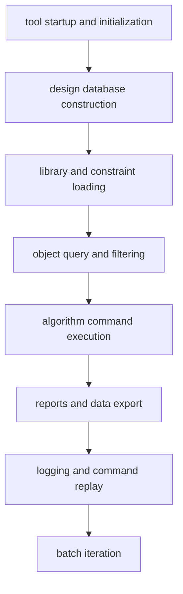
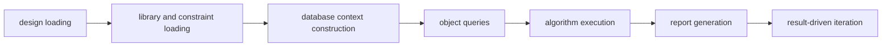

# EDA Flow Engineering 03: Why Tcl Is the Core Glue Language of EDA Flow Automation

When people first approach an EDA tool, they usually focus on the obvious “hard” capabilities:

- how strong the placer is
- how robust clock-tree synthesis is
- whether routing converges well
- how accurate timing analysis is
- whether power, congestion, DRC, and ECO can close cleanly

All of that matters.

But from an engineering point of view, the long-term usability of an EDA tool depends on something else as well:

> **whether the tool exposes a control layer that is strong enough, uniform enough, and extensible enough to turn isolated capabilities into an actual engineering system.**

In most mature EDA systems, that layer is Tcl.

So Tcl is not important merely because it makes scripting convenient.  
Its real value is that it connects:

- complex algorithms
- the design database
- the parameter system
- logging and replay
- batch execution and iterative flows

into one controllable, observable, and reproducible system.

That is why Tcl became the core glue language of EDA flow automation.

---

## 1. Why an EDA tool naturally needs a glue language

An EDA tool is not a single-function program. It is a multi-layer engineering system.

A typical session spans several layers:



These layers are not loosely related. They depend on one another tightly.

For example:

- without a database, object queries are meaningless
- without libraries and constraints, timing analysis is incomplete
- without the current context, many optimization and reporting commands are invalid
- without logs and command traces, results are hard to reconstruct
- without batch execution, a flow cannot become reusable engineering infrastructure

This means an EDA tool needs a unifying control language that can organize all those layers.

Such a language must support at least:

1. command invocation  
2. object passing  
3. parameter organization  
4. ordering and conditional control  
5. logging and replay  
6. tight embedding inside the tool  

Architecturally, that is exactly the role of a glue language.

---

## 2. Why Tcl, specifically?

Tcl is not the most fashionable general-purpose language.  
But in EDA, its longevity is not an accident. It is a consequence of engineering fit.

## 2.1 Tcl fits command-driven systems naturally

Tcl is fundamentally built around **commands and arguments**.

That matches EDA extremely well, because tool capabilities are naturally exposed as commands such as:

- `import`
- `link_project`
- `get_cells`
- `report_timing`
- `route`
- `route_optimize`
- `export_def`

This command-oriented model fits very well above a complex algorithmic kernel as a stable control layer.

## 2.2 Tcl is easy to embed into C/C++ systems

Most EDA cores are large C/C++ systems.  
Tcl has long been strong as an embedded interpreter, which makes it practical for developers to expose internal capabilities incrementally.

Architecturally, that means:

- the kernel stays in a high-performance compiled language
- the control plane is unified under Tcl
- capabilities can be exposed step by step without rebuilding the whole interaction model

## 2.3 Tcl works well for tools that evolve for years

EDA tools evolve over long time horizons:

- new process nodes appear
- new constraint models are added
- new object types are introduced
- new analysis flows are attached
- new GUI forms are exposed
- new import/export interfaces are added

If the control interface is unstable, that kind of evolution becomes increasingly difficult to maintain.  
Tcl’s command-based extensibility lets tools grow inside one control space without repeatedly redefining the external operating model.

---

## 3. What layers does Tcl actually connect in an EDA system?

If we view an EDA tool as a complete system, Tcl connects at least four layers.

## 3.1 The command system

At the surface, users see commands such as:

- `get_*`
- `report_*`
- `import`
- `load_project`
- `save_project`
- `route`
- `report_clock`
- `export_*`

These are not just convenience operations. From an engineering standpoint, they are the tool’s external API.

Tcl’s first value is that it exposes internal capabilities in a unified callable form.

---

## 3.2 The design database

One major difference between EDA tools and ordinary scripting environments is that EDA tools are usually centered on **database state**, not just files.

Many operations are actually acting on objects such as:

- modules
- instances
- nets
- pins
- ports
- clocks
- figures
- shapes
- collections
- properties

So Tcl in EDA is not merely “string-based scripting.”  
It is:

> **a scripting layer that operates on database objects.**

That changes its role completely.  
Once the control language has direct access to objects, it stops being just a command shell and becomes a database access layer.

---

## 3.3 The parameter system

Mature EDA tools typically contain a large number of parameters:

- basic parameters
- UI parameters
- database parameters
- timing parameters
- optimization parameters
- routing parameters
- hidden or expert parameters
- runtime or persistent parameters

These are not just preferences. They influence:

- algorithm behavior
- execution mode
- report interpretation
- resource usage
- session state

Tcl’s third value is that it places parameter control into one unified interface:

- set
- query
- override
- compare
- persist
- session-level adjustment

Without that layer, the parameter system tends to dissolve into a hidden mixture of GUI state, config files, and user habits.

---

## 3.4 Flow orchestration

This is arguably the most important engineering role of Tcl.

A single command is rarely the hard part.  
The hard part is organizing many commands under the right timing, the right context, and the right conditions.

For example:



Such a process naturally requires:

- variable passing
- conditional branching
- loops
- nested commands
- error handling
- intermediate result caching
- structured outputs

So Tcl’s real value is not that it can invoke one command, but that it can turn many commands into a reusable, debuggable, extensible engineering flow.

---

## 4. Why Tcl is better described as a control plane than as a scripting layer

Calling Tcl a “scripting language” is technically correct, but architecturally incomplete.

In an EDA tool, Tcl behaves more like a **control plane**.

It performs at least four roles that GUI interaction alone cannot reliably sustain.

## 4.1 Abstraction

It compresses complex functionality into uniform command interfaces.

Without that, capabilities remain trapped inside buttons and internal code paths.

## 4.2 Composition

It turns isolated operations into scripts, templates, batch jobs, and complete flows.

Without that, the tool remains largely interactive rather than systematic.

## 4.3 Observation

Through `help`, `--h`, `info commands`, parameter interfaces, object queries, and logs, Tcl exposes what the tool can do, what it accepts, and what context it is in.

Without that, automation becomes guesswork.

## 4.4 Stabilization

It allows a workable command sequence to become a reusable engineering asset.

Without that, experience stays stuck in individual memory.

At the system level, Tcl behaves like:

> **a command bus, an object access layer, a parameter control layer, and a flow orchestrator.**

That is what makes “control plane” the more accurate description.

---

## 5. Why the object model is the real technical depth of Tcl in EDA

In ordinary scripting environments, scripts mainly manipulate:

- text
- files
- paths
- strings
- config fragments

But in EDA, the most valuable thing is the object space.

That is why commands such as the following matter so much:

```text
get_cells
get_ports
get_nets
get_pins
get_property
get_select_set
```

Their importance does not come merely from frequency of use.  
Their importance is structural:

> **they reveal whether the tool is willing to expose internal database state in object form to the control language.**

Without a true object model, automation stays shallow:

- it falls back to rough name matching
- composable filtering becomes difficult
- query results are harder to reuse as downstream inputs
- logical, physical, constraint, and reporting views stay fragmented

So the real technical significance of Tcl in EDA is not its syntax.  
It is whether it genuinely reaches into the database object layer.

---

## 6. Why Tcl is also a key entry point for observability

A system becomes automatable only if it is observable.

In EDA flows, the most dangerous situation is often not “the command does not exist,” but rather:

- the command exists, but its arguments are misunderstood
- the command runs, but the context is wrong
- the command finishes, but the result is not interpretable
- two runs differ, but nobody can identify where the difference began

Tcl matters because it often provides all of the following in one place:

- command help
- meta-option help
- parameter control
- object queries
- logging
- source and replay

That means Tcl is not just an execution interface.  
It is also an **observability interface**.

And observability determines whether:

- problems can be localized
- results can be explained
- flows can be converged
- experience can be converted into reusable engineering knowledge

---

## 7. Why Tcl directly affects reproducibility in EDA flows

EDA engineering does not merely fear complexity.  
It fears **non-reproducibility**.

Typical symptoms include:

- the same command behaving differently on different machines
- the same inputs producing different outcomes over time
- results achieved manually in the GUI that cannot be replayed by script
- parameter adjustments that leave no explicit history
- debugging sessions where nobody knows exactly what happened before the failure

Tcl is one of the main tools that suppress this risk.

Once a flow becomes Tcl-driven, key aspects become explicit:

- startup mode becomes explicit
- parameter input becomes explicit
- command order becomes explicit
- object selection becomes explicit
- output paths become explicit
- error locations become explicit
- session traces become explicit

That is why Tcl’s deeper value is this:

> **it turns tool usage that depends on personal interaction habits into flows that can be replayed, audited, compared, and stabilized.**

---

## 8. Why Tcl determines whether a team can truly “own” its EDA flow

Two teams may use the same tool and still have very different engineering maturity.

The difference is often not who knows more buttons.  
It is who has actually built a Tcl control layer around the tool.

A GUI-only team typically lives with:

- memory-driven operation
- oral flow transfer
- personal parameter habits
- experience-based debugging
- screenshot-based confirmation

A team that builds a Tcl control layer gradually develops:

- standard initialization scripts
- standard parameter templates
- standard object-query interfaces
- standard reporting entry points
- standard logging and replay mechanisms
- standard stage skeletons

At that point, the team owns more than a tool license.  
It owns:

> **an engineering control framework that can keep evolving.**

That is where Tcl creates the most long-term value.

---

## 9. From a systems viewpoint, what capabilities does Tcl add to an EDA tool?

Architecturally, Tcl adds at least six critical capabilities:

### 9.1 Commandification
It turns internal capabilities into callable interfaces.

### 9.2 Objectification
It exposes database state as script-accessible objects.

### 9.3 Parameterization
It gives structured control over modes, switches, and algorithm settings.

### 9.4 Composability
It allows single commands to be composed into scripts, templates, and flows.

### 9.5 Observability
It exposes help, queries, logs, and reports in one place.

### 9.6 Reproducibility
It turns a session into something replayable, comparable, and auditable.

Without these six capabilities, even a strong EDA tool behaves more like a large interactive application.  
With them, it begins to behave like a platform.

---

## 10. Conclusion

Back to the title:

**Why is Tcl the core glue language of EDA flow automation?**

Because it does not merely connect a few commands.  
It connects the full engineering structure:

1. **the command system**
2. **the design database**
3. **the parameter system**
4. **flow orchestration**
5. **observability**
6. **reproducibility**

So Tcl’s real significance in EDA is not just “script writing.”

Its true engineering meaning is this:

> **it transforms a complex EDA tool from an interaction-heavy application into a controllable, observable, reusable, and accumulative engineering system.**

That is why Tcl has remained central in EDA flow automation for so long.

---

## One final sentence

If algorithms are the computational core of an EDA tool,  
then Tcl is much closer to its engineering nervous system.

Without algorithms, the tool cannot produce results.  
Without Tcl, those results are much harder to turn into stable engineering flows.
