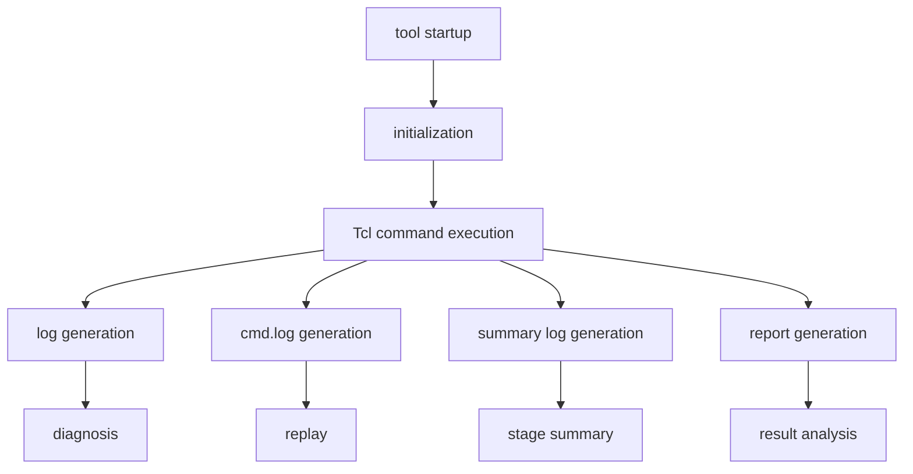

# EDA Flow Engineering 04: From log to cmd.log — How EDA Tools Create a Replayable Engineering Session

Many engineering problems are not problems of “can it be done?”  
They are problems of “can we ever get back to the exact same situation again?”

You have probably seen this kind of situation:

- the tool worked yesterday, but not today
- the same script behaves differently on another machine
- an interactive action fixed the result, but nobody remembers what exactly was done
- a report exists, but nobody can reconstruct how it was produced
- after a crash, the last usable state cannot be rebuilt

These are not isolated annoyances.  
They all point to one engineering question:

> **has the session been preserved as a replayable engineering state?**

This article focuses on that question alone:

> **from log to cmd.log, how does an EDA tool turn one run into something diagnosable, replayable, and reconstructable?**

In practice, the key carriers are usually:

- log
- cmd.log
- summary log
- source / replay / debug mechanisms

---

## 1. Why “it runs” is far from “it is engineered”

Many teams initially judge a flow by one criterion:

> does the script run through?

That matters, but for a complex EDA environment, it is only the floor.

The real engineering questions come right after:

- can the run be reproduced?
- can another engineer take it over?
- can failures be localized?
- can two runs be compared meaningfully?
- can a result be explained?
- can a successful session be replayed?

In other words, a successful run is not yet an engineering system.  
A system becomes engineered when it is:

- diagnosable
- traceable
- reviewable
- replayable

And those properties rest on a structured recording system.

---

## 2. What should a complete EDA session actually leave behind?

From an engineering perspective, a complete session should not leave only a final result.  
It should leave at least four categories of artifacts:



Each artifact serves a different role.

### 2.1 log
Records the execution trace, including outputs, warnings, errors, and run-time context.

### 2.2 cmd.log
Records Tcl commands in replayable form.

### 2.3 summary log
Compresses the run into a higher-level status view.

### 2.4 reports
Persist key analysis results rather than leaving them only on screen.

The engineering value does not come from “having one log file.”  
It comes from whether these artifacts together can represent a **replayable and auditable session**.

---

## 3. Why the logging system must be layered

A common instinct is: log everything into one big file.

That sounds safe, but for complex EDA flows it quickly becomes counterproductive.

### 3.1 Too much information hides the important parts

A long session may include:

- initialization messages
- parameter dumps
- object query results
- warnings and errors
- timing or routing statistics
- debug expansions
- report fragments

If everything is mixed together, important issues are harder to find, not easier.

### 3.2 Different engineering goals are different by nature

At minimum, engineers need three kinds of views:

- process visibility
- summary visibility
- replay capability

Trying to force all three into one file usually means none of them works well.

### 3.3 Readability is not the same as replayability

A large log may be informative enough to read, but still insufficient to reproduce the command sequence accurately.

That is why a mature EDA logging system is layered:

```text
log       -> full execution trace
cmd.log   -> replayable command trace
sum.log   -> compressed run summary
reports   -> persisted result artifacts
```

This is not just file organization.  
It is an engineering architecture.

---

## 4. What problem does log solve?

The primary role of the log is to answer one question:

> **what happened during this run?**

It typically records things such as:

- which commands were invoked
- which warnings and errors appeared
- when certain commands started and finished
- how long certain stages took
- what analysis mode or context was active

So the log is best suited for questions like:

- what did the session actually do?
- in what order did events occur?
- where did the first anomaly appear?
- which stage consumed the most time?
- what context existed when an issue appeared?

From an engineering standpoint, the log is the **truth file of process history**.

Without it, debugging turns into recollection and guesswork.

---

## 5. What problem does cmd.log solve?

Compared with log, `cmd.log` serves a more specific role.

It does not mainly describe the outcome.  
It preserves:

> **the Tcl command sequence that drove the session.**

That difference is critical.

- log is primarily for reading and diagnosis
- cmd.log is primarily for replay and reconstruction

If you only have the log, you may know approximately what was done.  
But you do not necessarily have the exact command trajectory.

Once you have cmd.log, you at least have a command-level starting point for replaying the session.

That is its core engineering value.

---

## 6. Why summary logs matter

Often, the first thing an engineer wants is not every detail.  
It is a compressed answer to a few high-level questions:

- did the run succeed overall?
- which stages executed?
- were there major warnings or errors?
- were key files produced?
- what run mode was used?

This is where the summary log becomes valuable.

Its job is not completeness.  
Its job is fast status compression.

In other words:

- log expands
- summary log compresses

That makes the summary log the **engineering summary layer**.  
It reduces the reading cost of a run and makes comparison across runs more practical.

---

## 7. Why source is such a critical node in the chain

In Tcl, `source` seems simple: it executes a script file.

But architecturally, it means much more:

> **it brings an external script into the current tool session as part of the live engineering state.**

That has immediate consequences:

- a sequence of commands is executed in order
- some commands enter the log
- some commands enter cmd.log
- reports may be generated
- errors may be caught locally or bubble up to the top
- intermediate database state may change for real

So `source` is not merely “reading a file.”  
It is the **entry point through which batch command streams enter the engineering session**.

That is why logging, error handling, and replay mechanisms are tightly coupled to it.

---

## 8. Why source -no_op matters so much

Many expensive script failures are not syntax failures.  
They are context failures or side-effect failures.

Examples include:

- a command form is valid, but the current context is wrong
- arguments look reasonable, but the command would modify the database
- the command itself is legal, but this is the wrong stage to execute it
- once executed, the script pushes the design into an undesirable state

In this setting, `source -no_op` becomes extremely valuable.

It is not meant to fully simulate execution.  
Its purpose is:

> **to expose script structure problems, command-form mistakes, and part of the call path before real side effects are allowed to happen.**

For critical scripts, that can dramatically reduce the risk of damaging the session the first time the script is run “for real.”

---

## 9. Why debug_tcl raises the diagnostic value of logs

Many Tcl scripts are not flat command sequences.  
They contain nested evaluations such as:

- object queries inside command arguments
- query results feeding later commands
- condition branches based on object properties
- output paths assembled dynamically
- execution paths depending on run-time data

If the log only records outer commands, diagnosis becomes difficult.

`debug_tcl` increases value by exposing part of the evaluation process, for example:

- how an argument was computed
- what a `get_*` query actually returned
- why a condition evaluated the way it did
- how a report or export filename was formed

That upgrades the log from an execution record to a diagnostic record.

For complex flows, that difference is substantial.

---

## 10. The real target is not “logging files” but “session solidification”

If you view log, cmd.log, summary, source, and debug together, they are all serving one deeper objective:

> **to solidify a run into a session that can be analyzed, compared, and reconstructed.**

At minimum, that means:

- the entry condition is explicit
- the order of execution is explicit
- parameters are explicit
- outputs are explicit
- errors are explicit
- traces are explicit
- results are explicit
- replay paths are explicit

For complex EDA flows, this is crucial.

What is difficult to reproduce is rarely one command.  
It is the combined state of an entire session.

---

## 11. Why this directly determines collaboration quality

Without session solidification, engineering knowledge collapses into oral memory:

- “this is how I got it to work yesterday”
- “click this, then that”
- “I think I changed a parameter somewhere”
- “I believe script A was sourced before script B”
- “I cannot remember where things started to go wrong”

That can survive at the level of an individual experiment.  
It does not scale to team engineering.

With:

- standardized logs
- standardized cmd.log traces
- standardized summaries
- persisted reports

team communication becomes evidence-based:

- inspect the failing stage
- compare command traces
- check replay consistency
- compare reports
- see whether warnings or errors moved earlier

That is the difference between personal workflow and engineering workflow.

---

## 12. Why replay is much more than “source the cmd.log once”

It is easy to reduce replay to a simplistic idea:

> if cmd.log exists, just source it again

But a true replayable engineering session requires more than a command file.

At minimum, these must also be clear:

1. startup mode  
2. initialization policy  
3. working directory  
4. script inputs  
5. command order  
6. critical parameters  
7. output paths  
8. result-check criteria  

So replay is not a single-file concept.  
It is a **session reconstruction problem**.

That is why log, cmd.log, summary, source, and reports must be understood together if we want a real engineering loop.

---

## 13. What capability does this architecture provide at the systems level?

From an infrastructure perspective, this architecture provides at least five classes of capability:

### 13.1 Process traceability
The run history is recorded.

### 13.2 Command traceability
The command sequence is replayable.

### 13.3 Error traceability
Warnings, errors, and calling relationships become diagnosable.

### 13.4 Result traceability
Key outputs are persisted as reports, not left as transient screen output.

### 13.5 Session traceability
A session does not merely happen once; it can be reconstructed.

Together, these capabilities form the real foundation of mature EDA automation.

---

## 14. Why this is more important than “writing more scripts”

Scripts can always be added later.  
But without recording, replay, and diagnosis infrastructure, more scripts often make the system more fragile.

The more scripts accumulate, the more visible the weaknesses become:

- failures are harder to localize
- differences are harder to compare
- experience is harder to transfer
- results are harder to audit
- the flow is harder to evolve safely

So from an engineering-priority viewpoint, what must be built first is not simply “more scripts,” but:

```text
logging capability
replay capability
verification capability
diagnostic capability
session-solidification capability
```

Only after those exist does a script ecosystem become genuinely stable.

---

## 15. Conclusion

Back to the title:

**From log to cmd.log — how do EDA tools create a replayable engineering session?**

Not by dumping more text, but by building a layered architecture:

- log for full trace
- cmd.log for replayable command history
- summary for compressed session status
- source for bringing external scripts into the live session
- `source -no_op` for safe pre-checking
- `debug_tcl` for stronger diagnostics
- reports for result solidification

Together, these mechanisms turn a run from a temporary execution into a reconstructable engineering session.

That is why logging is not a side feature in a mature EDA flow.  
It is part of the automation infrastructure itself.

---

## One final sentence

If Tcl is the control plane of an EDA flow,  
then log, cmd.log, and summary are the **run-record layer** of that control plane.

Without the control plane, flows are hard to organize.  
Without the run-record layer, even completed flows remain hard to truly engineer.
