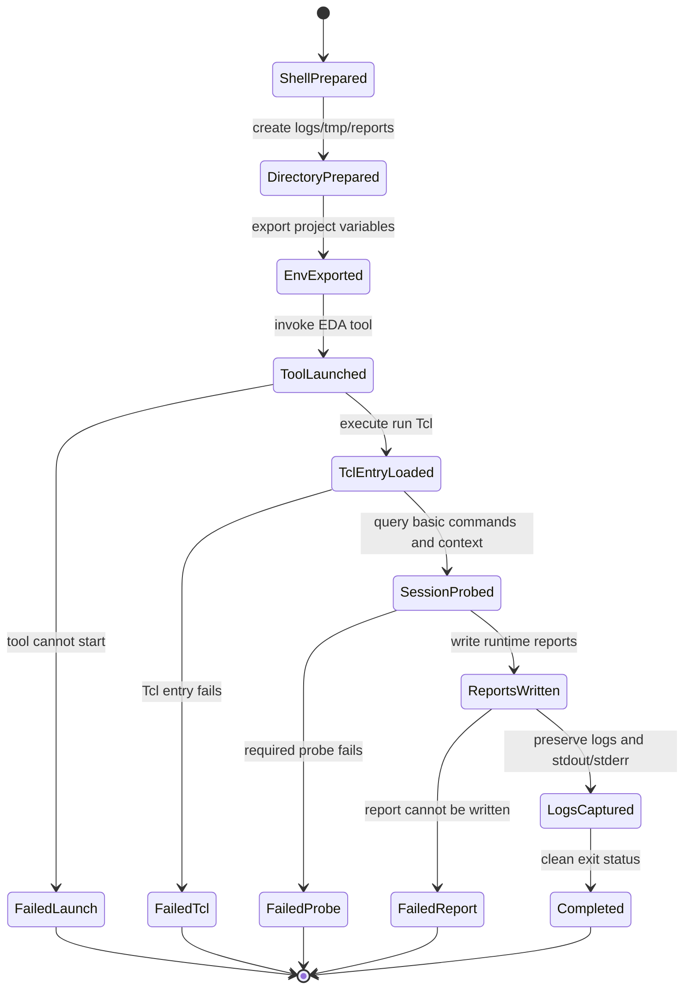
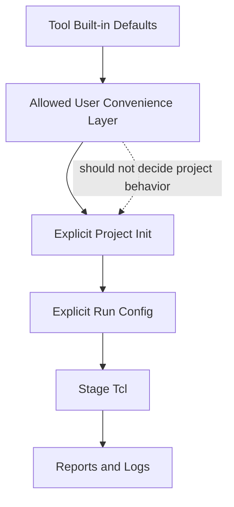
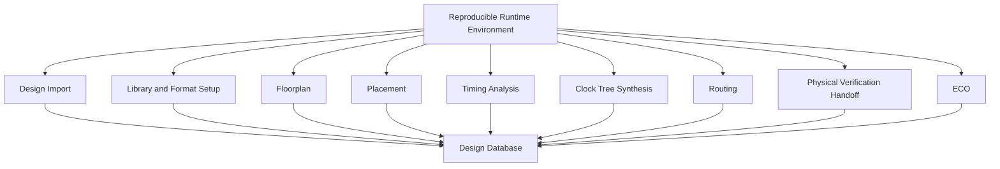
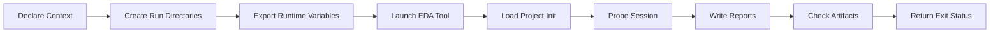

# 01. Why the First Step in Backend Flow Is a Reproducible Runtime Environment

Author: Darren H. Chen

Demo: `LAY-BE-01_reproducible_environment`

Tags: `Backend Flow` `EDA` `APR` `Tcl` `Runtime Environment` `Reproducibility` `Engineering Flow`

In many backend implementation projects, the first visible technical action is usually design import. A typical engineer may start by reading the gate-level netlist, loading Liberty timing libraries, importing LEF technology and cell abstracts, applying SDC constraints, and then moving toward floorplan, placement, clock tree synthesis, routing, and signoff handoff.

That sequence is correct at the design-data level. However, it is not the first step at the engineering-flow level.

Before an EDA tool can safely read a design, the run itself must be reproducible. The tool session must have a controlled executable path, a controlled working directory, a controlled initialization model, a controlled Tcl entry point, a controlled log system, a controlled temporary directory, and a controlled way to capture what actually happened during the run.

A backend flow that can run once is not yet an engineering flow. A backend flow becomes an engineering flow only when another user, another server, another run directory, or a future debug session can reconstruct the same runtime context and understand how the tool moved from startup to output.

This article explains the runtime environment as the first design object of backend flow engineering.

---

## 1. Backend Flow Starts Before Design Import

A physical implementation flow is often described as a sequence of design stages:

```text
netlist import
library setup
floorplan
power plan
placement
timing analysis
clock tree synthesis
routing
physical verification handoff
ECO
final export
```

This is useful, but it hides an earlier layer:

```text
tool executable
shell environment
license environment
working directory
startup files
project configuration
Tcl command stream
log files
temporary files
exit status
run summary
```

The second layer determines whether the first layer can be trusted.

When two engineers run the same Tcl script and get different results, the difference often comes from runtime context rather than design intent. The script may look identical, but the session may not be identical.

A backend run is affected by many forms of hidden state:

| Runtime factor | Why it matters |
|---|---|
| Tool executable | Different releases may parse files, set defaults, or report violations differently. |
| Environment variables | Library paths, license settings, locale, temporary locations, and tool search paths may change behavior. |
| Working directory | Relative paths, output paths, and generated files depend on the run location. |
| User home configuration | Personal startup files may inject aliases, parameters, or display settings. |
| Project initialization | Library setup, design variables, report paths, and run switches must be project-owned. |
| Tcl entry point | The tool must receive a clear command stream rather than an informal interactive history. |
| Logs and summaries | Debugging requires durable evidence, not memory. |
| Temporary directory | Old temporary data can pollute a new run if the directory is not isolated. |

A design import command executed inside an uncontrolled session is not a clean design import. It is a design import under unknown assumptions.

---

## 2. Runtime Environment as a State Space

A backend tool session can be modeled as a state space. The session does not begin with an empty mathematical state. It begins with a shell process, inherited environment variables, a current directory, possible startup files, command-line flags, and internal default settings.

The first goal of a reproducible environment is to make this state space explicit.

```mermaid
flowchart LR
    subgraph Shell[Shell Process]
        A1[PATH]
        A2[license variables]
        A3[HOME]
        A4[current directory]
    end

    subgraph Launch[Tool Launch]
        B1[tool binary]
        B2[launch options]
        B3[working directory]
        B4[tmp directory]
    end

    subgraph Init[Initialization Layer]
        C1[user startup files]
        C2[project init Tcl]
        C3[run options]
        C4[library setup hooks]
    end

    subgraph Runtime[Tool Runtime]
        D1[Tcl interpreter]
        D2[design database]
        D3[parameters]
        D4[object model]
    end

    subgraph Evidence[Evidence Artifacts]
        E1[main log]
        E2[command log]
        E3[summary log]
        E4[stdout and stderr]
        E5[run manifest]
    end

    Shell --> Launch --> Init --> Runtime --> Evidence
```



From this view, a backend flow is not only a sequence of commands. It is a sequence of state transitions.

A command such as `import_verilog`, `read_sdc`, `init_floorplan`, or `place_opt` does not operate in isolation. It operates against the current state of the tool session. That state includes loaded libraries, active design context, timing scenarios, unit settings, parameter values, search paths, and previous commands.

Therefore, reproducibility requires two levels of control:

1. **Input-state control**: the session must start from a known context.
2. **Transition control**: each command must be recorded and reviewed as a state-changing operation.

Without input-state control, the same command stream may begin from different conditions.

Without transition control, the engineer may not know what was actually executed.

---

## 3. The Minimal Runtime Contract

A reproducible backend runtime environment should define a runtime contract. The contract is not tied to any particular commercial tool. It describes the engineering guarantees expected from the run wrapper and project layout.

| Contract item | Engineering requirement |
|---|---|
| Tool identity | The exact backend tool entry point is known. |
| Working directory | The tool starts in a defined project or run directory. |
| Project configuration | The project initialization file is explicitly loaded. |
| Tcl command stream | The command stream is provided by a known file or standard input. |
| Main log | The tool log is preserved in a deterministic location. |
| Command log | The executed command trace is preserved when supported. |
| Summary log | A compact stage-level summary is generated. |
| Standard output/error | Shell-level output is captured. |
| Temporary directory | Temporary files are isolated per run. |
| Exit status | The wrapper returns a meaningful status to the caller. |
| Run manifest | The run records key paths, settings, and artifacts. |

The purpose of this contract is not to make the first demo complex. The purpose is to make every later demo trustworthy.

If the first runtime layer is loose, later stages become difficult to compare:

```text
Was the placement result changed by the placement script?
Was it changed by a different tool version?
Was it changed by a different startup file?
Was it changed by a hidden parameter?
Was it changed by a stale temporary database?
Was it changed by a different search path?
```

A reproducible runtime environment makes these questions answerable.

---

## 4. The Runtime State Machine

The first demo can be understood as a finite-state machine. It does not need to load a real chip design. It only needs to prove that the run wrapper, runtime context, Tcl entry point, and evidence artifacts form a clean loop.



This state machine is useful because it separates different failure classes.

A failed tool launch is different from a failed Tcl command. A failed Tcl command is different from a missing report directory. A missing report is different from an incomplete command trace. Without this separation, a single statement such as “the run failed” is not very useful.

For a real backend platform, failure classification matters. Runtime failures should be identified before design-data failures. A netlist import error should not be mixed with a missing license variable. A Tcl syntax error should not be mixed with a stale run directory. A write-permission problem should not be mixed with a timing-constraint problem.

---

## 5. Why Design Import Should Not Be the First Test

Design import is a heavy test because it depends on several layers at the same time:

```text
Verilog syntax
library search path
physical abstract availability
technology-layer consistency
top module name
link path
constraint assumptions
tool parser behavior
run directory
log capture
```

If the first demo starts with design import and fails, the failure space is too large. The engineer may need to ask many unrelated questions at once.

| Failure symptom | Possible root cause |
|---|---|
| Tool cannot start | Wrong executable path, missing license, missing runtime library. |
| Tcl script exits early | Wrong shell expansion, missing environment variable, syntax issue. |
| Netlist cannot be read | File path, parser option, HDL dialect, include directory. |
| Library cannot be found | Search path, file permission, corner naming, compressed-file handling. |
| Top cannot be linked | Top name mismatch, missing module, missing library cell. |
| DEF cannot be loaded | Version mismatch, missing rows/tracks, missing technology context. |
| Reports missing | Wrong output path, no write permission, script branch skipped. |

This is why the first test should be simpler. It should only verify that the runtime layer works.

The first demo should answer:

```text
Can the tool be invoked through a controlled wrapper?
Can the wrapper create a clean run directory structure?
Can project variables be exported to the tool process?
Can a known Tcl entry file be executed?
Can the run produce logs and reports in known locations?
Can the command stream be captured?
Can the run summary be reviewed without opening a GUI?
```

Only after these questions are answered should design import become the next layer of validation.

---

## 6. HOME Configuration vs Project Configuration

Many EDA tools can read user-level startup files. This is convenient for personal use, but dangerous when the goal is a project-level engineering flow.

A user-level configuration and a project-level configuration have different meanings.

| Configuration type | Typical location | Suitable content | Risk if misused |
|---|---|---|---|
| User-level configuration | `$HOME` | UI preferences, personal aliases, display habits. | Hidden project dependency. |
| Project-level configuration | repository or project root | library paths, report paths, design variables, stage switches. | Should be reviewed and versioned. |
| Run-level configuration | run directory | run name, output directory, temporary directory, selected stage. | Must be isolated per run. |
| Tool default configuration | tool installation | vendor defaults and built-in behavior. | May change across releases. |

The safest rule is simple:

```text
Project behavior must be defined by project-owned files.
```

A personal startup file can make interactive work easier, but it should not define the formal runtime behavior of a project. If a backend flow depends on files under one engineer's home directory, the flow is not portable.

A reproducible runtime environment should use explicit project initialization:

```tcl
source ./config/project_init.tcl
source ./config/path_setup.tcl
source ./config/report_setup.tcl
source ./config/runtime_options.tcl
```

The exact file names may vary. The principle is stable: startup dependency should be visible in the Tcl entry point and stored with the project.

---

## 7. Hidden Initialization Is a Hidden Input

An EDA tool may load startup files, preferences, Tcl helpers, aliases, or previous GUI settings during launch. These behaviors can improve usability, but they also create hidden inputs.

Hidden inputs are dangerous because they are not visible in the main run script.

For example, a visible script may look like this:

```tcl
source ./config/project_init.tcl
source ./stages/import_design.tcl
source ./stages/floorplan.tcl
```

But the tool session may already contain settings loaded before the script begins:

```text
custom aliases
changed parameter defaults
modified search paths
changed report units
GUI preferences
previous session settings
```

A backend run is reproducible only when such hidden inputs are either disabled, recorded, or treated as non-project behavior.

A practical approach is to divide initialization into three zones:



The project initialization layer should override project-critical behavior. The run configuration should define run-specific directories and stage switches. Stage Tcl files should focus on design operations rather than environment discovery.

This separation keeps the flow readable and debuggable.

---

## 8. Directory Architecture for a Reproducible Run

A clean directory structure is not a cosmetic issue. It is part of the runtime architecture.

A recommended minimal layout is:

```text
LAY-BE-01_reproducible_environment/
├── README.md
├── config/
│   ├── project_init.tcl
│   ├── path_setup.tcl
│   └── runtime_options.tcl
├── scripts/
│   └── run_demo.csh
├── tcl/
│   ├── run_demo.tcl
│   └── probe_session.tcl
├── reports/
│   ├── runtime_manifest.rpt
│   ├── session_probe.rpt
│   └── artifact_check.rpt
├── logs/
│   ├── run.log
│   ├── run.cmd.log
│   ├── run.sum.log
│   └── run.stdout_stderr.log
├── tmp/
│   └── run.tmp/
└── output/
    └── .gitkeep
```

The important point is not the exact spelling of each directory. The important point is role separation.

| Directory | Responsibility |
|---|---|
| `config/` | Project-owned settings and explicit initialization. |
| `scripts/` | Shell-level launch wrappers. |
| `tcl/` | Tool-level command stream and probe logic. |
| `reports/` | Human-reviewable evidence produced by the run. |
| `logs/` | Raw runtime traces and command history. |
| `tmp/` | Isolated temporary data. |
| `output/` | Output artifacts produced by later stages. |

This layout allows an engineer to inspect the runtime without opening the tool GUI. It also makes the repository easier to review because each file category has a stable purpose.

---

## 9. Shell Layer: Why `set` and `setenv` Matter in csh

Many backend environments still use `csh` or `tcsh` because older EDA infrastructure, legacy farm wrappers, and project scripts were built around them.

In `csh`, there is an important difference between `set` and `setenv`.

```text
set     : defines a shell variable inside the current csh process
setenv  : exports an environment variable to child processes
```

The backend tool is a child process of the shell wrapper. If the tool Tcl script needs to read a variable through `env(...)`, the shell wrapper must export it with `setenv`.

A typical split is:

```csh
set RUN_ROOT = `pwd`
set LOG_DIR  = "$RUN_ROOT/logs"
set TMP_DIR  = "$RUN_ROOT/tmp/run.tmp"

setenv LAY_PROJECT_ROOT "$RUN_ROOT"
setenv LAY_REPORT_DIR   "$RUN_ROOT/reports"
setenv LAY_LOG_DIR      "$LOG_DIR"
setenv LAY_TMP_DIR      "$TMP_DIR"
setenv LAY_TCL_ENTRY    "$RUN_ROOT/tcl/run_demo.tcl"
```

Shell-local variables are useful for path construction inside the wrapper. Exported variables define the contract between the wrapper and the backend tool process.

Inside Tcl, the project can then read:

```tcl
set project_root $env(LAY_PROJECT_ROOT)
set report_dir   $env(LAY_REPORT_DIR)
set log_dir      $env(LAY_LOG_DIR)
set tmp_dir      $env(LAY_TMP_DIR)
```

This makes the shell-to-tool boundary explicit.

---

## 10. Tool Entry Pattern

A generic backend tool invocation may look like this:

```csh
#!/bin/csh -f

set RUN_ROOT = `pwd`
set LOG_DIR  = "$RUN_ROOT/logs"
set TMP_DIR  = "$RUN_ROOT/tmp/run.tmp"
set RPT_DIR  = "$RUN_ROOT/reports"

mkdir -p "$LOG_DIR"
mkdir -p "$TMP_DIR"
mkdir -p "$RPT_DIR"

setenv LAY_PROJECT_ROOT "$RUN_ROOT"
setenv LAY_REPORT_DIR   "$RPT_DIR"
setenv LAY_LOG_DIR      "$LOG_DIR"
setenv LAY_TMP_DIR      "$TMP_DIR"
setenv LAY_TCL_ENTRY    "$RUN_ROOT/tcl/run_demo.tcl"

setenv BACKEND_TOOL_BIN /path/to/backend_tool

$BACKEND_TOOL_BIN \
    -work_dir "$RUN_ROOT" \
    -log "$LOG_DIR/run.log" \
    -cmd_log "$LOG_DIR/run.cmd.log" \
    -summary_log "$LOG_DIR/run.sum.log" \
    -tmp_dir "$TMP_DIR" \
    -stdin < "$LAY_TCL_ENTRY" \
    >& "$LOG_DIR/run.stdout_stderr.log"

set STATUS = $status
echo "RUN_EXIT_STATUS: $STATUS" >> "$RPT_DIR/runtime_manifest.rpt"
exit $STATUS
```

The option names above are intentionally generic. Different EDA tools use different command-line syntax. The architecture remains the same:

```text
explicit tool entry
explicit work directory
explicit Tcl entry
explicit logs
explicit temporary directory
explicit exit status
```

A run wrapper should not be a pile of launch commands. It should be the outer boundary of the engineering contract.

---

## 11. Tcl Entry Pattern

The Tcl entry point should be small and predictable. It should establish the project context, create a runtime manifest, probe the session, and then stop. The first demo does not need to import a design.

Example structure:

```tcl
set project_root $env(LAY_PROJECT_ROOT)
set report_dir   $env(LAY_REPORT_DIR)
set log_dir      $env(LAY_LOG_DIR)
set tmp_dir      $env(LAY_TMP_DIR)

source "$project_root/config/project_init.tcl"

set fp [open "$report_dir/runtime_manifest.rpt" w]
puts $fp "DEMO_ID: LAY-BE-01_reproducible_environment"
puts $fp "PROJECT_ROOT: $project_root"
puts $fp "REPORT_DIR: $report_dir"
puts $fp "LOG_DIR: $log_dir"
puts $fp "TMP_DIR: $tmp_dir"
puts $fp "TCL_ENTRY: $env(LAY_TCL_ENTRY)"
close $fp

set fp [open "$report_dir/session_probe.rpt" w]
puts $fp "TCL_INTERPRETER: active"
puts $fp "PROJECT_INIT: loaded"
puts $fp "SESSION_PROBE: completed"
close $fp
```

The goal is not to test placement or timing. The goal is to validate the runtime path from shell wrapper to Tcl execution to report generation.

---

## 12. Command Log as State-Transition Evidence

The main log explains what the tool reported. The command log explains what the session executed.

For backend flow engineering, both are important.

| Artifact | Main question answered |
|---|---|
| Main log | What did the tool print during the run? |
| Command log | What commands were executed, and in what order? |
| Summary log | What stage-level result did the run produce? |
| stdout/stderr log | What happened at the shell process boundary? |
| Runtime manifest | What was the declared runtime context? |

A command log is especially valuable because backend failures are often sequence-dependent.

A command may be valid in one state and invalid in another. A property query may work only after a design is linked. A report may require loaded timing libraries. A floorplan command may require defined rows and sites. A routing command may require tracks and layer rules.

Therefore, the engineering question is not only:

```text
Is this command valid?
```

It is also:

```text
Was this command executed after the required state had been established?
```

The command log is the evidence trail for this question.

---

## 13. Runtime Manifest

The runtime manifest is a compact report that records the declared context of a run. It should be easy to read in a text editor, easy to diff, and easy to archive.

A minimal manifest may contain:

```text
DEMO_ID: LAY-BE-01_reproducible_environment
RUN_ROOT: /path/to/run
TOOL_BIN: /path/to/backend_tool
TCL_ENTRY: /path/to/run/tcl/run_demo.tcl
PROJECT_INIT: /path/to/run/config/project_init.tcl
REPORT_DIR: /path/to/run/reports
LOG_DIR: /path/to/run/logs
TMP_DIR: /path/to/run/tmp/run.tmp
USER: darren
HOST: build-server-01
START_TIME: 2026-xx-xx xx:xx:xx
EXIT_STATUS: 0
```

A more complete manifest can also record selected environment variables, version probes, command availability checks, and generated report paths.

The manifest should not replace detailed logs. It should provide a fast index into the run.

---

## 14. Reproducibility Checklist

Before moving to design import, the following checklist should pass.

| Check item | Expected result |
|---|---|
| Tool binary exists | The wrapper can locate the backend tool executable. |
| Tool can be launched | A basic session starts from the wrapper. |
| Work directory is fixed | The session starts under the expected run root. |
| Project init is explicit | The Tcl entry point sources project-owned configuration. |
| Logs are generated | Main log, command log, summary log, and stdout/stderr log exist. |
| Reports are generated | Runtime manifest and session probe reports exist. |
| Temporary directory is isolated | The run uses a dedicated temporary directory. |
| Exit status is captured | The wrapper returns success or failure to the caller. |
| No design import is required | Runtime validation does not depend on LEF, Liberty, Verilog, DEF, or SDC. |

This checklist is intentionally independent from design content. A clean result means the runtime layer is ready for the next demo.

---

## 15. Common Anti-Patterns

A reproducible runtime environment prevents several common backend-flow anti-patterns.

### 15.1 Using `tool` from `PATH` without version control

If the wrapper only calls:

```bash
tool
```

then the selected executable depends on `PATH`. Another user or server may pick a different release.

A stable wrapper should declare the tool entry point or receive it through a controlled project variable.

### 15.2 Writing logs into the current directory

If the run writes logs wherever the shell happens to be, later review becomes difficult. A run should have a stable log directory.

### 15.3 Depending on personal startup files

Personal startup files should not carry project behavior. They are not shared project state.

### 15.4 Mixing temporary data across runs

If multiple runs share the same temporary directory, stale files can affect later diagnosis. Each run should have its own temporary location.

### 15.5 Treating a successful launch as a successful flow

A tool that opens successfully has only passed the launch test. It has not yet proved that the project runtime is controlled.

### 15.6 Debugging design import before debugging runtime

If the runtime layer is not clean, design import debug becomes noisy. Runtime evidence should be checked first.

---

## 16. Relationship to Later Backend Stages

The first demo may look simple, but it supports every later backend stage.



Later stages all depend on clean evidence:

- Design import requires clear file paths and parser logs.
- Library setup requires library-search evidence.
- Floorplan requires reportable die/core/row state.
- Placement requires utilization, legality, congestion, and timing reports.
- Timing analysis requires constraints, operating conditions, and path reports.
- Clock tree synthesis requires clock definitions, skew groups, and clock reports.
- Routing requires route status, DRC status, and parasitic extraction context.
- Physical verification handoff requires export manifests and rule-deck coordination.
- ECO requires before/after comparison and repeatable debug material.

If the runtime layer is unstable, every later stage inherits instability.

---

## 17. Demo Design: `LAY-BE-01_reproducible_environment`

The first demo should not attempt to prove physical implementation quality. It should prove that the repository has a controlled runtime skeleton.

### 17.1 Inputs

| Input | Purpose |
|---|---|
| `scripts/run_demo.csh` | Shell-level launcher. |
| `config/project_init.tcl` | Project-level initialization entry. |
| `config/runtime_options.tcl` | Runtime options used by the demo. |
| `tcl/run_demo.tcl` | Tool-level Tcl entry point. |
| Environment variables | Shell-to-tool runtime contract. |

### 17.2 Outputs

| Output | Purpose |
|---|---|
| `logs/run.log` | Main tool log. |
| `logs/run.cmd.log` | Command trace if supported by the tool. |
| `logs/run.sum.log` | Summary log if supported by the tool. |
| `logs/run.stdout_stderr.log` | Shell-level output capture. |
| `reports/runtime_manifest.rpt` | Declared runtime context. |
| `reports/session_probe.rpt` | Basic tool session probe. |
| `reports/artifact_check.rpt` | Confirmation that required output files exist. |

### 17.3 Pass Criteria

The demo passes when:

```text
the tool launches from the wrapper
the Tcl entry point is executed
the project initialization file is loaded
reports are written under reports/
logs are written under logs/
temporary data is isolated under tmp/
the wrapper returns a meaningful exit status
```

### 17.4 What This Demo Should Not Do

This demo should not:

```text
read a real netlist
load full technology data
load Liberty timing libraries
import DEF
initialize floorplan
run placement
run timing
run routing
```

Those operations belong to later demos. Keeping the first demo small makes it easier to isolate runtime problems from design-data problems.

---

## 18. Engineering Methodology

A reproducible backend runtime can be built through the following methodology.



Each step should have one responsibility:

| Step | Responsibility |
|---|---|
| Declare context | Identify run root, tool entry, Tcl entry, and report locations. |
| Create directories | Ensure output locations exist before launching the tool. |
| Export variables | Pass project-level paths across the shell/tool boundary. |
| Launch tool | Start the backend tool in a controlled work directory. |
| Load project init | Establish project-owned initialization. |
| Probe session | Confirm the Tcl interpreter and basic runtime commands are available. |
| Write reports | Produce reviewable evidence. |
| Check artifacts | Confirm expected files were generated. |
| Return status | Make success or failure visible to the caller. |

This methodology is intentionally conservative. Backend flow failures are expensive. It is better to fail early with a clear runtime error than to continue into design import under an unknown session state.

---

## 19. Key Takeaways

The first step in backend flow engineering is not design import. It is runtime control.

A reproducible runtime environment establishes:

```text
who launched the run
where the run was launched
which tool entry point was used
which project initialization was loaded
which Tcl command stream was executed
where logs and reports were written
where temporary data was stored
what exit status was returned
```

Once this layer is stable, design import becomes a meaningful next step. Without this layer, design import is only a command executed under uncertain conditions.

A backend flow should not be judged by whether it runs once. It should be judged by whether its runtime context, command stream, and evidence artifacts can be inspected, compared, and reproduced.

That is why the first demo in this series is `LAY-BE-01_reproducible_environment`.
