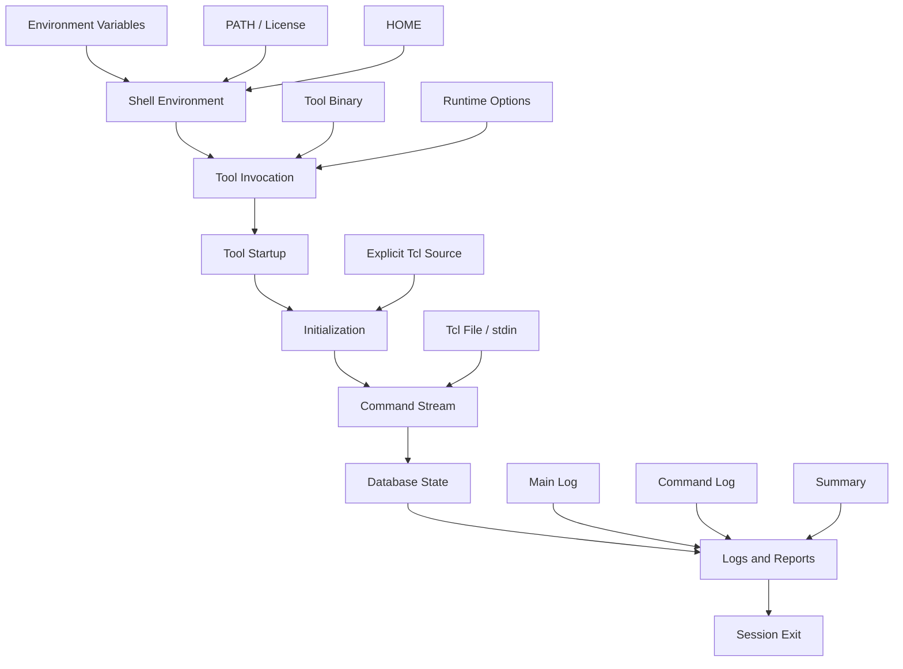

# Backend Flow Engineering 02: Backend Tool Startup as a Session State Space

> Author: Darren H. Chen  
> Direction: Backend Flow / EDA tool engineering / flow infrastructure  
> demo: **LAY-BE-02_session_state_space**  
> tags: Backend Flow, EDA, APR, Session, Runtime State, Logs, Tcl

Launching a backend tool may look simple:

```bash
tool run.tcl
```

or:

```bash
tool -batch run.tcl
```

But a real backend session is not determined by a single command line. It is determined by a state space.

The final behavior depends on executable path, tool version, current directory, HOME directory, environment variables, initialization scripts, command stream, execution mode, license state, logs, and temporary files.

This article describes a backend session as an engineering state system.

---

## 1. A session is a state function

A backend session can be represented as:

```text
Session = F(
    ToolBinary,
    ToolVersion,
    WorkingDirectory,
    HomeDirectory,
    EnvironmentVariables,
    LicenseState,
    InitScripts,
    CommandStream,
    RuntimeOptions,
    LogSystem,
    TempDirectory,
    ExecutionMode
)
```

If any dimension changes, the result may change.

That is why the same Tcl script can behave differently:

```text
under a different user
under a different directory
under a different shell setup
under a different release
under GUI mode instead of batch mode
```

The script is important, but it is only one part of the session state.

---

## 2. Tool binary and version

The tool executable determines command availability, default behavior, message format, and supported options.

A controlled flow should avoid relying only on `PATH`:

```csh
setenv LAY_BACKEND_TOOL_NAME AP
setenv LAY_BACKEND_TOOL_BIN  /proj0/apoka/bin/rhel8-64/AP
```

The version should be captured at the beginning of every run:

```csh
$LAY_BACKEND_TOOL_BIN -version >&! logs/tool_version.rpt
```

When a flow changes behavior after a release update, this file becomes the first reference point.

---

## 3. Working directory

Many backend commands use relative paths. The same script can reference different files if the current directory changes.

A stable session should fix the project root:

```csh
set LAY_PROJECT_ROOT = /path/to/project
cd "$LAY_PROJECT_ROOT"
```

Then the Tcl layer can use explicit variables:

```tcl
set project_root $env(LAY_PROJECT_ROOT)
source $project_root/config/project_init.tcl
```

The working directory should not be left to chance.

---

## 4. HOME directory

Some tools load user-level configuration from HOME:

```text
$HOME/.toolrc
$HOME/.eda/init.tcl
$HOME/.gui/preferences
```

HOME is useful for personal preferences, but risky as a project dependency.

Project-critical information should not be hidden in HOME:

```text
library paths
technology files
design inputs
run options
algorithm switches
report locations
```

A repeatable backend flow either isolates HOME effects or records them explicitly.

---

## 5. Init scripts

Initialization scripts are one of the most powerful state variables.

They may define:

```text
parameters
aliases
project paths
library setup
GUI behavior
logging options
database options
```

There are two common patterns:

```text
implicit auto-load
explicit source
```

For flow engineering, explicit `source` is easier to review:

```tcl
source $env(LAY_PROJECT_INIT_TCL)
```

This makes the initialization sequence visible and version-controlled.

---

## 6. Command stream

The executed command stream may come from multiple sources:

```text
startup scripts
main Tcl scripts
stdin
interactive shell commands
GUI actions
internally generated commands
```

A command log matters because it answers a precise question:

```text
What commands did the tool actually execute?
```

That question is different from:

```text
What commands were written in the original script?
```

The two are not always identical.

---

## 7. Execution mode

Backend tools may run in several modes:

```text
GUI mode
shell mode
batch mode
stdin mode
no-GUI mode
view-only mode
```

Different modes can load different configuration, expose different commands, or write different logs.

A flow intended for repeatable runs should be tested in a non-interactive mode as early as possible:

```text
fixed command input
fixed log output
fixed temporary directory
clear exit status
```

---

## 8. State transition model

The session can be viewed as a state machine:



The main engineering task is to reduce hidden transitions.

---

## 9. Key takeaway

A backend session is not a single command. It is a state space.

Reliable flow work begins by making the important state variables explicit:

```text
tool path
version
working directory
HOME influence
environment variables
initialization sequence
command source
log destination
temporary directory
execution mode
```

Once these are controlled, later design stages become easier to debug and reproduce.
