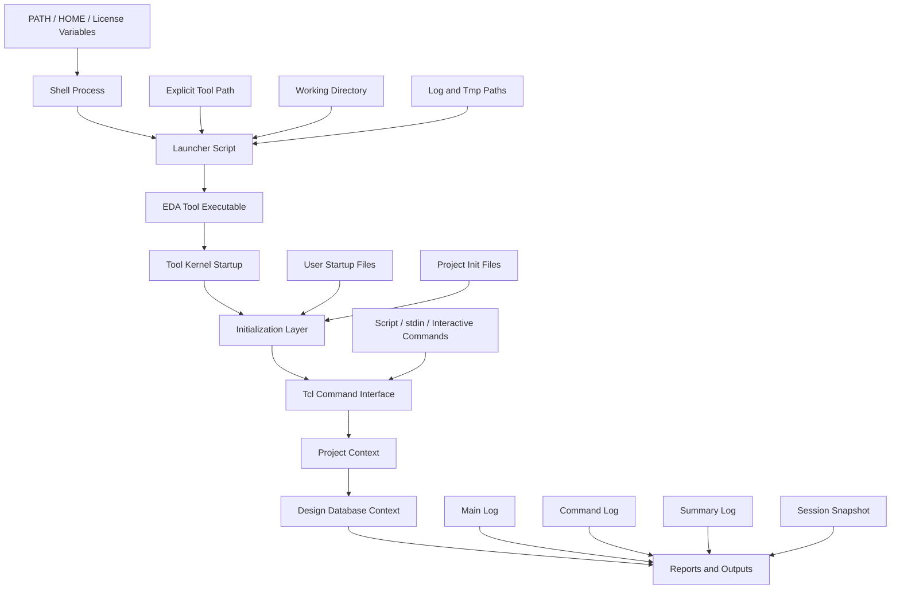
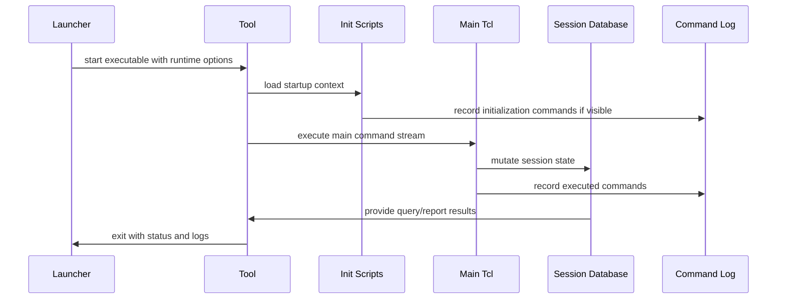
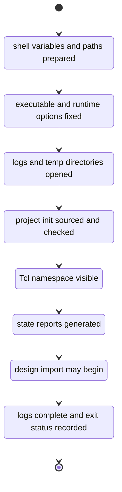
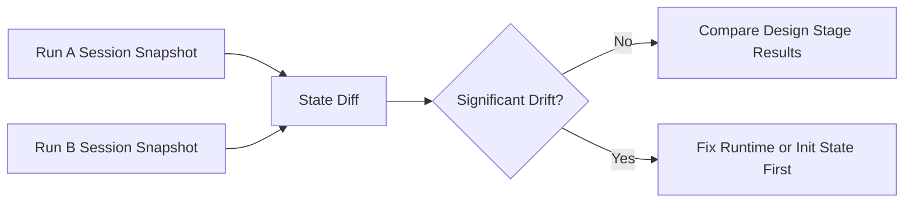

# 02. Backend Tool Startup as a Session State Space

Author: Darren H. Chen

Demo: `LAY-BE-02_session_state_space`

Tags: `Backend Flow` `EDA` `APR` `Session State` `Tcl` `Runtime Context` `Logs` `Reproducibility`

Starting an EDA backend tool is often shown as a one-line command:

```sh
tool run.tcl
```

or:

```sh
tool -batch run.tcl
```

That view is convenient, but it is incomplete. A backend run is not only the execution of a script. It is the construction of a tool session. The session inherits a shell environment, binds a specific tool executable, chooses a working directory, evaluates initialization files, opens log streams, creates temporary work areas, exposes a Tcl command namespace, and then begins to mutate an internal design database.

From an engineering-flow point of view, startup is not a small preface before “real work” begins. Startup defines the state in which every later command will be interpreted.

The same command can be valid, empty, wrong, or dangerous depending on the current session state. A design query before design import is only a command name. A timing query before library and constraint state is incomplete. A physical query before technology and floorplan state may have no meaningful geometry. A report generated under an unintended working directory may be correct as a file but useless as evidence.

This article treats EDA tool startup as a **session state space**. The goal is to make the hidden variables of a backend run visible, measurable, and reviewable before the flow moves into design import, floorplan, placement, timing, CTS, routing, and physical verification handoff.

---

## 1. A Backend Session Is More Than a Process

At operating-system level, launching an EDA tool creates a process. At backend-flow level, it creates a stateful engineering context.

A process has a PID, memory space, file descriptors, environment variables, and command-line arguments. A backend session has all of those, plus tool-specific state:

```text
loaded startup scripts
runtime parameters
search paths
license visibility
current project context
current design context
loaded libraries
Tcl command namespace
log file handles
temporary database paths
report locations
mode-specific behavior
```

The process can exist while the session is still not meaningful. A tool window may open, a shell prompt may appear, and a command may be accepted, but the session may still have no project context, no design context, no library context, and no controlled log system.

This distinction matters because backend implementation is a stateful discipline. Each stage consumes state created by earlier stages:

```text
runtime state
  -> library state
      -> design import state
          -> linked database state
              -> physical floorplan state
                  -> placement state
                      -> timing and clock state
                          -> routing state
                              -> signoff handoff state
```

When startup state is not controlled, the entire chain becomes less predictable. A later placement, timing, or routing issue may appear to be a design problem while the root cause is actually hidden in startup.

---

## 2. The Session State Function

A backend session can be modeled as a function of many state variables:

```text
Session = F(
    ToolBinary,
    ToolVersion,
    WorkingDirectory,
    HomeDirectory,
    EnvironmentVariables,
    LicenseState,
    InitScripts,
    RuntimeOptions,
    CommandStream,
    ExecutionMode,
    LogSystem,
    TempDirectory,
    DatabaseState,
    ParameterState
)
```

This model is useful because it prevents a common misunderstanding:

```text
Same Tcl script == same run
```

That is not necessarily true. The script is only one input to the session function. If any other state variable changes, the session may change.

For example:

| Visible fact | Hidden state that may differ |
|---|---|
| Same `run.tcl` file | Different tool executable found through `PATH` |
| Same project directory | Different `HOME` startup file loaded |
| Same netlist path | Different library search path binding a different cell view |
| Same command sequence | Different parameter defaults active in the session |
| Same report command | Different current design or current scenario |
| Same shell script | Different license feature, thread setting, or batch mode |
| Same output filename | Different working directory or symlink target |

A reproducible flow does not assume these variables are stable. It records and controls the variables that matter.

---

## 3. Session State Space Architecture

The startup architecture can be viewed as layered state construction.



This architecture separates four concerns:

1. **Shell state** decides what the process can inherit.
2. **Launcher state** decides which executable, paths, logs, and temporary areas are used.
3. **Initialization state** decides which parameters, aliases, search paths, and project variables are installed.
4. **Command state** decides what the tool actually executes and how the internal database changes.

A weak flow mixes these layers together. A strong flow makes each layer visible.

---

## 4. Tool Binary: The First Identity of the Session

The first state variable is the tool executable. Using a short command name such as `tool` relies on the shell search path. That may be acceptable for interactive exploration, but it is fragile for engineering flow control.

The executable identity determines:

```text
tool version
command availability
supported options
parser behavior
message format
default parameter values
file-format tolerance
license checkout behavior
runtime and capacity behavior
```

A mature flow should not merely call a tool. It should record which executable was called.

Recommended startup evidence:

```text
EDA_TOOL_BIN=/path/to/eda_tool/bin/tool
EDA_TOOL_VERSION=<captured from tool version command>
PATH=<captured or minimized>
LD_LIBRARY_PATH=<captured if relevant>
```

The important point is not the variable name. The important point is that the executable is treated as a session input, not an assumption.

A practical launcher should prefer this pattern:

```csh
setenv EDA_TOOL_BIN /path/to/release/bin/tool
$EDA_TOOL_BIN -version
```

rather than this pattern:

```csh
tool -version
```

The second form may work today but silently change tomorrow if `PATH` changes.

---

## 5. Working Directory: The Coordinate Origin of the Run

The working directory is the coordinate origin for relative paths. It affects script loading, input discovery, output generation, temporary file placement, report paths, and debug navigation.

A relative path is not a file. It is a file plus a current directory.

```text
./config/init.tcl
./data/top.v
./reports/session_state.rpt
./logs/run.log
```

Each of these has meaning only after the current directory is known. If a run is launched from a different directory, the same relative path may point to a different file or fail altogether.

A backend flow should therefore define a project root and move into it explicitly:

```csh
set ROOT_DIR = /path/to/project
cd "$ROOT_DIR"
```

or pass the working directory as an explicit runtime option if the tool supports it:

```sh
tool -wd /path/to/project -batch scripts/run.tcl
```

The working directory should also be recorded in the session snapshot. It is a high-impact variable because many mistakes look like design-data issues but are actually path-resolution issues.

---

## 6. Home Directory: Useful for People, Dangerous for Flow Dependency

The home directory is often underestimated. Many EDA tools support user-level startup files, preferences, history files, GUI settings, command aliases, or initialization scripts under `HOME`.

That is useful for personal productivity. It is dangerous when the project flow silently depends on it.

User-level configuration is appropriate for:

```text
window layout
editor preferences
color settings
keyboard shortcuts
personal aliases for interactive use
```

Project flow configuration should own:

```text
technology library paths
standard cell library paths
design file paths
run options
stage switches
report directories
constraint file lists
physical verification handoff settings
```

If critical project behavior lives under `HOME`, two users may run the same visible project and get different sessions.

The engineering rule is simple:

```text
Personal preference may live under HOME.
Project behavior should live under the project repository.
```

For session-state tracking, `HOME` should be captured as evidence even if the flow avoids depending on it.

---

## 7. Initialization Scripts: The Hidden Program Before the Program

Initialization scripts are one of the most powerful sources of session state. They may be loaded by the tool itself, by the user environment, by the launcher, or by the main Tcl script.

Common initialization sources include:

```text
tool release defaults
site-level setup files
user-level startup files
project-level setup files
stage-level Tcl files
explicit source commands
```

Initialization scripts may set:

```text
search paths
parameters
message policies
unit settings
library variables
scenario variables
report procedures
custom Tcl helpers
aliases
GUI settings
```

The key risk is not initialization itself. The risk is invisible initialization.

### Implicit Initialization

Implicit startup is convenient. It lets an experienced user enter a tool and immediately have preferred settings available. However, it creates hidden dependencies.

Symptoms of hidden initialization include:

```text
a script works only for one user
a script works only on one server
a batch run behaves differently from an interactive run
a command exists in one session but not in another
parameter values differ before the project script starts
```

### Explicit Initialization

A project flow should explicitly source its project initialization:

```tcl
source $env(PROJECT_INIT_TCL)
```

This gives the run a visible dependency chain:

```text
launcher script -> environment variables -> project init -> main Tcl script -> stage commands
```

That chain is reviewable, versionable, and portable.

---

## 8. Environment Variables as Shell-to-Tool Contracts

Environment variables are the bridge between shell launch logic and tool Tcl logic. They provide a controlled way to pass project identity, paths, and mode settings into the tool process.

Typical variables include:

| Variable class | Example meaning |
|---|---|
| Tool identity | executable path, tool label, tool version record path |
| Project identity | project root, demo id, run id |
| Script entry | main Tcl file, project init Tcl file |
| Output control | log directory, report directory, output directory |
| Temporary state | temp directory, scratch directory |
| Runtime policy | batch mode, shell mode, GUI-disabled mode |
| License visibility | license server variables or license configuration path |

In `csh` and `tcsh`, it is important to distinguish shell variables from environment variables:

```csh
set ROOT_DIR = /path/to/project
setenv PROJECT_ROOT /path/to/project
```

The first is local to the shell. The second can be inherited by the tool process.

Inside Tcl, environment variables are usually accessed through the `env` array:

```tcl
set project_root $env(PROJECT_ROOT)
source $env(PROJECT_INIT_TCL)
```

The session-state demo should not only use environment variables. It should report them. Otherwise the flow cannot prove what the tool actually received.

---

## 9. Command Stream: What the Tool Actually Executes

A backend tool accepts commands from several possible sources:

```text
main Tcl script
sourced Tcl files
standard input
interactive shell commands
GUI-generated commands
startup files
tool-generated helper commands
```

The visible `run.tcl` file may not be the complete command stream. It may source other files. Startup files may run before it. GUI interactions may emit commands. A wrapper may generate Tcl dynamically.

For debug, the key question is not only:

```text
What did the script contain?
```

The more important question is:

```text
What did the tool actually execute, and in what order?
```

That is why a command log is a first-class engineering artifact.



The command log is different from the main log. The main log tells what the tool reported. The command log tells what commands were submitted. Both are needed.

---

## 10. Execution Mode Is Also State

EDA tools often support multiple execution modes:

```text
interactive shell mode
batch script mode
standard input mode
GUI mode
shell-only mode
viewing mode
remote execution mode
```

The same command may behave differently depending on mode. For example:

- a GUI mode may load display preferences or GUI startup state;
- a batch mode may suppress interactive prompts;
- a stdin mode may interpret command termination differently;
- a shell-only mode may avoid creating layout windows;
- a remote execution mode may change scratch paths or host variables.

Therefore, execution mode is not just an operational preference. It is part of the session state vector.

A backend repository intended for repeatable practice should prefer a non-interactive execution path first, then use GUI only for inspection and debugging.

A stable mode policy looks like this:

```text
primary run path: batch or stdin script execution
primary evidence: logs, reports, snapshots, output files
secondary inspection: GUI or viewer opened after state is created
```

This order makes the session easier to reproduce.

---

## 11. Log System: Observability of the Session

A log file is not simply text output. It is an observability channel.

A mature backend session should separate log responsibilities:

| Artifact | Main responsibility |
|---|---|
| `stdout.log` | Captures terminal output and wrapper-level messages |
| `main.log` | Captures tool messages, warnings, errors, and progress |
| `cmd.log` | Captures the executed command stream |
| `summary.log` | Captures high-level stage status |
| `session_state.rpt` | Captures runtime state variables and paths |
| `environment_snapshot.rpt` | Captures selected shell-to-tool variables |
| `command_namespace.rpt` | Captures visible command families |
| `exit_status.rpt` | Captures pass/fail status from the wrapper perspective |

Without these artifacts, debugging becomes memory-based. With them, debugging becomes evidence-based.

A useful rule is:

```text
If a state variable can affect the run, the flow should either control it or report it.
```

---

## 12. Temporary Directory: Mutable State That Must Be Isolated

Temporary directories are not harmless. Backend tools may place important intermediate data there:

```text
intermediate databases
parallel task files
parser cache
extraction cache
recovery files
temporary scripts
large binary working data
```

When multiple runs share a temporary directory, failures can become difficult to understand:

```text
old data is reused
new data overwrites old data
parallel jobs conflict
permissions differ by user
crash recovery points to stale data
cleanup removes files needed by another run
```

The method is straightforward:

```text
one run -> one temp directory
one demo -> one isolated temp tree
one stage -> optionally one stage-specific scratch area
```

The temporary path should be deterministic enough to find, but isolated enough to avoid cross-run pollution.

---

## 13. Session State Machine

A backend session can be represented as a finite state machine. The exact internal states vary by tool, but the engineering model is stable.



The important transition is:

```text
SnapshotWritten -> DesignWorkAllowed
```

Design import should not begin until the flow has enough evidence to describe the session in which import will happen.

This is not bureaucracy. It prevents later debug from mixing three different questions:

```text
Did the design fail?
Did the library fail?
Did the session start under the wrong state?
```

---

## 14. State Invariants Before Design Import

A session-state stage should define measurable invariants. These are conditions that must be true before the next stage starts.

| Invariant | Reason |
|---|---|
| Tool executable path is recorded | Prevents accidental release changes |
| Working directory is recorded | Makes relative path interpretation auditable |
| Project root is recorded | Separates project-owned state from user-owned state |
| Main Tcl entry is recorded | Identifies the command stream origin |
| Project init path is recorded | Makes initialization dependency visible |
| Log directory exists | Ensures observability before long tasks start |
| Report directory exists | Ensures stage evidence can be written |
| Temp directory exists | Avoids hidden default scratch locations |
| Selected environment variables are captured | Detects shell-to-tool drift |
| Command namespace can be queried | Confirms the Tcl interface is alive |
| Session summary can be written | Confirms reporting path works |

A stage is not complete because the tool launched. A stage is complete when these invariants are reported and reviewable.

---

## 15. Session Drift

Session drift means that two runs with the same visible script differ in hidden session inputs.

Common drift sources include:

```text
PATH order changed
license variable changed
user startup file changed
project init file changed
working directory changed
temporary path reused
parameter default changed
command alias added or removed
library search path changed
execution mode changed
```

Drift is dangerous because it often causes non-local symptoms. A changed library path may not fail during startup. It may appear later as a link mismatch, timing difference, placement failure, or ECO inconsistency.

The defense is to snapshot session state before design data is loaded and compare snapshots between runs.



This method prevents premature debugging of downstream stages.

---

## 16. Demo Design: `LAY-BE-02_session_state_space`

The purpose of this demo is not to import a real design. The purpose is to observe and report the session state space.

The demo should answer:

```text
Which tool executable is used?
Which project root is active?
Which working directory is active?
Which Tcl entry point is used?
Which project init file is expected?
Where do logs go?
Where do reports go?
Where does temporary data go?
Which selected environment variables are visible?
Which key command families are visible?
Can a session summary be generated?
```

### Input

Typical inputs:

```text
config/project_env.csh
tcl/project_init.tcl
tcl/run_demo.tcl
current shell environment
selected runtime variables
```

### Output

Expected outputs:

```text
reports/session_state_space.rpt
reports/environment_snapshot.rpt
reports/command_namespace_probe.rpt
reports/session_summary.rpt
logs/LAY-BE-02_session_state_space.stdout.log
logs/LAY-BE-02_session_state_space.log
logs/LAY-BE-02_session_state_space.cmd.log
logs/LAY-BE-02_session_state_space.sum.log
tmp/LAY-BE-02_session_state_space.tmp/
```

### What the Demo Should Not Do

This demo should not attempt to prove placement quality, timing quality, routing quality, or physical verification readiness. It should not hide session-state checking inside a design import flow. Its value is to isolate the runtime state layer.

---

## 17. Suggested Report Structure

A clear `session_state_space.rpt` should be organized by state category.

```text
# Session State Space Report

[identity]
demo_id
run_id
timestamp
host
user

[tool]
tool_label
tool_executable
tool_version
execution_mode

[paths]
project_root
working_directory
home_directory
main_tcl
project_init_tcl
log_directory
report_directory
tmp_directory

[environment]
PATH
license variables
library path variables
project variables

[initialization]
implicit startup policy
explicit project init path
source order

[command interface]
help command availability
history command availability
report command availability
query command availability

[health]
missing variables
missing directories
unexpected empty values
warnings
errors
```

The exact fields can be adjusted by project, but the structure should separate identity, runtime, paths, initialization, command interface, and health.

---

## 18. Why Command Existence Is Not Enough

Many early flow checks only ask whether a command exists:

```tcl
info commands get_cells
info commands report_timing
info commands import_def
```

That is useful, but incomplete.

A command may exist while the required state is absent. For example:

| Command type | Command may exist even when... |
|---|---|
| Object query | no design database has been created |
| Timing report | no clocks or constraints have been loaded |
| Physical query | no technology or floorplan has been created |
| Library query | no library has been imported or linked |
| Export command | no valid output state exists |

Therefore, session-state review should report both:

```text
command visibility
required context availability
```

The command namespace tells what the tool can do. The session state tells whether it is meaningful to do it now.

---

## 19. Startup Debug Methodology

A practical session debug method follows this order:

### Step 1: Prove executable identity

Record the executable path and version before running project commands.

### Step 2: Prove path identity

Record project root, working directory, home directory, script paths, log directory, report directory, and temp directory.

### Step 3: Prove initialization order

Record which project initialization file is sourced and whether the flow depends on any user-level startup behavior.

### Step 4: Prove environment inheritance

Record selected environment variables visible inside the tool process, not only in the wrapper shell.

### Step 5: Prove command interface visibility

Probe basic commands and command families relevant to the stage.

### Step 6: Prove report writing

Write a session report before design import. This proves that report paths, permissions, and Tcl file output are functional.

### Step 7: Only then enter design import

Once session state is known, later import/link/floorplan issues can be debugged against a stable baseline.

---

## 20. Common Failure Patterns

### Pattern 1: The Script Works Only for One User

Likely causes:

```text
HOME startup file dependency
personal alias dependency
private library path
unrecorded environment variable
```

Repair method:

```text
move project dependencies into project init
record HOME but do not depend on it for project behavior
make library paths explicit
```

### Pattern 2: The Script Works Only in One Directory

Likely causes:

```text
relative path assumptions
implicit output directories
working directory not fixed
symbolic link ambiguity
```

Repair method:

```text
establish project root
convert critical paths to absolute paths
record working directory in session report
```

### Pattern 3: Batch Run Differs From Interactive Run

Likely causes:

```text
different startup files
different command source
different mode defaults
GUI settings affecting interactive behavior
missing prompt handling in batch mode
```

Repair method:

```text
standardize batch entry
make initialization explicit
capture execution mode
avoid relying on interactive history
```

### Pattern 4: Later Stage Fails With a Misleading Error

Likely causes:

```text
startup drift
incorrect search path
stale temp data
wrong library version
unexpected parameter value
```

Repair method:

```text
compare session snapshots
fix state drift before debugging downstream reports
```

---

## 21. Session State as an Engineering Contract

The session snapshot is a contract between stages.

Before design import, the session-state stage promises:

```text
the tool identity is known
the project root is known
the initialization path is known
the logs are writable
the reports are writable
the temporary area is isolated
the command interface is alive
selected environment variables are visible
```

Design import can then assume a controlled runtime context. Floorplan can assume a controlled import context. Placement can assume a controlled floorplan context. Timing can assume a controlled library and constraint context.

This contract structure is what turns a flow from a sequence of commands into a sequence of verified state transitions.

---

## 22. A Minimal Session-State Launcher Pattern

The following example is intentionally generic. It shows the structure, not a tool-specific command contract.

```csh
#!/bin/csh -f

set nonomatch

set ROOT_DIR = /path/to/backend-flow-demo
set LOG_DIR = "$ROOT_DIR/logs"
set REPORT_DIR = "$ROOT_DIR/reports"
set TMP_DIR = "$ROOT_DIR/tmp/LAY-BE-02_session_state_space.tmp"
set TCL_ENTRY = "$ROOT_DIR/tcl/run_demo.tcl"
set PROJECT_INIT = "$ROOT_DIR/tcl/project_init.tcl"

mkdir -p "$LOG_DIR"
mkdir -p "$REPORT_DIR"
mkdir -p "$TMP_DIR"

setenv EDA_TOOL_BIN /path/to/eda/tool
setenv LAY_DEMO_ID LAY-BE-02_session_state_space
setenv LAY_DEMO_ROOT "$ROOT_DIR"
setenv LAY_LOG_DIR "$LOG_DIR"
setenv LAY_REPORT_DIR "$REPORT_DIR"
setenv LAY_TMP_DIR "$TMP_DIR"
setenv LAY_TCL_ENTRY "$TCL_ENTRY"
setenv LAY_PROJECT_INIT_TCL "$PROJECT_INIT"

cd "$ROOT_DIR"

$EDA_TOOL_BIN \
    -wd "$ROOT_DIR" \
    -log "$LOG_DIR/LAY-BE-02_session_state_space.log" \
    -cmd_log "$LOG_DIR/LAY-BE-02_session_state_space.cmd.log" \
    -sum_log "$LOG_DIR/LAY-BE-02_session_state_space.sum.log" \
    -tmp_dir "$TMP_DIR" \
    -batch "$TCL_ENTRY" \
    >&! "$LOG_DIR/LAY-BE-02_session_state_space.stdout.log"
```

The important properties are:

```text
explicit tool path
explicit root directory
explicit project init path
explicit Tcl entry
explicit log path
explicit command log path
explicit summary log path
explicit temporary directory
stdout captured by the wrapper
```

The exact options may differ across tools, but the architecture should remain.

---

## 23. A Minimal Session-State Tcl Report Pattern

The Tcl side should prove what the tool process actually sees.

```tcl
proc write_kv {fp key value} {
    puts $fp [format "%-32s : %s" $key $value]
}

set rpt "$env(LAY_REPORT_DIR)/session_state_space.rpt"
set fp [open $rpt w]

puts $fp "# Session State Space Report"
write_kv $fp "demo_id" $env(LAY_DEMO_ID)
write_kv $fp "demo_root" $env(LAY_DEMO_ROOT)
write_kv $fp "working_directory" [pwd]
write_kv $fp "home_directory" $env(HOME)
write_kv $fp "main_tcl" $env(LAY_TCL_ENTRY)
write_kv $fp "project_init_tcl" $env(LAY_PROJECT_INIT_TCL)
write_kv $fp "log_dir" $env(LAY_LOG_DIR)
write_kv $fp "report_dir" $env(LAY_REPORT_DIR)
write_kv $fp "tmp_dir" $env(LAY_TMP_DIR)

puts $fp "\n# Selected Environment"
foreach var {PATH LM_LICENSE_FILE SNPSLMD_LICENSE_FILE MGLS_LICENSE_FILE} {
    if {[info exists env($var)]} {
        write_kv $fp $var $env($var)
    } else {
        write_kv $fp $var "<undefined>"
    }
}

puts $fp "\n# Command Interface Probe"
foreach cmd {help history source info puts exit} {
    set found [expr {[llength [info commands $cmd]] > 0}]
    write_kv $fp $cmd $found
}

close $fp
```

This report does not need design data. It proves that session introspection itself is working.

---

## 24. Review Checklist

Before moving from session startup to design import, review the following checklist:

| Check | Pass condition |
|---|---|
| Tool executable | Absolute path recorded |
| Tool version | Version or release identity recorded |
| Working directory | Matches project root policy |
| HOME | Recorded and not used for project-critical dependencies |
| Project init | Explicit path exists and is sourced |
| Main Tcl | Explicit path exists and is executed |
| Logs | Main, command, summary, and stdout logs are written |
| Reports | Session-state report is generated |
| Temp | Isolated temporary directory exists |
| Environment | Selected variables visible inside tool Tcl |
| Command interface | Basic Tcl/tool commands are visible |
| Exit status | Wrapper captures pass/fail result |

A flow that passes this checklist has not yet proven design correctness. It has proven something more basic: the design will be loaded into a known runtime context.

---

## 25. Key Takeaways

Backend tool startup should be treated as state construction, not as a one-line launch action.

The session-state model gives several practical conclusions:

```text
A backend run is a function of many state variables, not only the Tcl script.
Tool binary, working directory, HOME, environment variables, init files, execution mode, logs, and temp paths all affect behavior.
Hidden initialization is convenient but dangerous for project-level reproducibility.
Command logs and session reports are required to reconstruct what happened.
Command availability does not prove context readiness.
Session snapshots should be generated before design import.
State drift should be fixed before debugging downstream design stages.
```

This is why `LAY-BE-02_session_state_space` focuses on observing the session instead of importing a design. Once the state space is visible, later backend stages can be analyzed as controlled transitions rather than uncertain command sequences.
