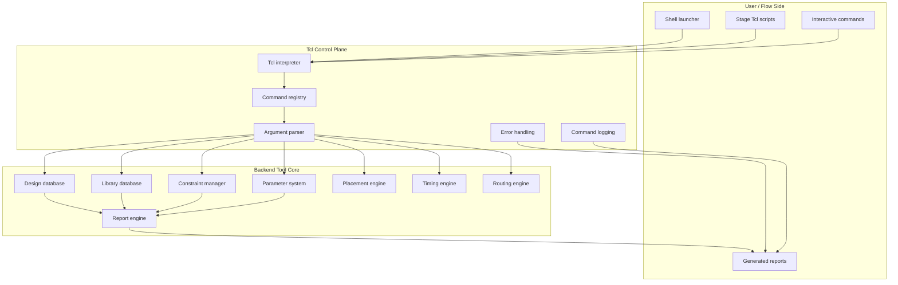
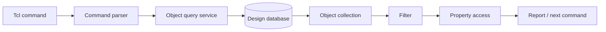
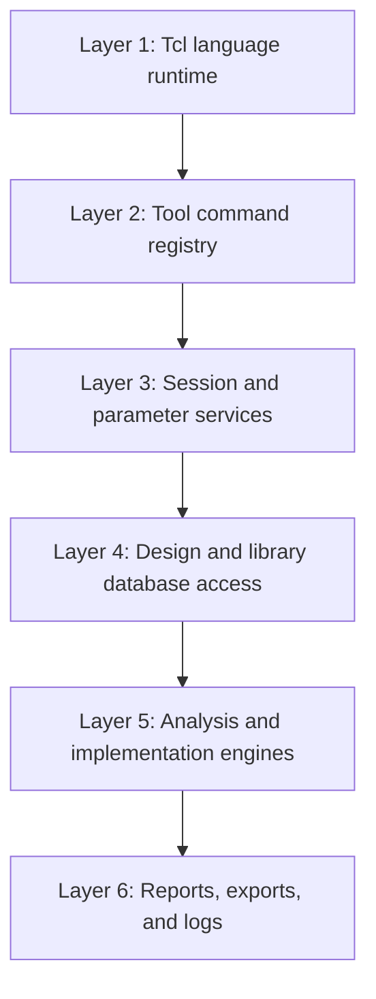
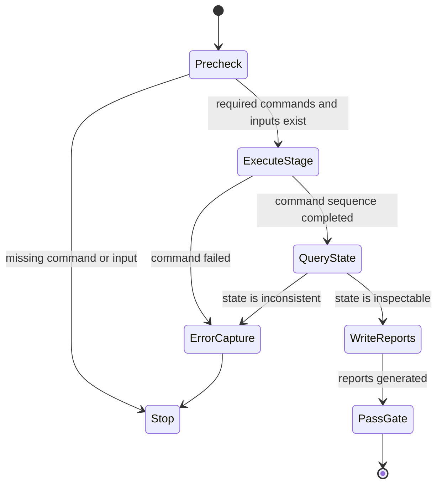
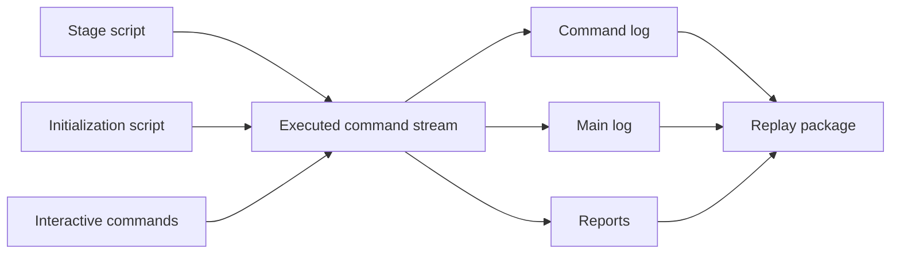

# 03. Why Tcl Is the Control Interface of Backend Flow

Author: Darren H. Chen  
Topic: EDA Tool Development / Physical Implementation / Backend Flow Engineering  
Demo: `LAY-BE-03_tcl_control_interface`

Backend tools are often evaluated by their visible engines: placement, clock-tree synthesis, routing, timing analysis, power analysis, design-rule checking, and ECO optimization. Those engines are important, but they are not sufficient to make a backend flow usable in a production environment.

A backend tool also needs a stable control layer.

That control layer must connect the executable program, the design database, technology and library contexts, command help, object queries, parameters, reports, logs, and stage scripts. In many mature EDA environments, the language used for this control layer is Tcl.

Tcl is therefore not just a scripting convenience. In backend implementation, Tcl acts as the command interface, object access layer, parameter control surface, report orchestration mechanism, and replayable engineering record.

The core idea of this article is simple:

> A backend flow becomes maintainable only when the tool exposes its internal capabilities through a controllable, inspectable, and repeatable Tcl interface.

This article explains why Tcl remains central to backend flow engineering, what architectural role it plays inside an EDA tool, what a command interface should expose, how Tcl relates to the design database, and how Demo 03 validates the minimum Tcl control surface before any design-specific flow is built.

---

## 1. Backend Flow Needs More Than Algorithms

A backend tool contains many algorithmic engines. A simplified view may look like this:

```text
Netlist import
Library loading
Floorplan initialization
Placement
Clock-tree synthesis
Routing
Timing analysis
Physical checking
ECO
Export
```

Each stage has its own internal data structures and optimization algorithms. However, real engineering flows do not simply call these engines once in a fixed order. They repeatedly query state, set parameters, select objects, capture reports, compare results, and react to intermediate findings.

For example, before placement, the flow may need to check:

```text
Are all standard-cell libraries loaded?
Are macro abstracts available?
Is the top design linked?
Are clock ports visible?
Are all required constraints loaded?
Are placement rows generated?
Are fixed macros legal?
Is utilization within an acceptable range?
```

After placement, the flow may need to ask:

```text
How many cells are placed?
How many cells remain unplaced?
What is the utilization?
Where are the high-density regions?
Which nets are timing-critical?
Which instances are fixed, soft-fixed, or movable?
Which reports should be written for review?
```

These questions cannot be answered by a placement engine alone. They require a control interface that can inspect and modify the tool state.

That is why backend flow engineering has two layers:

| Layer | Main responsibility | Typical implementation |
|---|---|---|
| Engine layer | Compute placement, routing, timing, extraction, checks, and optimization | C/C++ kernels, database services, graph algorithms |
| Control layer | Invoke engines, query objects, set options, manage stage order, write reports, record logs | Tcl command interface |

The engine layer produces results. The control layer makes those results usable in a repeatable engineering process.

---

## 2. Tcl as the Control Plane

A useful way to understand Tcl in backend flow is to see it as a control plane rather than a simple script layer.

In networking, a data plane forwards packets, while a control plane decides how forwarding should happen. Similarly, in an EDA tool, the algorithm engines manipulate design data, while the Tcl layer controls when and how those engines are invoked.



This architecture explains why Tcl is so persistent in EDA.

A backend tool needs to expose hundreds or thousands of capabilities, but those capabilities must not be exposed as unrelated binary APIs. They need a textual, inspectable, stable, and composable interface. Tcl fits this role because it provides:

| Requirement | Why it matters in backend flow | Tcl role |
|---|---|---|
| Command invocation | Backend capabilities are commonly exposed as commands | Command syntax and dispatch |
| Argument passing | EDA commands require many options and object lists | Option and list handling |
| Object flow | Query results must feed later commands | Lists, collections, variables |
| Conditional logic | Flow behavior depends on checks and reports | `if`, `catch`, `foreach`, procedures |
| Error capture | Long runs must stop or recover predictably | `catch`, return codes, error text |
| Reuse | Stages must be converted into reusable procedures | Tcl proc and sourced files |
| Replay | A failed session must be reconstructed | command log and scripted command stream |

Tcl is therefore not valuable because its syntax is fashionable. It is valuable because it matches the command-driven nature of backend tools.

---

## 3. The Control Interface Is a Contract

Every backend tool exposes an implicit contract through its command interface. That contract answers several questions:

```text
What commands exist?
Which commands are shell-safe?
Which commands require a design context?
Which commands work before design import?
Which commands require linked libraries?
Which commands are GUI-only?
Which commands create or modify database state?
Which commands only report state?
```

A mature backend flow should not assume that this contract is known. It should measure it.

That is the purpose of a command interface baseline.

Before building stage scripts, the flow should probe the environment:

```tcl
info commands
help <command>
```

or equivalent mechanisms offered by the tool.

The goal is not to build a complete manual. The goal is to classify the visible control surface into usable engineering groups:

| Command family | Example intent | Why it matters |
|---|---|---|
| Session commands | `help`, `history`, `get_logfile_name` | Understand the running session |
| Import commands | `import_*`, `read_*`, `load_*` | Bring external data into the tool |
| Linking commands | `link_*`, `current_*` | Establish design context |
| Object query commands | `get_cells`, `get_nets`, `get_pins`, `get_ports` | Observe database objects |
| Property commands | `get_property`, `list_property`, `report_property` | Inspect object attributes |
| Timing commands | `compute_*`, `report_*`, `get_*paths` | Analyze timing state |
| Physical commands | `place_*`, `route_*`, `check_*` | Modify or verify layout state |
| Export commands | `export_*`, `write_*`, `save_*` | Produce downstream handoff data |
| Report commands | `report_*` | Produce reviewable evidence |

The interface contract is not static across all tools, versions, modes, and licenses. That is why the command probe must be part of the demo and not only part of documentation.

---

## 4. Tcl Is Connected to the Design Database

The most important difference between a normal shell script and an EDA Tcl script is the object model behind it.

In a normal shell script, most operations manipulate files, paths, and strings. In a backend tool, Tcl commands operate on database objects:

```text
cell
net
pin
port
module
clock
scenario
shape
row
site
layer
via
route guide
blockage
violation
```

This changes the meaning of scripting.

A command such as `get_cells` is not just a string search. It is a database query. A command such as `get_property` is not just a key-value lookup. It is a controlled view into the attributes of internal objects.

The Tcl layer becomes powerful only when it is connected to the database object model.



This is the fundamental reason why backend Tcl is deeper than ordinary scripting. It is not only controlling a process; it is controlling a live design database.

---

## 5. Command Names Are Not Enough

A common mistake in backend scripting is to check whether a command exists and then assume it is usable. That is not sufficient.

A command can exist but still be unusable in the current state.

For example:

| Situation | Command may exist | But it may fail because |
|---|---|---|
| No design loaded | `get_cells` | There is no current design context |
| Libraries not linked | `report_link` | Library binding has not been performed |
| No clocks defined | `report_clock` | Clock objects do not exist yet |
| No timing graph built | timing report command | Timing state has not been computed |
| No routing data | route report command | Routing has not been performed |
| GUI-only context | selection command | No shell-visible selection set exists |

Therefore, command probing should distinguish between four levels:

| Level | Meaning | Example interpretation |
|---|---|---|
| Visible | Command is present in the namespace | It can be discovered by `info commands` |
| Callable | Command accepts invocation in current mode | Help or basic invocation succeeds |
| Context-valid | Required database state exists | Design, library, or timing context exists |
| Flow-valid | Command produces meaningful engineering evidence | Report or query result is useful |

This distinction is important for Demo 03. The demo should not force design-dependent commands to pass before a design has been imported. Instead, it should classify them correctly.

For example, object query commands may be visible before design import, but their meaningful execution belongs to later demos after import and link.

---

## 6. Backend Tcl Is a Layered Interface

A backend Tcl environment can be understood as several stacked layers.



Each layer has a different engineering meaning.

### 6.1 Tcl language runtime

This layer provides variables, procedures, lists, conditionals, loops, file I/O, and error capture. It is the basic programming environment.

### 6.2 Tool command registry

This layer maps textual commands to internal tool capabilities. It is where `get_*`, `set_*`, `report_*`, `import_*`, `export_*`, and engine commands become visible.

### 6.3 Session and parameter services

This layer controls environment-dependent state: working directory, log files, runtime parameters, message policy, resource settings, and session settings.

### 6.4 Design and library database access

This layer exposes objects such as cells, nets, pins, ports, libraries, sites, layers, rows, and shapes.

### 6.5 Analysis and implementation engines

This layer invokes placement, routing, timing, optimization, physical checking, and other engines.

### 6.6 Reports, exports, and logs

This layer converts internal state into external evidence: reports, command logs, summary logs, DEF, Verilog, SDC, SDF, SPEF, GDS/OASIS, violation databases, and review files.

When Tcl is treated only as a script language, these layers are easy to miss. When Tcl is treated as a control interface, the architecture becomes visible.

---

## 7. Object Query, Filter, and Property Access

The most useful backend Tcl scripts are rarely just linear command lists. They usually follow a query-filter-act pattern.

```text
query objects -> filter objects -> inspect properties -> act or report
```

For example, a flow may need to find all sequential cells, all clock pins, all high-fanout nets, all fixed macros, all unplaced instances, or all objects in a region.

Conceptually:

```tcl
set cells [get_cells *]
set ports [get_ports *]
set nets  [get_nets *]
```

Then the script may inspect properties:

```tcl
foreach c $cells {
    # get_property $c <property_name>
}
```

The exact syntax varies by tool, but the model is the same.

| Step | Purpose | Engineering value |
|---|---|---|
| Query | Convert database state into a Tcl-visible object set | Avoid manual inspection |
| Filter | Reduce the object set to a meaningful subset | Focus on relevant design state |
| Property access | Read object attributes | Explain why a flow behaves as it does |
| Action or report | Modify objects or write evidence | Create repeatable stage behavior |

This is the foundation of advanced backend flow engineering.

Without object query and property access, scripts remain shallow. With them, scripts can become design-aware.

---

## 8. Tcl Makes Stage Boundaries Explicit

Backend flow stages are not only a sequence of commands. They are controlled transitions between database states.

A stage boundary should answer:

```text
What state must exist before the stage starts?
What commands does the stage execute?
What state should exist after the stage finishes?
What reports prove that the stage completed correctly?
What should happen if the stage fails?
```

Tcl is the natural place to express this boundary.



This state-machine view is important. A stage script should not be only a list of commands. It should be a controlled transition with a precondition, execution body, postcondition, reports, and failure behavior.

Demo 03 focuses on an early stage boundary: before real design operations, the tool must expose a usable Tcl control interface.

---

## 9. Tcl and Error Handling

A backend run may take hours. A failure should not leave the engineer with only a truncated terminal output.

Tcl provides the structure needed to capture and classify failures:

```tcl
set rc [catch {
    # tool command
} result]

if {$rc != 0} {
    puts "ERROR: $result"
}
```

A robust flow should collect:

| Error data | Why it matters |
|---|---|
| Return code | Detect pass/fail in batch mode |
| Error message | Identify direct failure reason |
| Error stack | Find calling context |
| Command text | Know exactly what was attempted |
| Stage name | Connect failure to flow boundary |
| Input state | Detect missing preconditions |
| Log path | Preserve debug evidence |

The key point is not the exact `catch` syntax. The key point is that a Tcl-based flow can turn a failure into structured evidence.

This is very different from a GUI-only process, where failure investigation often depends on manual recollection.

---

## 10. Tcl and Command Replay

A production backend run should leave a replayable trace.

The flow may contain:

```text
wrapper shell script
project initialization script
stage Tcl files
generated Tcl fragments
interactive commands
command log
main log
summary log
reports
```

Tcl is central to this replay model because it provides a textual representation of what the tool did.



A command log is not merely a convenience. It is a technical artifact that answers:

```text
What did the tool actually execute?
In what order did commands run?
Which stage produced the failure?
Can the session be reconstructed?
Can two runs be compared?
```

For backend flow engineering, this is a major reason to prefer Tcl-driven execution over undocumented manual operations.

---

## 11. Demo 03: What Should Be Probed

`LAY-BE-03_tcl_control_interface` should not import a real design. Its job is to probe the control interface in a clean session.

The demo should answer:

```text
Can the tool expose its command namespace?
Can the flow classify command families?
Are key session commands visible?
Are object query commands visible?
Are library/import/link commands visible?
Are report commands visible?
Which commands are missing or context-dependent?
Can the result be written to reports?
```

A practical output set may include:

| Report | Purpose |
|---|---|
| `reports/tcl_control_interface.rpt` | Summarizes visible Tcl command interface |
| `reports/key_interface_probe.rpt` | Checks key command availability |
| `reports/command_family_summary.rpt` | Groups commands by family |
| `reports/context_dependent_commands.rpt` | Marks commands that require a design context |
| `reports/demo03_result.rpt` | Gives pass/fail interpretation for the demo |

The pass/fail decision should not require every possible backend command to exist. It should require the minimum command families needed to build later demos.

---

## 12. Suggested Probe Categories

A useful Demo 03 probe can classify commands as follows.

| Category | Representative commands | Required in Demo 03? | Notes |
|---|---|---:|---|
| Tcl basics | `source`, `info`, `proc`, `catch`, `puts` | Yes | Required for scripting |
| Help system | `help`, `history` | Yes | Needed for command discovery |
| Session/logging | log query or report commands | Recommended | Needed for observability |
| Import family | `import_*`, `read_*`, `load_*` | Recommended | Used by later demos |
| Link/context family | `link_*`, `current_*` | Optional/contextual | May require design state |
| Object query | `get_cells`, `get_nets`, `get_pins`, `get_ports` | Recommended | Core database interface |
| Property access | `get_property`, `list_property`, `report_property` | Recommended | Core object inspection path |
| Timing analysis | tool-specific timing commands | Optional/contextual | May require constraints and timing graph |
| Reports | `report_*` | Recommended | Evidence generation |
| Export | `export_*`, `write_*` | Optional | Used after data exists |
| GUI-only commands | selection/window commands | Not required | Should not block shell-mode demos |

This avoids a common mistake: treating all command names as equally mandatory.

A no-design Tcl control demo should verify the interface, not force design-dependent behavior.

---

## 13. Context-Dependent Commands Should Be Labeled, Not Treated as Failures

A command such as `current_design` or a timing report command can be meaningful only after design context has been established. If such a command is missing or fails in a no-design shell, the correct response is not always to mark the whole demo as failed.

The better classification is:

| Status | Meaning |
|---|---|
| `required-present` | Must exist for this demo to pass |
| `optional-present` | Useful if present, but not required |
| `context-dependent` | Valid only after a later stage establishes design context |
| `gui-only` | Not required for shell-oriented backend flow |
| `vendor-specific` | Tool-specific variant expected |
| `missing-critical` | Required command absent; demo fails |

This classification turns command probing into an engineering diagnostic rather than a brittle checklist.

For example:

```text
get_cells         -> required-present or recommended-present
get_nets          -> recommended-present
get_pins          -> recommended-present
get_ports         -> recommended-present
get_property      -> recommended-present
report_timing     -> vendor-specific or context-dependent
current_design    -> context-dependent
name_select       -> gui-only or optional
```

The exact command names differ by tool. The concept does not.

---

## 14. A Minimal Command Probe Skeleton

The following Tcl fragment is illustrative and intentionally generic:

```tcl
proc command_exists {cmd} {
    expr {[llength [info commands $cmd]] > 0}
}

set key_commands {
    help
    history
    get_cells
    get_nets
    get_pins
    get_ports
    get_property
    list_property
    report_property
}

set fp [open "reports/key_interface_probe.rpt" w]
puts $fp "# Key Interface Probe"

foreach cmd $key_commands {
    if {[command_exists $cmd]} {
        puts $fp [format "%-30s : present" $cmd]
    } else {
        puts $fp [format "%-30s : missing" $cmd]
    }
}

close $fp
```

This is not a complete flow. It is a model for command discovery. The production version should also classify commands, separate required and optional items, and record the execution mode.

---

## 15. How Tcl Relates to Later Backend Stages

Demo 03 is early in the series, but it affects all later stages.

| Later stage | Tcl dependency |
|---|---|
| Project library | Import libraries, query loaded libraries, report library state |
| Standard formats | Read and export LEF, DEF, Liberty, Verilog, SDC, SDF, SPEF, GDS/OASIS |
| Design import | Import netlist, link design, query top context |
| Object model | Query cells, nets, pins, ports, and properties |
| Floorplan | Create die/core, rows, tracks, blockages, macro placement |
| Placement | Set placement options, run placement, report utilization and congestion |
| Timing | Load constraints, compute timing, report path and constraint information |
| CTS | Build clock structures, report skew, latency, and clock QoR |
| Routing | Invoke routing stages, report violations and routing metrics |
| ECO | Select objects, replace cells, insert buffers, update reports |
| Handoff | Export standard deliverables and review manifests |

The Tcl control interface is therefore not a local topic. It is the foundation for the entire backend flow.

---

## 16. Methodology: Build a Tcl Control Baseline Before Building Flow Scripts

A disciplined backend flow should build its Tcl layer in the following order:

```text
1. Establish reproducible runtime environment
2. Capture session state space
3. Probe Tcl command interface
4. Build command help baseline
5. Build project library load stage
6. Import and link design
7. Validate object model queries
8. Build physical stages on top of verified context
```

Demo 03 corresponds to step 3.

The methodology is to avoid writing large flow scripts before understanding the command surface. Otherwise, the flow becomes fragile:

```text
A stage script calls commands that may not exist in the current mode.
A report command is assumed to be available but depends on a license or context.
A selection command works interactively but fails in batch mode.
A timing command name comes from another tool family and does not match the current backend tool.
A command exists but returns empty results because the database state is not ready.
```

A command baseline reduces these risks.

---

## 17. Engineering Checklist

A good Tcl control interface demo should check the following items.

| Check item | Expected result |
|---|---|
| Tool enters shell or batch Tcl mode | Session starts without GUI dependency |
| Tcl runtime is usable | Basic Tcl commands work |
| Command namespace is inspectable | Command list can be queried |
| Help mechanism exists | Key commands can be documented or probed |
| Object query commands are visible | Cells, nets, pins, and ports can be queried after design context exists |
| Property commands are visible | Object attributes can be inspected later |
| Report commands are visible | The flow can write evidence |
| Context-dependent commands are labeled | The report does not misclassify no-design failures |
| GUI-only commands are not required | Shell flow remains stable |
| Probe output is written to reports | Results are reviewable and versionable |

This checklist converts Tcl availability from an assumption into a measured artifact.

---

## 18. Common Pitfalls

### 18.1 Assuming command names are portable

Different backend tools may use different command names for similar concepts. A flow should avoid assuming that every command name is universal.

### 18.2 Mixing GUI-only commands into shell flows

Some commands are intended for windows, selections, or interactive views. These should not be required by batch-oriented demos.

### 18.3 Treating context-dependent commands as missing features

A command may fail simply because the design has not been imported yet. Demo 03 should not over-interpret such failures.

### 18.4 Ignoring command logs

A Tcl flow without a command log is difficult to reconstruct. Command logging should be enabled as early as possible.

### 18.5 Writing stage scripts before probing the interface

Large scripts written before command discovery tend to embed wrong assumptions. A control baseline should come first.

---

## 19. Demo 03 Review Path

After running `LAY-BE-03_tcl_control_interface`, review the outputs in this order:

```text
1. logs/<demo>.stdout.log
2. logs/<demo>.log
3. logs/<demo>.cmd.log
4. reports/tcl_control_interface.rpt
5. reports/key_interface_probe.rpt
6. reports/command_family_summary.rpt
7. reports/context_dependent_commands.rpt
8. reports/demo03_result.rpt
```

The most important question is not whether every command exists. The important questions are:

```text
Is the Tcl interpreter usable?
Can the command namespace be inspected?
Are key command families visible?
Are missing commands classified correctly?
Are design-context commands deferred to later demos?
Is the result written into stable report files?
```

If these questions can be answered, the backend flow now has a measurable control interface foundation.

---

## 20. Key Takeaways

Tcl is central to backend flow engineering because it connects multiple layers:

```text
Tool executable
Session state
Command registry
Design database
Library context
Parameter system
Analysis engines
Physical engines
Reports
Logs
Replay artifacts
```

It is not merely a language for writing small scripts. It is the tool-facing control interface through which backend engineering becomes reproducible.

The main engineering conclusions are:

1. Backend tools need a control plane in addition to algorithm engines.
2. Tcl is widely used because its command model matches EDA tool architecture.
3. The value of Tcl comes from its connection to the design database, not only from its syntax.
4. Command existence, command callability, and command context validity are different concepts.
5. A no-design control interface demo should classify commands instead of treating every missing context as a failure.
6. Object query and property access are the foundation of design-aware backend scripts.
7. Command logs and reports convert a Tcl session into reviewable engineering evidence.
8. A mature backend flow should build a Tcl command baseline before building large stage scripts.

If backend algorithms are the computation engines, Tcl is the engineering nervous system that lets those engines be controlled, inspected, sequenced, and reproduced.
