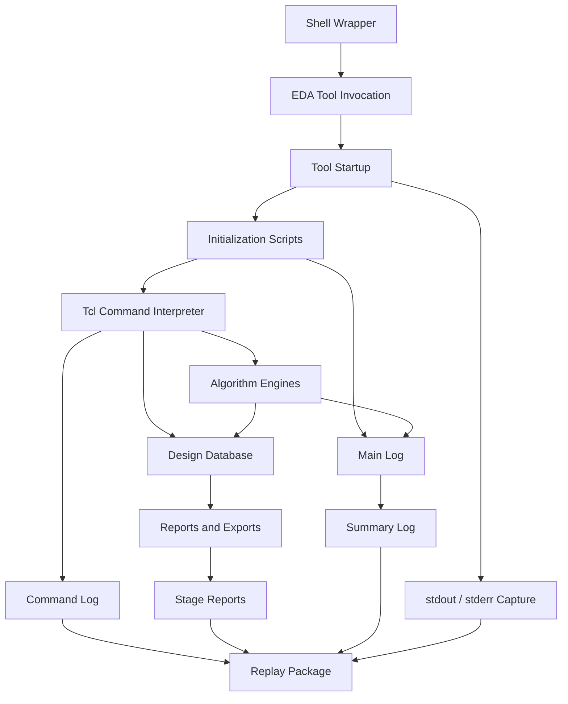
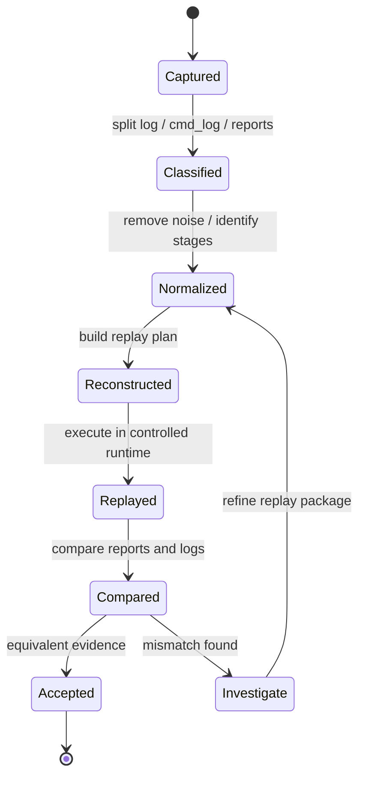
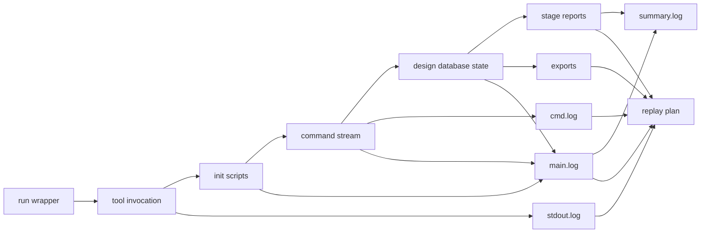
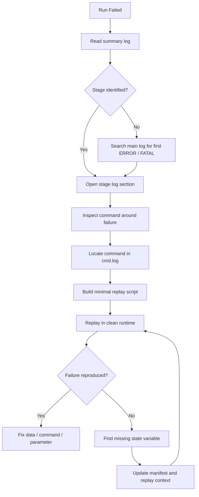

# 04. From log to cmd_log: Building a Replayable Backend Engineering Session

Author: Darren H. Chen  
Demo: `LAY-BE-04_log_cmdlog_replay`  
Tags: `Backend Flow` `EDA` `Log System` `Command Log` `Replay` `Tcl` `Debug Infrastructure` `Engineering Evidence`

In backend implementation, a successful run is not only a set of generated output files. It is also an engineering event that must be explained, reviewed, compared, and reconstructed later.

A backend flow may run for minutes, hours, or even days. It may pass through design import, library setup, timing constraint loading, floorplan construction, placement, clock construction, routing, engineering change, physical verification handoff, and final export. During that process, the design database changes many times. Tool parameters may be updated. Intermediate reports may be generated. Warnings may appear long before the final error. Some commands may be issued from scripts, some from the interactive shell, and some from GUI operations translated into tool commands.

If the run fails and the only thing left is a final error message, the engineering session has already lost most of its value.

A mature backend flow must preserve the engineering scene.

That scene is usually reconstructed from several layers of runtime evidence:

```text
main log
command log
summary log
standard output / standard error
stage reports
runtime manifest
input file manifest
checkpoint or database snapshot
```

The purpose of this article is to explain why `log` and `cmd_log` should be treated as core backend flow infrastructure, not as optional debug files.

---

## 1. A Backend Run Is a State Transition, Not a Linear Text Execution

A simple script may look linear:

```text
source setup.tcl
read design
link design
run placement
report result
```

But the actual tool session is not just a linear text execution. It is a sequence of state transitions.

At the beginning, there is no loaded design database. After libraries are loaded, the project library state changes. After a netlist is imported, the logical design graph exists. After linking, logical instances are bound to library cells. After floorplan creation, the physical canvas exists. After placement, cells have legal or illegal locations. After routing, nets acquire physical shapes and parasitic effects.

Therefore, each meaningful command should be understood as a transition:

```text
State_n + Command_n -> State_n+1 + Messages_n + Reports_n
```

A backend log system should preserve enough information to answer three questions:

```text
What was the previous state?
What command or operation caused the transition?
What evidence shows the new state?
```

Without this, the flow may still "run", but the run is not inspectable.

---

## 2. The Four-Layer Runtime Record Model

A single log file is not enough for a serious backend flow. Different record types solve different engineering problems.

| Record layer | Primary question answered | Typical content | Engineering role |
|---|---|---|---|
| `stdout.log` / `stderr.log` | What did the process print to the terminal? | terminal output, shell redirection, uncaught messages | process-level evidence |
| `main.log` | What happened inside the tool session? | initialization, warnings, errors, progress, runtime messages | diagnostic trace |
| `cmd.log` | What command sequence was executed? | Tcl commands, interactive commands, sourced commands | replay trace |
| `summary.log` | What is the quick status of this run? | stage status, pass/fail count, key warnings, elapsed time | review entry point |
| stage reports | What did the design look like at each checkpoint? | timing, utilization, placement, routing, DRC, QoR | design-state evidence |
| manifest files | What inputs and environment produced the run? | file paths, checksums, tool version, variables | reproducibility evidence |

The key point is that these files are not redundant. They are complementary.

A large `main.log` may tell you that an error occurred, but it may not provide a clean command sequence for replay. A `cmd.log` may provide the command sequence, but it may not show all warnings, timing summaries, or internal tool messages. A `summary.log` may quickly tell you which stage failed, but it cannot replace the full diagnostic trace.

A backend engineering flow should therefore be designed around layered runtime evidence.

---

## 3. Runtime Record Architecture

A backend tool session can be viewed as a runtime evidence generator.



The log architecture should not be added after the flow is already complicated. It should be present from the first runnable demo.

A good backend run wrapper should answer:

```text
Where is the main log?
Where is the command log?
Where is the summary?
Where are stage reports written?
Where is stdout captured?
Where is the temporary directory?
Where is the run manifest?
```

If these answers are implicit, the flow is not yet engineering-grade.

---

## 4. Why the Main Log Exists

The main log is the event trace of the tool session.

It usually records:

```text
tool startup messages
license checkout messages
environment and initialization messages
command execution traces
warnings and errors
stage progress
runtime statistics
internal engine messages
report generation messages
database save/load messages
exit status
```

The main log is the first place to inspect when a run fails. However, it is also easy for the main log to become too large. For this reason, it should be structured with stage markers.

A practical pattern is:

```text
[STAGE_BEGIN] 00_runtime_probe
...
[STAGE_END]   00_runtime_probe status=PASS elapsed=00:00:03

[STAGE_BEGIN] 01_init
...
[STAGE_END]   01_init status=PASS elapsed=00:00:12

[STAGE_BEGIN] 02_import
...
[STAGE_END]   02_import status=FAIL elapsed=00:01:05
```

This makes the log searchable and reviewable.

---

## 5. Why the Command Log Exists

The command log answers a different question:

```text
What commands did the tool actually execute?
```

This is not always the same as "what the top-level script contains".

A real session may include:

```text
commands from the main script
commands from sourced scripts
commands created by procedures
commands typed interactively
commands generated by GUI operations
commands issued by helper scripts
commands executed after variable expansion
```

Therefore, the command log is closer to the actual operational trace than the source script alone.

A command log is useful for:

```text
replaying a session
extracting minimal reproduction steps
comparing two sessions
building regression tests
auditing unexpected interactive changes
debugging GUI-to-command behavior
```

However, a command log is not automatically a complete replay package. It is one critical component of the package.

---

## 6. log vs cmd_log vs report

The distinction is important enough to formalize.

| File type | Best at | Weak at | Typical review method |
|---|---|---|---|
| `main.log` | understanding what happened | clean replay | search for `ERROR`, `WARNING`, stage markers |
| `cmd.log` | reconstructing command sequence | explaining internal messages | inspect command order and parameters |
| `summary.log` | fast pass/fail review | detailed diagnosis | read top-down |
| report files | understanding design state | reconstructing command history | compare stage by stage |
| manifest files | reproducing run context | explaining design QoR | compare paths, versions, checksums |

A mature backend flow does not choose one of them. It uses all of them.

---

## 7. Replay Is Not Just Sourcing a cmd_log

A common misunderstanding is:

```text
If I have cmd.log, I can replay the run.
```

This is only partially true.

A command sequence can only be replayed correctly when the surrounding state is also reconstructed. That state includes:

```text
tool binary
tool version
working directory
environment variables
license environment
HOME-related startup behavior
initialization scripts
input files
technology files
library files
constraints
database checkpoints
temporary directory isolation
runtime parameters
random seed or deterministic settings
```

A more accurate replay model is:

```text
Replay = CommandSequence + InitialState + InputData + RuntimeContext + ToolVersion
```

The command log provides the command sequence. It does not, by itself, provide the initial state.

This is why Demo 04 should not only parse a command log. It should also produce a replay plan.

---

## 8. Replay State Machine

A replayable engineering session can be represented as a state machine.



This model highlights an important point:

Replay is an iterative engineering process. The first replay attempt may fail because a hidden state was missing. The response should not be random debugging. The response should be to identify which state dimension was not captured.

---

## 9. The Session Evidence Graph

The relationship between log files and design evidence can be modeled as a graph.



This graph is useful because it prevents a narrow view of replay. A replay package is not just one file. It is a connected set of evidence files.

---

## 10. What Should Be Logged at Stage Boundaries

Every backend stage should leave a small but structured record.

| Stage boundary field | Example | Purpose |
|---|---|---|
| stage name | `design_import` | identify flow phase |
| start time | `2026-04-27 02:10:00` | runtime tracking |
| end time | `2026-04-27 02:11:21` | elapsed time calculation |
| input files | `top.v`, `std.lib`, `tech.lef` | reproduce stage |
| output files | `import.rpt`, `link.rpt` | locate evidence |
| warning count | `12` | fast risk review |
| error count | `0` | pass/fail gate |
| database checkpoint | `db/import_done` | restart point |
| command source | `tcl/import.tcl` | traceability |
| status | `PASS` / `FAIL` | summary decision |

A backend flow without stage boundary records is hard to debug because the reviewer must manually infer where one phase ended and the next began.

---

## 11. Error and Warning Classification

Not all warnings are equal. A useful log system should classify messages by engineering impact.

| Class | Meaning | Example impact | Review action |
|---|---|---|---|
| Fatal error | run cannot continue | parser failure, missing required file | stop and fix |
| Stage error | current stage failed | import failure, link failure, routing failure | inspect stage log |
| Data warning | input accepted but suspicious | missing physical view, unmatched instance | check data consistency |
| QoR warning | run finished but quality is risky | high utilization, high congestion | review reports |
| Environment warning | runtime context may be unstable | missing variable, fallback path | fix wrapper |
| License warning | license behavior affects run | waiting, reduced feature | review license setup |
| Noise warning | informational or known benign | repeated display messages | filter after confirmation |

The summary log should not merely count all warnings. It should help the engineer decide which warnings matter.

---

## 12. Command Log Normalization

A raw command log is often not suitable for direct reuse. It may contain:

```text
absolute paths
temporary paths
machine-specific paths
GUI-only commands
interactive selection commands
timestamps
viewer operations
debug-only commands
duplicated commands
commands generated by experiments
```

Before using it as a replay source, it should be normalized.

A normalized command log should separate:

```text
required commands
optional review commands
GUI-only commands
diagnostic commands
unsafe commands
environment-specific commands
```

A practical replay plan may look like this:

```text
01_required_init.tcl
02_required_import.tcl
03_required_link.tcl
04_optional_reports.tcl
05_diagnostic_queries.tcl
99_excluded_gui_only.tcl
```

This structure is much more useful than blindly sourcing a raw command log.

---

## 13. Replay Package Design

A replay package should be self-describing.

```text
replay/
  README.md
  manifest/
    runtime_manifest.txt
    input_manifest.txt
    tool_manifest.txt
    report_manifest.txt
  logs/
    run.stdout.log
    run.log
    run.cmd.log
    run.sum.log
  tcl/
    replay_required.tcl
    replay_reports.tcl
    replay_diagnostics.tcl
  reports/
    original/
    replayed/
  diff/
    report_diff_summary.txt
```

The replay package should answer:

```text
How was the original run launched?
Which commands must be replayed?
Which files are required?
Which reports define equivalence?
Which differences are acceptable?
Which differences require investigation?
```

This moves replay from a manual activity to an engineering procedure.

---

## 14. Report Comparison Is Part of Replay

A run is not replayed just because the replay script completes.

A replay should compare observable outputs.

Possible comparison targets include:

```text
stage pass/fail status
warning and error counts
number of loaded libraries
number of design instances
number of nets and ports
timing summary
utilization summary
placement legality summary
routing summary
DRC summary
export file existence
```

Some outputs are expected to be identical. Some may differ because of runtime timestamps, host names, temporary file names, or nondeterministic ordering. A good comparison framework distinguishes between meaningful and non-meaningful differences.

---

## 15. A Practical Debug Flow Using log and cmd_log

When a backend run fails, a structured debug flow is more effective than random inspection.



This flow makes one principle explicit:

If a failure cannot be reproduced, the missing piece is often not the command itself. It is one of the state variables around the command.

---

## 16. What Demo 04 Should Demonstrate

Demo 04 is not intended to run a full physical implementation stage. Its purpose is to demonstrate runtime evidence handling.

A good Demo 04 should perform the following actions:

```text
read a sample main log
read a sample command log
extract warning/error/failure lines
identify command sequence
classify command types
generate a replay plan
write a replay summary report
```

The expected output can include:

```text
reports/log_cmdlog_replay_plan.rpt
reports/error_warning_extract.rpt
reports/command_sequence.rpt
reports/replay_readiness.rpt
```

The demo should help the reader understand:

```text
what was captured
what can be replayed
what cannot be replayed directly
what state information is still required
```

This is why Demo 04 belongs early in the backend flow series. Before handling large design databases, the engineering environment must first be able to preserve and replay tool sessions.

---

## 17. Example Replay Readiness Report

A useful replay readiness report may look like this:

```text
# Replay Readiness Report

Run ID                : LAY-BE-04
Main log              : FOUND
Command log           : FOUND
Summary log           : FOUND
Runtime manifest      : FOUND
Input manifest        : FOUND

Command count         : 37
Required commands     : 18
Diagnostic commands   : 11
GUI-only commands     : 3
Unsafe commands       : 1
Unknown commands      : 4

First error stage     : design_import
First error command   : import_def ./data/top.def
Replay status         : PARTIAL
Missing state         : design database checkpoint before DEF import
Recommended action    : add link-stage checkpoint and input file checksum
```

This kind of report is more valuable than simply saying "replay failed". It tells the engineer what is missing.

---

## 18. Anti-Patterns

Several common habits make backend sessions difficult to replay.

| Anti-pattern | Why it is risky | Better pattern |
|---|---|---|
| only checking final reports | hides early warnings | review summary and first error |
| using one giant log only | hard to replay | split log, command log, summary |
| relying on GUI memory | not reproducible | capture command trace |
| overwriting logs | loses history | unique run directories |
| mixing multiple runs in one tmp directory | causes contamination | per-run tmp directory |
| using raw absolute paths everywhere | reduces portability | use project-root variables |
| ignoring command log | loses replay path | archive cmd.log with reports |
| replaying without manifest | hidden state mismatch | record runtime and inputs |

Avoiding these anti-patterns is often more important than adding more flow commands.

---

## 19. Recommended Directory Structure

A simple but effective structure is:

```text
run/
  2026-04-27_024112_LAY-BE-04/
    logs/
      run.stdout.log
      run.log
      run.cmd.log
      run.sum.log
    reports/
      log_cmdlog_replay_plan.rpt
      error_warning_extract.rpt
      command_sequence.rpt
      replay_readiness.rpt
    manifest/
      runtime_manifest.txt
      input_manifest.txt
      tool_manifest.txt
    tmp/
    replay/
      replay_required.tcl
      replay_reports.tcl
```

The timestamped run directory prevents overwriting. The separate subdirectories keep evidence organized. The replay directory keeps reconstructed commands separate from raw command logs.

---

## 20. Methodology: Evidence-Driven Backend Flow

The underlying methodology can be summarized as:

```text
Do not trust a backend run unless it leaves evidence.
Do not trust evidence unless it can be interpreted.
Do not trust interpretation unless it can be replayed or compared.
```

This leads to a practical engineering rule:

```text
Every stage should produce:
1. a command trace,
2. a diagnostic trace,
3. a summary,
4. a design-state report,
5. enough context for replay.
```

This methodology applies not only to early demos, but also to full-scale implementation work.

---

## 21. Engineering Checklist

Before considering a backend run reproducible, check the following:

```text
[ ] Tool executable path is recorded.
[ ] Tool version is recorded.
[ ] Working directory is recorded.
[ ] Environment variables are recorded or controlled.
[ ] Startup scripts are explicit.
[ ] Main log is generated.
[ ] Command log is generated.
[ ] Summary log is generated.
[ ] stdout and stderr are captured.
[ ] Stage reports are generated.
[ ] Input files are listed.
[ ] Important input files have checksums.
[ ] Temporary directory is isolated.
[ ] Run directory is not overwritten.
[ ] Failure stage can be identified.
[ ] First error can be located.
[ ] Command around first error can be extracted.
[ ] Replay plan can be generated.
```

The value of this checklist is not bureaucratic. It is the minimum engineering discipline required to make backend flow behavior explainable.

---

## 22. Conclusion

The difference between a temporary backend run and an engineering-grade backend session is evidence.

A temporary run may produce a result. An engineering-grade session produces a result plus enough context to explain how the result was produced.

`main.log`, `cmd.log`, `summary.log`, reports, and manifests form the runtime evidence layer of a backend flow. The main log explains what happened. The command log preserves the command trajectory. The summary log compresses the review path. Reports capture design state. Manifests preserve the surrounding runtime context.

Replay is not a single command. It is a method for reconstructing a session from its evidence.

For backend engineering, this is not a secondary concern. It is one of the foundations of reliable flow development.
