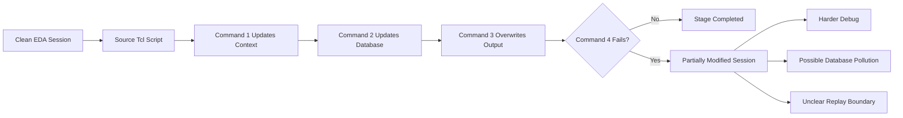
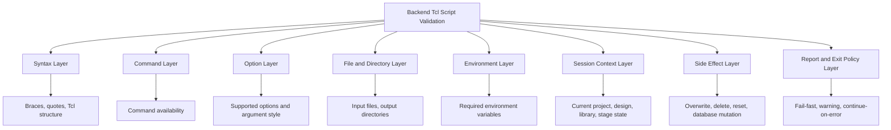
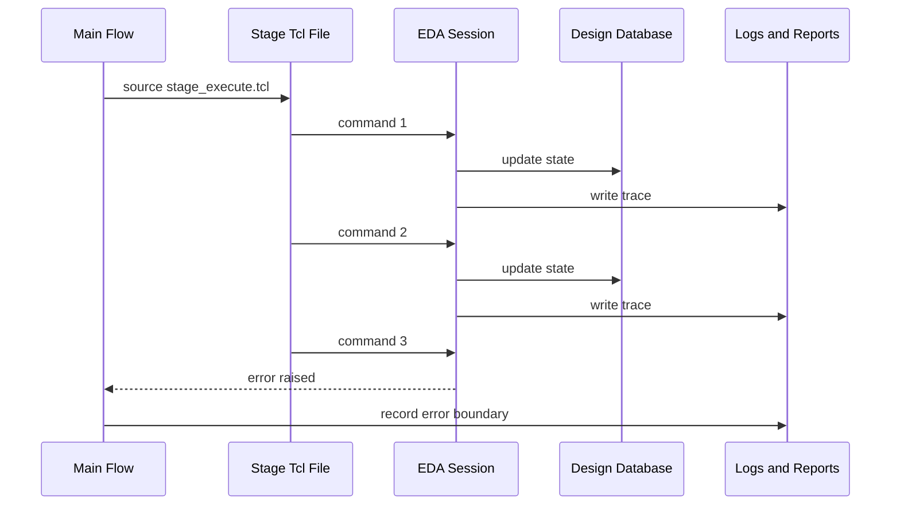
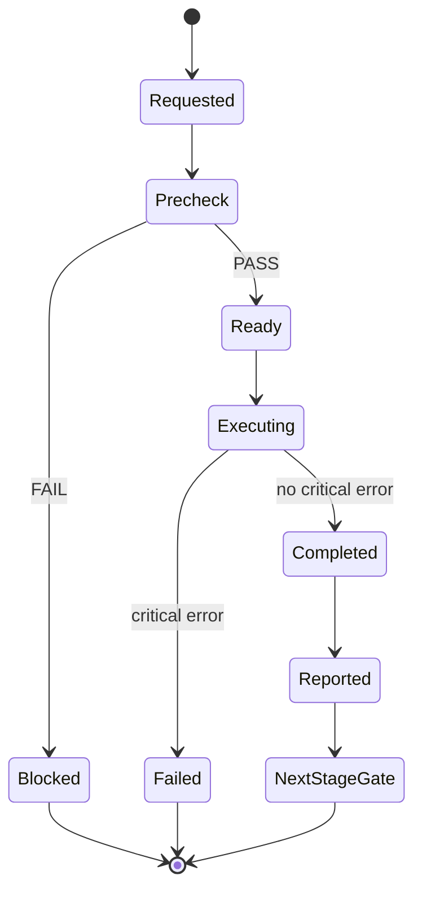
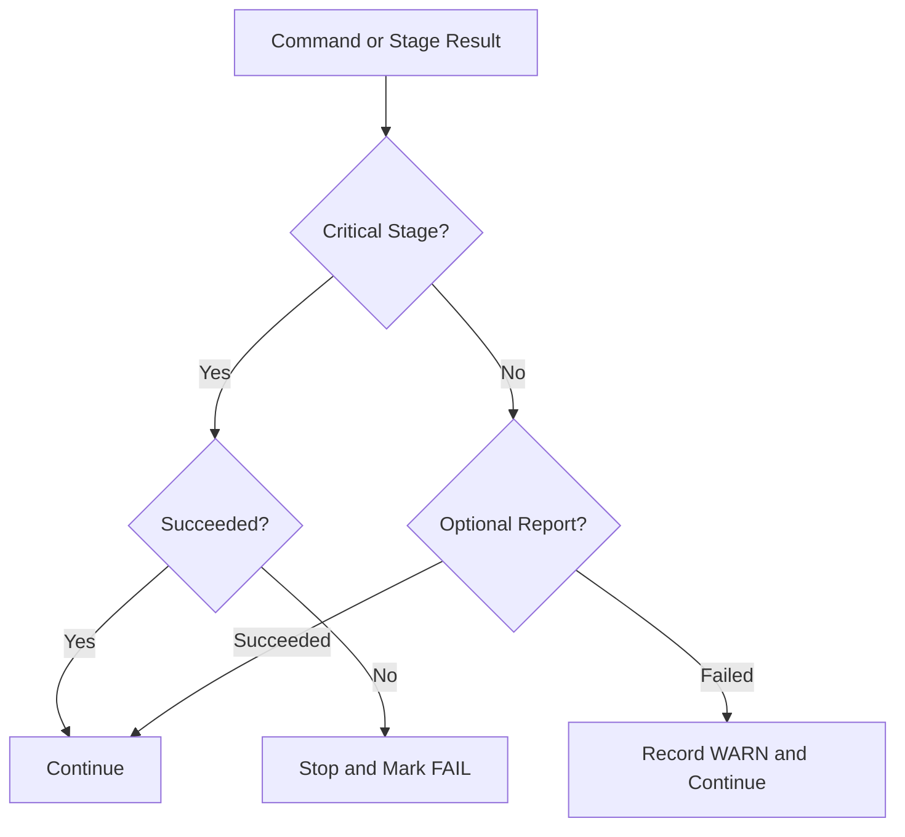
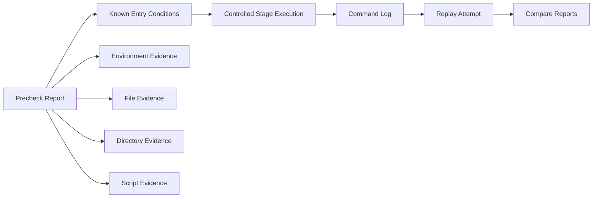

# 05. Why Backend Tcl Scripts Must Be Checked Before Execution

Author: Darren H. Chen  
Topic: Backend Flow Engineering / Tcl Flow Control / Reproducible EDA Runtime  
Demo: `LAY-BE-05_tcl_script_precheck`

Backend Tcl scripts are not ordinary helper scripts.

In a backend implementation flow, a Tcl script can load libraries, import a design, link a database, initialize a floorplan, create rows, insert blockages, change constraints, place cells, update routing state, generate reports, overwrite output files, and move the current session from one implementation state to another.

That means a backend Tcl script is not only a text file to be executed. It is a state transition program for an active EDA session.

This is why a mature backend flow should not directly execute every script with a blind `source` command. Before a script changes the design database, the flow should verify whether the script is structurally valid, whether its inputs exist, whether the environment is complete, whether the current session is in the right state, and whether the expected side effects are acceptable.

The purpose of precheck is not to make scripts look complicated. The purpose is to prevent a backend session from entering an unknown, half-modified, hard-to-reproduce state.

---

## 1. A Backend Tcl Script Is a State Transition Boundary

A simple shell script often manipulates files, strings, command-line arguments, and process calls. A backend Tcl script manipulates an in-memory design database.

For example, a stage script may do things such as:

```tcl
source ./config/project_init.tcl
source ./scripts/library_setup.tcl
source ./scripts/design_import.tcl
source ./scripts/floorplan_init.tcl
source ./scripts/place_setup.tcl
```

From the outside, these are only several `source` statements. Inside the EDA tool, each statement may trigger a large set of state transitions.

```text
No design database
    -> technology context loaded
    -> physical and timing libraries loaded
    -> netlist imported
    -> design linked
    -> floorplan initialized
    -> placement context prepared
```

Once a command has changed the design database, the session is no longer the same. If a later command fails, the flow is not necessarily back at the original state. It may be in a partially updated condition.

This is the central reason why script execution needs a gate.



The problem is not only that a command failed. The problem is that the failure happened after the session had already moved forward.

A robust backend flow therefore treats each stage script as a controlled state transition:

```text
precheck -> execute -> report -> gate next stage
```

---

## 2. Why “Run First, Debug Later” Is Not Enough

A common early-stage flow style is:

```tcl
source run.tcl
```

If the script fails, the engineer opens the log and starts debugging. This approach works for very small experiments, but it becomes risky in real backend work.

The reason is that many backend errors are delayed errors.

A delayed error is a failure that is not detected at the moment when the harmful condition is introduced. It appears later, after several commands have already executed.

Typical examples include:

| Error Type | When the Issue Is Introduced | When It May Fail |
|---|---|---|
| Missing library path | During setup | During link or timing report |
| Wrong top module | During import | During link, query, or report |
| Invalid floorplan parameter | During config parsing | During row generation or placement |
| Missing output directory | During stage setup | During report writing |
| Unsupported command option | During script authoring | At command execution |
| Wrong design context | Before stage starts | When object query returns empty or invalid data |
| Overwritten output path | During config setup | After a successful but destructive write |

If the flow only catches the final failure, the original cause can be buried under many later messages.

That is why a script should be checked before it is executed. Precheck moves obvious and preventable failures to the beginning of the run, where they are easier to understand and less damaging.

---

## 3. Script Validation Is More Than Syntax Checking

Many engineers associate script checking with syntax checking. Syntax is only the first layer.

A backend Tcl script can be syntactically correct and still unsafe to execute.

For example:

```tcl
report_timing > reports/timing.rpt
```

This line may be syntactically valid, but it may still be wrong in the current context:

- the command may not exist in the selected tool mode;
- the design may not be linked;
- no timing library may be loaded;
- clocks may not be defined;
- the `reports` directory may not exist;
- the redirection style may not be supported;
- the report may overwrite an important previous result.

A practical backend precheck system should cover multiple layers.



Each layer answers a different engineering question.

| Validation Layer | Question It Answers | Typical Failure Prevented |
|---|---|---|
| Syntax | Can the Tcl interpreter parse the script? | Broken braces, quotes, malformed control blocks |
| Command | Does the command exist in this tool mode? | Version mismatch, missing license feature, GUI-only command |
| Option | Are the command arguments valid? | Unsupported option, ambiguous option, wrong value type |
| File and directory | Are required files and output locations available? | Missing netlist, missing library, unwritable reports directory |
| Environment | Are required shell variables exported? | Missing project root, tool root, library root |
| Session context | Is the database ready for this stage? | Running placement before floorplan, reporting timing before link |
| Side effect | Will the script modify or overwrite important state? | Accidental reset, output overwrite, destructive cleanup |
| Exit policy | What should happen if this check fails? | Continuing after a critical failure |

A flow that only checks syntax still leaves most real backend failures uncovered.

---

## 4. The Hidden Risk of `source`

In Tcl, `source` is a simple and powerful command: it reads a file and evaluates the Tcl commands inside that file.

In a backend flow, this simplicity hides a serious engineering issue. `source` does not merely read a script. It injects a sequence of commands into the current EDA session.



If command 3 fails, command 1 and command 2 have already changed the session. This is why a stage wrapper should never treat `source` as a harmless file operation.

A safer pattern is:

```tcl
set rc [catch {
    source ./scripts/stage_execute.tcl
} errMsg]

if {$rc != 0} {
    puts "STAGE_ERROR: stage_execute"
    puts "ERROR: $errMsg"
    puts "ERRORINFO: $::errorInfo"
    exit 1
}
```

This does not undo previous database changes, but it creates a clear execution boundary. It also prevents the flow from continuing into the next stage after a critical failure.

---

## 5. Precheck as a Stage Gate

A backend flow is usually a staged system. Each stage has entry conditions, execution commands, output reports, and exit criteria.

A stage should start only when its entry conditions are satisfied.



The important idea is that precheck is not an optional decorative step. It is a gate between a run request and a state-changing stage.

A stage gate usually includes:

```text
1. required environment variables
2. required files
3. required directories
4. required tool commands
5. expected current session state
6. expected output paths
7. stage risk level
8. error policy
```

For Demo 05, the basic version focuses on the most fundamental gate:

```text
environment variables -> directories -> Tcl stage file -> controlled source -> precheck report
```

This is intentionally small. The goal is not to simulate an entire signoff flow. The goal is to demonstrate the engineering pattern.

---

## 6. File-Level Precheck

The simplest and most useful checks are file-level checks.

Before a stage is executed, the flow should confirm that the required script files exist and that output directories are writable.

A minimal set of helper procedures may look like this:

```tcl
proc require_env {name} {
    if {![info exists ::env($name)]} {
        error "Missing required environment variable: $name"
    }
}

proc require_file {path} {
    if {![file exists $path]} {
        error "Required file does not exist: $path"
    }
    if {![file readable $path]} {
        error "Required file is not readable: $path"
    }
}

proc require_dir {path} {
    if {![file isdirectory $path]} {
        error "Required directory does not exist: $path"
    }
}
```

These checks may look basic, but they catch a large class of real flow failures:

- wrong run directory;
- broken relative paths;
- missing generated script;
- stale project copy;
- incomplete demo package;
- missing reports directory;
- missing temporary directory;
- incorrectly exported environment variables.

Backend flow failures are not always deep algorithmic problems. Many of them are preventable path and context problems.

---

## 7. Environment Validation

Shell environment and Tcl execution are tightly connected in backend scripting.

A common flow pattern is:

```csh
setenv PROJECT_ROOT /path/to/project
setenv REPORT_DIR   /path/to/project/reports
setenv LOG_DIR      /path/to/project/logs
setenv TMP_DIR      /path/to/project/tmp
setenv STAGE_TCL    /path/to/project/tcl/stage_execute.tcl
```

Then the Tcl script uses:

```tcl
set project_root $env(PROJECT_ROOT)
set report_dir   $env(REPORT_DIR)
set stage_tcl    $env(STAGE_TCL)
```

If one of these variables is missing, the script may fail in a confusing location. It is better to check them at the beginning.

A clean precheck report should make environment status explicit:

```text
[PASS] PROJECT_ROOT is set
[PASS] REPORT_DIR is set
[PASS] LOG_DIR is set
[PASS] TMP_DIR is set
[PASS] STAGE_TCL is set
[PASS] REPORT_DIR exists
[PASS] LOG_DIR exists
[PASS] TMP_DIR exists
[PASS] STAGE_TCL exists
PRECHECK_RESULT: PASS
```

When a required item is missing, the report should block the stage:

```text
[PASS] PROJECT_ROOT is set
[FAIL] STAGE_TCL is not set
[BLOCK] stage execution is not allowed
PRECHECK_RESULT: FAIL
```

The value of this report is not only technical. It also improves team communication. Instead of saying “the script does not work,” the report says exactly which precondition is missing.

---

## 8. Context Validation

File-level checks are necessary but not sufficient. A backend stage often requires a certain database context.

For example:

| Stage | Required Context |
|---|---|
| Library setup | Technology and library files are available |
| Design import | Netlist path and top module are known |
| Link | Imported netlist and loaded libraries exist |
| Floorplan | Linked design and physical site information exist |
| Placement | Floorplan, rows, blockages, and placement area exist |
| Timing report | Linked timing graph, clocks, constraints, and libraries exist |
| Routing | Legal placement and routing resources exist |
| Export | Valid database state and output directories exist |

A command may exist but still be invalid in the current context.

For example, an object query command may be available before design import, but it may return an empty result because no design database exists yet. A timing report command may be available before constraints are loaded, but the result may be meaningless.

A robust stage precheck therefore distinguishes between command availability and context readiness.

```text
Command exists  !=  command is meaningful now
Script parses   !=  stage is safe to execute
File exists     !=  design context is complete
```

This distinction is essential in backend flow engineering.

---

## 9. Side-Effect Awareness

Some Tcl commands are informational. Others are state-changing. A script precheck system should treat them differently.

| Command Class | Typical Purpose | Risk Level |
|---|---|---|
| Query commands | Inspect objects or parameters | Low |
| Report commands | Generate output reports | Low to medium |
| Setup commands | Configure stage behavior | Medium |
| Import commands | Build database context | Medium to high |
| Optimization commands | Modify design implementation | High |
| Cleanup commands | Delete or reset state | High |
| Export commands | Write handoff files | Medium to high |

A precheck system does not need to prohibit high-risk commands. It needs to make risk visible and intentional.

For example, a run plan may state:

```text
Stage: floorplan_init
Policy: fail-fast
Side effects:
  - creates die/core boundary
  - creates placement rows
  - may overwrite floorplan report
  - changes design database state
```

This is far better than hiding the side effects inside a long script.

---

## 10. Fail-Fast and Continue-on-Error

Not every failure should be handled in the same way.

A backend flow should distinguish between critical and non-critical failures.

| Policy | Meaning | Suitable For |
|---|---|---|
| Fail-fast | Stop the flow immediately when the step fails | Environment setup, library loading, design import, link, floorplan, placement, routing, export |
| Continue-on-error | Record the error but continue the flow | Optional debug report, optional statistics, exploratory queries |
| Warn-only | Print a warning but do not change flow status | Non-blocking recommendation, optional input not present |

A common mistake is to use one global behavior for all errors. For example:

```text
always stop
```

or:

```text
always continue
```

Both are too crude.

Always stopping makes the flow fragile. Always continuing makes the flow unsafe.

The better method is stage-specific policy.



The policy should be visible in the script, not buried in engineer memory.

---

## 11. Error Boundaries with `catch`

Tcl provides `catch` as a direct way to define an error boundary.

A stage wrapper can be written as:

```tcl
proc run_stage {stage_name script_path policy} {
    puts "STAGE_BEGIN: $stage_name"

    if {![file exists $script_path]} {
        error "Stage script not found: $script_path"
    }

    set rc [catch {
        source $script_path
    } errMsg]

    if {$rc != 0} {
        puts "STAGE_ERROR: $stage_name"
        puts "ERROR: $errMsg"
        puts "ERRORINFO: $::errorInfo"

        if {$policy eq "fail-fast"} {
            error "Stage failed with fail-fast policy: $stage_name"
        } else {
            puts "WARNING: continuing after non-critical stage failure: $stage_name"
        }
    }

    puts "STAGE_END: $stage_name"
}
```

This wrapper gives the flow several engineering properties:

- every stage has a visible name;
- the source file is checked before execution;
- the error message is captured;
- the Tcl stack trace is preserved through `errorInfo`;
- the failure policy is explicit;
- the next stage is blocked when the policy requires it.

Without such a boundary, a long script can fail in the middle and leave the top-level flow with poor diagnostic information.

---

## 12. Run Plan Before Execution

For longer flows, it is useful to generate a run plan before execution.

A run plan is not a replacement for the script. It is a readable description of what the run intends to do.

Example:

```text
[STAGE] environment_precheck
  input  : shell environment, project directory
  output : reports/precheck_summary.rpt
  policy : fail-fast

[STAGE] script_precheck
  input  : tcl/stage_execute.tcl
  output : reports/precheck_summary.rpt
  policy : fail-fast

[STAGE] stage_execute
  input  : tcl/stage_execute.tcl
  output : reports/stage_execute.rpt
  policy : fail-fast

[STAGE] final_summary
  input  : stage result
  output : reports/run_summary.rpt
  policy : continue-on-error
```

The run plan answers several practical questions before the tool starts modifying the database:

- which stages will run;
- which files are required;
- where reports will be written;
- what policy applies to each stage;
- which stage is allowed to modify state;
- which stage only reports status.

This makes the flow easier to review, easier to hand over, and easier to debug.

---

## 13. Precheck Reports as Engineering Evidence

Precheck output should not exist only in terminal text. It should be written into a report file.

A useful precheck report should include:

| Field | Meaning |
|---|---|
| Check name | What was checked |
| Result | PASS, FAIL, or WARN |
| Detail | Path, variable, command, or context value |
| Blocking policy | Whether failure blocks execution |
| Suggested action | What to fix next |

Example:

```text
# precheck_summary.rpt

Generated: 2026-04-27 10:00:00
Demo: LAY-BE-05_tcl_script_precheck

[PASS] env PROJECT_ROOT exists
[PASS] env REPORT_DIR exists
[PASS] env LOG_DIR exists
[PASS] env TMP_DIR exists
[PASS] dir REPORT_DIR exists
[PASS] dir LOG_DIR exists
[PASS] dir TMP_DIR exists
[PASS] file stage_execute.tcl exists

PRECHECK_RESULT: PASS
EXECUTION_ALLOWED: YES
```

A failing example:

```text
# precheck_summary.rpt

[PASS] env PROJECT_ROOT exists
[PASS] env REPORT_DIR exists
[FAIL] file stage_execute.tcl missing
[BLOCK] stage_execute cannot be sourced

PRECHECK_RESULT: FAIL
EXECUTION_ALLOWED: NO
```

This report becomes part of the engineering evidence chain.

```text
precheck report -> execution log -> command log -> stage report -> summary report
```

Together, these files explain not only what happened, but why the flow was allowed to proceed.

---

## 14. Precheck and Replay Are Connected

Script validation and command replay are closely related.

A replayable flow needs more than a command log. It needs a known starting state and known entry conditions.

If the original run was executed under unclear conditions, replay becomes unreliable. A command log may reproduce command order, but it cannot reconstruct a missing library path, an unknown working directory, or a hidden user initialization file.

Precheck improves replay quality by recording the initial state before execution.



This is why Demo 05 naturally follows Demo 04. Demo 04 records the executed command trace. Demo 05 validates the stage boundary before those commands are allowed to run.

---

## 15. Script Precheck as a Team Interface

A well-written precheck layer makes a Tcl flow easier for other engineers to use.

Without precheck, the script author may know many implicit requirements:

```text
run from this directory
set this environment variable first
make sure the reports directory exists
do not run this after placement
use a clean session
ignore this warning but not that one
```

A new engineer does not know these assumptions.

Precheck turns implicit assumptions into executable checks.

That changes the team interface from informal instruction to engineering contract.

| Hidden Assumption | Explicit Precheck |
|---|---|
| Run from project root | Check `PROJECT_ROOT` and working directory |
| Reports directory exists | Check and create or block |
| Stage file is generated | Check file existence |
| Previous stage completed | Check stage marker or report |
| Design is linked | Query current design context |
| Warning is acceptable | Mark it as WARN with policy |
| Failure must stop flow | Use fail-fast policy |

The result is a flow that explains its own requirements.

---

## 16. Demo 05: What This Demo Should Prove

Demo `LAY-BE-05_tcl_script_precheck` is not intended to implement a full chip backend flow. Its purpose is to demonstrate the minimum engineering pattern for safe script execution.

The demo should prove five things.

### 16.1 The Wrapper Can Check Required State

The wrapper should check environment variables and directory structure before invoking the stage script.

Expected checks include:

```text
LAY_DEMO_ROOT
LAY_REPORT_DIR
LAY_LOG_DIR
LAY_TMP_DIR
LAY_BACKEND_TOOL_BIN
```

The exact variable names can be adjusted by project convention, but the principle remains the same: the wrapper must not assume that the runtime context is valid.

### 16.2 The Stage Script Is Not Sourced Blindly

The main script should verify that the stage file exists before calling `source`.

```text
tcl/stage_execute.tcl
```

If the file is missing, the flow should stop and write a clear report.

### 16.3 Precheck Result Is Written to a Report

The key output should be:

```text
reports/precheck_summary.rpt
```

This report should make the result machine-readable and human-readable.

### 16.4 Execution Is Controlled by Precheck Result

If precheck fails, the stage should not execute.

If precheck passes, the stage can execute and generate:

```text
reports/stage_execute.rpt
```

### 16.5 Errors Are Captured at the Stage Boundary

If the stage script fails, the wrapper should capture the error and record enough detail to diagnose it.

At minimum:

```text
stage name
script path
error message
Tcl errorInfo
policy decision
```

---

## 17. Recommended Repository Structure for This Demo

A clean demo package can use a structure like this:

```text
LAY-BE-05_tcl_script_precheck/
  README.md
  README_zh.md
  config/
    laycore_env.csh
  scripts/
    run_demo.csh
  tcl/
    lay_common.tcl
    run_demo.tcl
    stage_execute.tcl
  reports/
    .gitkeep
  logs/
    .gitkeep
  tmp/
    .gitkeep
```

The important point is separation of responsibilities:

| Path | Role |
|---|---|
| `config/` | Shell-level runtime configuration |
| `scripts/` | Entry wrapper and command-line interface |
| `tcl/` | Tool-side Tcl logic |
| `reports/` | Structured result outputs |
| `logs/` | Runtime traces |
| `tmp/` | Isolated temporary files |

This structure also makes the demo easy to review on GitHub. Readers can inspect the flow boundary without needing access to proprietary technology files or design data.

---

## 18. Practical Checklist for Backend Tcl Precheck

A useful backend precheck checklist can start with the following items.

### Runtime

```text
[ ] tool binary is explicitly selected
[ ] working directory is fixed
[ ] log directory exists
[ ] report directory exists
[ ] tmp directory exists
[ ] stdout/stderr redirection is configured
```

### Environment

```text
[ ] project root is set
[ ] technology root is set if needed
[ ] library root is set if needed
[ ] design root is set if needed
[ ] run mode is recorded
```

### Script

```text
[ ] stage script exists
[ ] stage script is readable
[ ] stage script is not empty
[ ] required included files exist
[ ] Tcl syntax can be checked where supported
```

### Context

```text
[ ] current project exists when required
[ ] current design exists when required
[ ] libraries are loaded when required
[ ] top module is known when required
[ ] floorplan exists when required
[ ] stage marker from previous step exists when required
```

### Output

```text
[ ] report output path is writable
[ ] existing reports are intentionally overwritten or versioned
[ ] stage summary will be generated
[ ] failure output will be preserved
```

### Policy

```text
[ ] critical stage uses fail-fast
[ ] optional report uses continue-on-error
[ ] warning-only checks are documented
[ ] failure returns non-zero status to the wrapper
```

---

## 19. Common Anti-Patterns

Several patterns should be avoided in a backend Tcl flow.

### 19.1 Blind Source

```tcl
source ./scripts/stage.tcl
```

This gives no precheck, no stage boundary, and weak error reporting.

### 19.2 Hidden Working Directory Dependency

```tcl
source ./config/init.tcl
```

This is safe only if the working directory is controlled. Otherwise, the same command may refer to different files in different runs.

### 19.3 Silent Continue After Critical Error

```tcl
catch {source ./scripts/import.tcl}
source ./scripts/floorplan.tcl
```

If import fails, floorplan should usually not continue.

### 19.4 Reports Without Stage Status

A report file without stage status can be misleading. It may exist from a previous run, or it may have been partially generated.

### 19.5 Shared Temporary Directory

Using a shared temporary directory across multiple runs can cause stale data, permission conflicts, and confusing replay behavior.

---

## 20. Engineering Takeaways

Backend Tcl script validation is not a cosmetic step. It is a fundamental part of flow reliability.

A mature backend flow should treat every stage script as a state transition program. Before executing it, the flow should verify the environment, files, directories, tool interface, and current session context. During execution, the flow should use explicit error boundaries. After execution, it should generate reports that explain what happened.

The key principles are:

```text
Do not source blindly.
Do not rely on hidden environment state.
Do not continue after a critical stage failure.
Do not leave precheck results only in terminal output.
Do not treat syntax checking as complete validation.
Do not mix precheck, execution, and reporting into an unreadable script block.
```

A robust script flow is built around explicit gates:

```text
precheck -> execute -> catch -> report -> decide next stage
```

This pattern turns Tcl from a collection of commands into a controlled engineering interface.

---

## 21. Final Summary

A backend Tcl script must be checked before execution because it can directly change the active EDA session and the design database. If the script fails after partial execution, the session may become polluted, reports may be overwritten, and replay may become unreliable.

Precheck reduces that risk by making entry conditions explicit.

A practical backend script precheck should cover:

1. required environment variables;
2. required input files;
3. required output directories;
4. stage script existence;
5. command and option availability where possible;
6. session context readiness;
7. side-effect awareness;
8. fail-fast or continue-on-error policy;
9. precheck reports;
10. stage-level error capture.

In backend flow engineering, direct execution is not the goal. Controlled execution is the goal.

A script that can run is useful. A script that can explain why it is allowed to run, where it failed, and what state it produced is an engineering asset.
