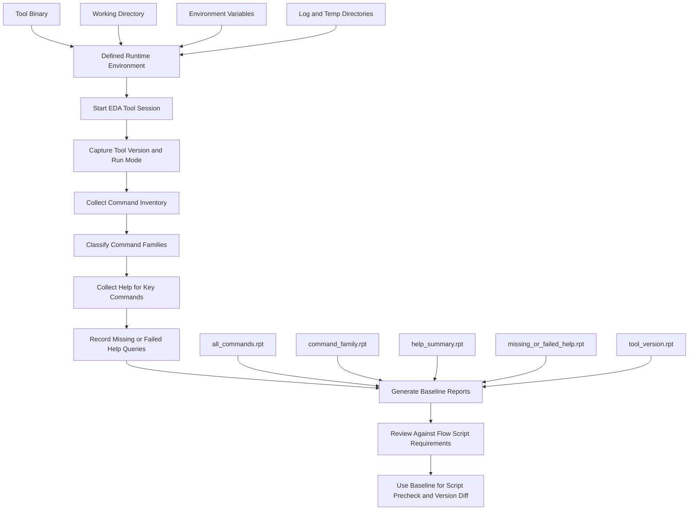
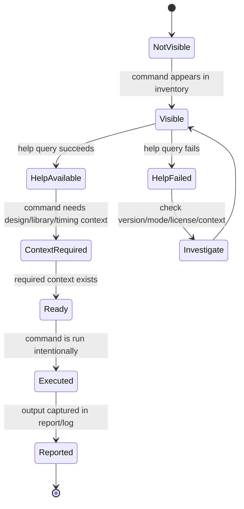
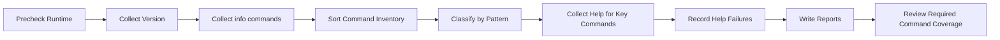
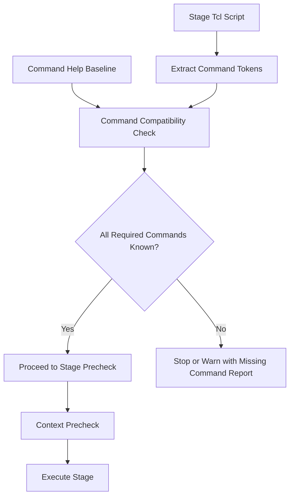

# 06. Why a Mature Backend Flow Needs a Command Help Baseline

Author: Darren H. Chen  
Demo: `LAY-BE-06_command_help_baseline`

A backend implementation flow is not only a sequence of design stages. It is also a sequence of tool-interface decisions.

Before a design can be imported, linked, floorplanned, placed, timed, routed, checked, repaired, and exported, the engineering team must answer a simpler but more fundamental question:

```text
What does the current EDA tool session actually expose as a controllable command interface?
```

This question looks basic, but it is one of the most important foundations of a maintainable backend flow.

A reference script may show how one project was once executed. A user manual may describe a broad command set. A GUI form may hide the command sequence behind buttons. A previous run directory may contain a working script. None of these, by itself, proves that the current environment has a stable and reviewable command interface.

A mature backend flow therefore needs a command help baseline.

A command help baseline is not just a dumped help file. It is an engineering snapshot of command availability, command families, parameter forms, query behavior, context requirements, and side-effect risk under a defined tool version, execution mode, license environment, and runtime setup.

In other words, it is the interface contract between the flow scripts and the EDA tool session.

---

## 1. Backend Flow Scripts Depend on a Hidden Interface Contract

When engineers write backend scripts, they often focus on high-level stages:

```text
read libraries
read design
link design
initialize floorplan
run placement
run timing analysis
build clock tree
run routing
run physical checks
export deliverables
```

Behind each stage is a command interface. The script assumes that certain commands exist, accept certain parameters, behave in certain ways, and are valid under certain contexts.

For example, a placement stage may assume that the EDA tool supports commands for:

```text
querying cells
querying nets
querying placement rows
reporting utilization
creating placement blockages
running placement
writing placement reports
```

A timing stage may assume commands for:

```text
loading timing libraries
reading timing constraints
building a timing graph
querying timing paths
reporting setup and hold violations
reporting clock information
exporting timing data
```

A routing stage may assume commands for:

```text
creating route guides
assigning routing layers
running global routing
running detailed routing
checking antenna risk
reporting DRC violations
exporting DEF or GDS/OASIS
```

The script is only valid if these assumptions are valid in the current session.

That is the hidden interface contract.

If the contract is not captured, the flow becomes dependent on memory, historical scripts, and trial-and-error. If the contract is captured, the flow becomes inspectable, comparable, and maintainable.

---

## 2. A Command Help Baseline Is an Interface Snapshot

A command help baseline records what a specific backend tool session exposes at a specific point in time.

It should answer at least these questions:

```text
Which commands are visible?
Which commands are missing?
Which command families exist?
Which commands have help text?
Which help queries fail?
Which commands are query-only?
Which commands can modify the design database?
Which commands require a loaded design?
Which commands require technology or library context?
Which commands are useful for reports and regression review?
Which commands are risky in a no-design probe session?
```

The baseline should be tied to:

```text
tool version
host platform
run mode
working directory
startup mode
loaded initialization files
license configuration
collection method
date and time
```

Without this metadata, a baseline loses much of its value. A command list captured from an interactive GUI session should not be treated as identical to a no-design batch session. A command list captured after loading a design should not be treated as identical to one captured immediately after tool startup. A command list captured from one tool version should not silently replace the command list from another version.

The baseline is meaningful because it is contextual.

---

## 3. Why Reference Scripts Are Not Enough

Reference scripts are useful, but they are not a substitute for a command help baseline.

A reference script tells you one possible command sequence. It does not necessarily tell you the command interface behind that sequence.

For example, a reference script may contain:

```tcl
report_timing -max_paths 20
```

This line raises several engineering questions:

```text
Is report_timing available in the current tool session?
Does this tool version use the same command name?
Is -max_paths a supported option?
Does the command require a linked design?
Does it require timing constraints to be loaded?
Does it require parasitics, or can it use estimated delay?
Does the command write only to stdout, or can it redirect to a report file?
Is the report format stable across tool versions?
```

A reference script normally does not answer those questions.

Another script may use:

```tcl
route_optimize -effort high
```

This also raises deeper questions:

```text
Is this command a high-side-effect command?
Can it change placement, routing, timing optimization, or database attributes?
Can it be safely executed in a probe session?
Does it require global routing first?
Does it overwrite route state?
Does it have different behavior in incremental mode?
```

A command help baseline does not replace project scripts. It gives those scripts a stable interface foundation.

---

## 4. Command Baseline Architecture

A baseline should be built as a small engineering pipeline, not as a manual copy-and-paste exercise.



This architecture has two important properties.

First, the baseline generation itself is reproducible. The same environment, same startup mode, and same collection scripts should generate comparable results.

Second, the baseline is report-driven. The result is not hidden inside a terminal session; it is written into files that can be reviewed, archived, compared, and used by later script checks.

---

## 5. The Three Layers of Command Knowledge

A mature command baseline should not stop at command names. It should separate command knowledge into three layers.

| Layer | Question | Example Review Item |
|---|---|---|
| Existence | Does the command exist? | Is `get_cells` visible in the session? |
| Interface | What options and arguments are supported? | Does the command support output redirection, filtering, or object collections? |
| Context | When is the command valid? | Does it require a loaded design, linked libraries, or timing graph? |

This distinction is critical.

A command may exist but still be unusable in the current context. A command may have help text but require a design database. A command may work after design import but fail in a no-design baseline. A command may be available in one run mode but not appropriate in another.

For example:

```text
help command exists      -> existence layer
help command describes options -> interface layer
command works after link -> context layer
```

If all three layers are mixed together, the baseline becomes confusing. If they are separated, the flow engineer can reason clearly about what is missing.

---

## 6. Command Families: Turning a Flat Command List into a Flow Map

A raw command list is usually too large to be useful. Backend tools expose many commands: query commands, reporting commands, design-edit commands, GUI commands, import/export commands, timing commands, routing commands, debug commands, and utility commands.

The baseline becomes much more valuable when commands are grouped by functional family.

| Command Family | Typical Role in Backend Flow | Typical Risk Level |
|---|---|---|
| Session | startup, exit, runtime control, log control | low to medium |
| Help and introspection | command discovery, help query, parameter query | low |
| Import | read Verilog, LEF, Liberty, DEF, SDC, SPEF, SDF, UPF | medium |
| Link and database setup | bind netlist to library, set current design, create database context | medium to high |
| Object query | query cells, nets, pins, ports, properties, collections | low |
| Property and collection | filter objects, list properties, report attributes | low |
| Floorplan | die/core, rows, sites, macros, IO guides, blockages | high |
| Placement | place cells, legalize, optimize, report utilization | high |
| Timing | build timing graph, query paths, report constraints | medium |
| Clock | clock tree, skew groups, latency, clock reports | high |
| Routing | route guides, global route, detail route, route repair | high |
| Physical check | DRC, antenna, density, fill, signoff interface | medium to high |
| Export | DEF, GDS/OASIS, Verilog, SDF, SPEF, reports | medium to high |
| ECO | logical/physical changes, incremental optimization | high |
| Debug and replay | history, command log, error report, replay support | low to medium |

This table is not just documentation. It gives the flow a stage-aware command taxonomy.

A command classifier can start with simple naming patterns:

```text
get_*        -> object query
report_*     -> report
import*      -> import
export_*     -> export
*route*      -> routing
*clock*      -> clock
*place*      -> placement
*floorplan*  -> floorplan
*property*   -> property system
```

The first classification does not need to be perfect. Its purpose is to convert a flat command space into an engineering map. The map can then be refined manually.

---

## 7. No-Design Baseline vs Design-Loaded Baseline

There should usually be at least two baseline modes.

| Baseline Mode | Design Loaded? | Main Purpose | Typical Output |
|---|---:|---|---|
| No-design baseline | No | Discover basic command visibility and help behavior | command inventory, help summary, missing help list |
| Design-loaded baseline | Yes | Verify object query, report, and context-sensitive commands | object query reports, property reports, timing/report command behavior |

A no-design baseline is safer and should come first. It avoids loading real project data and reduces the risk of side effects.

A design-loaded baseline is more realistic. It tells whether object queries and report commands behave as expected after the design database exists.

The two baselines should not be mixed.

For example, `get_cells` may exist in a no-design session, but it may return an empty collection until a design is loaded. A timing report command may be visible before timing constraints are loaded, but the report is not meaningful until the timing graph is built. A routing report command may exist before routing, but its output may be incomplete.

This leads to an important rule:

```text
Command visibility is not the same as command readiness.
```

The baseline should record both when possible.

---

## 8. Command Readiness as a State Machine

A command moves through readiness states as the session evolves.



This state machine is useful because it prevents a common mistake: treating all visible commands as ready-to-use commands.

In backend flow engineering, readiness depends on stage.

```text
Before import: only session, help, environment, and file checks should run.
After library load: library query commands become meaningful.
After design import and link: cell/net/pin/port queries become meaningful.
After constraints: timing checks become meaningful.
After placement: placement reports become meaningful.
After routing: route and DRC-oriented reports become meaningful.
```

The baseline should help identify where each command belongs in this lifecycle.

---

## 9. Parameter Help Is Part of the Contract

Command names are only the first half of the interface. Parameters are the other half.

A backend flow can break even when the command name still exists.

Typical parameter-level changes include:

```text
an option is renamed
an option is removed
an option becomes mandatory
a default value changes
two options become mutually exclusive
a value type changes
a command accepts a new object class
a command stops accepting a previous object class
```

For example, a report command may support:

```text
-output
-format
-max_paths
-delay_type
-from
-to
-through
```

A routing command may support:

```text
-effort
-layer_range
-incremental
-drc_repair
-congestion_aware
```

A baseline should capture help for key commands so script validation can check whether the script is using parameters that are likely to be accepted by the current tool version.

This is the bridge between Article 05 and Article 06:

```text
Tcl script precheck needs a command interface reference.
The command help baseline provides that reference.
```

Without a baseline, precheck can only verify files, variables, and Tcl syntax. With a baseline, precheck can begin to reason about command and parameter compatibility.

---

## 10. Side-Effect Classification

A command baseline should also classify side-effect risk.

Not all commands are safe to execute during baseline collection.

| Side-Effect Class | Description | Examples of Command Intent |
|---|---|---|
| Read-only introspection | Does not modify the design database | help, command inventory, parameter query |
| Read-only design query | Requires design context but should not modify it | query cells, query nets, report properties |
| Report generation | Writes report files but should not change design state | timing report, utilization report, route report |
| Database setup | Builds or changes the design database context | import, link, load libraries |
| Physical modification | Changes layout, placement, route, or objects | floorplan, place, route, ECO |
| Output export | Writes external deliverables and may overwrite files | DEF/GDS/OASIS/Verilog/SDF/SPEF export |
| Destructive operation | Deletes, resets, purges, overwrites, or clears state | delete, reset, purge, clean, remove |

The baseline collection phase should prefer the first three classes.

High-side-effect commands should be documented but not executed accidentally.

This principle matters because a command baseline is supposed to observe the interface. It should not mutate a real design unless the demo explicitly uses a safe sample design and a controlled output directory.

---

## 11. Recommended Baseline Report Structure

A useful Demo 06 directory should produce reports similar to the following:

```text
reports/
  01_tool_version.rpt
  02_all_commands.rpt
  03_command_family.rpt
  04_help_summary.rpt
  05_missing_or_failed_help.rpt
  06_side_effect_classification.rpt
  07_flow_command_coverage.rpt
```

Each report has a separate purpose.

| Report | Purpose |
|---|---|
| `01_tool_version.rpt` | Records tool version, host, mode, date, and collection context |
| `02_all_commands.rpt` | Full command inventory from the current session |
| `03_command_family.rpt` | Functional grouping of commands into backend stages |
| `04_help_summary.rpt` | Help text or summarized help result for key commands |
| `05_missing_or_failed_help.rpt` | Commands whose help could not be collected |
| `06_side_effect_classification.rpt` | Initial risk classification for commands used by the flow |
| `07_flow_command_coverage.rpt` | Checks whether required commands for this repository's demos are visible |

The key is that the baseline is not only for humans reading help. It is also for future checks.

For example, if a script requires these logical capabilities:

```text
session control
command help
object query
library import
Verilog import
design linking
report output
```

then `07_flow_command_coverage.rpt` can show whether the current session supports the necessary command families.

---

## 12. A Minimal Command Baseline Collection Flow

A generic baseline collection flow can be organized as follows:



The baseline collection scripts should remain simple. They should not depend on a large design. They should not run placement or routing. They should not assume the database is already loaded.

A simplified Tcl-style pseudo-flow could look like this:

```tcl
set rpt_dir ./reports
file mkdir $rpt_dir

# 1. Capture visible command list.
set fp [open "$rpt_dir/02_all_commands.rpt" w]
foreach cmd [lsort [info commands]] {
    puts $fp $cmd
}
close $fp

# 2. Classify commands by naming pattern.
proc classify_command {cmd} {
    if {[string match "get_*" $cmd]}      { return "object_query" }
    if {[string match "report_*" $cmd]}   { return "report" }
    if {[string match "import*" $cmd]}    { return "import" }
    if {[string match "export_*" $cmd]}   { return "export" }
    if {[string match "*route*" $cmd]}    { return "routing" }
    if {[string match "*clock*" $cmd]}    { return "clock" }
    if {[string match "*place*" $cmd]}    { return "placement" }
    return "misc"
}

# 3. Collect help for key commands without running side-effect commands.
set key_commands {
    help
    info
    source
    get_cells
    get_nets
    get_pins
    get_ports
    get_property
    report_property
    report_timing
    read_verilog
    read_lef
    read_liberty
    link_design
    write_def
    write_gds
}
```

The exact command names vary by EDA tool. The method does not.

The method is:

```text
collect -> classify -> inspect help -> record failures -> compare against flow needs
```

---

## 13. Command Baseline and Script Precheck

The command help baseline becomes much more valuable when it is connected to script precheck.

A script precheck can parse or scan stage scripts and compare them against the baseline:

```text
script command appears in baseline?          PASS / FAIL
script command belongs to expected family?   PASS / WARN
script uses high-side-effect command?        WARN / BLOCK depending on stage
script command has help text?                PASS / WARN
script command requires design context?      CHECK stage preconditions
```

This gives the flow a stronger validation model.



This is where the baseline becomes a living engineering asset.

It does not merely describe the tool. It actively supports safer flow execution.

---

## 14. Command Baseline and Version Migration

Tool versions change.

Even when the high-level design flow stays the same, the command interface may drift.

A version migration should therefore compare command baselines before running large design jobs.

Recommended comparison flow:

```text
1. Generate baseline under old version.
2. Generate baseline under new version.
3. Diff all command inventories.
4. Diff key command help summaries.
5. Check required command coverage.
6. Review missing or changed options.
7. Run small no-design and sample-design checks.
8. Run full flow only after interface differences are understood.
```

The diff output can be organized as:

| Diff Type | Meaning | Action |
|---|---|---|
| Command removed | Existing script may fail | Replace command or keep old version for that flow |
| Command added | New capability may exist | Review but do not immediately depend on it |
| Help changed | Parameter interface may have changed | Review stage scripts using that command |
| Help failed | Current mode/context may differ | Retry with proper context or check license/mode |
| Family changed | Classification pattern may need update | Refine command taxonomy |

This makes version migration less dependent on surprise failures during full implementation runs.

---

## 15. Command Baseline and Team Knowledge Transfer

A command baseline also improves team communication.

Without a baseline, a new engineer often receives a pile of scripts and must infer the tool model from usage examples.

With a baseline, the engineer can see:

```text
main command families
commands used by each stage
commands that are query-only
commands that modify database state
commands that generate reports
commands that are risky outside controlled stages
commands that may require design context
```

This changes the learning path.

Instead of memorizing isolated scripts, the engineer learns the control interface map.

That is much more valuable for long-term backend flow maintenance.

---

## 16. Demo 06: What This Demo Should Prove

The purpose of `LAY-BE-06_command_help_baseline` is to prove that a baseline can be collected in a controlled session.

It should not run a real placement or routing flow. It should not depend on a large chip design. It should focus on command discovery and report generation.

A recommended demo structure is:

```text
LAY-BE-06_command_help_baseline/
  README.md
  scripts/
    run_demo.csh
  config/
    demo_env.csh
  tcl/
    run_demo.tcl
    collect_command_inventory.tcl
    classify_command_family.tcl
    collect_help_summary.tcl
  logs/
  reports/
  tmp/
```

The demo should produce:

```text
reports/01_tool_version.rpt
reports/02_all_commands.rpt
reports/03_command_family.rpt
reports/04_help_summary.rpt
reports/05_missing_or_failed_help.rpt
```

The demo succeeds if:

```text
the EDA tool session starts
the command inventory is generated
key command help attempts are recorded
missing or failed help queries are reported
command families are classified
logs and command logs are preserved
```

The important output is not a design database. The important output is an interface baseline.

---

## 17. Demo 06 Review Checklist

After running the demo, review the following items.

| Check Item | Expected Result |
|---|---|
| Runtime environment | Tool path, working directory, logs, and reports are explicit |
| Version report | Tool version or equivalent runtime identity is captured |
| Command inventory | Full command list is written to `02_all_commands.rpt` |
| Command family report | Major commands are grouped into functional families |
| Help summary | Key commands have help query results or clear failure entries |
| Failed help report | Missing or unsupported help queries are not silently ignored |
| Log files | Main log and command log are preserved |
| No unintended design modification | Demo remains a command-interface probe, not a physical implementation run |

The failed help report is especially important. A failed help query is not always a demo failure. It may be a valid finding.

For example:

```text
command missing in current version
command visible but no help text available
command requires design-loaded context
command name differs across tool families
current execution mode does not expose this command
```

The report should make such cases visible.

---

## 18. Common Pitfalls

### Pitfall 1: Treating the official manual as the baseline

Manuals are important, but the baseline should reflect the current tool session. The current session may differ because of version, license, mode, plugin loading, or startup context.

### Pitfall 2: Treating command visibility as command readiness

A visible command may still require libraries, a linked design, timing constraints, routing state, or physical context.

### Pitfall 3: Executing high-side-effect commands during baseline collection

A command help baseline should observe the interface. It should not accidentally alter a design database.

### Pitfall 4: Mixing GUI and batch baselines

GUI sessions may expose commands, preferences, and behaviors that should not be assumed in batch runs.

### Pitfall 5: Ignoring failed help queries

Failed help queries often reveal version, mode, license, or context mismatch. They should be recorded explicitly.

### Pitfall 6: Not versioning baselines

A baseline without version metadata cannot support meaningful upgrade comparison.

---

## 19. Engineering Takeaways

A command help baseline is the command-interface foundation of backend flow engineering.

It provides:

```text
command inventory
command family taxonomy
key command help records
missing command visibility
failed help visibility
side-effect awareness
script precheck support
version migration support
team onboarding support
```

The baseline does not make the backend flow complete by itself. It makes the flow controllable.

A backend flow that only relies on reference scripts is fragile. A backend flow that also maintains a command help baseline has a stable interface reference.

This is the difference between:

```text
"This script worked once."
```

and:

```text
"This script is built on a known command interface under a recorded runtime context."
```

That distinction becomes increasingly important as a flow grows from a single demo into a reusable engineering repository.

---

## 20. Summary

A mature backend flow should establish a command help baseline before depending on a large collection of stage scripts.

The reason is simple:

```text
Scripts depend on commands.
Commands depend on version, mode, context, and parameters.
A baseline records that dependency explicitly.
```

The baseline should capture command inventory, command families, help summaries, failed help queries, side-effect risk, and version metadata. It should be generated in a controlled session, written into reports, and used later for script precheck, version comparison, and team review.

In a backend engineering repository, Demo 06 is therefore not a side topic. It is one of the key infrastructure demos.

It turns the command interface from an implicit assumption into an explicit engineering asset.
