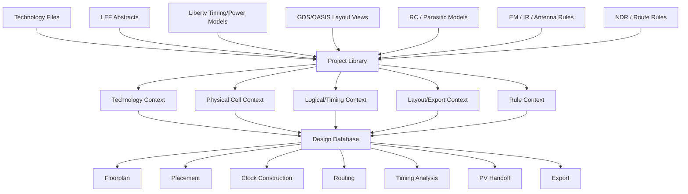
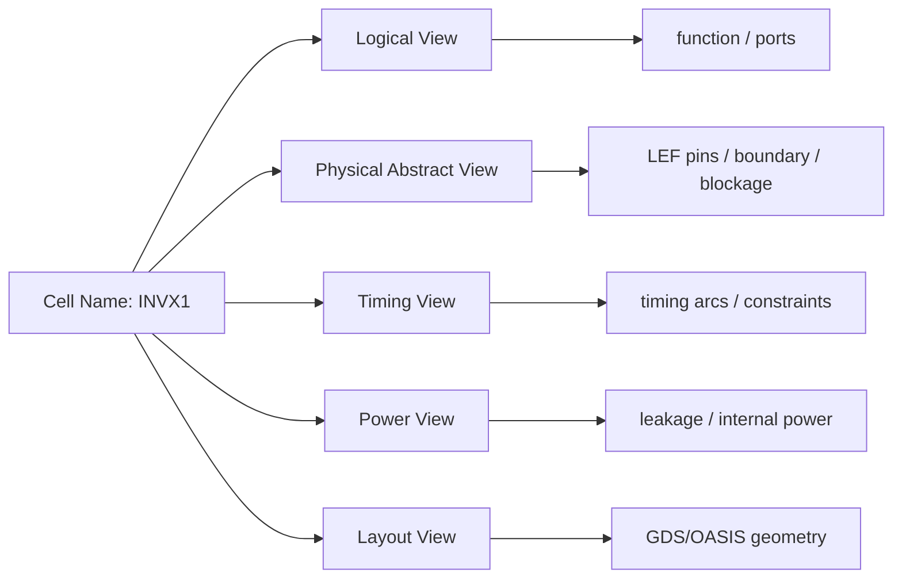
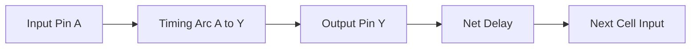
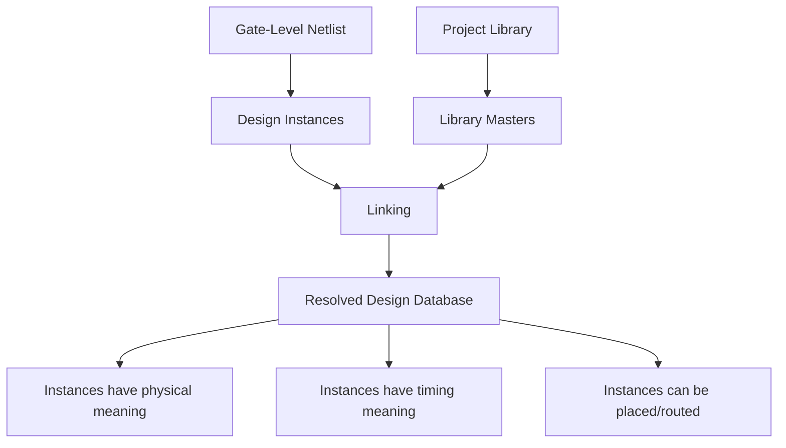
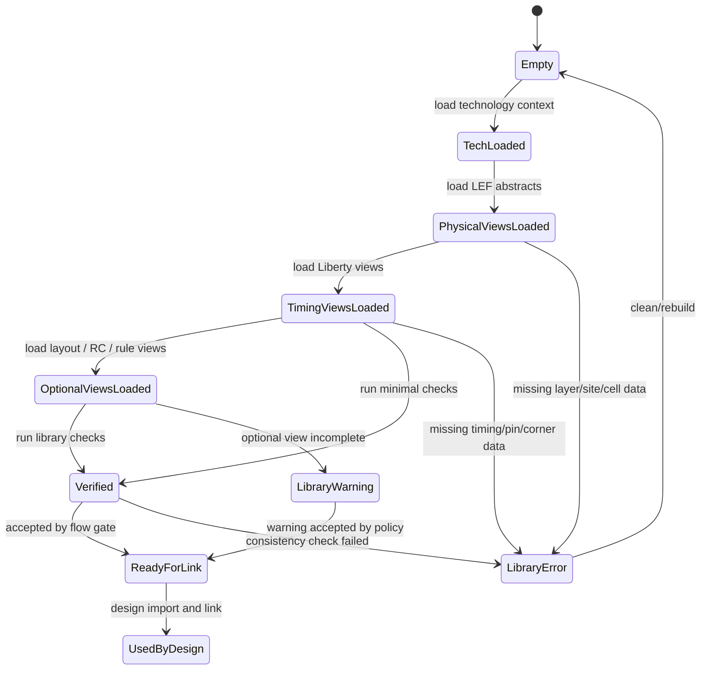
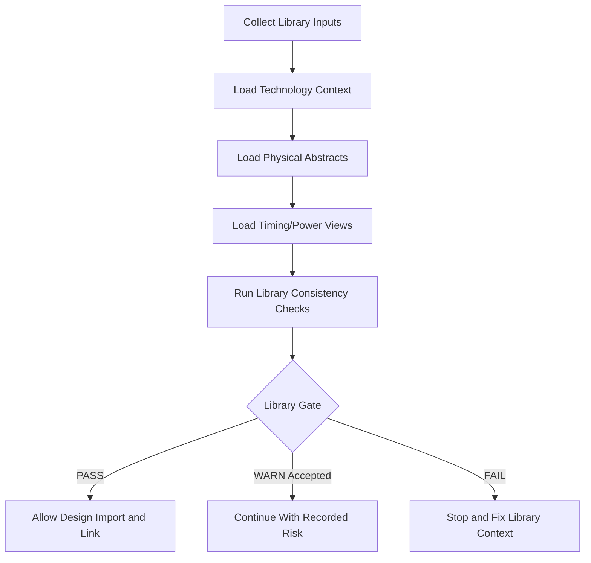

# 07. How Project Library Manages Technology and Standard Cell Context

Author: Darren H. Chen  
Domain: EDA Tool Engineering / Backend Implementation / Backend Flow Infrastructure  
demo: `LAY-BE-07_project_library`

A backend implementation flow cannot understand a digital design from the netlist alone.

A Verilog gate-level netlist may tell the tool that an instance named `U1` uses a cell named `INVX1`, and that `U1/Y` drives a certain net. It does not tell the tool where the pins of `INVX1` are, how wide the cell is, whether it fits a standard-cell row, which metal layers can be used for routing, what the delay arc from `A` to `Y` looks like, whether the cell can be used for hold fixing, or whether it has a layout view for final stream-out.

Those meanings come from the technology and library context.

This article discusses the engineering role of the **Project Library** in a backend EDA tool. The Project Library is not just a directory containing `.lef`, `.lib`, `.gds`, `.tf`, or rule files. It is the tool-side infrastructure that converts external technology and library files into an internally consistent model that can be used by design import, linking, floorplanning, placement, clock tree construction, routing, timing analysis, power analysis, physical verification handoff, and final export.

The focus is not on a specific vendor command. The focus is the underlying architecture and methodology:

```text
External technology and library files
        ↓
Project Library construction
        ↓
Technology / physical / timing / power / layout views
        ↓
Design database linking
        ↓
Backend implementation stages
```

Once this layer is weak, every later stage becomes less trustworthy. Once this layer is well organized, many downstream failures become easier to explain, reproduce, and fix.

---

## 1. Why a Netlist Is Not Enough

A gate-level netlist describes a logical instance graph.

For example:

```verilog
INVX1  U1 (.A(a),  .Y(n1));
NAND2X1 U2 (.A(n1), .B(b), .Y(n2));
DFFQX1 U3 (.D(n2), .CK(clk), .Q(q));
```

This tells the tool that:

```text
U1 is an instance of INVX1.
U2 is an instance of NAND2X1.
U3 is an instance of DFFQX1.
The instances are connected by nets.
```

But this is only the logical skeleton. Backend implementation needs much more information.

For `INVX1`, the tool needs to know:

| Question | Required model |
|---|---|
| How large is the cell? | physical abstract view |
| Can it be placed in a row? | site and row compatibility |
| Where are pins `A` and `Y`? | pin geometry in the abstract view |
| Which metal layers are used by the pins? | LEF layer and pin shapes |
| What is the delay from `A` to `Y`? | Liberty timing arc |
| What is the output transition model? | Liberty lookup tables |
| What is the input capacitance? | Liberty pin capacitance |
| What is the leakage power? | Liberty power data |
| Can it be used by optimization? | library attributes and flow rules |
| Does it have a final layout view? | GDS/OASIS or equivalent layout database |

Without these models, an instance is only a symbolic reference. It has a name, but it does not yet have physical, timing, power, or manufacturing meaning.

The Project Library is the layer that supplies that meaning.

---

## 2. Project Library as a Tool-Side Knowledge Base

It is useful to think of a Project Library as a knowledge base for the backend tool.

It answers questions such as:

```text
What technology is this project targeting?
What routing layers exist?
What cut layers exist?
What is the manufacturing grid?
What standard-cell sites exist?
Which cell masters are available?
Which cells have both timing and physical views?
Which cells are usable by placement?
Which cells are usable by clock tree construction?
Which cells are usable by hold fixing?
Which macro abstracts are available?
Which layout cells are available for final export?
Which RC or parasitic models should be used?
Which antenna, EM, or route rules are available?
```

This is much more than file loading. The EDA tool must parse external files, normalize them, check their consistency, bind multiple views together, cache internal representations, and make them queryable by later stages.

A practical Project Library therefore has two identities:

1. **File-level identity**: the external files provided by foundry, IP vendors, standard-cell vendors, or internal methodology teams.
2. **Database-level identity**: the internal model created after the tool has read, converted, indexed, and verified those files.

The engineering problem is not only to collect files. The engineering problem is to make sure the tool has constructed a consistent internal context from them.

---

## 3. High-Level Architecture

The following diagram shows the basic architecture.



The key point is that the Project Library sits between external file formats and the live design database.

The design database does not directly reason from raw files. It reasons from the internal library context created from those files.

---

## 4. The Main Model Types in a Project Library

A Project Library usually manages several categories of models. Each model contributes a different kind of meaning.

| Model type | Typical source | Main information | Used by |
|---|---|---|---|
| Technology model | technology file, LEF technology section | units, grid, layers, vias, routing directions, rule primitives | floorplan, route, DRC precheck, export |
| Site and row model | LEF, technology setup | standard-cell site, row height, symmetry, orientation | floorplan, placement legalization |
| Standard-cell abstract | LEF | cell boundary, pins, obstructions, class, symmetry | placement, routing, pin access |
| Macro abstract | LEF | macro boundary, pins, blockages, internal obstructions | floorplan, top-level routing |
| Timing and power model | Liberty | timing arcs, constraints, power, capacitance, functions | link, timing analysis, optimization |
| Layout view | GDS/OASIS | final geometry | stream-out, signoff handoff |
| RC model | TLU+, tech RC, extraction models | layer resistance/capacitance, coupling models | timing, extraction, route analysis |
| Antenna model | rule file or technology setup | antenna constraints and ratios | routing and antenna repair |
| EM/IR model | technology/rule files | current limits, voltage-drop assumptions | power network analysis |
| Route rule / NDR model | route rule setup | width, spacing, via preference | clock routing, critical nets, special nets |

A weak Project Library treats these as unrelated files. A strong Project Library treats them as coordinated views of the same technology and cell universe.

---

## 5. File View vs Internal View

One common mistake is to assume that loading a file means the model is ready.

In practice, file loading is only the first step. The tool has to convert file-level content into internal objects.

### 5.1 LEF Example

A LEF cell abstract may contain:

```text
MACRO INVX1
  CLASS CORE ;
  ORIGIN 0 0 ;
  SIZE 1.0 BY 2.0 ;
  PIN A ...
  PIN Y ...
  OBS ...
END INVX1
```

After loading, the tool may create internal objects such as:

```text
lib cell master: INVX1
cell width: 1.0
cell height: 2.0
site compatibility
pin A physical shapes
pin Y physical shapes
routing obstruction list
placement class
symmetry rules
```

### 5.2 Liberty Example

A Liberty cell may contain:

```text
cell (INVX1) {
  area : ...;
  pin (A) { direction : input; capacitance : ...; }
  pin (Y) { direction : output; function : "!A"; timing() { ... } }
}
```

After loading, the tool may create:

```text
timing cell: INVX1
input pin: A
output pin: Y
logic function: Y = !A
input capacitance table
delay arc A -> Y
transition model
leakage data
power model
usage attributes
```

### 5.3 Technology Example

A technology model may describe:

```text
units
manufacturing grid
routing layers
cut layers
via definitions
minimum width
minimum spacing
preferred directions
```

After loading, the tool may build:

```text
technology database
layer table
routing resource table
cut/via rule table
track-grid basis
geometry legality rules
export layer mapping basis
```

The important point is this:

```text
External files are file syntax.
Project Library objects are tool semantics.
```

The backend flow depends on the second, not merely the first.

---

## 6. Multi-View Consistency

A standard cell usually has multiple views.



These views often come from different files, and sometimes from different teams or vendors. The Project Library must bind them together.

The binding is normally based on names and structured attributes:

```text
cell name
pin name
pin direction
cell class
site compatibility
power/ground pins
layout cell name
corner name
voltage domain
process condition
```

When these bindings fail, the design may still partially load, but later behavior becomes unpredictable.

For example:

| Inconsistency | Possible downstream symptom |
|---|---|
| Cell exists in Liberty but not in LEF | timing may work, placement cannot place it |
| Cell exists in LEF but not in Liberty | physical view exists, timing analysis cannot model it |
| Pin exists in Liberty but not in LEF | timing arc exists, routing cannot access the physical pin |
| LEF pin shape is missing or on wrong layer | route connection or pin access failure |
| Cell height does not match site row | placement legalization failure |
| GDS cell name differs from LEF cell name | stream-out or signoff mismatch |
| Liberty corner set incomplete | scenario setup or timing coverage problem |
| Power pins differ across views | power routing or LVS mismatch risk |

The Project Library therefore has to be treated as a consistency system, not only as a file import step.

---

## 7. Technology Context Comes First

Technology context is the lowest layer of the backend implementation world.

Before the tool can reason about cells, rows, tracks, pins, routes, or spacing, it must know the technology universe:

```text
coordinate units
manufacturing grid
routing layers
cut layers
layer directions
minimum width rules
minimum spacing rules
via definitions
site definitions
track-grid assumptions
```

A simplified technology stack can be illustrated as follows:

```text
+--------------------------------------------------+
| M6 : routing layer, horizontal, wide/global use   |
+--------------------------------------------------+
| V5 : cut layer                                    |
+--------------------------------------------------+
| M5 : routing layer, vertical                     |
+--------------------------------------------------+
| V4 : cut layer                                    |
+--------------------------------------------------+
| M4 : routing layer, horizontal                   |
+--------------------------------------------------+
| V3 : cut layer                                    |
+--------------------------------------------------+
| M3 : routing layer, vertical                     |
+--------------------------------------------------+
| V2 : cut layer                                    |
+--------------------------------------------------+
| M2 : routing layer, horizontal                   |
+--------------------------------------------------+
| V1 : cut layer                                    |
+--------------------------------------------------+
| M1 : local routing / pin access layer            |
+--------------------------------------------------+
```

If this layer is wrong, later stages fail in ways that may look unrelated.

Examples:

| Technology context issue | Later symptom |
|---|---|
| Wrong database unit | layout dimensions scaled incorrectly |
| Wrong manufacturing grid | off-grid shapes, export issues |
| Missing routing layer | route cannot use expected resources |
| Missing cut layer | via insertion failure |
| Wrong preferred direction | routing congestion or nonstandard topology |
| Incomplete spacing rule | large physical check violation count |
| Wrong site definition | row generation or legalization failure |

This is why Project Library construction should begin with the technology model, not with the netlist.

---

## 8. LEF as the Physical Abstract Contract

LEF is often described as a physical abstract format. In backend implementation, it behaves like a contract between library generation and physical implementation.

For a standard cell, LEF tells the backend tool:

```text
where the cell boundary is
which site it belongs to
how wide and high the cell is
where each pin is located
which layers each pin uses
which internal areas are blocked
whether the cell is CORE, BLOCK, PAD, or another class
```

For a macro, LEF tells the tool:

```text
macro size
macro pins
routing blockages
placement boundary
obstruction geometry
allowed routing layers around or over the macro
```

The following simplified diagram shows how LEF abstracts a standard cell.

```text
+-------------------------------+
|           INVX1 LEF            |
|                               |
|  M1 pin A        M1 pin Y      |
|   +---+           +---+        |
|   | A |           | Y |        |
|   +---+           +---+        |
|                               |
|  OBS: internal metal shapes    |
|                               |
+-------------------------------+
| boundary / site-compatible box |
+-------------------------------+
```

Placement uses the boundary and site information. Routing uses the pin shapes and obstructions. Pin access analysis uses both pin geometry and local routing rules. Export and physical verification handoff rely on consistent naming and geometry assumptions.

If LEF is incomplete, the flow may fail much later than the library loading stage. That is why LEF checking should be part of Project Library verification.

---

## 9. Liberty as Timing, Power, and Logical Semantics

Liberty is often called a timing library, but backend implementation uses it more broadly.

A Liberty view can provide:

```text
cell area
pin direction
logic function
timing arcs
setup / hold constraints
minimum pulse width constraints
input capacitance
output drive behavior
transition tables
internal power
switching power
leakage power
clock pin attributes
operating conditions
usage restrictions
```

For placement and optimization, the timing model is not only a reporting reference. It affects decisions such as:

```text
which cell can replace another cell
which buffer is appropriate for a net
which inverter or buffer size can reduce delay
which cells are suitable for hold fixing
which clock-related cells are allowed
which cells should be avoided
```

For timing analysis, Liberty defines the graph semantics:



If Liberty is missing or inconsistent, the design may still have a physical representation, but timing closure becomes unreliable.

---

## 10. Library Context and Design Linking

Project Library and design database are different layers.

```text
Project Library:
  Defines what cell masters exist and what they mean.

Design Database:
  Defines which instances exist in the current design and how they are connected.
```

The relationship can be shown as:



Before linking, an instance is a reference:

```text
U123 : INVX1
```

After linking, the tool can resolve:

```text
U123 uses master cell INVX1.
INVX1 has a LEF abstract.
INVX1 has Liberty timing arcs.
INVX1 has pin geometry.
INVX1 is compatible with standard-cell rows.
INVX1 is allowed or restricted by flow rules.
```

This is why link failures are often library failures, not necessarily netlist failures.

Common link symptoms include:

```text
unresolved cell master
missing macro abstract
missing timing view
pin mismatch
black-box reference
library corner mismatch
missing physical view
```

A good library report can reduce the time spent guessing which file is responsible.

---

## 11. Project Library State Machine

The Project Library has its own lifecycle. It is not a one-line load operation.



This state machine makes one methodology point clear:

```text
The library should pass through a verification gate before design linking becomes trusted.
```

The flow should not silently move from file loading to design linking without checking whether the internal library context is coherent.

---

## 12. Library Verification Methodology

A practical Project Library verification methodology should check several dimensions.

### 12.1 File Presence and Accessibility

The first check is simple but essential:

```text
Do the expected files exist?
Are they readable?
Are paths absolute or resolved consistently?
Are compressed files handled correctly?
Are duplicated files intentional?
```

This catches many environment and path errors before the tool reaches more expensive stages.

### 12.2 Technology Layer Checks

Check whether the expected technology objects exist:

```text
routing layers
cut layers
layer directions
layer order
site definitions
via definitions
track/grid assumptions
```

A minimal report can include:

| Check | Expected result |
|---|---|
| Routing layers exist | PASS |
| Cut layers exist | PASS |
| Standard-cell site exists | PASS |
| Manufacturing grid defined | PASS |
| Layer order consistent | PASS |

### 12.3 LEF and Liberty Cell Matching

This is one of the most important checks.

```text
For each cell used by the design or allowed by the flow:
  Does a physical abstract exist?
  Does a timing view exist?
  Do pin names match?
  Do power/ground pins match?
  Is the cell class reasonable?
```

A useful matching table looks like:

| Cell | LEF view | Liberty view | Pin match | Status |
|---|---:|---:|---:|---|
| INVX1 | yes | yes | yes | PASS |
| NAND2X1 | yes | yes | yes | PASS |
| DFFQX1 | yes | yes | yes | PASS |
| FILL1 | yes | no | n/a | ACCEPTED_PHYSICAL_ONLY |
| MACRO_A | yes | optional | check needed | WARN |

Not every cell must have every view. Fillers, tap cells, end caps, decaps, tie cells, and physical-only cells may have special policies. The point is not to force one rule on all cells. The point is to make the policy explicit.

### 12.4 Pin-Level Consistency

Pin mismatch is one of the most expensive errors to discover late.

Typical checks:

```text
pins in Liberty but missing in LEF
pins in LEF but missing in Liberty
pin direction mismatch
clock pin not identified
power/ground pin mismatch
pin shape missing
pin layer not routable
```

A simple report might include:

| Cell | Pin | Liberty direction | LEF shape | Status |
|---|---|---|---|---|
| INVX1 | A | input | exists | PASS |
| INVX1 | Y | output | exists | PASS |
| DFFQX1 | CK | input/clock | exists | PASS |
| MACRO_A | VDD | pg_pin | exists | PASS |

### 12.5 Site and Row Compatibility

Standard cells must fit rows. A cell abstract can load successfully and still fail placement if its site information is inconsistent.

Check:

```text
cell height matches site height
cell width aligns with site grid
symmetry supports row orientation
row site exists in technology context
physical-only cells are compatible with row rules
```

This directly affects placement legalization.

### 12.6 Optional View Policies

Some views may be required for signoff but not for early exploration. The flow should not treat all missing files the same way.

| View | Early demo | Implementation flow | Signoff handoff |
|---|---|---|---|
| LEF | required | required | required |
| Liberty | required for timing | required | required |
| GDS/OASIS | optional | often required for export | required |
| RC model | optional in minimal demo | required for realistic timing | required |
| antenna rules | optional in minimal demo | recommended | required for clean handoff |
| EM/IR rules | optional | project-dependent | required for power integrity closure |

This policy should be written down instead of being hidden in personal knowledge.

---

## 13. Project Library Reports

A Project Library stage should generate reports. These reports are not decorative; they are the evidence that the library context has been constructed.

Recommended reports include:

```text
reports/technology_layer_summary.rpt
reports/loaded_libraries.rpt
reports/library_cell_summary.rpt
reports/lef_liberty_match.rpt
reports/pin_mismatch.rpt
reports/site_summary.rpt
reports/library_verification.rpt
reports/library_context_status.rpt
```

Each report answers a different engineering question.

| Report | Main question |
|---|---|
| `technology_layer_summary.rpt` | What technology layers and sites are available? |
| `loaded_libraries.rpt` | Which libraries were loaded and from where? |
| `library_cell_summary.rpt` | What cell masters are available? |
| `lef_liberty_match.rpt` | Which cells have matching physical and timing views? |
| `pin_mismatch.rpt` | Are pin names and directions consistent? |
| `site_summary.rpt` | Are placement sites available and usable? |
| `library_verification.rpt` | Did the library pass the flow gate? |
| `library_context_status.rpt` | Is the Project Library ready for design link? |

These reports are especially useful when the next stage fails. If design linking fails, the first question should be:

```text
Did the Project Library pass the library verification gate?
```

---

## 14. Demo 07 Design

The purpose of `LAY-BE-07_project_library` is to verify a minimal Project Library context before real design import and linking become the focus.

The demo should be independent and small. It does not need a full chip. It needs enough data to prove the library layer can be constructed and queried.

A recommended directory structure is:

```text
LAY-BE-07_project_library/
├── README.md
├── config/
│   └── env.csh
├── data/
│   ├── tech/
│   │   └── demo.tech
│   ├── lef/
│   │   └── demo_stdcell.lef
│   ├── liberty/
│   │   └── demo_stdcell.lib
│   └── netlist/
│       └── demo_top.v
├── scripts/
│   ├── run_demo.csh
│   └── clean.csh
├── tcl/
│   ├── run_demo.tcl
│   ├── load_library_context.tcl
│   ├── verify_library_context.tcl
│   └── report_library_context.tcl
├── logs/
├── reports/
└── tmp/
```

The demo should emphasize:

```text
technology context loading
LEF abstract loading
Liberty timing/power loading
basic library query
LEF/Liberty consistency check
library summary report
library verification result
```

It should not attempt to prove the entire backend flow. Its job is narrower:

```text
Can the tool build a coherent Project Library context from minimal public/demo data?
```

---

## 15. Demo 07 Expected Input and Output

### 15.1 Inputs

| Input | Purpose |
|---|---|
| `data/tech/demo.tech` | Minimal technology context or technology note |
| `data/lef/demo_stdcell.lef` | Physical abstract for standard cells |
| `data/liberty/demo_stdcell.lib` | Timing and power model for standard cells |
| `data/netlist/demo_top.v` | Optional small design used only for name sanity checks |
| `tcl/run_demo.tcl` | Main tool-side Tcl entry |
| `config/env.csh` | Run environment variables |

### 15.2 Outputs

| Output | Purpose |
|---|---|
| `logs/LAY-BE-07_project_library.log` | Main run log |
| `logs/LAY-BE-07_project_library.cmd.log` | Command trace |
| `logs/LAY-BE-07_project_library.sum.log` | Summary log |
| `reports/library_verification.rpt` | Primary pass/fail report |
| `reports/loaded_libraries.rpt` | Loaded library inventory |
| `reports/technology_layer_summary.rpt` | Technology and layer summary |
| `reports/lef_liberty_match.rpt` | Physical/timing view matching report |
| `reports/site_summary.rpt` | Site and row-related summary |

A good demo report should not only say that files existed. It should say whether the library context is ready for the next stage.

---

## 16. Common Failure Patterns

Project Library issues often appear later as import, placement, routing, or timing failures. The following table helps map symptoms back to the library layer.

| Symptom | Likely library-layer cause |
|---|---|
| Unresolved standard cell during link | netlist cell not found in library |
| Placement cannot legalize cells | site/row/cell height mismatch |
| Router cannot connect a pin | missing or invalid LEF pin shape |
| Timing report has missing paths | missing timing arcs or constraints |
| Cell cannot be used by optimization | cell usage attribute or missing timing view |
| Macro routing fails | macro obstruction or pin abstract problem |
| Exported layout mismatches signoff | LEF/GDS naming or boundary mismatch |
| Power routing does not connect cells | inconsistent power/ground pin naming |
| Large early physical check violations | incomplete technology or rule context |

The methodology is to debug from the bottom up:

```text
technology context
  ↓
LEF physical abstracts
  ↓
Liberty timing/power views
  ↓
multi-view consistency
  ↓
design link
  ↓
implementation stages
```

Do not start by changing placement or routing options when the library foundation is not yet verified.

---

## 17. Project Library as a Stage Gate

A mature backend flow should treat the Project Library stage as a gate.



The gate should not be vague. It should have explicit criteria.

Example gate criteria:

```text
Required files are readable.
Technology context is loaded.
At least one valid standard-cell site exists.
Required standard cells have physical views.
Required standard cells have timing views.
Required pins match across physical and timing views.
Library summary reports are generated.
No blocking library errors are present.
```

For a minimal demo, the criteria can be small. For a real project, they should be stricter.

---

## 18. Engineering Checklist

Before moving from Project Library to design import, review the following checklist.

| Category | Check |
|---|---|
| File control | Are all technology and library paths explicit? |
| Version control | Is the library release version recorded? |
| Technology | Are routing layers, cut layers, grid, and site defined? |
| LEF | Are standard-cell and macro abstracts loaded? |
| Liberty | Are timing and power views loaded for required cells? |
| Cell matching | Do LEF and Liberty cell names match? |
| Pin matching | Do pin names and directions match? |
| Site compatibility | Do cells fit legal rows? |
| Special cells | Are tap, filler, end cap, tie, decap, and clock cells classified? |
| Reports | Are library reports generated and archived? |
| Gate | Is the library context accepted before link? |

This checklist is more important than simply seeing that the import commands completed.

---

## 19. Engineering Takeaways

The Project Library is the foundation of backend implementation.

It turns:

```text
files into context,
names into objects,
models into constraints,
and library releases into flow-ready engineering assets.
```

A backend EDA tool can only understand a design after it understands the technology and library universe in which that design exists.

The most important takeaways are:

1. A netlist alone is not enough for backend implementation.
2. LEF, Liberty, technology rules, RC models, and layout views are different views of one implementation universe.
3. Project Library construction is a semantic conversion step, not only a file loading step.
4. Multi-view consistency is critical for link, placement, timing, routing, and export.
5. Library verification should happen before design linking is trusted.
6. Library reports are engineering evidence and should be archived with the run.
7. Many later-stage failures are easier to explain when the Project Library stage is treated as a formal gate.

---

## 20. Closing Note

Before a backend EDA tool can understand a chip design, it must first understand the technology world around that design.

The Project Library is the entry point where that technology world becomes an internal engineering context.

A reliable backend flow therefore does not start with placement or routing. It starts by making sure the library foundation is correct, visible, and verifiable.
