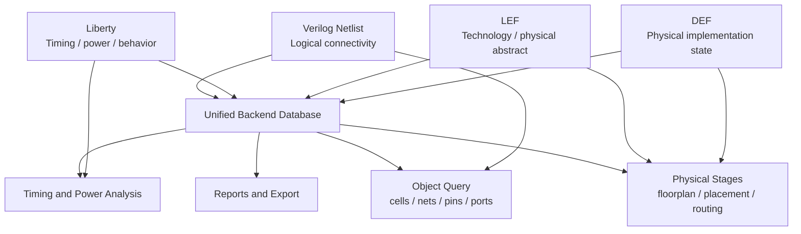
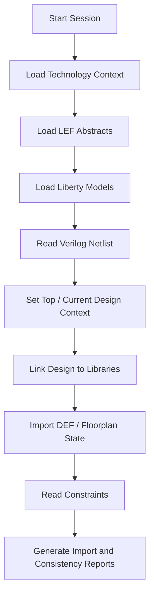
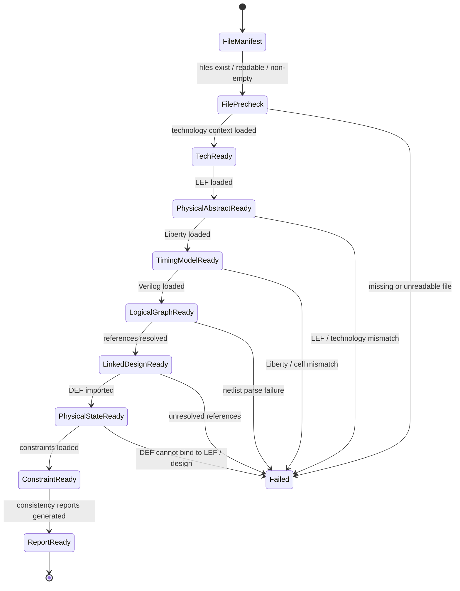

# 08. Why LEF, Liberty, Verilog, and DEF Must Work Together in Backend Flow

Author: Darren H. Chen  
Domain: EDA Tool Engineering / Backend Implementation / Backend Flow Infrastructure  
demo: `LAY-BE-08_standard_formats`

A backend implementation flow is not built from a single design file.

A gate-level Verilog netlist describes the logical connectivity of the design. A Liberty file describes timing, power, and cell-level logical behavior. A LEF file describes technology layers, standard-cell abstracts, macro abstracts, sites, pins, obstructions, and routing-related physical information. A DEF file describes the physical implementation state of a specific design instance: die area, rows, tracks, components, pins, blockages, special nets, and routes.

None of these formats is sufficient by itself.

A backend EDA tool must read them, align them, cross-check them, and convert them into one coherent internal design database. Only after that can the tool perform floorplanning, placement, clock tree construction, routing, timing analysis, power analysis, physical checks, ECO, and final export.

This article discusses the architecture and methodology behind standard-format collaboration in backend flow:

```text
Verilog  -> logical connectivity
Liberty  -> timing / power / cell behavior
LEF      -> technology and physical abstract
DEF      -> physical implementation state
        ↓
Unified backend design database
        ↓
Implementation, analysis, reporting, and handoff
```

The focus is not on a specific vendor command. The focus is the engineering model behind standard formats and why a mature backend flow must treat them as a coordinated semantic system rather than a set of unrelated input files.

---

## 1. Backend Flow Starts with Multiple Views of the Same Design

A chip design has many views.

It has a logical view, because the design contains modules, ports, instances, nets, and pin connections. It has a physical view, because instances must occupy locations on a die and must obey row, site, boundary, layer, and routing constraints. It has a timing view, because every path has delay, transition, capacitance, setup checks, hold checks, clock behavior, and timing exceptions. It has a power view, because every cell and net contributes dynamic power, leakage power, and power-network load. It has a manufacturing view, because final shapes must satisfy technology and foundry rules.

No single file format captures all of this.

| Design view | Main questions | Typical format sources |
|---|---|---|
| Logical connectivity | What instances and nets exist? | Verilog netlist |
| Cell behavior | What does a cell do logically? | Liberty function, Verilog model |
| Timing behavior | What are timing arcs, delays, and constraints? | Liberty, SDC, SDF, parasitics |
| Physical abstract | How large are cells and where are pins? | LEF |
| Physical implementation state | Where are instances, pins, rows, and routes? | DEF |
| Technology context | What layers, sites, tracks, vias, and grids exist? | LEF technology section, technology file |
| Signoff layout | What are final manufacturing shapes? | GDS/OASIS and layer maps |

Backend implementation is the process of bringing these views together and keeping them consistent while the design evolves.

This is why a backend EDA tool does not simply “read a netlist.” It constructs a multi-view design database.

---

## 2. Why a Single Format Cannot Describe a Complete Backend Design

Consider the following small gate-level netlist:

```verilog
module demo_top (
    input  clk,
    input  a,
    input  b,
    output q
);

wire n1;
wire n2;

AND2X1  U1 (.A(a),  .B(b),  .Y(n1));
INVX1   U2 (.A(n1), .Y(n2));
DFFQX1  U3 (.D(n2), .CK(clk), .Q(q));

endmodule
```

The netlist is useful, but it only describes a logical graph.

It tells the tool:

```text
U1 is an AND2X1 instance.
U2 is an INVX1 instance.
U3 is a DFFQX1 instance.
The instances are connected by nets n1 and n2.
clk drives the clock pin of U3.
```

It does not answer the physical and timing questions that backend implementation requires:

```text
How wide is AND2X1?
How tall is INVX1?
Does DFFQX1 fit the current row site?
Where is pin CK located in DFFQX1?
Which metal layer is used by pin Q?
What is the delay from A to Y in AND2X1?
What is the clock-to-Q delay of DFFQX1?
What is the setup time of DFFQX1?
Where should U1, U2, and U3 be placed?
Has net n1 already been routed?
Does clk use a clock routing rule?
```

These answers come from other formats.

A backend tool therefore needs multiple inputs before it can build a meaningful implementation database:

```text
Verilog gives the logical instance graph.
Liberty gives timing, power, and cell behavior.
LEF gives physical abstracts and technology context.
DEF gives physical implementation state.
```

The database is meaningful only when these formats agree with one another.

---

## 3. Verilog: Logical Connectivity and Hierarchical Structure

Verilog netlist is often the most visible design input to backend implementation.

At backend stage, Verilog is usually a synthesized gate-level netlist, although it may still contain hierarchy, macro instances, black-box references, and special wrapper logic. It defines:

```text
top module
submodules
ports
wires
standard-cell instances
macro instances
pin connections
logical hierarchy
constant connections
clock-gating logic
scan cells
spare cells
```

The backend tool reads Verilog to build the first logical graph of the design.

A simplified model looks like this:

```text
Module
 ├─ Port
 ├─ Net
 └─ Instance
      ├─ Master cell name
      ├─ Instance name
      └─ Pin-to-net connection
```

From a database perspective, Verilog creates references but not complete objects.

For example:

```text
Instance U1 references master cell AND2X1.
```

At this stage, `AND2X1` is only a name. The tool still needs to find that name in the project library. If the master cell exists in Liberty but not in LEF, timing may be possible but physical placement will fail. If it exists in LEF but not in Liberty, placement may be possible but timing-driven optimization will be incomplete. If it exists in neither, linking fails.

This is why Verilog import and library linking must be understood as two different operations:

```text
Verilog import builds logical references.
Library linking resolves those references against available cell models.
```

The key engineering check is not only whether Verilog can be parsed. The key check is whether every referenced cell can be resolved to the proper physical and timing views.

---

## 4. Liberty: Timing, Power, and Cell-Level Behavior

Liberty files are often called timing libraries, but in backend implementation they do much more than provide delay numbers.

A Liberty model may describe:

```text
cell name
cell area
pin names
pin direction
pin capacitance
timing arcs
setup and hold constraints
clock pins
sequential behavior
combinational function
cell leakage power
internal power
output transition behavior
operating conditions
PVT corner information
cell usage attributes
```

For a combinational cell, Liberty tells the tool which input-to-output arcs exist and how delay is calculated as a function of input transition and output load.

For a sequential cell, Liberty tells the tool which pin is the clock pin, which pin is the data pin, which pin is the output pin, what setup and hold checks exist, and how clock-to-Q delay should be modeled.

From the backend flow perspective, Liberty affects many stages:

| Backend stage | Liberty contribution |
|---|---|
| Link | Resolves cell names and pin semantics |
| Timing analysis | Provides timing arcs, lookup tables, constraints |
| Placement optimization | Supports timing-driven placement and buffering decisions |
| Clock tree construction | Identifies clock pins, sequential cells, clock buffers, inverters |
| Hold fixing | Provides delay models and usable cells |
| Power analysis | Provides leakage and internal power data |
| ECO | Supports replacement, sizing, buffering, and timing repair |

A common mistake is to think Liberty matters only after placement. In reality, Liberty is already important at design linking time.

If a Liberty file has inconsistent pin names, missing timing arcs, wrong operating conditions, or incomplete sequential attributes, the design database may be constructed incorrectly. Later reports may still be generated, but the results may not represent the intended silicon behavior.

---

## 5. LEF: Technology Context and Physical Abstracts

LEF provides physical abstraction.

It is the bridge between abstract logic and physical implementation. LEF usually contains two broad categories of information:

```text
Technology LEF information
Cell / macro abstract information
```

Technology-level LEF information may include:

```text
units
manufacturing grid
routing layers
cut layers
preferred directions
minimum widths
spacing-related information
via definitions
site definitions
track-related information
```

Cell and macro LEF information may include:

```text
macro name
class
origin
size
symmetry
site compatibility
pin names
pin directions
pin shapes
pin layers
obstructions
cell boundary
macro blockage
```

For standard-cell placement, LEF answers questions such as:

```text
What is the standard-cell site?
How tall is the cell?
How wide is the cell?
Can this cell be placed in the generated rows?
Does the cell support legal orientation?
```

For routing, LEF answers questions such as:

```text
Where are pins located?
Which layers can reach the pins?
Where are routing obstructions?
Which routing layers exist?
Which via definitions are available?
```

For macros, LEF is even more critical because top-level implementation often sees a macro only through its abstract view. The router cannot use shapes it does not know. The placer cannot respect macro keepout or boundary behavior if the macro abstract is incomplete.

The practical consequence is simple:

```text
Bad LEF data creates physical implementation failures.
```

Those failures may look like placement overlap, row incompatibility, pin access errors, routing blockage issues, or export mismatch. But the root cause may be in the physical abstract layer.

---

## 6. DEF: Physical Implementation State of a Specific Design

DEF is often paired with LEF, but they play different roles.

A useful distinction is:

```text
LEF describes reusable physical abstracts.
DEF describes the physical state of one concrete design.
```

LEF says:

```text
INVX1 has this size and these pins.
```

DEF says:

```text
Instance U123 of INVX1 is placed at coordinate (x, y).
Port clk is located at this boundary location.
These rows exist in the core area.
These tracks exist for routing.
This special net is routed on these layers.
This regular net has these route segments.
```

DEF may contain:

```text
version and units
die area
rows
tracks
components
component placement status
pins
pin placement
blockages
regions
groups
special nets
regular nets
vias
routing segments
```

A DEF file is therefore a design-state snapshot.

It can represent a floorplan DEF, a placed DEF, a routed DEF, or a final handoff DEF. The same format can appear at different flow stages, but the semantic content differs.

| DEF stage | Typical content |
|---|---|
| Floorplan DEF | die area, rows, tracks, pins, blockages, macro placement |
| Placed DEF | component placement, placement status, maybe scan order related state |
| CTS/post-CTS DEF | clock routing, clock-related special data, updated placement |
| Routed DEF | regular nets, special nets, vias, route shapes |
| Handoff DEF | final physical implementation state for downstream tools |

Because DEF references components, layers, pins, rows, and tracks, it depends heavily on LEF and technology context. If the tool reads DEF before understanding the corresponding LEF definitions, it may not know how to interpret the component masters, layers, sites, or routing shapes.

---

## 7. The Four-Format Semantic Model

LEF, Liberty, Verilog, and DEF can be seen as four projections of the same design world.



This diagram is the key to understanding standard-format collaboration.

The EDA tool does not merely store each file separately. It builds cross-links:

```text
Verilog instance -> library master
Library master -> Liberty cell
Library master -> LEF macro
DEF component -> Verilog instance
DEF component master -> LEF macro
LEF pin -> Liberty pin
Verilog port -> DEF pin
DEF layer -> LEF technology layer
```

If these links are incomplete or inconsistent, the database may be partially constructed but not reliable.

A robust backend flow therefore treats import as semantic integration, not file loading.

---

## 8. Cross-Format Binding: The Hidden Work Done by the Tool

The most important work often happens between file parsing and stage execution.

After the files are read, the tool must bind names, objects, layers, pins, and views together.

A simplified binding table looks like this:

| Binding target | Source A | Source B | Why it matters |
|---|---|---|---|
| Cell master | Verilog instance master name | LEF macro / Liberty cell | Enables link, placement, timing |
| Pin name | Verilog pin connection | LEF pin / Liberty pin | Enables routing and timing semantics |
| Port name | Verilog top port | DEF pin / SDC object | Enables constraints and physical I/O placement |
| Layer name | DEF route layer | LEF technology layer | Enables route interpretation |
| Site name | DEF row site | LEF site | Enables row legality |
| Component name | DEF component | Verilog instance | Enables physical state attachment |
| Timing cell | Verilog master | Liberty cell | Enables timing graph construction |
| Physical cell | Verilog master | LEF macro | Enables placement and routing |

This is why many backend errors are not simple parser errors.

A file may be syntactically valid but semantically incompatible with the rest of the database.

Examples:

```text
Verilog parses successfully, but link fails because a cell master is missing.
LEF imports successfully, but routing fails because pin access is incomplete.
Liberty imports successfully, but timing graph is incomplete because pin names do not match.
DEF imports successfully, but components cannot be attached because master names differ.
SDC reads successfully, but constraints do not apply because port or clock names differ.
```

The engineering goal is to catch these issues early.

---

## 9. Import Order Is a Dependency Graph, Not a Habit

A common beginner question is: why does import order matter?

The answer is that each format depends on context created by previous formats.

A typical dependency graph looks like this:



This order is not universal for every tool, but the dependency logic is stable:

```text
DEF needs layer, site, and component-master context.
Verilog link needs library context.
Timing analysis needs linked design and timing libraries.
Physical stages need physical abstracts and technology context.
Export needs a complete and consistent database.
```

If a flow mixes these stages without explicit order, problems become harder to diagnose. A good flow makes the dependency chain visible.

---

## 10. Standard-Format Readiness State Machine

The standard-format import process can be modeled as a state machine.



This state machine is useful because it gives each stage a clear entry and exit condition.

Instead of treating design import as one large command block, the flow can ask:

```text
Are the input files complete?
Is technology context ready?
Are physical abstracts loaded?
Are timing models loaded?
Is the logical graph built?
Is the design linked?
Is physical state attached?
Are consistency reports generated?
```

A failure at each state points to a different class of root cause.

---

## 11. Typical Cross-Format Failure Patterns

Standard-format problems often appear later than their real cause.

The following table maps symptoms to likely semantic mismatches.

| Symptom | Possible root cause | Format relationship to check |
|---|---|---|
| Unresolved cell during link | Netlist references a missing library master | Verilog vs LEF/Liberty |
| Cell can be placed but not timed | Physical abstract exists but Liberty cell is missing | LEF vs Liberty |
| Cell can be timed but not placed | Liberty exists but LEF macro is missing | Liberty vs LEF |
| Pin access failure | Pin geometry incomplete or wrong layer | LEF pin vs routing layer |
| DEF component import failure | DEF component master not found | DEF vs LEF |
| DEF layer error | DEF route layer not defined in technology context | DEF vs LEF technology |
| Constraint does not apply | SDC object name does not match design object | SDC vs Verilog |
| Clock path missing | Clock pin not correctly modeled | Liberty vs Verilog pin usage |
| Placement row error | Site mismatch or missing site definition | LEF site vs DEF row |
| LVS mismatch after export | Layout, netlist, and abstract names differ | GDS/OASIS vs DEF/Verilog/LEF |

This table also shows why a backend engineer must think beyond parser errors.

The files may be individually legal but collectively inconsistent.

---

## 12. File Manifest as the First Engineering Artifact

A mature flow should record the exact input files used in each run.

This is more important than it first appears.

If a run result changes, the first question should be:

```text
Did the input files change?
```

A file manifest should include:

```text
format type
absolute path
logical role
file size
timestamp
optional checksum
version label
owner or source
expected stage
```

Example:

| Format | Role | Example path | Stage |
|---|---|---|---|
| LEF | technology + standard-cell abstract | `data/lef/demo_stdcell.lef` | physical context |
| Liberty | timing / power model | `data/liberty/demo_stdcell.lib` | timing context |
| Verilog | gate-level netlist | `data/verilog/demo_top.v` | logical graph |
| DEF | floorplan state | `data/def/demo_floorplan.def` | physical state |
| SDC | timing constraints | `data/sdc/demo_top.sdc` | timing constraints |

The manifest should be written to a report file, not only embedded in the run script.

This makes the run auditable and comparable.

---

## 13. Precheck Should Validate Both Files and Semantics

The first precheck layer is file-level:

```text
file exists
file is readable
file is not empty
path is deterministic
output directory is writable
```

The second precheck layer is format-level:

```text
LEF version is accepted by the target flow
DEF version is accepted by the target flow
Verilog top module name is known
Liberty library has nominal attributes or corner information
units and database precision are understood
```

The third precheck layer is semantic:

```text
Verilog masters are covered by LEF and Liberty
LEF and Liberty pin names are consistent
DEF components map to known physical masters
DEF layers map to known technology layers
SDC clocks and ports map to design objects
```

The fourth precheck layer is stage-readiness:

```text
Can the tool proceed to link?
Can the tool proceed to DEF import?
Can the tool proceed to timing setup?
Can the tool generate meaningful reports?
```

A good precheck does not need to prove everything. It should catch the high-probability and high-cost failures before the tool enters deeper implementation stages.

---

## 14. A Minimal Demo Architecture for `LAY-BE-08_standard_formats`

The goal of Demo 08 is not to run full placement or routing.

The goal is to demonstrate how standard formats form a coordinated backend context.

A suitable demo structure is:

```text
LAY-BE-08_standard_formats/
├─ data/
│  ├─ lef/
│  │  └─ demo_stdcell.lef
│  ├─ liberty/
│  │  └─ demo_stdcell.lib
│  ├─ verilog/
│  │  └─ demo_top.v
│  ├─ def/
│  │  └─ demo_floorplan.def
│  └─ sdc/
│     └─ demo_top.sdc
├─ scripts/
│  ├─ run_demo.csh
│  └─ clean.csh
├─ tcl/
│  ├─ run_demo.tcl
│  ├─ precheck_formats.tcl
│  ├─ import_context.tcl
│  └─ report_format_summary.tcl
├─ logs/
│  ├─ standard_formats.log
│  ├─ standard_formats.cmd.log
│  └─ standard_formats.sum.log
├─ reports/
│  ├─ file_manifest.rpt
│  ├─ format_precheck.rpt
│  ├─ import_summary.rpt
│  ├─ cell_name_alignment.rpt
│  ├─ pin_name_alignment.rpt
│  └─ def_binding_summary.rpt
└─ README.md
```

The demo should answer a small set of clear questions:

```text
Which files are used?
Are they present and readable?
Can the physical abstract be loaded?
Can the timing model be loaded?
Can the logical graph be loaded?
Can library references be resolved?
Can DEF physical state be attached?
Can the flow produce consistency reports?
```

This is enough for a minimal but meaningful standard-format demo.

---

## 15. Recommended Input and Output Mapping

For this demo, the input/output contract should be explicit.

| Category | Input | Purpose |
|---|---|---|
| Physical abstract | `demo_stdcell.lef` | cell size, pins, layers, sites, obstructions |
| Timing/power model | `demo_stdcell.lib` | timing arcs, pin direction, delay/power data |
| Logical netlist | `demo_top.v` | modules, instances, nets, pin connections |
| Physical state | `demo_floorplan.def` | die area, rows, tracks, pins, placement state |
| Constraint file | `demo_top.sdc` | clocks, I/O timing, design constraints |
| Run script | `run_demo.csh` | controlled tool invocation |
| Tcl entry | `run_demo.tcl` | staged import and reporting |

Expected outputs:

| Output | Purpose |
|---|---|
| `file_manifest.rpt` | Records all input files and metadata |
| `format_precheck.rpt` | Records file and basic format readiness |
| `import_summary.rpt` | Records import/link stage results |
| `cell_name_alignment.rpt` | Checks netlist master coverage |
| `pin_name_alignment.rpt` | Checks physical/timing pin consistency |
| `def_binding_summary.rpt` | Checks DEF component/layer binding |
| `standard_formats.cmd.log` | Preserves command stream |
| `standard_formats.sum.log` | Summarizes run status |

This makes the demo self-contained and reviewable.

---

## 16. A Generic csh Run Entry

The run entry should make paths explicit.

```csh
#!/bin/csh -f

set nonomatch

set ROOT_DIR = `pwd`
set LOG_DIR  = "$ROOT_DIR/logs"
set RPT_DIR  = "$ROOT_DIR/reports"
set TMP_DIR  = "$ROOT_DIR/tmp"
set TCL_DIR  = "$ROOT_DIR/tcl"

mkdir -p "$LOG_DIR"
mkdir -p "$RPT_DIR"
mkdir -p "$TMP_DIR"

setenv LAY_DEMO_ROOT "$ROOT_DIR"
setenv LAY_LEF_FILE  "$ROOT_DIR/data/lef/demo_stdcell.lef"
setenv LAY_LIB_FILE  "$ROOT_DIR/data/liberty/demo_stdcell.lib"
setenv LAY_V_FILE    "$ROOT_DIR/data/verilog/demo_top.v"
setenv LAY_DEF_FILE  "$ROOT_DIR/data/def/demo_floorplan.def"
setenv LAY_SDC_FILE  "$ROOT_DIR/data/sdc/demo_top.sdc"
setenv LAY_RPT_DIR   "$RPT_DIR"
setenv LAY_LOG_DIR   "$LOG_DIR"
setenv LAY_TMP_DIR   "$TMP_DIR"

setenv EDA_TOOL_BIN /path/to/backend_tool

$EDA_TOOL_BIN \
    -batch "$TCL_DIR/run_demo.tcl" \
    -log "$LOG_DIR/standard_formats.log" \
    >&! "$LOG_DIR/standard_formats.stdout.log"
```

The purpose of this wrapper is not only to start the tool. Its purpose is to freeze the run context:

```text
input file paths are explicit
log paths are explicit
report paths are explicit
temporary directory is explicit
Tcl entry point is explicit
```

This prevents format-debugging problems from being mixed with path-resolution problems.

---

## 17. A Generic Tcl Precheck Skeleton

The Tcl precheck should fail before database modification begins.

```tcl
proc require_env {name} {
    if {![info exists ::env($name)]} {
        error "Missing required environment variable: $name"
    }
}

proc require_file {path} {
    if {![file exists $path]} {
        error "Required file does not exist: $path"
    }
    if {![file readable $path]} {
        error "Required file is not readable: $path"
    }
    if {[file size $path] == 0} {
        error "Required file is empty: $path"
    }
}

set required_vars {
    LAY_LEF_FILE
    LAY_LIB_FILE
    LAY_V_FILE
    LAY_DEF_FILE
    LAY_SDC_FILE
    LAY_RPT_DIR
    LAY_LOG_DIR
}

foreach var $required_vars {
    require_env $var
}

foreach file_var {
    LAY_LEF_FILE
    LAY_LIB_FILE
    LAY_V_FILE
    LAY_DEF_FILE
    LAY_SDC_FILE
} {
    require_file $::env($file_var)
}

puts "FORMAT_PRECHECK: PASS"
```

This precheck layer is intentionally simple. It catches missing inputs, unreadable files, and empty files before the tool starts constructing the design database.

In a larger flow, this layer can be extended to record checks into `format_precheck.rpt`.

---

## 18. A Generic Import and Link Skeleton

A tool-neutral import sequence can be expressed as stages:

```tcl
puts "STAGE_BEGIN: load_physical_abstract"
# import LEF or equivalent physical abstract
puts "STAGE_END: load_physical_abstract"

puts "STAGE_BEGIN: load_timing_model"
# import Liberty or configure timing library path
puts "STAGE_END: load_timing_model"

puts "STAGE_BEGIN: read_logical_netlist"
# import Verilog netlist
puts "STAGE_END: read_logical_netlist"

puts "STAGE_BEGIN: link_design"
# resolve design references against library context
puts "STAGE_END: link_design"

puts "STAGE_BEGIN: import_physical_state"
# import DEF floorplan or implementation state
puts "STAGE_END: import_physical_state"

puts "STAGE_BEGIN: read_constraints"
# read SDC or equivalent constraint file
puts "STAGE_END: read_constraints"
```

The exact command names differ across EDA tools, but the architecture is stable.

The flow should separate:

```text
loading physical abstracts
loading timing models
reading logical graph
linking references
attaching physical state
reading constraints
reporting consistency
```

This separation improves debugging. If DEF import fails, the engineer can check whether link was successful first. If link fails, the engineer can check whether library context was loaded first. If library context fails, the engineer can check the file manifest and precheck report.

---

## 19. Report Design: What Should Be Captured

A good standard-format demo should produce reports that help explain the database state.

### 19.1 `file_manifest.rpt`

This report should capture:

```text
format type
file path
file size
last modified time
role in flow
optional checksum
```

### 19.2 `format_precheck.rpt`

This report should capture:

```text
file existence
readability
empty-file check
directory writability
known file version if detectable
blocking errors
warnings
```

### 19.3 `import_summary.rpt`

This report should capture:

```text
LEF import result
Liberty import result
Verilog import result
link result
DEF import result
constraint import result
```

### 19.4 `cell_name_alignment.rpt`

This report should capture:

```text
cell masters referenced by Verilog
cell masters available in LEF
cell masters available in Liberty
missing physical views
missing timing views
```

### 19.5 `pin_name_alignment.rpt`

This report should capture:

```text
pin names in netlist connections
pin names in LEF abstracts
pin names in Liberty cells
missing pins
extra pins
pin direction mismatches
```

### 19.6 `def_binding_summary.rpt`

This report should capture:

```text
DEF units
DEF die area
rows
tracks
components
pins
component masters
unresolved DEF references
layer binding status
```

These reports turn import from a black-box step into an auditable engineering process.

---

## 20. Methodology: Treat Formats as Contracts

A useful methodology is to treat each format as a contract.

Verilog makes a contract:

```text
These instances, nets, modules, and ports exist.
```

Liberty makes a contract:

```text
These cells, pins, timing arcs, and power models exist.
```

LEF makes a contract:

```text
These physical masters, pins, layers, sites, and obstructions exist.
```

DEF makes a contract:

```text
This concrete design state uses these components, rows, tracks, pins, layers, and routes.
```

The backend database is valid only if these contracts are compatible.

That compatibility must be checked through explicit flow stages and reports.

A robust methodology therefore follows this sequence:

```text
1. Build a manifest.
2. Precheck files.
3. Load technology and physical abstracts.
4. Load timing and power models.
5. Read logical netlist.
6. Resolve design references.
7. Attach physical state.
8. Read constraints.
9. Generate cross-format consistency reports.
10. Gate later stages on these reports.
```

This is the difference between “using standard files” and “engineering a standard-format backend flow.”

---

## 21. Engineering Review Checklist

Before a design is allowed to proceed beyond import and link, the following questions should be answerable:

| Review item | Question |
|---|---|
| Manifest | Are all input files recorded with paths and metadata? |
| File readiness | Are files present, readable, and non-empty? |
| Tool context | Is the working directory and run mode explicit? |
| Technology context | Are layers, units, sites, and grids available? |
| Physical abstract | Are standard cells and macros loaded from LEF? |
| Timing model | Are Liberty cells and operating conditions loaded? |
| Netlist | Is the top module known and readable? |
| Linking | Are all cell references resolved? |
| Pin consistency | Do LEF and Liberty pin names align for used cells? |
| DEF binding | Do DEF components and layers bind to known objects? |
| Constraint binding | Do clocks and ports in constraints map to design objects? |
| Reports | Are import and consistency reports generated? |

This checklist should be part of backend flow review, not an afterthought.

---

## 22. Why This Matters for Later Stages

Format alignment affects every later backend stage.

### 22.1 Floorplan

Floorplan depends on:

```text
die/core units
row sites
macro abstracts
I/O pin definitions
blockages
tracks
```

If these are inconsistent, the floorplan may look legal but behave badly in placement or routing.

### 22.2 Placement

Placement depends on:

```text
standard-cell size
site compatibility
orientation rules
cell class
macro boundary
placement blockage
```

If LEF and netlist master names are not aligned, placement cannot attach physical meaning to logical instances.

### 22.3 Timing

Timing depends on:

```text
linked design graph
Liberty timing arcs
pin directions
clock definitions
constraints
operating conditions
```

If Liberty and Verilog do not align, timing reports may be missing paths or reporting misleading data.

### 22.4 Routing

Routing depends on:

```text
routing layers
via definitions
pin geometry
obstructions
DEF state
technology grids
```

If LEF, DEF, and technology context are inconsistent, routing failures may appear far away from the original import issue.

### 22.5 Handoff

Handoff depends on:

```text
DEF
GDS/OASIS
Verilog
LEF
layer map
constraints
reports
```

If earlier format alignment is weak, downstream physical verification and equivalence/debug steps become much harder.

---

## 23. Practical Takeaways

A backend engineer should not treat standard formats as passive files.

They are active semantic inputs to the database.

The practical takeaways are:

```text
Verilog is not enough.
Liberty is not only for late timing.
LEF is not only a physical appendix.
DEF is not only a placement snapshot.
Import order reflects semantic dependencies.
Linking is the point where logical names meet library definitions.
Precheck must cover both file readiness and semantic alignment.
Reports must capture the constructed context.
Later-stage failures often originate from early format mismatches.
```

For a demo repository, this means Demo 08 should not only show that files exist. It should show how multiple formats jointly define a backend design context.

---

## 24. Summary

Backend Flow depends on multi-format collaboration because the design itself is multi-dimensional.

The core roles are:

| Format | Core role |
|---|---|
| Verilog | Logical connectivity and hierarchy |
| Liberty | Timing, power, cell behavior, and optimization meaning |
| LEF | Technology context and physical abstracts |
| DEF | Physical implementation state of the concrete design |

The backend EDA tool builds a unified database by aligning these views.

A mature flow should therefore provide:

```text
explicit file manifest
file and format precheck
stable import order
library and design linking
cross-format consistency reports
clear failure classification
stage readiness gates
reviewable logs and command traces
```

The deeper lesson is that backend import is not just file reading.

It is semantic database construction.

Once this construction is reliable, floorplan, placement, timing, routing, export, and handoff have a stable foundation. Once it is weak, downstream failures become difficult to interpret and expensive to debug.

---

## Closing Thought

The first layer of backend complexity is not algorithmic complexity. It is semantic complexity.

LEF, Liberty, Verilog, and DEF work together because backend implementation must unify logic, physical abstraction, timing behavior, and concrete physical state into one executable engineering model.
