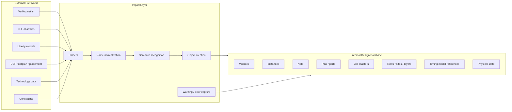
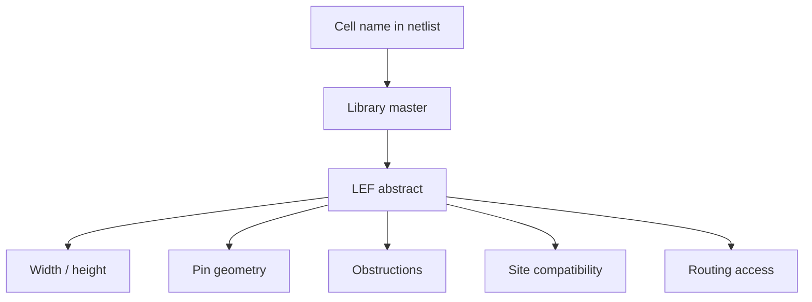
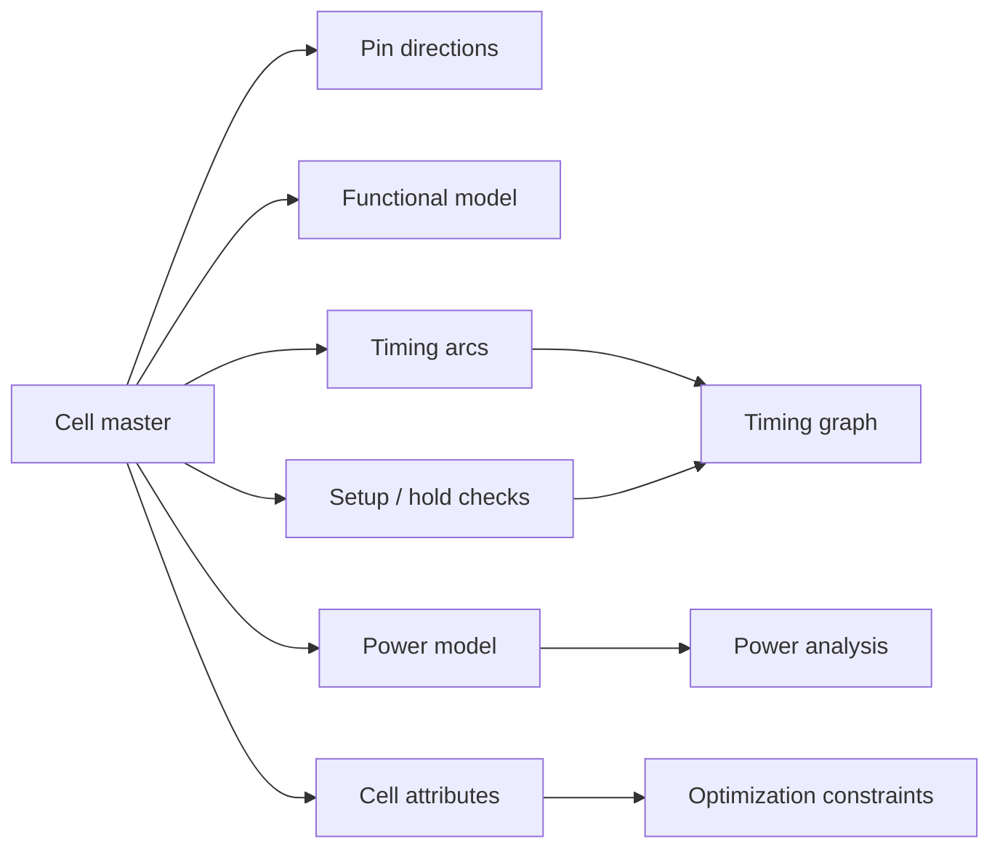
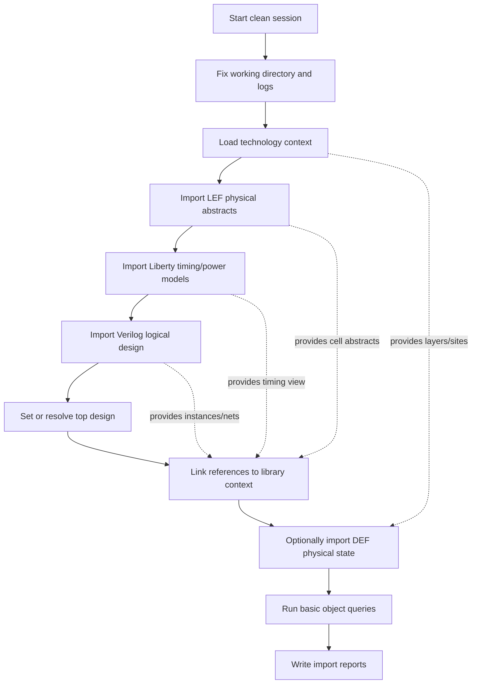
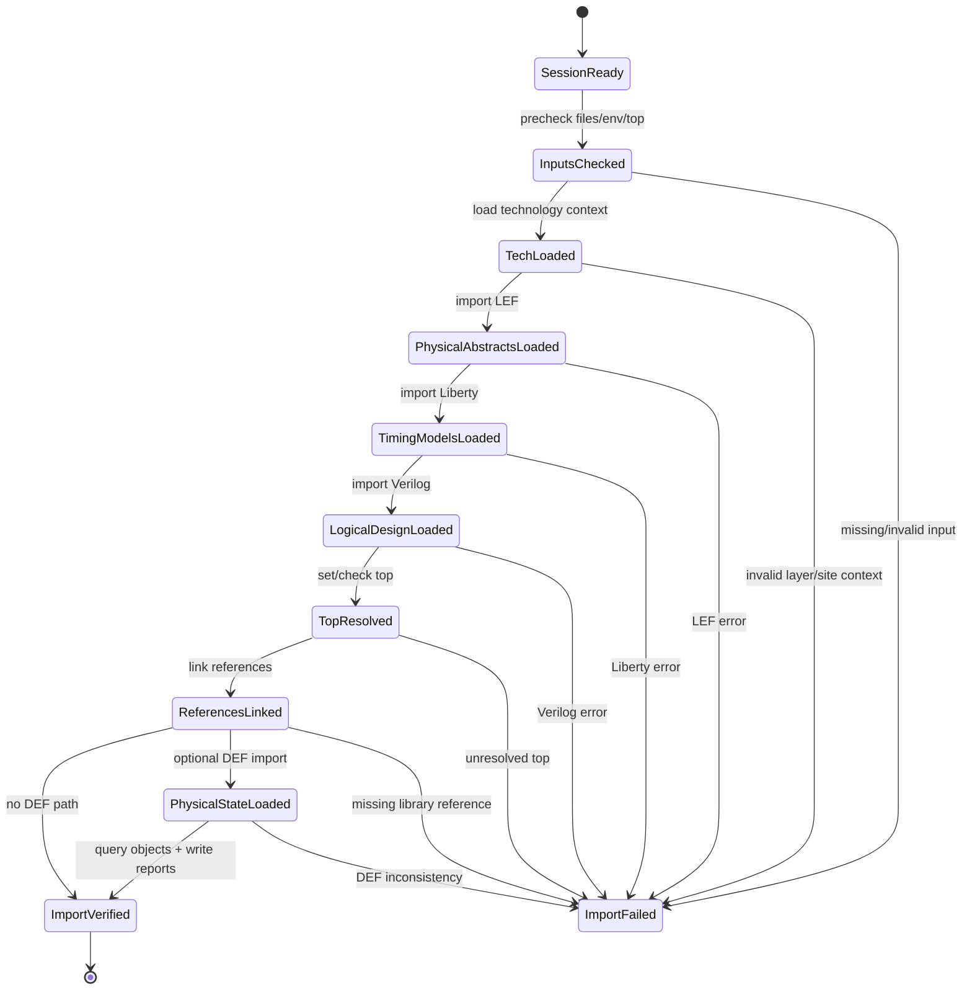

# 09. Design Import Is Not File Reading: Building the First Semantic Layer of the Design Database

Author: Darren H. Chen  
demo: `LAY-BE-09_design_import`

## Overview

In many backend implementation flows, design import is introduced as a short list of commands:

```tcl
read_verilog top.v
read_lef stdcell.lef
read_liberty stdcell.lib
read_def floorplan.def
```

From the outside, this looks like file input. A file is passed to an EDA tool, the tool parses it, and the flow moves on to link, floorplan, placement, timing, clock-tree synthesis, routing, and export.

That mental model is too shallow for backend flow engineering.

Design import is not merely the act of reading files from disk. It is the first stage where external design descriptions are translated into an internal design database. After import, the tool should no longer see only text files. It should start seeing modules, instances, nets, pins, ports, cell masters, technology layers, rows, blockages, placement records, timing arcs, and physical implementation states.

A robust backend flow therefore treats design import as a database construction stage.

The central engineering question is:

> When external files enter an EDA tool, what semantic objects are created, how are they related, and how can we verify that the first design database state is reliable?

This article explains design import from that viewpoint. It focuses on the underlying architecture, semantic layers, stage boundaries, failure modes, and demo review method for `LAY-BE-09_design_import`.

---

## 1. Why the Phrase “Read Files” Is Misleading

The phrase “read files” describes only the file-system side of design import.

A backend flow may read:

- Verilog netlists
- LEF physical abstracts
- Liberty timing and power libraries
- DEF physical implementation data
- SDC timing constraints
- SPEF parasitics
- GDS or OASIS layout views
- technology files
- power intent files

However, the backend tool does not operate on these files as plain text after they are imported. The tool must parse them, validate their syntax, identify the semantics, allocate internal objects, connect those objects to existing context, and expose them through query/report commands.

A Verilog instance such as:

```verilog
DFFQX1 U1 (.D(n1), .CK(clk), .Q(q));
```

should become an internal relationship like this:

```text
module       : top
instance     : U1
master name  : DFFQX1
pins         : D, CK, Q
nets         : n1, clk, q
connectivity : U1.D  -> n1
               U1.CK -> clk
               U1.Q  -> q
```

This transformation is the real purpose of import.

If a file is parsed but no reliable internal object model is created, the flow has not truly entered the backend implementation domain. It has only moved text into memory.

A mature design import stage must therefore answer more than “Did the file parse?” It must answer:

- Which design objects were created?
- Which top module is active?
- Which cells are unresolved?
- Which ports and nets exist?
- Which library views are visible?
- Which physical state was imported from DEF?
- Which warnings appeared during import?
- Which objects can be queried after import?

Design import is the boundary between the file world and the database world.

---

## 2. File World vs. Object World

The following diagram shows the key architectural transition.



The most important transition is not `file -> parser`. It is `parser -> database object`.

Once the database objects exist, later stages can operate on them:

```text
get cells
get nets
get pins
query properties
report utilization
initialize floorplan
place instances
analyze timing
route nets
export implementation data
```

Without this object layer, later backend stages cannot have stable meaning.

---

## 3. Design Import Builds the First Semantic Layer, Not the Final Design Understanding

Design import is the first semantic layer of the design database.

It does not mean the tool fully understands everything yet.

For example, after importing a Verilog netlist, the tool may know:

```text
modules
instances
ports
nets
hierarchy
connectivity
```

But it may not yet know:

```text
instance physical size
pin geometry
timing arc delay
power model
row legality
routing access
clock definition
parasitic loading
scenario-specific constraints
```

Those additional meanings come from library context, technology context, constraints, DEF state, parasitics, and timing setup.

A useful way to view the backend database is as a sequence of semantic layers.

| Layer | Main question answered | Typical source |
|---|---|---|
| Syntax layer | Can the file be parsed? | Verilog, LEF, Liberty, DEF |
| Object layer | What objects exist? | Verilog, LEF, DEF |
| Reference layer | What does each name refer to? | library + netlist + top |
| Physical layer | Where can objects exist physically? | LEF, technology, DEF |
| Timing layer | How does delay and constraint propagate? | Liberty, SDC, parasitics |
| Implementation layer | What is the current physical state? | DEF, database save, route data |
| Verification layer | Is the state consistent and checkable? | reports, signoff inputs |

Design import mainly starts the syntax, object, reference, and partial physical layers. It prepares the database for link, query, and implementation.

---

## 4. Input Formats and the Semantics They Contribute

Different input formats do not represent the same kind of information. Each one contributes a different semantic slice of the design.

| Input | Main database contribution | Typical objects or attributes created |
|---|---|---|
| Verilog | logical structure and connectivity | modules, instances, nets, ports, hierarchy |
| LEF | physical abstract and technology access | cell abstracts, macro abstracts, pins, obstructions, sites, layers |
| Liberty | timing, power, and cell logic model | timing arcs, pin directions, setup/hold checks, power tables, cell attributes |
| DEF | physical implementation state | die/core, rows, tracks, components, placement, pins, blockages, special nets, routes |
| Technology data | manufacturing and routing context | layers, units, grids, via rules, spacing/width constraints |
| SDC | timing intent | clocks, IO delays, exceptions, uncertainty, path groups |
| SPEF | extracted parasitic state | RC network, coupling, net capacitance/resistance |
| GDS/OASIS | detailed layout view | cell geometries, stream-out layout, signoff physical view |

This table is important because it prevents a common mistake: treating all input files as equivalent “read” operations.

They are not equivalent. They enter different parts of the database.

For example:

- Verilog creates logical object relationships.
- LEF creates physical object definitions.
- Liberty creates timing and power interpretation.
- DEF creates design-instance physical state.

A design import stage is therefore a semantic merge point.

---

## 5. Verilog Import: Building the Logical Object Graph

Verilog import builds the logical skeleton of the design.

A gate-level netlist typically provides:

```text
top module
submodules
standard-cell instances
macro instances
nets
ports
pin connections
hierarchy
black boxes
bus notation
constant connections
```

After Verilog import, the tool should be able to represent the design as an object graph.

```text
top
├── ports
│   ├── clk
│   ├── rst_n
│   ├── a
│   └── y
├── nets
│   ├── clk
│   ├── rst_n
│   ├── a
│   ├── n1
│   └── y
└── instances
    ├── U_AND : AND2X1
    │   ├── A -> a
    │   ├── B -> rst_n
    │   └── Y -> n1
    └── U_DFF : DFFQX1
        ├── D  -> n1
        ├── CK -> clk
        └── Q  -> y
```

This graph is the starting point for many later operations:

- fan-in and fan-out traversal
- timing path construction
- logic cone analysis
- placement object creation
- routing connectivity
- ECO impact analysis
- report generation

If the logical object graph is wrong, later stages may still run, but they will operate on the wrong design meaning.

This is why import reports should include object counts:

```text
module count
instance count
net count
port count
black-box count
unresolved reference count
```

A netlist that parses successfully but creates the wrong object graph is still an import failure from a flow-engineering perspective.

---

## 6. LEF Import: Creating Physical Abstracts

LEF import creates physical abstracts and technology-aware placement/routing context.

A standard-cell instance in Verilog is just a name and a connectivity node. It becomes physically meaningful only when the tool can associate it with a physical master.

LEF contributes information such as:

```text
cell width
cell height
site relation
symmetry
pin geometry
pin layer
routing obstruction
macro boundary
macro blockage
routing layer definitions
preferred routing direction
```

The physical meaning of a cell can be viewed like this:



Without LEF, the tool may know that instance `U1` is an `INVX1`, but it cannot reliably answer:

- how wide the cell is
- whether it fits into a row
- where its input/output pins are
- which metal layer can access a pin
- whether a macro blocks routing resources
- whether a DEF component placement is legal

LEF import therefore bridges logical naming and physical implementation.

---

## 7. Liberty Import: Adding Timing and Power Interpretation

Liberty import adds timing, power, and cell logic semantics.

A flip-flop in Verilog may appear as:

```text
DFFQX1 U_DFF
```

Liberty defines what that cell means for timing and power:

```text
D is a data input
CK is a clock pin
Q is an output
CK -> Q has clock-to-Q delay
D relative to CK has setup and hold checks
output transition depends on input transition and output load
leakage power depends on operating condition
internal power depends on switching behavior
```

From a database standpoint, Liberty contributes interpretation rather than placement geometry.



If Liberty is missing or mismatched, the design may still appear as a connected object graph, but timing analysis, optimization, and power estimation will be unreliable.

Typical symptoms include:

```text
missing timing arcs
unknown pin direction
missing clock pin attributes
cell not usable in optimization
invalid setup/hold checks
corner mismatch
power model missing
```

Liberty import is therefore not a late timing step. It is part of building the design database semantics from the beginning.

---

## 8. DEF Import: Loading Physical Implementation State

DEF import is different from Verilog, LEF, and Liberty import because DEF usually describes a specific design instance state.

DEF may contain:

```text
die area
core area
rows
tracks
components
component placement status
pin placement
blockages
regions
groups
special nets
regular net routes
vias
```

This means DEF import may modify the physical state of the current database.

For example:

```text
U_CPU is placed at coordinate X/Y
U_MEM is fixed
IO pins are assigned to edges
power stripes already exist
standard-cell rows are defined
some nets already have routing shapes
```

Because DEF can carry physical state, it should be treated as a high-impact import operation.

The import stage should check:

- whether the DEF top matches the current design
- whether DEF components reference known masters
- whether DEF units match the database units
- whether DEF layer names exist in the technology context
- whether row/site information is compatible with LEF
- whether special nets match the power/ground strategy
- whether imported placement conflicts with existing state

A DEF file that parses successfully may still be semantically unsafe if the referenced layers, components, or site rules are inconsistent.

---

## 9. Top Design and Current Design Are Import-Critical Concepts

A Verilog file may contain many modules. The tool must know which one is the design entry point.

This is the role of the top design or current design concept.

Without a clear top, many commands become ambiguous:

```text
query all cells
report utilization
initialize floorplan
import DEF
place cells
export DEF
run timing reports
```

A robust import stage therefore should not rely on implicit top inference.

It should explicitly record:

```text
TOP_NAME
netlist file list
library file list
physical abstract file list
DEF file list
current design after import
```

A good import report should include:

```text
requested top name
resolved top name
available module count
unresolved module count
black-box module count
current design status
```

Top ambiguity is one of the most common sources of unstable backend runs. It should be eliminated during import, not discovered during floorplan or timing analysis.

---

## 10. A Typical Import Dependency Graph

The exact command order depends on the tool, but the semantic dependency is usually stable.



The key engineering principle is:

> Build the interpretation context before importing state that depends on it.

For example:

- DEF needs layers, sites, and cell abstracts.
- Link needs logical design and library definitions.
- Timing setup needs imported design, Liberty views, and constraints.

When import order is not controlled, many errors appear later in the flow and are harder to diagnose.

---

## 11. Import Stage as a State Machine

Design import can be modeled as a state machine.



This state machine is useful because it turns a vague step named “import design” into reviewable checkpoints.

Instead of one large step, the flow can report:

```text
SESSION_READY              PASS
INPUTS_CHECKED             PASS
TECH_LOADED                PASS
PHYSICAL_ABSTRACTS_LOADED  PASS
TIMING_MODELS_LOADED       PASS
LOGICAL_DESIGN_LOADED      PASS
TOP_RESOLVED               PASS
REFERENCES_LINKED          PASS
PHYSICAL_STATE_LOADED      PASS/WARN/SKIP
IMPORT_VERIFIED            PASS
```

This makes import failures easier to classify.

---

## 12. Precheck Before Import

A backend flow should not import files blindly.

Before import, the script should verify the minimum conditions:

| Check item | Reason |
|---|---|
| tool version recorded | import behavior may vary by version |
| working directory fixed | relative paths must be stable |
| log directory writable | failures must be diagnosable |
| report directory writable | import summary must be preserved |
| top name defined | current design must be explicit |
| Verilog file exists | logical graph input |
| LEF file exists | physical abstract input |
| Liberty file exists | timing/power model input |
| technology context available | layer/site/unit interpretation |
| optional DEF file checked | physical state import must be controlled |
| command baseline checked | import commands must be available in current mode |

A generic Tcl precheck skeleton can look like this:

```tcl
proc require_env {name} {
    if {![info exists ::env($name)]} {
        error "Missing required environment variable: $name"
    }
}

proc require_file {path} {
    if {![file exists $path]} {
        error "Required file does not exist: $path"
    }
    if {![file readable $path]} {
        error "Required file is not readable: $path"
    }
    if {[file size $path] == 0} {
        error "Required file is empty: $path"
    }
}

proc check_import_inputs {} {
    require_env PROJECT_ROOT
    require_env TOP_NAME
    require_env VERILOG_FILE
    require_env LEF_FILE
    require_env LIBERTY_FILE
    require_env REPORT_DIR
    require_env LOG_DIR

    require_file $::env(VERILOG_FILE)
    require_file $::env(LEF_FILE)
    require_file $::env(LIBERTY_FILE)

    if {[info exists ::env(DEF_FILE)] && $::env(DEF_FILE) ne ""} {
        require_file $::env(DEF_FILE)
    }
}
```

This is simple, but it removes many low-value failures:

```text
wrong path
empty file
missing top variable
unwritable report directory
incorrect working directory
missing optional DEF file
```

The earlier the flow rejects bad inputs, the easier the run is to debug.

---

## 13. Import Is Not Complete Until Objects Can Be Queried

A file being imported without a fatal error is not enough.

The flow should immediately query the database after import.

Useful post-import queries include:

```text
current design
module count
instance count
net count
port count
library count
unresolved cell count
row count if DEF was imported
component placement count if DEF was imported
warning/error summary
```

A tool-neutral review report might contain:

```text
IMPORT SUMMARY
==============
Top requested        : top
Top resolved         : top
Verilog files        : 1
LEF files            : 1
Liberty files        : 1
DEF files            : 1 optional
Modules              : 3
Instances            : 128
Nets                 : 214
Ports                : 32
Unresolved refs      : 0
Imported rows        : 20
Imported components  : 128
Warnings             : 2
Errors               : 0
Import status        : PASS
```

The important idea is:

> Import success should be proven by database observability, not only by command return codes.

---

## 14. Recommended Report Set for Design Import

A design import stage should produce reports that make the first database state reviewable.

| Report | Purpose |
|---|---|
| `import_file_list.rpt` | records all input files, paths, sizes, timestamps |
| `import_top_summary.rpt` | records requested/resolved top and module status |
| `import_object_summary.rpt` | records modules, instances, nets, ports, cells |
| `import_library_reference.rpt` | records cell references and missing library masters |
| `import_physical_state.rpt` | records DEF rows, components, pins, blockages, routes when applicable |
| `import_warning_error_summary.rpt` | collects import warnings/errors in one place |
| `import_stage_summary.rpt` | records pass/fail/skip status for each import substage |

These reports are not only for the current run. They become evidence for later debugging.

If placement fails, one of the first questions is:

```text
Did the cells and physical abstracts import correctly?
```

If timing analysis fails, one of the first questions is:

```text
Did the timing libraries and top design import correctly?
```

If DEF import fails, one of the first questions is:

```text
Were the technology layers, sites, and component masters already known?
```

Import reports shorten the path from symptom to root cause.

---

## 15. Common Design Import Failure Patterns

Design import failures tend to fall into repeatable categories.

| Failure pattern | Typical symptom | Likely root cause | Earlier check |
|---|---|---|---|
| Path failure | file not found | wrong root directory or relative path | file manifest precheck |
| Empty input | parser fails or creates no objects | upstream generated empty file | file size check |
| Top ambiguity | current design missing or wrong | multiple modules, no explicit top | top precheck |
| Missing cell master | unresolved reference | netlist/library mismatch | library reference report |
| LEF/Liberty mismatch | physical or timing view missing | library version mismatch | cell name match check |
| Pin mismatch | link or timing errors | pin naming differs across views | pin match report |
| DEF layer failure | DEF import error | layer not defined in technology/LEF | layer summary precheck |
| DEF component failure | components not recognized | DEF master not in LEF/library | DEF component check |
| Unit mismatch | coordinates appear wrong | DBU or unit mismatch | technology/DEF unit review |
| Implicit environment drift | works for one user only | HOME/PATH/search path dependency | session state report |

A well-designed demo should intentionally make these failure classes visible in reports, even if the sample design is small.

The goal is not only to show a passing run. The goal is to show how import health is determined.

---

## 16. Design Import and Reproducibility

Design import has a large impact on reproducibility because it creates the initial database state used by all later stages.

If import is unstable, placement, timing, routing, and export cannot be stable.

Common reproducibility risks include:

```text
relative file paths
implicit library search paths
implicit top inference
HOME initialization side effects
unstable file lists
library version drift
optional DEF import changing between runs
different environment variables across users
```

A reproducible import stage should therefore follow these principles:

| Principle | Engineering meaning |
|---|---|
| explicit input manifest | every imported file is listed and reviewed |
| explicit top | the design entry point is never guessed |
| explicit working directory | relative paths do not depend on the shell caller |
| explicit log/report paths | all evidence is preserved |
| explicit optional inputs | DEF or constraints are skipped or imported intentionally |
| explicit stage boundaries | import substeps are independently diagnosable |
| explicit failure policy | a failed critical import does not silently continue |

A generic shell entry can express this pattern:

```csh
#!/bin/csh -f

set ROOT_DIR = /path/to/project
set LOG_DIR  = "$ROOT_DIR/logs"
set RPT_DIR  = "$ROOT_DIR/reports"
set TCL_DIR  = "$ROOT_DIR/tcl"

mkdir -p "$LOG_DIR" "$RPT_DIR"

setenv PROJECT_ROOT "$ROOT_DIR"
setenv TOP_NAME     top
setenv VERILOG_FILE "$ROOT_DIR/data/netlist/top.v"
setenv LEF_FILE     "$ROOT_DIR/data/lef/stdcell.lef"
setenv LIBERTY_FILE "$ROOT_DIR/data/liberty/stdcell.lib"
setenv DEF_FILE     "$ROOT_DIR/data/def/floorplan.def"
setenv LOG_DIR      "$LOG_DIR"
setenv REPORT_DIR   "$RPT_DIR"

$EDA_TOOL_BIN \
    -batch "$TCL_DIR/run_design_import.tcl" \
    -log "$LOG_DIR/design_import.log" \
    -cmd_log "$LOG_DIR/design_import.cmd.log" \
    >&! "$LOG_DIR/design_import.stdout.log"
```

The exact tool options may differ. The reproducibility pattern remains the same.

---

## 17. Demo 09: What This Demo Should Prove

The purpose of `LAY-BE-09_design_import` is not to complete a full backend implementation. Its purpose is to show that a minimal design can enter the database in a controlled, inspectable way.

A good demo run should prove:

- the input files are explicit
- the top name is explicit
- Verilog import creates logical objects
- LEF import creates physical abstracts
- Liberty import creates timing/power references
- optional DEF import is controlled and reviewable
- basic object queries work after import
- import warnings and errors are captured
- reports describe the created database state

A recommended demo structure is:

```text
LAY-BE-09_design_import/
├── data/
│   ├── tech/
│   │   └── demo.tech
│   ├── lef/
│   │   └── demo_stdcell.lef
│   ├── liberty/
│   │   └── demo_stdcell.lib
│   ├── netlist/
│   │   └── top.v
│   └── def/
│       └── floorplan.def
├── scripts/
│   ├── run_import.csh
│   └── clean.csh
├── tcl/
│   ├── common_check.tcl
│   ├── 01_precheck_import.tcl
│   ├── 02_import_technology.tcl
│   ├── 03_import_libraries.tcl
│   ├── 04_import_verilog.tcl
│   ├── 05_import_def_optional.tcl
│   └── 06_report_import_summary.tcl
├── logs/
│   ├── design_import.log
│   ├── design_import.cmd.log
│   └── design_import.stdout.log
├── reports/
│   ├── import_file_list.rpt
│   ├── import_top_summary.rpt
│   ├── import_object_summary.rpt
│   ├── import_library_reference.rpt
│   ├── import_physical_state.rpt
│   └── import_warning_error_summary.rpt
└── README.md
```

The demo should be judged by the reports, not only by whether the tool exits successfully.

---

## 18. Demo Review Checklist

After running Demo 09, review the output in this order.

| Step | File or check | What to confirm |
|---|---|---|
| 1 | stdout log | the tool started and exited normally |
| 2 | main log | no fatal parser/import errors |
| 3 | command log | import commands were executed in the expected order |
| 4 | `import_file_list.rpt` | all intended files were used |
| 5 | `import_top_summary.rpt` | requested and resolved top match |
| 6 | `import_object_summary.rpt` | modules, cells, nets, ports were created |
| 7 | `import_library_reference.rpt` | no unexpected unresolved references |
| 8 | `import_physical_state.rpt` | DEF state is imported only when intended |
| 9 | `import_warning_error_summary.rpt` | warnings are classified and understood |

This review method is more valuable than a simple “PASS” message.

Backend flow debugging depends on evidence. Demo 09 should generate that evidence at the import boundary.

---

## 19. Engineering Takeaways

Design import is the foundation of the backend database.

Its engineering value can be summarized in four statements.

### 19.1 It turns files into objects

External formats become modules, instances, nets, pins, ports, layers, rows, sites, cell masters, and physical state records.

### 19.2 It turns objects into context

Objects are not useful alone. They become meaningful when they are connected to the current design, library context, technology context, and implementation state.

### 19.3 It turns input into evidence

A mature import stage writes reports that prove what entered the database and what failed to resolve.

### 19.4 It moves risk forward

Path, top, cell, pin, layer, and DEF-state issues should be detected during import, not after placement, routing, or timing analysis.

---

## 20. Summary

Design import is not file reading.

It is the first controlled transformation from external design descriptions into an internal backend design database.

A mature design import stage should:

1. parse Verilog into logical objects and connectivity;
2. parse LEF into physical abstracts and layer/site context;
3. parse Liberty into timing, power, and cell interpretation;
4. parse DEF into optional physical implementation state;
5. resolve or explicitly record the top design;
6. prepare objects for link, query, floorplan, placement, timing, routing, and export;
7. generate import summaries and warning/error reports;
8. make the initial design database state reviewable and reproducible.

The practical lesson is straightforward:

> Do not judge design import by whether files were read. Judge it by whether the database state created from those files is observable, consistent, and ready for the next backend stage.
