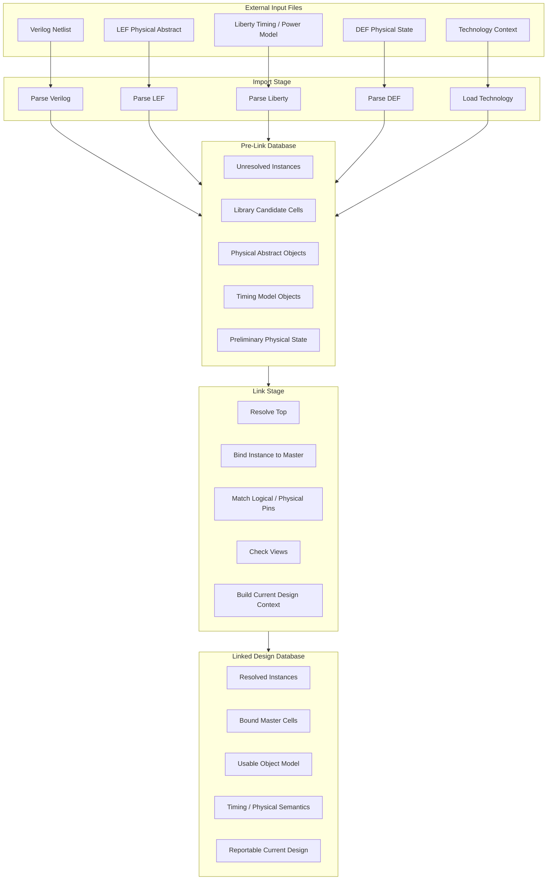
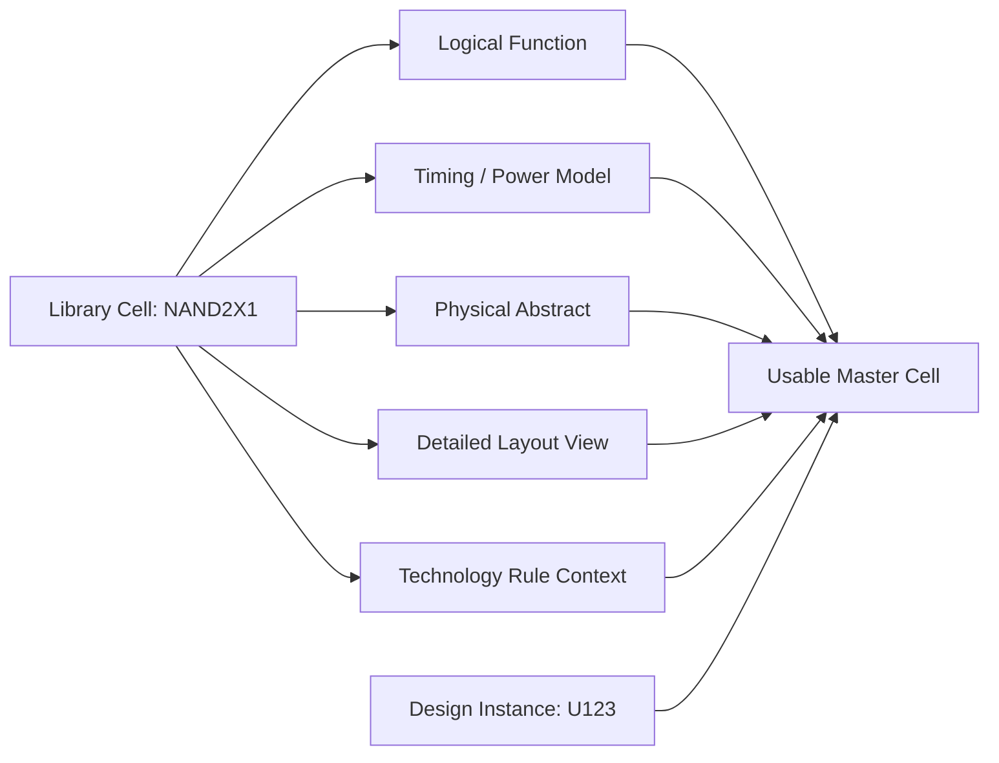
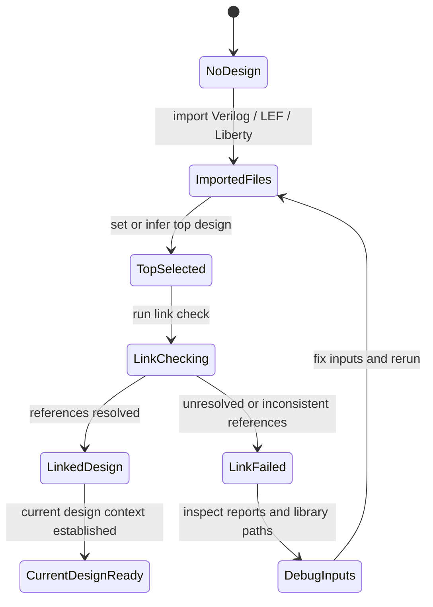
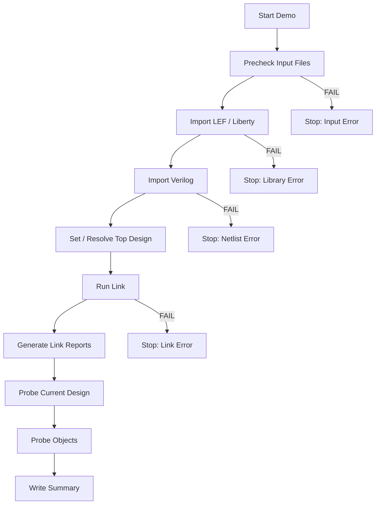

# 10. From Import to Link: Why `link_project` Decides Whether the EDA Tool Really Understands the Design

Author: Darren H. Chen  
Category: Backend Flow Engineering / Physical Implementation / EDA Flow Infrastructure  
demo: `LAY-BE-10_import_link_current_design`

---

## 1. Import Is Not the End of Design Loading

In a backend implementation flow, design loading is often described as a short sequence of commands:

```tcl
import_lef     ./data/stdcell.lef
import_liberty ./data/stdcell.lib
import_verilog ./data/top.v
import_def     ./data/floorplan.def
```

From the file-system point of view, this looks like the tool has already received all major inputs. A Verilog netlist has been read. Physical abstracts have been read. Timing libraries have been read. A DEF file may also have been read.

However, from the internal architecture of a backend EDA tool, importing files is only the first half of the story.

A file being parsed does not mean the design is already understood. The tool may know that a netlist contains an instance named `U123` of type `INVX1`, but it still has to answer several deeper questions:

```text
Does INVX1 exist in the project library?
Does INVX1 have a physical abstract?
Does INVX1 have a timing model?
Do the LEF pins match the Liberty pins?
Does the instance bind to a valid master cell?
Is the top design clear?
Are hierarchy references resolved?
Are black boxes intentional or accidental?
Can object queries operate on a meaningful current design?
Can floorplan, placement, timing, and routing safely consume this database?
```

These questions are not solved by file parsing alone. They are solved by the linking stage.

In this article, the command name `link_project` is used as a generic backend-flow concept: a stage where the imported design, project library, search paths, top module, hierarchy, and multi-view cell definitions are resolved into a coherent internal design database.

The key engineering idea is:

> Import brings data into the tool. Link binds that data into a usable design context.

Without a successful link stage, the design may be present as raw objects, but it is not yet a reliable implementation database.

---

## 2. The Core Difference Between Import and Link

The difference between import and link can be summarized as follows:

| Stage | Main Question | Internal Result |
|---|---|---|
| Import | Can the tool parse the input files? | Raw objects and preliminary file-derived structures |
| Link | Can the tool resolve those objects against the library and project context? | Bound design database with usable implementation semantics |

Import is mostly about turning files into internal representations:

```text
Verilog  -> modules, instances, nets, ports, hierarchy
LEF      -> cell abstracts, pins, sites, layers, blockages
Liberty  -> timing arcs, pin directions, power models, cell attributes
DEF      -> rows, tracks, placement, special nets, routing shapes
```

Link is about resolving relationships across those representations:

```text
instance reference -> library master cell
logical pin        -> Liberty pin
physical pin       -> LEF pin
cell name          -> multi-view library entry
top name           -> current design context
hierarchy reference -> resolved module or intentional black box
```

A backend database becomes useful only after these relationships are established.

A netlist imported without linking is similar to a schematic where each component has a name but no attached model. The tool can see the component names, but it cannot reliably place, time, optimize, or route them.

---

## 3. Architecture View: File Data Versus Linked Design Context

The following diagram shows the conceptual difference between imported file data and a linked design context.



This architecture view explains a common debugging trap: a file may be imported successfully, but the design may still fail at link time because names, pins, views, or hierarchy references cannot be resolved.

---

## 4. Why Importing Verilog Alone Is Not Enough

A gate-level Verilog netlist primarily describes logical connectivity.

For example:

```verilog
module top (
    input  clk,
    input  a,
    input  b,
    output q
);

wire n1;

AND2X1 U_AND (
    .A(a),
    .B(b),
    .Y(n1)
);

DFFQX1 U_REG (
    .D(n1),
    .CK(clk),
    .Q(q)
);

endmodule
```

After Verilog import, the tool can identify a logical graph:

```text
top
├── ports
│   ├── clk
│   ├── a
│   ├── b
│   └── q
├── nets
│   ├── n1
│   ├── clk
│   ├── a
│   ├── b
│   └── q
└── instances
    ├── U_AND : AND2X1
    └── U_REG : DFFQX1
```

This is useful, but it is incomplete.

The Verilog netlist does not tell the tool:

```text
How wide is AND2X1?
How tall is DFFQX1?
Where is pin CK physically located?
Does DFFQX1 have setup and hold timing checks?
Is CK a clock pin?
Does AND2X1 have a valid output transition model?
Can U_AND be placed in the selected standard-cell row?
Can the router access pin Y?
Is the cell allowed for optimization?
```

These answers come from the project library.

Therefore, after import, the tool still needs to bind each instance type to a real library master. This is one of the central jobs of the link stage.

---

## 5. The Most Important Binding: Instance to Master Cell

The most important relationship created by linking is:

```text
Design instance -> Library master cell
```

For example:

```text
U_AND -> AND2X1
U_REG -> DFFQX1
```

Before linking, `AND2X1` may be just a reference name inside the imported netlist.

After linking, `AND2X1` should point to a valid master cell in the project library, with associated views:

```text
AND2X1
├── LEF physical abstract
├── Liberty timing / power model
├── optional GDS / OASIS layout view
├── technology-layer interpretation
└── tool-specific cell properties
```

This binding is critical because almost every later operation depends on it.

| Later Operation | Dependency on Instance-Master Binding |
|---|---|
| Area report | Needs master cell area or physical size |
| Placement | Needs width, height, site compatibility, class, obstruction |
| Routing | Needs pin geometry and routing obstruction |
| Timing analysis | Needs timing arcs, pin directions, delay tables |
| Optimization | Needs legal replacement candidates, sizing cells, buffer cells |
| CTS | Needs clock buffers, inverters, clock pins, gating cells |
| ECO | Needs replaceable cells and legal implementation candidates |
| Export | Needs consistent names and physical/legal views |

If an instance cannot bind to a master cell, the design is not fully understood.

---

## 6. Project Library as a Multi-View Knowledge Base

The project library is not a folder of files. It is a knowledge base that combines multiple views of the same design primitives.

A standard cell or macro may have several views:

| View | Typical Source | Used By |
|---|---|---|
| Logical function | Liberty / cell model | Logic interpretation, equivalence, optimization |
| Timing view | Liberty | STA, sizing, buffering, setup/hold fixing |
| Power view | Liberty / power model | Power estimation, leakage optimization |
| Physical abstract | LEF | Placement, routing, floorplan integration |
| Detailed layout | GDS / OASIS | Stream-out, physical verification, abstract validation |
| Technology rules | Tech file / LEF tech section | Routing, DRC awareness, layer interpretation |

The link stage verifies whether a design instance can be interpreted through these views.

A simplified multi-view cell model looks like this:



The backend tool can use `U123` reliably only when this binding is consistent enough for the target stage.

For example, early logical checks may not need full GDS, but placement requires a physical abstract, timing optimization requires Liberty timing data, and final stream-out requires detailed layout and layer mapping.

---

## 7. Link Is Also a Hierarchy Resolution Stage

A real Verilog netlist is often hierarchical. It may contain:

```text
top modules
submodules
hard macros
black boxes
preserved hierarchy
flattened logic
IP wrappers
feedthrough modules
clock-gating blocks
power-management blocks
```

The link stage must determine whether each reference is resolved.

There are several possible outcomes:

| Reference Type | Expected Link Behavior |
|---|---|
| Standard cell instance | Bind to a library master cell |
| Hard macro instance | Bind to macro abstract and optional timing model |
| RTL-like submodule | Resolve to an imported module definition |
| Intentional black box | Preserve as allowed unresolved block with known interface |
| Accidental missing module | Report unresolved reference and block strict flow |
| Duplicate module | Resolve according to search/link rules or report ambiguity |

This is why link is not only a library operation. It is also a hierarchy operation.

A backend flow should never treat all black boxes the same. Some black boxes are intentional IP placeholders. Others indicate that a required module or macro library was not loaded. A mature link stage must distinguish between them.

---

## 8. Top Design and Current Design Context

Another critical output of the link stage is the current design context.

A Verilog file may contain many modules. The backend tool must know which one is the design root.

```text
Which module is top?
Which hierarchy is active?
Which design will object queries operate on?
Which design will floorplan commands modify?
Which design will timing reports analyze?
```

Without a clear current design, many commands become ambiguous.

For example:

```tcl
get_cells *
get_ports *
report_link
report_timing
init_floorplan
export_def
```

These commands implicitly require a valid current design or current project context.

The transition can be modeled as follows:



The state `CurrentDesignReady` is the real gateway into object-oriented backend flow.

Before that point, the tool may have imported information, but the design is not yet ready for reliable implementation stages.

---

## 9. Search Path and Link Path Are Part of the Design State

Linking depends on where the tool searches for libraries and how it prioritizes them.

This makes search path and link path part of the design state.

Common sources of link path instability include:

```text
Implicit search paths inherited from shell environment
User-specific HOME initialization files
Old libraries left from previous sessions
Multiple libraries containing the same cell name
Corner-specific libraries loaded in the wrong order
Physical and timing libraries from different releases
Relative paths depending on working directory
```

A reproducible link stage should make these variables explicit.

A generic configuration may look like:

```tcl
set PROJECT_ROOT ./demo
set TOP_NAME     demo_top

set LEF_FILES {
    ./data/lef/demo_stdcell.lef
}

set LIBERTY_FILES {
    ./data/liberty/demo_tt.lib
}

set VERILOG_FILES {
    ./data/netlist/demo_top.v
}
```

The important point is not the exact command syntax, but the engineering rule:

> A link result is not reproducible unless the library search rules are reproducible.

A linked design should be traceable back to the exact library files used in that run.

---

## 10. Link Quality Is Not Binary

A link command may return successfully, but the design can still contain warnings that matter.

For engineering purposes, link quality should not be treated as only PASS or FAIL. It is better to classify link quality into levels.

| Level | Meaning | Flow Policy |
|---|---|---|
| Clean | All required references resolved; no critical warnings | Continue |
| Warning | Non-critical issues exist; reports must be reviewed | Continue only for exploration |
| Degraded | Some views missing but partial analysis possible | Block formal flow; allow debug only |
| Failed | Missing master, unresolved top, critical pin mismatch | Stop |
| Ambiguous | Multiple candidates or unclear binding | Stop and resolve search path |

This distinction is important because not every issue has the same impact.

For example:

```text
Missing GDS for a standard cell may not block early placement exploration.
Missing LEF for that same cell blocks physical implementation.
Missing Liberty blocks timing-driven optimization.
Missing master cell blocks the design itself.
```

A mature backend flow should define which link issues are acceptable at each project stage.

---

## 11. Typical Link Failure Patterns

The following table summarizes common link failures and their likely root causes.

| Failure Pattern | Typical Symptom | Likely Root Cause | Debug Direction |
|---|---|---|---|
| Missing library cell | Instance reference cannot bind to master | Wrong standard-cell library, missing macro abstract, library version mismatch | Compare netlist cell list with LEF/Liberty cell list |
| Missing logical view | Physical abstract exists but timing model missing | Liberty not loaded, wrong corner, link path incomplete | Check Liberty file list and used libraries report |
| Missing physical view | Liberty exists but LEF abstract missing | LEF not loaded, macro LEF missing, wrong abstract version | Check LEF summary and physical library report |
| Pin mismatch | Instance pins do not match library pins | LEF/Liberty/netlist version mismatch, bus notation issue | Compare pin names across views |
| Duplicate master | Same cell appears in multiple libraries | Search path order ambiguous, old library included | Report used library and duplicate definitions |
| Unresolved hierarchy | Submodule or macro not found | Missing Verilog file, missing black-box declaration, wrong top | Check hierarchy and unresolved module report |
| Ambiguous top | Tool cannot infer top or infers wrong top | Multiple candidate modules, no explicit top variable | Explicitly set top and report current design |
| Wrong library corner | Design binds to unexpected Liberty corner | Search path order or config error | Report actual library bindings |

A good link report should make these patterns visible.

---

## 12. Why `report_link` Is a Required Engineering Artifact

A link stage should not end with the command itself. It should always generate reports.

Recommended reports include:

```text
reports/report_link.rpt
reports/used_libraries.rpt
reports/current_design_summary.rpt
reports/missing_cells.rpt
reports/missing_views.rpt
reports/pin_mismatch.rpt
reports/link_warning_error_summary.rpt
```

Each report answers a different engineering question.

| Report | Question Answered |
|---|---|
| `report_link.rpt` | Did the link stage resolve design references correctly? |
| `used_libraries.rpt` | Which libraries were actually used? |
| `current_design_summary.rpt` | What is the active top/current design? |
| `missing_cells.rpt` | Which instance master references are unresolved? |
| `missing_views.rpt` | Which cells lack required logical or physical views? |
| `pin_mismatch.rpt` | Do library views disagree on pin names or directions? |
| `link_warning_error_summary.rpt` | Which warnings/errors should gate the next stage? |

These reports turn link from a hidden internal operation into an auditable engineering checkpoint.

Without them, later failures become harder to debug because the initial binding state is unknown.

---

## 13. Link as a Flow Gate

A backend implementation flow should treat link as an early quality gate.

A typical gate policy can be defined as follows:

```text
Gate: import_link_current_design

Required PASS conditions:
  - top design is explicitly known
  - Verilog import completed
  - required LEF libraries loaded
  - required Liberty libraries loaded
  - link completed without critical errors
  - no missing standard-cell master references
  - intentional black boxes are documented
  - current design context is established
  - link report generated
  - used library report generated

Blocking conditions:
  - unresolved top
  - missing standard-cell master
  - missing mandatory LEF view
  - missing mandatory Liberty timing view
  - critical pin mismatch
  - ambiguous library binding
```

This type of gate prevents the flow from entering floorplan, placement, or timing stages with an incomplete database.

The policy should be explicit. Otherwise, different users may make different decisions about whether a warning is acceptable.

---

## 14. Check Mode Versus Strict Mode

In engineering practice, it is useful to distinguish between exploratory link checking and strict flow gating.

### Check Mode

Check mode is useful during bring-up.

Its purpose is to collect as many link issues as possible:

```text
What is missing?
Which cells cannot bind?
Which pins disagree?
Which libraries are being used?
Which black boxes exist?
```

The flow may continue long enough to generate diagnostic reports, even if issues exist.

### Strict Mode

Strict mode is used for formal flow execution.

Its purpose is to stop the flow if critical link requirements are not met:

```text
No missing required master cells.
No unresolved top.
No critical pin mismatch.
No mandatory library view missing.
No ambiguous binding.
```

A good strategy is:

```text
First run check mode to expose issues.
Fix the library/configuration problems.
Then run strict mode as the official gate.
```

This two-step pattern is more practical than either stopping at the first problem or allowing all warnings to pass.

---

## 15. Link and Object Query Readiness

The next stage after linking is often object exploration:

```tcl
get_cells *
get_nets *
get_pins *
get_ports *
get_property <object> <property_name>
```

These queries become meaningful only after link has established a current design context.

Before link:

```text
Objects may exist only as raw imported structures.
Instance references may still be unresolved.
Properties may be incomplete.
Pin objects may not be reliably connected to library views.
Reports may not have a valid design scope.
```

After link:

```text
Instances have bound masters.
Pins can be interpreted through library views.
Nets belong to a known design context.
Design-level reports have an active scope.
Properties become more meaningful.
```

This is why the import-link stage is the foundation for design object modeling.

A backend flow that skips link validation will often fail later in object query, timing reporting, placement, or export.

---

## 16. Recommended Demo Structure for `LAY-BE-10_import_link_current_design`

The demo should be focused. It does not need to run placement or routing. Its purpose is to verify the import-link-current-design boundary.

A recommended directory structure is:

```text
LAY-BE-10_import_link_current_design/
├── data/
│   ├── lef/
│   │   └── demo_stdcell.lef
│   ├── liberty/
│   │   └── demo_stdcell_tt.lib
│   ├── netlist/
│   │   └── demo_top.v
│   └── config/
│       └── link_inputs.tcl
├── scripts/
│   ├── run_demo.csh
│   └── clean.csh
├── tcl/
│   ├── common_check.tcl
│   ├── 01_precheck_inputs.tcl
│   ├── 02_import_library.tcl
│   ├── 03_import_design.tcl
│   ├── 04_link_project.tcl
│   ├── 05_query_current_design.tcl
│   └── 06_report_link_summary.tcl
├── logs/
│   ├── LAY-BE-10_import_link_current_design.log
│   ├── LAY-BE-10_import_link_current_design.cmd.log
│   └── LAY-BE-10_import_link_current_design.stdout.log
├── reports/
│   ├── precheck_inputs.rpt
│   ├── imported_files.rpt
│   ├── link_summary.rpt
│   ├── used_libraries.rpt
│   ├── current_design_summary.rpt
│   └── object_probe_after_link.rpt
└── README.md
```

The demo should answer five questions:

```text
Were the required input files present?
Were LEF and Liberty loaded into the project context?
Was the Verilog design imported?
Was the top/current design established?
Can basic object queries run after link?
```

This is enough to demonstrate the engineering purpose of the link stage.

---

## 17. Recommended Run Flow

The demo flow can be organized as a small state-controlled pipeline:



This flow demonstrates that link is not just one command inside a script. It is a controlled engineering gate with inputs, outputs, reports, and failure policies.

---

## 18. Example Abstract Tcl Skeleton

The following skeleton is intentionally generic. It expresses the stage structure rather than a specific vendor syntax.

```tcl
# ============================================================
# run_import_link.tcl
# ============================================================

puts "STAGE_BEGIN: import_link_current_design"

# ------------------------------------------------------------
# Precheck
# ------------------------------------------------------------
source ./tcl/common_check.tcl
require_file ./data/lef/demo_stdcell.lef
require_file ./data/liberty/demo_stdcell_tt.lib
require_file ./data/netlist/demo_top.v
require_env  TOP_NAME

# ------------------------------------------------------------
# Import library context
# ------------------------------------------------------------
puts "STAGE_BEGIN: import_library"
import_lef     ./data/lef/demo_stdcell.lef
import_liberty ./data/liberty/demo_stdcell_tt.lib
puts "STAGE_END: import_library"

# ------------------------------------------------------------
# Import logical design
# ------------------------------------------------------------
puts "STAGE_BEGIN: import_design"
import_verilog ./data/netlist/demo_top.v
puts "STAGE_END: import_design"

# ------------------------------------------------------------
# Link design
# ------------------------------------------------------------
puts "STAGE_BEGIN: link_design"
link_project
puts "STAGE_END: link_design"

# ------------------------------------------------------------
# Probe linked context
# ------------------------------------------------------------
puts "STAGE_BEGIN: current_design_probe"
# The exact command depends on the backend tool.
# The purpose is to verify that a current design context exists.
puts "EXPECTED_TOP = $::env(TOP_NAME)"
puts "STAGE_END: current_design_probe"

# ------------------------------------------------------------
# Reports
# ------------------------------------------------------------
redirect_to_file ./reports/link_summary.rpt {
    puts "TOP_NAME = $::env(TOP_NAME)"
    puts "LINK_STAGE = COMPLETED"
    puts "NEXT_GATE = object_model_probe"
}

puts "STAGE_END: import_link_current_design"
```

In a real flow, `link_project`, `report_link`, `list_libraries`, `get_cells`, and current-design probing should be adapted to the actual backend tool command set. The methodology remains the same.

---

## 19. What to Check in the Demo Reports

For this demo, the most important report is not a timing report or a placement report. It is the link summary.

A useful `link_summary.rpt` should include:

```text
Tool run ID
Top design name
Imported Verilog files
Imported LEF files
Imported Liberty files
Link status
Current design status
Number of cells queried after link
Number of nets queried after link
Number of ports queried after link
Missing cell count
Missing view count
Critical warning count
Recommended next stage
```

A useful `object_probe_after_link.rpt` should include:

```text
get_cells result
get_nets result
get_ports result
basic property query result
whether the query was executed before or after link
```

This creates a visible boundary between:

```text
files imported
```

and:

```text
design context ready for object-level flow
```

That boundary is the whole purpose of Demo 10.

---

## 20. Engineering Methodology: Treat Link as a Contract

A robust backend flow should treat the link stage as a contract between input preparation and physical implementation.

Before link, the flow promises:

```text
All required input files are present.
The intended top name is known.
Library paths are explicit.
LEF and Liberty versions are intended to match.
The Verilog netlist is the expected revision.
```

After link, the tool promises:

```text
The current design is established.
Instances are bound to library masters.
Required views are present.
Object queries can operate on the design.
Reports can be generated with a known scope.
The design is ready for the next stage.
```

If this contract is broken, the flow should stop.

This is why link belongs early in the backend flow quality system.

It is not a passive command. It is an engineering checkpoint.

---

## 21. Summary

Design import and design link are different stages.

Import converts external files into internal preliminary objects:

```text
Verilog -> modules, instances, nets, ports
LEF -> physical abstracts, pins, layers, sites
Liberty -> timing arcs, power models, pin directions
DEF -> physical implementation state
```

Link resolves these objects into a coherent backend design database:

```text
instance -> master cell
logical pin -> timing pin
physical pin -> abstract pin
top module -> current design
library views -> usable project library
raw imported data -> linked implementation context
```

A mature backend flow should therefore treat `link_project` as a quality gate, not as a minor command after import.

The link stage should be explicit, reproducible, reportable, and strict enough to prevent later stages from running on incomplete design semantics.

The central engineering lesson is:

> Import lets the EDA tool see the files. Link lets the EDA tool understand the design.

Only after link succeeds does the design become a reliable object for floorplanning, placement, timing analysis, routing, ECO, export, and signoff handoff.
