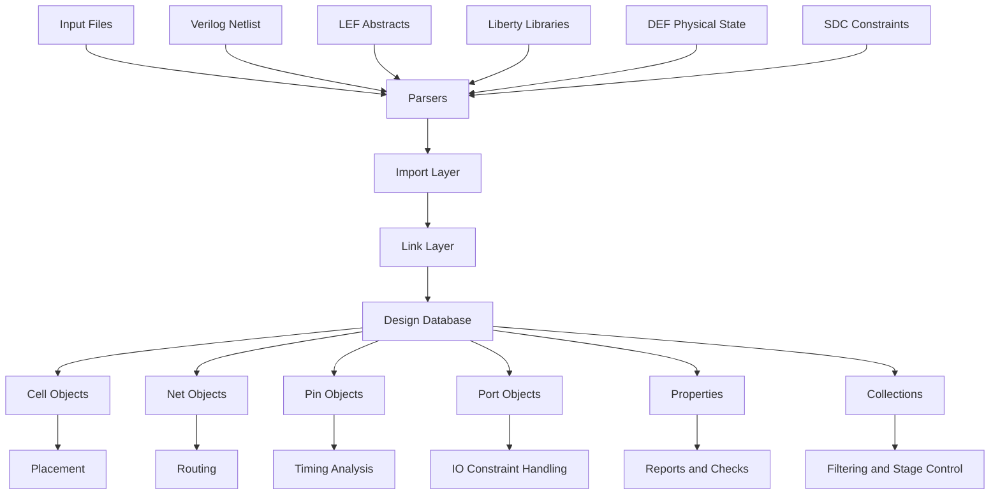
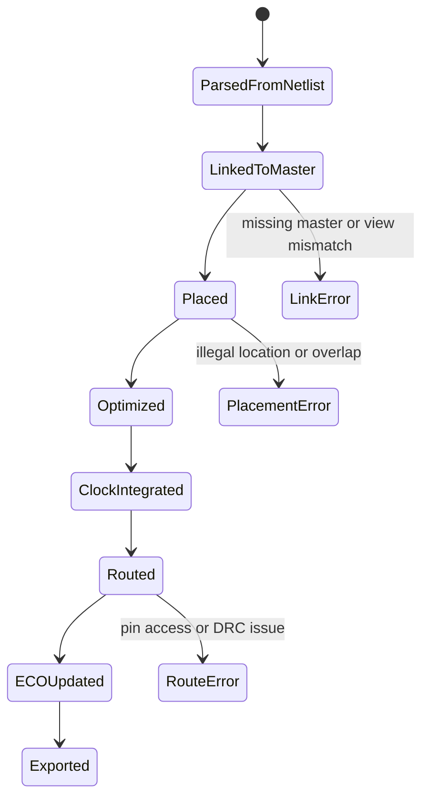
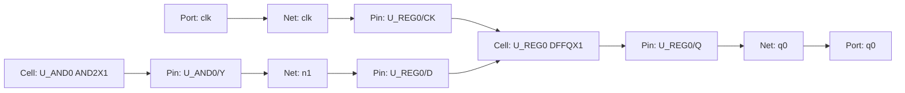
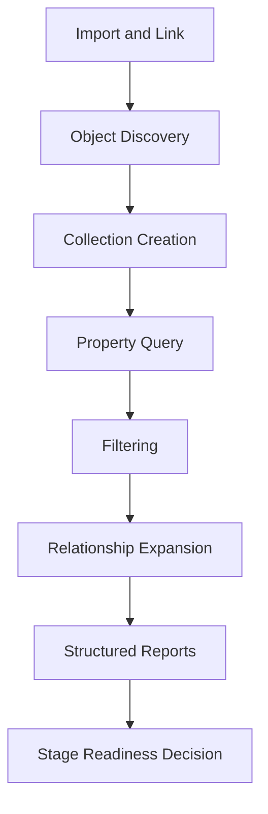
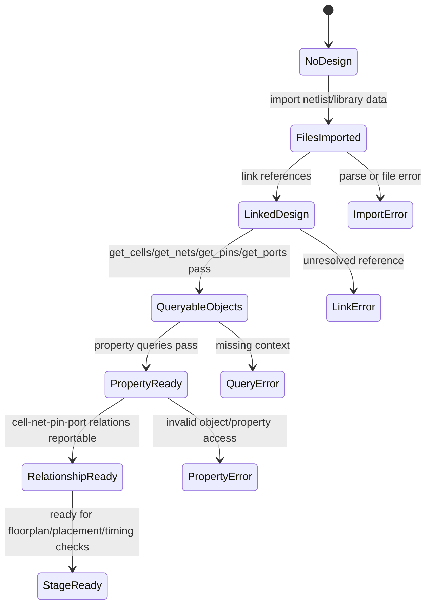

# 11. Design Object Model: Why Cell, Net, Pin, and Port Are the Fundamental Units of Backend Flow Engineering

Author: Darren H. Chen

Demo: `LAY-BE-11_design_object_model`

Tags: `Backend Flow`, `EDA`, `Tcl`, `Design Object Model`, `Cell`, `Net`, `Pin`, `Port`, `Object Query`, `Engineering Flow`

---

## 1. From Imported Files to an Internal Design World

After design import and link are completed, a backend EDA tool no longer sees the design as a group of disconnected files.

The input files may still look simple from the outside:

```text
Verilog netlist
LEF abstracts
Liberty timing and power libraries
DEF floorplan or placement state
SDC constraints
technology and routing rules
optional parasitic or layout data
```

However, the tool does not perform placement, timing analysis, routing, ECO, and reporting directly on raw text files. It parses those files, binds their references, creates internal database objects, attaches properties to those objects, and then runs each backend stage on top of that object graph.

This is the point where backend flow engineering starts to become different from ordinary script execution.

A script that only calls commands is still shallow. A flow that understands the design object model can inspect the database, verify stage preconditions, detect abnormal states, generate structured reports, and explain why a later physical implementation stage behaves the way it does.

The most fundamental objects in that database are:

```text
cell
net
pin
port
```

These four object classes form the lowest-level logical connectivity model used by later physical and timing engines. Floorplan, placement, timing analysis, CTS, routing, ECO, and handoff reporting all depend on them.

This article explains why `cell`, `net`, `pin`, and `port` are the basic engineering units of a backend flow, how they relate to each other, how they evolve across the implementation stages, and how Demo 11 can be used to validate that the design has truly entered an object-queryable database state.

---

## 2. The Key Shift: Files Are Inputs, Objects Are the Working Model

A backend run starts with files, but it cannot remain at the file level.

A Verilog line such as:

```verilog
DFFQX1 U_REG0 (.D(n1), .CK(clk), .Q(q0));
```

must eventually become several database objects:

```text
instance cell : U_REG0
reference     : DFFQX1
pins          : U_REG0/D, U_REG0/CK, U_REG0/Q
nets          : n1, clk, q0
connections   : U_REG0/D -> n1
                U_REG0/CK -> clk
                U_REG0/Q -> q0
```

After library binding, the tool should know more:

```text
DFFQX1 exists in the project library
DFFQX1 has a physical abstract from LEF
DFFQX1 has timing arcs and constraints from Liberty
U_REG0 is an instance of DFFQX1
U_REG0/CK is a clock-related pin
U_REG0/D and U_REG0/Q participate in timing paths
```

After physical stages, the same object becomes even richer:

```text
U_REG0 has a placement location
U_REG0 has an orientation
U_REG0 may be fixed, movable, sized, cloned, or replaced
its pins have physical access information
its connected nets may have estimated or extracted parasitics
```

This is the fundamental transformation:

```text
file syntax -> parsed records -> database objects -> properties -> stage reports
```

A backend flow that understands this transformation becomes object-driven rather than file-driven.

---

## 3. Object Model Architecture

A simplified backend object model can be shown as follows:



The important point is that the backend tool is not merely reading files. It is creating a connected database.

Once the database exists, Tcl-level queries are no longer just string matching operations. Commands such as:

```tcl
get_cells *
get_nets *
get_pins *
get_ports *
get_property <object> <property_name>
report_property <object>
```

are database queries.

The output of one query can become the input of another command. This is why collections and object handles matter so much in backend engineering.

---

## 4. Name Is Not the Same as Object

One of the most important concepts in backend Tcl scripting is this:

```text
A name is only an identifier.
An object is a database entity.
```

For example:

```text
U_REG0
clk
U_REG0/CK
q0
```

These strings may identify objects, but the objects contain much more information than their names.

A cell object may have:

```text
name
reference library cell
hierarchy path
placement status
location
orientation
area
fixed or movable flag
connected pins
stage-specific properties
```

A net object may have:

```text
name
usage type
connected pins
driver and load relation
fanout
routing status
wire geometry
estimated or extracted capacitance
clock or signal classification
```

A pin object may have:

```text
name
owner cell
direction
connected net
physical pin geometry
timing role
capacitance
transition
arrival and required time
```

A port object may have:

```text
name
direction
boundary relation
connected net
IO delay information
physical IO location
external drive or load model
```

If a script treats all of these as plain strings, it loses the database semantics. If a script keeps them as objects or collections, it can continue to query, filter, report, compare, and hand off structured information.

This is the difference between text processing and backend flow engineering.

---

## 5. Cell Objects: Instance-Level Units of Implementation

A `cell` in backend implementation usually refers to an instantiated design object. It is important to distinguish it from a library cell or master cell.

| Concept | Meaning | Typical Source | Engineering Role |
|---|---|---|---|
| Library cell / master cell | A reusable cell definition such as `INVX1` or `DFFQX1` | LEF, Liberty, physical library | Describes what this cell type is |
| Instance cell | A concrete instance such as `U_REG0` | Verilog netlist | Describes where and how a cell type is used in the current design |

A library cell answers questions such as:

```text
What is the cell function?
What pins does it have?
What is its cell size?
What timing arcs are defined?
Can it be used for optimization?
Does it have physical abstract information?
```

An instance cell answers different questions:

```text
Where is this instance located?
Which nets are connected to its pins?
Is it fixed or movable?
Is it sequential or combinational?
Is it part of a timing-critical path?
Was it inserted, resized, cloned, or replaced during optimization?
```

The backend stages operate heavily on instance cells:

```text
placement moves cells
optimization resizes or replaces cells
CTS inserts clock buffer cells
ECO modifies or inserts cells
routing connects pins belonging to cells
reports summarize cell usage, area, utilization, and state
```

A cell object is therefore not just a symbol from the netlist. It is an implementation object.

### Cell Object Lifecycle



This lifecycle shows why cell objects must be queryable after import and link. If a flow cannot reliably query cells, it cannot reliably verify later stages.

---

## 6. Net Objects: Connectivity, Timing Propagation, and Physical Routing

A `net` is the connection object in the design database.

At the logical level, a net connects drivers and loads. At the physical level, the same net becomes route guides, wire segments, vias, shielding structures, or special routing geometry. At the timing level, it contributes delay, slew, capacitance, coupling, and path behavior.

This makes net objects especially important.

A net can be viewed through several layers:

| Layer | What the Net Represents | Typical Questions |
|---|---|---|
| Logical connectivity | Driver/load relationship | Who drives this net? Which pins are loads? |
| Timing model | Delay and capacitance path segment | What is the transition? What is the net delay? |
| Placement estimation | Wirelength and congestion driver | Is this net long? Does it cross congested regions? |
| Routing object | Physical wires and vias | Has this net been routed? On which layers? |
| Signoff object | Extracted electrical network | What is the final RC? Are there antenna or DRC risks? |

A clock net, reset net, scan net, power net, and ordinary signal net may all be represented as nets, but their engineering behavior is very different.

A robust backend flow therefore needs net classification.

Typical net categories include:

```text
signal net
clock net
reset net
scan net
power net
ground net
special net
high-fanout net
critical timing net
```

A net object is the bridge between connectivity and implementation. If a flow cannot query nets and their connected pins, it cannot reliably explain timing paths, route failures, scan chain problems, fanout issues, or ECO impact.

---

## 7. Pin Objects: The Interface Between Cells and Nets

A `pin` is the connection interface between a cell and a net.

In many backend problems, the root cause eventually lands on a pin:

```text
The route cannot access a pin.
The timing path starts or ends at a pin.
The clock tree did not recognize a sink pin.
The load capacitance on a pin is too high.
The transition at a pin violates constraints.
The pin name in the netlist does not match the library view.
```

A pin has three simultaneous meanings.

### Logical Meaning

At the logical level, a pin has direction and function:

```text
input
output
inout
clock
reset
scan enable
data
```

### Physical Meaning

At the physical level, a pin has geometry:

```text
layer
shape
access point
obstruction relation
pin accessibility
```

### Timing Meaning

At the timing level, a pin is a node in the timing graph:

```text
arrival time
required time
slack
transition
capacitance
timing arc source or sink
```

This is why pin objects are more detailed than they first appear.

A timing report is often pin-based. A routing failure is often pin-access based. A clock tree is sink-pin based. A library mismatch is often pin-name based. A constraint binding failure may be port or pin based.

Therefore, a design object model demo should not stop at `get_cells`. It must also query pins and their connected nets.

---

## 8. Port Objects: Boundary Interfaces of the Current Design

A `port` is a boundary object of the current design.

A port is not the same as an internal cell pin. A pin usually belongs to an instance cell. A port belongs to the design boundary.

Examples include:

```text
clk
rst_n
scan_en
data_in[0]
data_out[0]
```

Ports matter because they connect the internal database to the external design context.

They are often referenced by:

```text
SDC constraints
input delay constraints
output delay constraints
external drive/load assumptions
IO placement
pad or bump connection planning
top-level DEF or GDS handoff
```

If a port is not correctly recognized, many downstream issues can appear:

```text
clock constraint cannot bind to the design
input delay is not applied
output delay is not applied
IO placement cannot be verified
top-level connectivity becomes ambiguous
exported boundary information is incomplete
```

A port is therefore the boundary anchor of the design database.

---

## 9. The Fundamental Relationship: Port -> Net -> Pin -> Cell

The four basic object types form a connectivity graph.



This graph is the foundation of backend reasoning.

A timing path walks through cells, pins, and nets. A placement engine moves cells but evaluates wirelength through nets. A router connects nets through pin geometries. CTS traces clock roots to sink pins. ECO changes cells and updates net/pin relations.

The flow may look like a sequence of commands, but the real subject of the flow is this object graph.

---

## 10. Collections: Object Sets, Not Plain String Lists

Many backend Tcl interfaces return collections or object lists.

A collection is not always the same as a plain Tcl list. Depending on the tool, it may be an internal object set, an object handle, or a special list-like structure.

For example:

```tcl
set all_cells [get_cells *]
set all_nets  [get_nets *]
set all_ports [get_ports *]
```

These variables should be treated as object collections, not simply as strings.

The reason is practical: a collection can often be passed directly into other commands:

```tcl
report_property $all_cells
get_pins -of_objects $all_cells
filter_collection $all_cells "is_sequential == true"
```

The exact command names differ by tool, but the concept is stable:

```text
query object collection
filter object collection
iterate object collection
report object collection
use object collection as input to another stage
```

This collection pipeline is a major part of backend scripting quality.

A fragile script does this:

```text
extract names as strings
manually parse them
reconstruct names later
hope the hierarchy and escaping rules still work
```

A robust script does this:

```text
query objects
keep them as objects or collections
filter by properties
report structured results
pass object sets to the next command
```

---

## 11. Properties: The State Layer of the Object Model

Objects become useful when their properties can be queried.

A cell name alone is not enough. The flow often needs to know whether the cell is sequential, fixed, macro-like, placed, optimized, or connected to a critical net.

A net name alone is not enough. The flow may need to know its fanout, usage type, route status, capacitance, or clock classification.

A pin name alone is not enough. The flow may need direction, owner, connected net, timing role, or physical accessibility.

Properties turn objects into stateful engineering entities.

| Object | Typical Properties | Engineering Use |
|---|---|---|
| Cell | reference name, location, orientation, fixed status, area, sequential flag | placement, utilization, ECO, optimization |
| Net | fanout, usage, driver, route status, capacitance | timing, routing, congestion, high-fanout analysis |
| Pin | direction, owner, connected net, capacitance, transition, timing role | STA, CTS, routing, constraint binding |
| Port | direction, connected net, IO delay, location | top-level constraint and IO checks |

A good object model demo should therefore produce not only object lists but also property reports.

For Demo 11, useful report targets include:

```text
cell_summary.rpt
net_summary.rpt
pin_summary.rpt
port_summary.rpt
property_summary.rpt
object_relation_summary.rpt
```

These reports verify that objects are not only present but also meaningful.

---

## 12. Query Pipeline: From Object Discovery to Engineering Report

A mature object query flow follows a pipeline.



The flow starts by discovering objects:

```tcl
get_cells *
get_nets *
get_pins *
get_ports *
```

Then it queries properties:

```tcl
get_property <cell> <property_name>
report_property <cell>
```

Then it expands relationships:

```text
cell -> pins
pin  -> net
net  -> connected pins
port -> net
```

Finally, it writes reports that can be reviewed by engineers or used as stage gates.

This is a better model than directly jumping from import to placement. The object query layer proves that the design is understandable before it is physically modified.

---

## 13. Object Model Readiness State Machine

The readiness of the design object model can be represented as a state machine.



This state machine makes an important point:

```text
Import success is not enough.
Link success is not enough.
The design should also be queryable, property-readable, and relation-reportable.
```

Demo 11 should verify precisely this transition from linked design to queryable object model.

---

## 14. How the Object Model Supports Later Backend Stages

### 14.1 Floorplan

Floorplan operates on design boundaries, rows, macros, IO ports, blockages, and placement regions.

Even before detailed placement, it already needs object context:

```text
which objects are macros
which ports are top-level IOs
which cells are standard cells
which nets connect macro pins and ports
```

### 14.2 Placement

Placement mainly moves cell instances, but it cannot ignore nets and pins.

A placement engine needs to evaluate:

```text
cell size
cell legality
net connectivity
estimated wirelength
pin density
timing-critical connections
congestion pressure
```

Thus, placement is not merely a coordinate assignment problem. It is object-driven physical optimization.

### 14.3 Timing Analysis

Timing paths are built from pins, arcs, cells, and nets.

A timing report can be viewed as a traversal over the object graph:

```text
startpoint pin -> cell arc -> net -> load pin -> cell arc -> ... -> endpoint pin
```

Without a correct object model, timing analysis cannot be trusted.

### 14.4 Clock Tree Synthesis

CTS depends on clock definitions, clock nets, clock root pins, sink pins, clock buffer cells, and routing rules.

The clock network is an object subgraph, not just a signal name.

### 14.5 Routing

Routing consumes net objects and pin geometries.

It needs to know:

```text
which pins belong to each net
where the pin shapes are
which layers are legal
which blockages exist
which nets are special nets
which nets have non-default rules
```

Routing is therefore a physical realization of net and pin objects.

### 14.6 ECO

ECO modifies the object graph.

It may:

```text
insert cells
remove cells
replace cells
split nets
connect new pins
change routing
update timing context
```

A reliable ECO flow must know exactly which objects are changed and how those changes propagate.

---

## 15. Common Failure Patterns in Object Query Flows

| Failure Pattern | Symptom | Likely Cause | Engineering Response |
|---|---|---|---|
| Empty `get_cells *` result | No cell objects are returned | Design not imported or wrong context | Check import/link/top context |
| `get_nets *` returns only ports or few nets | Incomplete netlist or wrong scope | Current design/scope issue | Report current design and hierarchy |
| Pin query fails | Pins not recognized or object syntax mismatch | Unlinked design, invalid collection handling | Verify link and command syntax |
| Property query fails | Object exists but property access is wrong | Wrong property name or wrong object type | Use `list_property` before `get_property` |
| Port constraints do not bind | Port object names mismatch constraints | SDC name mismatch or top mismatch | Compare port summary with constraints |
| Hierarchical object not found | Simple name cannot resolve hierarchy | Scope or hierarchy path mismatch | Use full hierarchical name or scope-aware query |
| Selection query fails | GUI selection not available in batch context | Selection commands are mode-dependent | Avoid GUI-only selection in batch checks |

The important lesson is that a query failure is not just a Tcl problem. It often indicates a deeper database context problem.

---

## 16. Methodology: Build Object Checks Before Physical Stages

A backend flow becomes more maintainable when object checks are placed before high-impact physical stages.

A recommended stage gate is:

```text
1. import files
2. link design
3. query cells, nets, pins, and ports
4. query key properties
5. generate object relation reports
6. only then enter floorplan, placement, timing, or routing stages
```

This prevents a common failure mode:

```text
The flow jumps into placement even though object linkage is incomplete.
```

A minimal object readiness check should answer:

```text
Are cells present?
Are nets present?
Are pins present?
Are ports present?
Can basic properties be queried?
Can cell-to-pin and pin-to-net relations be reported?
Is the current top or current design unambiguous?
```

If these questions are not answered, later stages become difficult to debug.

---

## 17. Demo 11: Design Object Model

The goal of `LAY-BE-11_design_object_model` is not to run placement or routing. Its goal is to verify that a minimal linked design can be queried as an object database.

A recommended structure is:

```text
LAY-BE-11_design_object_model/
├─ data/
│  ├─ netlist/
│  │  └─ demo_top.v
│  ├─ lef/
│  │  └─ demo_stdcell.lef
│  └─ liberty/
│     └─ demo_stdcell.lib
├─ scripts/
│  ├─ run_object_model.csh
│  └─ clean.csh
├─ tcl/
│  ├─ 01_precheck_inputs.tcl
│  ├─ 02_import_and_link.tcl
│  ├─ 03_query_cells.tcl
│  ├─ 04_query_nets.tcl
│  ├─ 05_query_pins_ports.tcl
│  ├─ 06_query_properties.tcl
│  └─ 07_report_object_relations.tcl
├─ logs/
│  ├─ object_model.log
│  ├─ object_model.cmd.log
│  └─ object_model.sum.log
├─ reports/
│  ├─ cell_summary.rpt
│  ├─ net_summary.rpt
│  ├─ pin_summary.rpt
│  ├─ port_summary.rpt
│  ├─ property_summary.rpt
│  └─ object_relation_summary.rpt
└─ README.md
```

The demo should validate:

```text
library input exists
netlist input exists
import/link stage completes
cell query returns expected objects
net query returns expected objects
pin query returns expected objects
port query returns expected objects
basic property query works for at least one object type
cell-net-pin-port relationship can be summarized
```

---

## 18. Demo 11 Input and Output Model

| Category | Input | Expected Use |
|---|---|---|
| Netlist | `demo_top.v` | Creates module, cell, net, pin, and port objects |
| LEF | `demo_stdcell.lef` | Provides physical abstract for library cells |
| Liberty | `demo_stdcell.lib` | Provides logic, pin direction, timing/power semantics |
| Tcl scripts | object query scripts | Define staged object queries and report generation |
| Shell wrapper | run script | Fixes environment, log paths, and run entry |

Expected outputs:

| Report | Purpose |
|---|---|
| `cell_summary.rpt` | Lists cell objects and key attributes |
| `net_summary.rpt` | Lists net objects and connection statistics |
| `pin_summary.rpt` | Lists pin objects and ownership/connection context |
| `port_summary.rpt` | Lists design boundary objects |
| `property_summary.rpt` | Confirms object properties are queryable |
| `object_relation_summary.rpt` | Shows the relation graph between cells, nets, pins, and ports |

The best success criterion is not merely that the tool exits without fatal errors. The stronger criterion is:

```text
The linked design is queryable as a structured object graph.
```

---

## 19. A Generic Tcl Query Pattern

The exact command syntax depends on the EDA tool. The following pattern is intentionally generic.

```tcl
# ------------------------------------------------------------
# Query basic objects
# ------------------------------------------------------------
set cells [get_cells *]
set nets  [get_nets *]
set pins  [get_pins *]
set ports [get_ports *]

# ------------------------------------------------------------
# Report object counts
# ------------------------------------------------------------
puts "CELLS = $cells"
puts "NETS  = $nets"
puts "PINS  = $pins"
puts "PORTS = $ports"

# ------------------------------------------------------------
# Query properties only after confirming object type and support
# ------------------------------------------------------------
# Example pattern:
#   list_property <object>
#   get_property <object> <property_name>
#   report_property <object>
```

A robust script should not assume that every property name exists in every tool mode. A safer pattern is:

```text
first discover available properties
then query selected properties
then write failures into a report instead of silently ignoring them
```

This matters because property names and object classes may vary across tools and versions.

---

## 20. Batch Mode vs Interactive Selection

Object selection commands can be useful in GUI-based debug, but they may not be reliable in batch-mode demos.

For example, commands that depend on the current GUI selection may fail when no layout window or active selection context exists.

A backend flow intended for repeatable runs should prefer explicit queries:

```text
get_cells <pattern>
get_nets <pattern>
get_pins <pattern>
get_ports <pattern>
```

rather than implicit GUI selection state.

Interactive selection is valuable for debug, but batch reports should be based on explicit object queries.

This distinction prevents the object model demo from depending on hidden UI state.

---

## 21. Engineering Checklist for Demo 11

Before running object queries:

```text
[ ] Tool path and working directory are fixed.
[ ] Log, command log, and summary log are enabled.
[ ] LEF and Liberty inputs are present.
[ ] Netlist input is present.
[ ] Top design name is explicit.
[ ] Import stage has completed.
[ ] Link stage has completed or produced a link report.
```

During object query:

```text
[ ] `get_cells` returns expected instances.
[ ] `get_nets` returns expected nets.
[ ] `get_pins` returns expected instance pins.
[ ] `get_ports` returns expected top-level ports.
[ ] Basic property discovery works.
[ ] Object relation report can be written.
```

After object query:

```text
[ ] Reports are generated under `reports/`.
[ ] Logs are generated under `logs/`.
[ ] Query failures are recorded, not ignored.
[ ] GUI-only behavior is not used as a batch pass/fail criterion.
[ ] The next stage is blocked if object readiness is not satisfied.
```

---

## 22. Engineering Takeaways

The design object model is the first layer where a backend design becomes truly inspectable.

The key engineering takeaways are:

1. Backend tools do not operate on raw files after import; they operate on design database objects.
2. `cell`, `net`, `pin`, and `port` form the basic connectivity graph of the design.
3. A name is not the same as an object; object properties and relations carry the real engineering meaning.
4. Collections should be treated as object sets, not plain text lists.
5. Property queries transform objects into reportable state.
6. Physical implementation stages are object transformations over this graph.
7. Object readiness should be checked before floorplan, placement, timing analysis, CTS, routing, and ECO.
8. A structured object summary is one of the best early indicators that import and link have produced a usable design database.

---

## 23. Conclusion

`cell`, `net`, `pin`, and `port` are not just convenient query names. They are the fundamental database units that allow a backend EDA tool to understand the design.

A file-level view can tell us what was provided as input.

An object-level view tells us what the tool actually understands.

That difference is essential.

A mature backend flow should therefore include an object model validation stage after import and link. This stage confirms that cells, nets, pins, and ports exist, that their properties are readable, and that their relationships can be reported.

Once this object graph is reliable, later stages such as floorplan, placement, timing analysis, CTS, routing, ECO, and handoff reporting become much easier to reason about.

The design object model is where backend flow changes from a sequence of commands into an inspectable engineering system.
