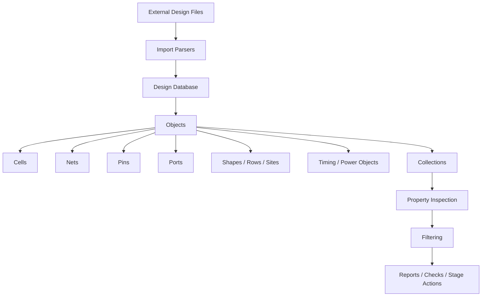
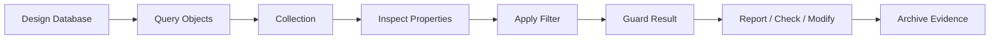
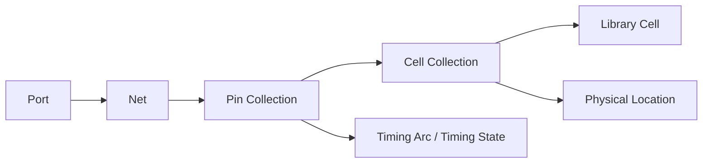
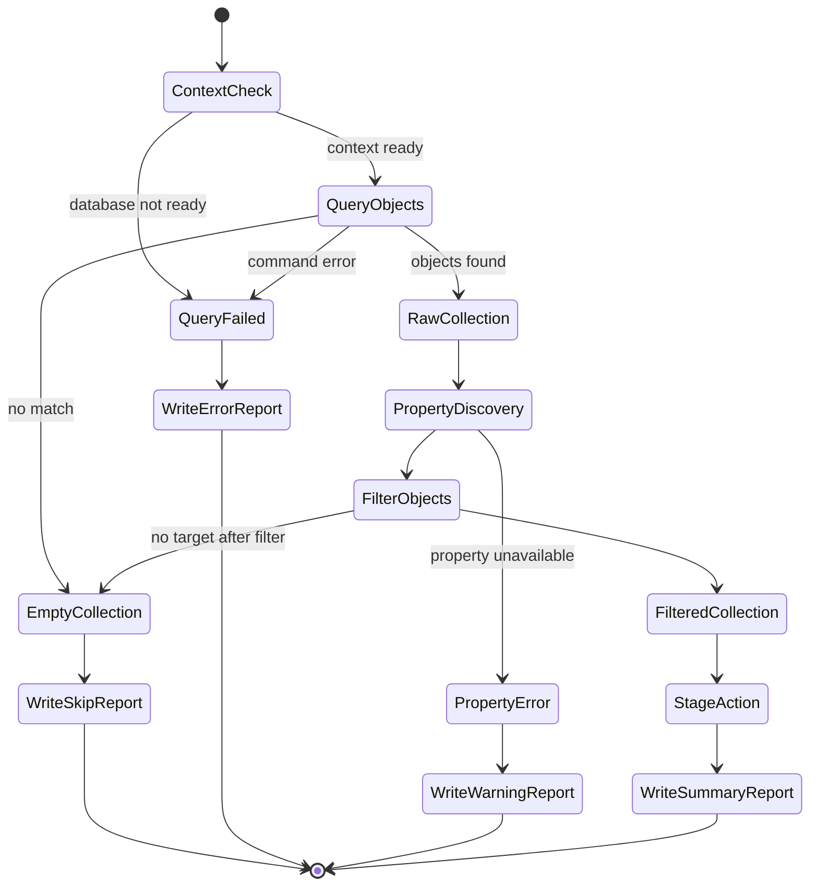

# 12. Collection, Property, and Filter: Why Object Query Capability Defines the Engineering Ceiling of Backend Scripts

Author: Darren H. Chen  
Demo: `LAY-BE-12_collection_property_filter`  
Tags: Backend Flow, EDA, Tcl, Collection, Property, Filter, Design Object Model, Object Query, Flow Engineering

In the previous article, we discussed the design object model and why `cell`, `net`, `pin`, and `port` form the basic units of backend flow engineering.

After design import and link, the EDA tool no longer sees the design as a group of text files. It sees a design database. That database contains objects, relationships, properties, physical states, timing states, hierarchy states, and tool-specific metadata.

At that point, the central question changes.

It is no longer:

```text
Can the tool read the design?
```

It becomes:

```text
Can the script reliably find the right objects, understand their state, filter them by engineering intent, and generate reproducible reports or actions?
```

This is where three capabilities become fundamental:

```text
Collection
Property
Filter
```

They may look like small Tcl scripting features, but from a backend flow architecture point of view, they define whether a script is merely a command sequence or a real database-driven engineering layer.

A backend script that cannot build object collections is forced to rely on hard-coded names.

A backend script that cannot inspect properties is blind to design state.

A backend script that cannot filter objects is unable to turn engineering rules into repeatable object selection.

That is why Collection / Property / Filter is not a minor scripting topic. It is one of the most important boundaries between simple tool usage and scalable backend flow engineering.

---

## 1. The Real Problem: Backend Designs Are Too Large for Name-Based Thinking

In a tiny demo design, it is easy to write scripts like this:

```tcl
get_cells U1
get_nets clk
get_pins U1/A
get_ports data_in
```

This works when the target object is known by name.

But real backend tasks rarely ask only for one known object.

They ask questions such as:

```text
Which cells are still unplaced?
Which macros are fixed?
Which nets are high-fanout nets?
Which pins are connected to clock nets?
Which cells belong to a given hierarchy?
Which ports have missing constraints?
Which objects are on timing-critical paths?
Which cells are sequential?
Which nets should be excluded from regular signal routing checks?
Which physical objects violate a stage-specific rule?
```

These are not pure name-matching questions.

They are database questions.

A name tells us how an object is identified. It does not tell us whether the object is placed, fixed, sequential, clock-related, routed, constrained, timing-critical, or physically reachable.

For a backend script to answer these questions, it needs a way to:

```text
query many objects,
inspect their state,
apply engineering conditions,
produce a smaller target set,
then report or act on that target set.
```

This is exactly the role of Collection / Property / Filter.

---

## 2. From Text Files to Queryable Database Objects

Before backend import, the design exists mainly as external data:

```text
Verilog netlist
LEF
Liberty
DEF
SDC
UPF
GDS/OASIS
parasitic files
```

After import and link, these inputs are transformed into internal objects:

| External source | Internal object examples | Main meaning |
|---|---|---|
| Verilog | module, instance, net, port | logical connectivity |
| LEF | macro, site, row, layer, pin shape | physical abstract |
| Liberty | library cell, timing arc, pin direction | timing and power model |
| DEF | placed component, track, blockage, route | physical implementation state |
| SDC | clock, path exception, delay constraint | timing constraint context |
| UPF/CPF | power domain, supply net, isolation strategy | power intent context |
| GDS/OASIS | layout geometry, detailed cell view | final physical view |

Once this conversion happens, scripts should no longer treat the design as plain text. They should operate on the database object model.

A simplified architecture looks like this:



The important transition is:

```text
file content -> database objects -> object collections -> filtered engineering targets
```

This transition is the foundation of mature backend scripting.

---

## 3. What Is a Collection?

A collection is a set of database objects returned by an object query.

For example, the following Tcl-style commands are representative of common backend tool interfaces:

```tcl
set all_cells [get_cells *]
set all_nets  [get_nets *]
set all_pins  [get_pins *]
set all_ports [get_ports *]
```

The returned values should not be treated as ordinary text lists without thought.

In many EDA tools, a collection may contain object handles or internal references. The display name may look like a string, but the value is backed by database identity.

This distinction is important.

A cell object may have:

```text
object identity
full hierarchical name
reference library cell
placement location
orientation
fixed status
area
physical status
timing relevance
custom properties
```

A net object may have:

```text
object identity
net name
usage type
driver pins
load pins
routing status
fanout
capacitance
clock/power/signal classification
```

A pin object may have:

```text
object identity
owner cell or port
direction
connected net
physical shape
timing role
capacitance
transition
arrival/required/slack information
```

A collection is therefore not just a textual convenience. It is a database-level object set.

That is why a mature script should use collection-aware operations whenever possible.

---

## 4. What Is a Property?

A property is an observable attribute of an object.

If a collection answers:

```text
Which objects are under consideration?
```

then properties answer:

```text
What is the current state of each object?
```

For example, a cell may expose properties such as:

```text
name
full_name
ref_name
is_macro
is_sequential
is_fixed
is_placed
location
orientation
area
dont_touch
```

A net may expose:

```text
name
usage
fanout
is_clock
is_power
is_ground
route_status
total_capacitance
driver_count
load_count
```

A pin may expose:

```text
name
direction
owner
net
is_clock_pin
capacitance
transition
arrival_time
required_time
slack
layer
location
```

A port may expose:

```text
name
direction
connected_net
input_delay
output_delay
physical_location
constraint_status
```

Properties are the observable layer of the design database.

Without properties, a script can only know that objects exist. With properties, the script can understand the engineering state of those objects.

This is the difference between:

```text
I found 100 cells.
```

and:

```text
I found 100 cells, 12 of them are macros, 6 are fixed, 31 are sequential, and 4 are currently unplaced.
```

---

## 5. What Is a Filter?

A filter applies a condition to a collection and returns a smaller collection.

Conceptually:

```text
FilteredCollection = Filter(Collection, Condition)
```

The condition may use:

```text
object properties
object type
object name
hierarchy path
connectivity relation
physical state
timing state
power state
stage context
```

For example, representative filter goals include:

```text
all macro cells
all fixed instances
all unplaced cells
all clock nets
all power/ground nets
all input ports
all sequential cells
all nets above a fanout threshold
all pins belonging to a given hierarchy
all objects with missing physical state
```

The key point is that filtering transforms engineering judgment into executable conditions.

A senior engineer may say:

```text
Do not move fixed macros.
Exclude power and ground nets from normal signal checks.
Report high-fanout nets separately.
Check all unplaced standard cells after placement.
Focus on sequential cells in the clock domain.
```

In a database-driven script, these statements become filters.

This is one of the most important steps in turning engineering knowledge into a reusable flow.

---

## 6. The Query Pipeline: From Database to Engineering Target

A robust object query usually follows a pipeline.



Each stage has a different purpose:

| Stage | Purpose | Common failure if missing |
|---|---|---|
| Query objects | Get the initial object set | script relies on hard-coded names |
| Build collection | Keep objects as database entities | object identity is lost |
| Inspect properties | Understand object state | script acts blindly |
| Apply filter | Select engineering target | script handles too much or too little |
| Guard result | handle empty/error/type cases | false failures or silent skips |
| Report/check/modify | perform the intended stage action | no stable output |
| Archive evidence | preserve result for review | no reproducible diagnosis |

This pipeline is the basic structure behind many reliable backend Tcl scripts.

The script should not jump directly from a name pattern to a high-impact operation. It should first query, inspect, filter, guard, and report.

---

## 7. Name, Object, and Property Must Not Be Confused

One of the most common mistakes in backend scripting is confusing three different concepts:

```text
name
object
property
```

They are related, but not the same.

| Concept | Meaning | Example | Risk if confused |
|---|---|---|---|
| Name | textual identifier | `U123`, `clk`, `top/u1/U2` | hierarchy, escaping, ambiguity |
| Object | database entity | cell object, net object, pin object | session-dependent identity |
| Property | observable state | `is_fixed`, `ref_name`, `fanout` | type/context dependency |

A name is how an object is referred to.

An object is what the database operates on.

A property is what describes the object's current state.

A script that treats all three as strings may work on a toy design, but it becomes fragile on real designs.

Typical risks include:

```text
hierarchical names are truncated,
bus names are escaped incorrectly,
wildcard patterns match unintended objects,
same local names exist under different hierarchy scopes,
object handles are converted into display names too early,
properties are queried on the wrong object type.
```

A better rule is:

```text
Use names to find objects.
Keep objects as collections.
Use properties to make engineering decisions.
```

---

## 8. Collection Is Not Always a Normal Tcl List

Many EDA tools expose collection-like values that resemble Tcl lists but are not identical to ordinary Tcl lists.

This matters because standard Tcl operations may not preserve object identity.

For example, this may look natural:

```tcl
set cells [get_cells *]
foreach c $cells {
    puts $c
}
```

But in some tools, a tool-provided iterator is safer:

```tcl
foreach_in_collection c $cells {
    # query object properties here
}
```

The exact API varies by tool, but the methodology is stable:

```text
Respect the tool's collection abstraction.
Do not flatten objects into strings too early.
Use collection-aware iteration and filtering when available.
```

The moment a script converts database objects into plain names, it may lose access to:

```text
object type
hierarchy identity
internal database handle
context-specific property access
safe command chaining
```

For report generation, names are useful. For engineering operations, object identity is usually more valuable.

---

## 9. Property Discovery Comes Before Property-Based Filtering

A mature script should not guess property names.

Before writing a filter, first inspect what properties are available on representative objects.

A typical exploration flow is:

```tcl
set one_cell [lindex [get_cells *] 0]
list_property $one_cell
report_property $one_cell
```

Then confirm the correct property names and value conventions.

For example, a tool or design context may describe placement state using one of several possible properties:

```text
is_placed
placement_status
place_status
is_fixed
physical_status
location
```

Similarly, net usage may be expressed as:

```text
usage
net_type
is_clock
is_power
is_ground
signal_type
```

Property discovery is not optional. It prevents scripts from becoming a pile of assumptions.

The robust sequence is:

```text
query sample object
list available properties
confirm property meaning
write filter
validate filter result
archive report
```

This sequence should be part of the flow development process.

---

## 10. Empty Collection Is Not the Same as Query Failure

Backend scripts must distinguish at least three states:

```text
command failed
command succeeded and returned an empty collection
command succeeded and returned a non-empty collection
```

These states have different meanings.

Example:

```text
No macros found in a standard-cell-only block.
```

This may be perfectly valid.

But:

```text
get_cells failed because the design is not linked.
```

This is a flow error.

A reliable script should handle them differently:

| Result state | Meaning | Recommended behavior |
|---|---|---|
| Command failure | query mechanism or context failed | fail the stage or write error report |
| Empty collection | query succeeded, no matching object | write `EMPTY` or `SKIP` report |
| Non-empty collection | target objects found | continue with property/report/action |

This is a small detail, but it changes script quality significantly.

A weak script sees only:

```text
something was not found
```

A strong script distinguishes:

```text
the database was not ready,
the query condition matched nothing,
or the target set exists and is safe to process.
```

---

## 11. Type Awareness Is Required

Different object types expose different properties.

A cell property may not exist on a net.

A net property may not exist on a pin.

A port property may not exist on an internal pin.

Representative examples:

| Object type | Typical properties | Typical queries |
|---|---|---|
| Cell | `ref_name`, `is_macro`, `is_fixed`, `location` | placement, area, hierarchy |
| Net | `fanout`, `usage`, `route_status`, `capacitance` | connectivity, routing, signal class |
| Pin | `direction`, `net`, `owner`, `transition` | timing, connectivity, pin access |
| Port | `direction`, `connected_net`, `input_delay`, `output_delay` | IO constraints, boundary checks |
| Shape | `layer`, `bbox`, `purpose` | physical geometry checks |
| Violation | `rule_name`, `bbox`, `severity` | DRC/debug reporting |

A generic report procedure should either know the object type or branch by type.

For example:

```tcl
proc report_object_safe {obj} {
    set obj_type [get_object_type $obj]

    if {$obj_type == "cell"} {
        puts "CELL [get_property $obj name] [get_property $obj ref_name]"
    } elseif {$obj_type == "net"} {
        puts "NET [get_property $obj name] [get_property $obj fanout]"
    } elseif {$obj_type == "pin"} {
        puts "PIN [get_property $obj name] [get_property $obj direction]"
    } else {
        puts "UNSUPPORTED_OBJECT_TYPE $obj_type"
    }
}
```

The command names are illustrative. The engineering principle is universal:

```text
Do not assume one property vocabulary for all object types.
```

---

## 12. Object Relations Matter More Than Individual Objects

The backend database is not a bag of isolated objects. It is a graph.

Important relations include:

```text
cell owns pins
pin connects to net
net connects driver and load pins
port connects to boundary net
cell references library cell
instance belongs to hierarchy
pin belongs to timing arc
net owns route shapes
shape belongs to layer
object belongs to physical region
violation references geometry and rule
```

For many real tasks, the target object is found by walking these relations.

For example:

```text
Start from a clock port.
Find its connected net.
Find all load pins of that net.
Find the owning cells of those pins.
Classify sequential sinks and clock buffers.
Generate a clock connectivity summary.
```

Or:

```text
Start from high-fanout nets.
Find driver pins.
Find load cells.
Check whether repeated buffering exists.
Report fanout distribution by hierarchy.
```

This is not simple filtering anymore. It is graph traversal.

A backend script becomes powerful when it can move from one object type to another while preserving database identity.



This relation traversal is the basis of meaningful backend analysis.

---

## 13. From Engineering Rules to Filter Conditions

Backend engineering rules are often expressed in natural language:

```text
Do not move fixed macros.
Report all unplaced standard cells.
Exclude power nets from normal signal-net checks.
Highlight clock nets separately.
Check only cells under a selected hierarchy.
Find all ports without timing constraints.
Report high-fanout nets above a threshold.
```

The scripting task is to convert those rules into conditions.

| Engineering statement | Object query form |
|---|---|
| fixed macros must not move | filter cells where `is_macro == true && is_fixed == true` |
| unplaced cells after placement are suspicious | filter cells where `is_placed == false` |
| clock nets need separate handling | filter nets where `usage == clock` or `is_clock == true` |
| PG nets should be excluded from signal checks | filter nets where `usage != power && usage != ground` |
| unconstrained ports should be reported | filter ports where timing delay property is missing |
| high-fanout nets need a report | filter nets where `fanout > threshold` |
| hierarchy-specific objects should be isolated | filter by full hierarchical name or parent instance |

This conversion is a core flow engineering skill.

It turns human review knowledge into executable, reviewable, and repeatable database operations.

---

## 14. A Four-Layer Query Architecture

To avoid unreadable scripts, object query logic should be layered.

A practical architecture is:

```text
1. Primitive query layer
2. Property access layer
3. Filter rule layer
4. Stage action layer
```

### 14.1 Primitive Query Layer

This layer wraps tool-native object commands.

```tcl
proc q_all_cells {} {
    return [get_cells *]
}

proc q_all_nets {} {
    return [get_nets *]
}

proc q_all_ports {} {
    return [get_ports *]
}
```

### 14.2 Property Access Layer

This layer normalizes property access.

```tcl
proc obj_prop {obj prop_name default_value} {
    set rc [catch {
        set value [get_property $obj $prop_name]
    } msg]

    if {$rc != 0} {
        return $default_value
    }

    return $value
}
```

### 14.3 Filter Rule Layer

This layer expresses engineering predicates.

```tcl
proc is_macro_cell {cell} {
    return [expr {[obj_prop $cell is_macro false] == true}]
}

proc is_fixed_object {obj} {
    return [expr {[obj_prop $obj is_fixed false] == true}]
}

proc is_high_fanout_net {net threshold} {
    set fanout [obj_prop $net fanout 0]
    return [expr {$fanout > $threshold}]
}
```

### 14.4 Stage Action Layer

This layer performs reports, checks, or stage-specific operations.

```tcl
proc report_high_fanout_nets {threshold rpt_file} {
    set fp [open $rpt_file w]
    puts $fp "High Fanout Net Report"
    puts $fp "Threshold: $threshold"
    puts $fp ""

    foreach_in_collection n [q_all_nets] {
        if {[is_high_fanout_net $n $threshold]} {
            puts $fp "[get_property $n name] [obj_prop $n fanout 0]"
        }
    }

    close $fp
}
```

The exact syntax may vary across tools. The architecture should not.

This layering reduces duplicated filters, makes intent visible, and separates object discovery from stage action.

---

## 15. Query Lifecycle State Machine

A query should be treated as a small state machine.



This state machine prevents two common bad behaviors:

```text
silently doing nothing when a query fails,
or treating a valid empty collection as a fatal error.
```

A good backend script always knows which state it is in.

---

## 16. Common Failure Patterns

Collection / Property / Filter logic tends to fail in recognizable ways.

| Failure pattern | Symptom | Root cause | Better practice |
|---|---|---|---|
| Name-only scripting | works only for one design | hard-coded object names | use collection queries |
| Over-broad wildcard | too many objects selected | weak pattern | filter by property and type |
| Empty result treated as error | valid design fails | no empty-collection handling | distinguish empty from failure |
| Query failure ignored | later stages fail mysteriously | no `catch` or status guard | write query error report |
| Wrong property on wrong type | property query fails | no type awareness | branch by object type |
| String conversion too early | object context lost | collection flattened to names | preserve object collection |
| Hidden hierarchy issue | missing objects | scope/current context wrong | record current design/scope |
| Unarchived query result | no evidence | report not written | always write summary report |

These patterns are not syntax issues. They are flow engineering issues.

---

## 17. Demo 12: What Should Be Verified

`LAY-BE-12_collection_property_filter` should not attempt full placement or routing.

Its purpose is to verify the object query layer.

The demo should answer these questions:

```text
Can the tool query cell/net/pin/port collections?
Can it list available properties on representative objects?
Can it read selected properties safely?
Can it apply simple filters?
Can it distinguish empty collections from query failures?
Can it traverse object relations?
Can it write structured reports?
```

A useful demo directory may look like this:

```text
LAY-BE-12_collection_property_filter/
├─ data/
│  ├─ netlist/
│  ├─ lef/
│  └─ liberty/
├─ scripts/
│  ├─ run_demo.csh
│  └─ clean.csh
├─ tcl/
│  ├─ 01_precheck_context.tcl
│  ├─ 02_query_inventory.tcl
│  ├─ 03_property_discovery.tcl
│  ├─ 04_filter_examples.tcl
│  ├─ 05_relation_traversal.tcl
│  └─ 06_report_summary.tcl
├─ logs/
│  ├─ object_query.log
│  ├─ object_query.cmd.log
│  └─ object_query.sum.log
├─ reports/
│  ├─ object_inventory.rpt
│  ├─ cell_property_summary.rpt
│  ├─ net_property_summary.rpt
│  ├─ pin_property_summary.rpt
│  ├─ port_property_summary.rpt
│  ├─ filter_result_summary.rpt
│  ├─ relation_traversal_summary.rpt
│  └─ empty_collection_check.rpt
└─ README.md
```

The reports are more important than the commands themselves.

They prove that the database query layer is observable and repeatable.

---

## 18. Recommended Report Structure

A strong object query demo should generate structured reports, not only terminal output.

| Report | Purpose |
|---|---|
| `object_inventory.rpt` | counts of cells, nets, pins, ports |
| `cell_property_summary.rpt` | representative cell properties |
| `net_property_summary.rpt` | net usage, fanout, route status |
| `pin_property_summary.rpt` | pin direction, owner, net relation |
| `port_property_summary.rpt` | port direction and boundary relation |
| `filter_result_summary.rpt` | filtered object groups and counts |
| `relation_traversal_summary.rpt` | port-net-pin-cell relationship examples |
| `empty_collection_check.rpt` | explicit handling of empty results |

A sample summary format:

```text
OBJECT_QUERY_SUMMARY
====================

cells.total              : 1284
cells.macro              : 4
cells.fixed              : 4
cells.unplaced           : 0

nets.total               : 1420
nets.clock               : 3
nets.power               : 2
nets.ground              : 2
nets.high_fanout         : 7

ports.total              : 96
ports.input              : 64
ports.output             : 32
ports.unconstrained      : 0

query.status             : PASS
filter.status            : PASS
empty_collection.status  : PASS
```

This kind of report turns object query capability into an auditable engineering asset.

---

## 19. Methodology: Query First, Then Act

A safe backend script should follow this method:

```text
1. Check context.
2. Query objects.
3. Inspect properties.
4. Apply filters.
5. Report target set.
6. Review or gate.
7. Perform action only after the target set is understood.
```

This method is especially important before high-impact operations such as:

```text
moving cells,
fixing or unfixing objects,
deleting routes,
changing net usage,
modifying constraints,
assigning NDR,
editing placement,
performing ECO changes.
```

A dangerous script says:

```text
find by name and immediately modify.
```

A better script says:

```text
query, filter, report, then modify under a clear condition.
```

This is how backend scripts become safer and easier to review.

---

## 20. Engineering Takeaways

Collection / Property / Filter provides the object query foundation of backend flow engineering.

The key lessons are:

```text
A collection is a database object set, not merely a string list.
A property describes object state and makes scripts state-aware.
A filter converts engineering intent into executable object selection.
Empty collection, query failure, and property failure must be separated.
Object type and current context must be explicit.
Object relations are often more important than individual names.
Reports turn query results into reviewable evidence.
```

The practical goal is not to write longer scripts.

The goal is to write scripts that can always answer:

```text
Which objects am I operating on?
Why were these objects selected?
What is their current state?
What report proves this selection?
What happens if the selection is empty?
What happens if the database is not ready?
```

When a backend script can answer these questions consistently, it has moved from command execution to database-driven engineering.

---

## 21. Conclusion

Collection / Property / Filter is one of the most important technical foundations of backend scripting.

Collection lets the script operate on database object sets.

Property lets the script observe object state.

Filter lets the script translate engineering rules into repeatable selection logic.

Together, they allow backend flow scripts to move beyond hard-coded names and become scalable, inspectable, and maintainable engineering components.

In backend flow engineering, the maturity of a script is not measured by how many commands it runs.

It is measured by how accurately it can identify the right objects, explain why they were selected, and preserve the result as evidence.

That is why object query capability defines the engineering ceiling of backend scripts.
