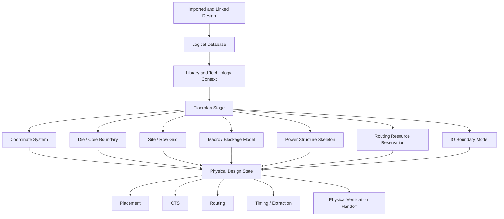
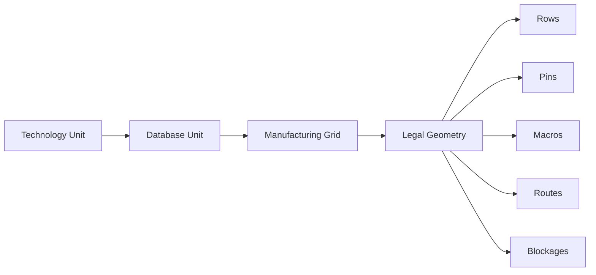
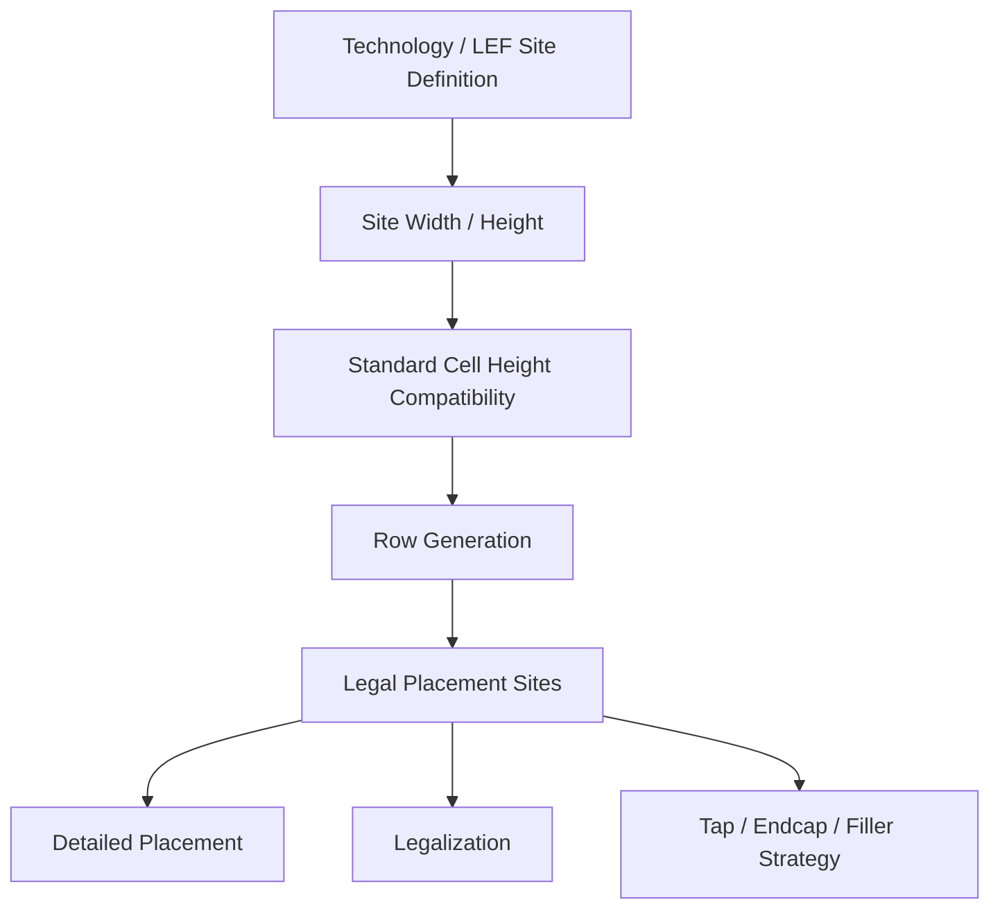
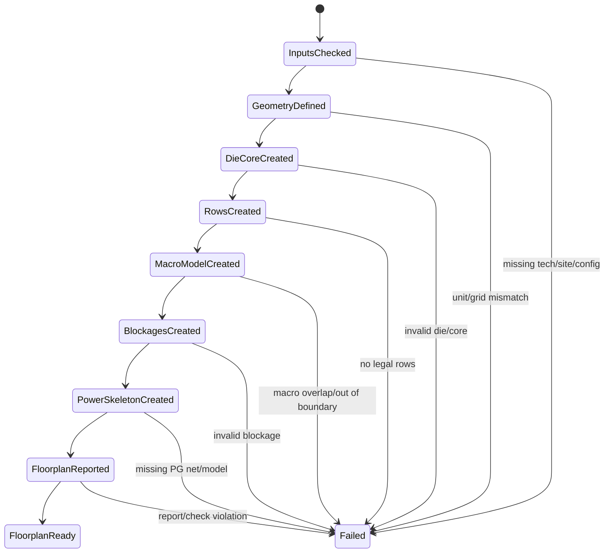
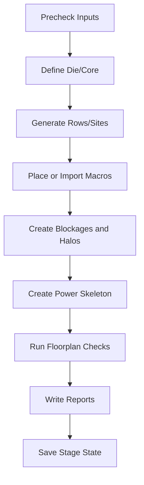

# 13. Floorplan: Why Backend Implementation Starts from Boundaries, Rows, Sites, and Power Structure

Author: Darren H. Chen  
Direction: Backend Flow Engineering / Physical Design / EDA Tool Engineering  
Demo: `LAY-BE-13_floorplan`  
Tags: `Backend Flow` `EDA` `Physical Design` `Floorplan` `Die` `Core` `Row` `Site` `Macro` `Power Structure` `Routing Resource`

Many engineers first understand physical implementation through placement.

That is natural. Placement is visually intuitive: standard cells are moved into legal positions, wirelength becomes shorter, timing may improve, and congestion maps begin to show where the design is difficult.

However, in a real backend flow, placement is not the first meaningful physical implementation step.

Before placement can become a valid optimization problem, the tool must already know the physical world in which placement is allowed to operate:

```text
Where is the die?
Where is the core?
Where can standard cells be placed?
Which sites are legal?
Which rows exist?
Where are macros fixed or constrained?
Which areas are blocked?
Where should power and ground structures live?
Which regions must be kept open for routing?
Which IO constraints define the design boundary?
```

Those questions are answered by floorplan.

Floorplan is not just a rectangle on the screen. It is the first physical state model of the backend database. It converts an imported and linked logical design into a physical design environment that placement, clock-tree synthesis, routing, timing analysis, power planning, and physical verification can all consume.

A practical way to describe it is:

```text
Placement optimizes objects inside a physical space.
Floorplan defines that physical space.
```

If the floorplan is weak, placement may still run, but the result will be hard to trust. Congestion may be caused by an unrealistic macro channel. Timing may be caused by an unfortunate block aspect ratio. Legalization may fail because rows and sites were wrong. Routing may fail because power structures consumed critical routing resources. DRC may explode because the basic grid, boundary, or blockage model was wrong.

That is why backend implementation should not be viewed as starting from placement. It starts from boundary, site, row, macro, blockage, power structure, and routing resource modeling.

---

## 1. The Role of Floorplan in the Backend Database

After design import and link, the tool understands logical connectivity and library references:

```text
instance -> master cell
pin      -> net
port     -> boundary signal
cell     -> library abstract
```

But this is still not enough for physical implementation.

The design database must also answer physical questions:

```text
Can this cell be placed?
Where can it be placed?
Which placement grid is legal?
Which physical region belongs to the core?
Where are fixed objects?
Where are routing blockages?
Where will power rails and straps be inserted?
How much usable area remains after macros and blockages?
```

Floorplan creates the first structured physical state that answers these questions.

A simplified backend database transition is:



This diagram highlights one important architectural point:

```text
Floorplan is not a visual decoration.
It is a database state consumed by almost every later stage.
```

---

## 2. Floorplan Is Not Just a Rectangle

A floorplan is often introduced as die size and core size.

That introduction is useful but incomplete.

A real floorplan contains multiple interacting object classes:

| Floorplan Element | What It Defines | Why It Matters |
|---|---|---|
| Coordinate system | Unit, origin, precision, manufacturing grid | All physical objects must use the same geometry language |
| Die boundary | Overall chip or block boundary | Defines the physical extent of the design |
| Core boundary | Main placement and logic region | Defines where standard cells and internal logic can live |
| Site | Basic legal placement unit | Defines the legal cell placement lattice |
| Row | Repeated site array | Defines where standard cells can be legalized |
| Macro | Large fixed or semi-fixed block | Drives channels, timing locality, and routing topology |
| Blockage | Restricted placement or routing area | Prevents illegal or undesirable object usage |
| IO guide / pin boundary | Boundary interface planning | Connects top-level ports to physical sides or regions |
| Power structure | Rings, straps, rails, power connectivity | Provides supply infrastructure and consumes routing resource |
| Routing channel | Reserved signal/clock routing space | Determines whether nets can physically pass through the design |
| Utilization target | Area pressure model | Influences density, congestion, timing, and ECO headroom |

From a tool-engineering point of view, floorplan is a container of physical constraints and legal regions.

From a physical-design point of view, floorplan is a negotiation between area, routability, timing, power integrity, hierarchy, IO relationship, and downstream signoff.

---

## 3. The First Layer: Coordinate System

Every physical object must eventually be represented in coordinates.

Examples include:

```text
cell location
macro boundary
pin shape
row origin
stripe geometry
routing blockage
placement blockage
route segment
via location
violation marker
```

Therefore, floorplan begins with a coordinate system.

A coordinate system includes:

```text
database unit
user unit
origin
manufacturing grid
precision
valid coordinate range
layer grid relationship
```

The dangerous part is that coordinate problems often do not look like coordinate problems at first.

They may appear later as:

```text
off-grid placement
unexpected DEF/GDS scaling
pin shape mismatch
route shape misalignment
massive DRC errors
macro boundary mismatch
via insertion failure
```

A simplified coordinate model looks like this:



The engineering rule is:

```text
Do not start placement until the geometric language is stable.
```

In a demo, coordinate checks should be visible in reports. The report should not merely say that floorplan was created. It should record the unit, boundary, site, row count, and basic geometry assumptions.

---

## 4. The Second Layer: Die and Core

Die and core are often shown as nested rectangles, but they have different meanings.

```text
Die  = external physical boundary of the chip or block.
Core = main internal implementation region for standard cells and internal logic.
```

A simple conceptual layout is:

```text
+------------------------------------------------------+
|                        DIE                           |
|                                                      |
|   IO / PAD / BOUNDARY / POWER RING RESERVED AREA     |
|                                                      |
|      +------------------------------------------+    |
|      |                  CORE                    |    |
|      |                                          |    |
|      |   standard-cell rows, macros, blockages  |    |
|      |   power straps, routing channels         |    |
|      |                                          |    |
|      +------------------------------------------+    |
|                                                      |
+------------------------------------------------------+
```

The distinction matters because different objects belong to different regions.

| Region | Typical Objects |
|---|---|
| Die boundary | seal ring, pad ring, top-level physical extent |
| Die-to-core margin | IO pins, pad structures, power ring, keepout |
| Core area | standard-cell rows, macros, placement blockages |
| Routing space | signal nets, clock routes, special routes |
| Reserved area | ECO space, decap, spare cells, physical keepout |

If die/core definition is wrong, later metrics become unreliable:

```text
core utilization may be wrong
row generation may be wrong
power ring may be misplaced
standard cells may be placed in illegal areas
IO constraints may not match physical reality
routing channels may be unintentionally blocked
```

The floorplan stage should therefore generate a `die_core_summary.rpt` or equivalent report that explicitly records:

```text
die lower-left / upper-right
core lower-left / upper-right
die area
core area
die-to-core margins
aspect ratio
target utilization
```

---

## 5. The Third Layer: Site and Row

Standard cells are not placed in arbitrary continuous space.

They are placed on a legal site grid.

A site is the basic placement unit defined by the technology and standard-cell library. A row is a repeated sequence of sites.

```text
site -> repeated site array -> row -> placement legal region
```

A conceptual row model is:

```text
Row Y = 100
+----+----+----+----+----+----+----+----+
| S0 | S1 | S2 | S3 | S4 | S5 | S6 | S7 |
+----+----+----+----+----+----+----+----+

A legal standard cell must align to site boundaries.
```

Rows define:

```text
where standard cells can sit
which orientation is legal
which cell height is legal
where power rails align
where legalizer can move cells
which regions are excluded by blockages or macros
```

A placement engine may spread cells globally, but detailed placement and legalization depend on rows.

Without rows, "placement" has no legality model.

A row can also carry implicit process/library assumptions:

```text
row height
site name
orientation
power rail polarity
multi-height support
well/tap/endcap relationship
placement region
```

A simplified site/row relationship is:



A robust floorplan stage should report:

```text
site name
site width / height
row count
row orientation pattern
row area
usable row area
blocked row area
multi-height row assumptions
```

---

## 6. Why Rows Are Not Just Geometry

A row looks like a geometric strip, but it is also a legality structure.

It connects multiple layers of backend modeling:

```text
standard-cell library
placement legalizer
power rail model
well/tap/endcap insertion
density analysis
multi-height cell support
```

For example, a standard cell can be placed only if:

```text
cell height matches row structure
cell width aligns with site grid
cell orientation is allowed
cell boundary does not overlap fixed objects
cell does not cross blocked regions
cell power rails align with row rail pattern
```

If rows are wrong, the symptoms may appear in later stages:

| Symptom | Possible Floorplan Root Cause |
|---|---|
| Many cells remain unplaced | Rows not generated or wrong site name |
| Legalization fails | Cell height/site mismatch |
| Unexpected overlaps | Row blockage/core boundary mismatch |
| Power rail issues | Row orientation or rail pattern mismatch |
| Tap/endcap insertion problems | Row structure inconsistent with library assumptions |
| Density report inaccurate | Usable row area incorrectly modeled |

The key principle is:

```text
Rows convert geometric area into legally usable placement capacity.
```

That is why floorplan quality cannot be judged only by die/core dimensions. Row quality is equally important.

---

## 7. The Fourth Layer: Utilization

Utilization is often introduced as:

```text
Utilization = standard cell area / core area
```

But practical utilization is more nuanced.

The denominator is not simply the rectangular core area. Many elements reduce effective placement capacity:

```text
macro area
placement blockages
routing blockages
power structures
halo / keepout
reserved ECO area
cell padding
congestion margin
spare-cell regions
physical-only cells
```

A more useful mental model is:

```text
Effective placement capacity =
    core area
  - fixed macro impact
  - hard placement blockage
  - reserved routing/power/halo space
  - ECO and congestion margin
```

Then:

```text
effective utilization =
    movable standard-cell area / effective placement capacity
```

The tradeoff is direct:

| Utilization Choice | Potential Benefit | Potential Risk |
|---|---|---|
| Too high | Smaller area | Congestion, poor timing, hard legalization, no ECO space |
| Too low | Easier placement/routing | Larger die, longer wires, larger clock tree |
| Balanced | Better closure margin | Requires realistic estimation |

Utilization is not just a number. It is a physical feasibility constraint.

A floorplan methodology should therefore ask:

```text
Is the utilization target based on total core area or effective row area?
Are macro halos included?
Are power straps considered?
Is routing margin reserved?
Is there enough space for buffers, hold fixing, and ECO?
```

A useful report should include both nominal and effective utilization.

---

## 8. The Fifth Layer: Macro and Blockage Model

Macros are not just large cells.

They reshape the entire physical problem.

A macro may:

```text
occupy a large fixed area
have fixed pin locations
block standard-cell placement
block routing layers
require keepout margin
need dedicated power connections
create routing channels around it
force timing paths into specific physical regions
```

A simple macro/channel model:

```text
+---------------------------------------------------+
|                     CORE                          |
|                                                   |
|   +------------+       channel       +---------+  |
|   |  MACRO A   |<------------------->| MACRO B |  |
|   |            |                     |         |  |
|   +------------+                     +---------+  |
|                                                   |
|       standard-cell placement region              |
|                                                   |
+---------------------------------------------------+
```

A poor macro placement can make the design difficult even if utilization looks reasonable.

Common macro-related failure modes:

| Macro Problem | Downstream Effect |
|---|---|
| Macro channel too narrow | Routing congestion and DRC repair loops |
| Macro too close to IO boundary | Difficult IO-to-core connectivity |
| Macro pins facing wrong direction | Long detours and timing degradation |
| Macro blocks central routing corridor | Global route overflow |
| Missing halo/keepout | Standard cells placed too close, causing routing/pin access issues |
| Macro power pins not planned | Late power connection issues |

Blockages are the mechanism used to restrict placement or routing behavior.

Typical blockage types include:

```text
hard placement blockage
soft placement blockage
routing blockage
macro halo / keepout
partial density blockage
power structure blockage
```

A robust floorplan does not simply place macros. It creates a macro/blockage model that downstream tools can understand.

---

## 9. The Sixth Layer: Power Structure

Power structure is often treated as a separate stage, but it is deeply tied to floorplan.

A power ring, stripe, rail, mesh, or macro power connection occupies physical space. It also consumes routing resources and influences IR/EM feasibility.

A basic power model may include:

```text
power/ground net names
core ring
vertical/horizontal straps
standard-cell rails
macro power connections
via arrays / via pillars
special routes
power switch structures
decap regions
```

A simplified view:

```text
+---------------------------------------------------+
|                  CORE RING                         |
|  +---------------------------------------------+  |
|  | |   |   |   |   vertical straps   |   |    | | |
|  | |---+---+---+---------------------+---+----| | |
|  | | standard-cell rails inside rows          | | |
|  | |---+---+---+---------------------+---+----| | |
|  | |   |   |   |                     |   |    | | |
|  +---------------------------------------------+  |
+---------------------------------------------------+
```

Power structure creates an important tradeoff:

| Power Planning Choice | Benefit | Risk |
|---|---|---|
| Stronger mesh / dense straps | Better IR/EM margin | More routing blockage |
| Sparse power structure | More signal routing resource | IR/EM risk |
| Early macro power planning | Stable integration | Requires macro-aware floorplan |
| Late power repair | Flexible initially | Expensive and disruptive later |

A floorplan should not assume that signal routing owns all routing resources. Power must be planned early enough so that placement and routing work inside a realistic resource model.

The floorplan report should include:

```text
power net names
ground net names
ring existence
stripe layer / width / pitch
macro power connection plan
standard-cell rail plan
estimated routing resource impact
```

---

## 10. The Seventh Layer: Routing Resource Reservation

Floorplan must leave room for routing.

This is especially important when the design contains macros, narrow channels, dense IO boundaries, or many power straps.

Routing needs resources in multiple forms:

```text
horizontal/vertical layer capacity
macro-to-macro channels
IO-to-core access
clock trunk corridors
power/signal coexistence regions
pin access space
global route capacity
detail route repair space
```

A design may have enough placement area but still fail routing.

For example:

```text
Standard cells fit inside the core.
However, macros divide the core into isolated islands.
Power stripes consume upper-layer tracks.
IO pins inject many nets into a narrow boundary region.
Clock trunks must cross the same congested channel.
```

This is a floorplan issue, not just a routing issue.

A routing-aware floorplan should check:

```text
macro channels
blockage density
IO pin concentration
power stripe resource usage
expected clock route corridors
critical-net physical distance
global route overflow after early estimation
```

The principle is:

```text
A legal placement region is not enough.
The design also needs routable connectivity space.
```

---

## 11. Floorplan as a State Machine

A floorplan stage should be treated as a controlled state transition, not as a set of loosely ordered commands.

A useful state machine is:



This state machine makes one methodology explicit:

```text
Do not enter placement until the floorplan reaches a reportable ready state.
```

---

## 12. Floorplan Data Model

A floorplan can be represented as a structured state object:

```text
FloorplanState = {
    coordinate_system,
    die_boundary,
    core_boundary,
    site_definition,
    row_array,
    macro_instances,
    macro_halo,
    placement_blockages,
    routing_blockages,
    io_guides,
    power_rings,
    power_straps,
    standard_cell_rails,
    utilization_targets,
    routing_resource_reservations,
    floorplan_reports
}
```

This model is useful because it makes floorplan auditable.

Instead of saying:

```text
The floorplan looks okay.
```

the flow can ask:

```text
Does the database contain rows?
Is the site name consistent with the library?
How much area is blocked?
What is the effective utilization?
Are macros inside the core?
Are power structures defined?
Are reports generated?
```

This is the difference between visual inspection and engineering review.

---

## 13. Floorplan Precheck Methodology

Before creating or modifying a floorplan, the flow should check input readiness.

Typical precheck items:

| Check | Purpose |
|---|---|
| Technology/library loaded | Ensure layers, sites, and cell abstracts are available |
| Top design linked | Ensure physical state is attached to the correct design |
| Site name available | Ensure row generation uses valid site |
| Die/core parameters defined | Avoid implicit or accidental geometry |
| Macro list known | Avoid placing rows through macros |
| PG net names defined | Prepare power structure creation |
| Report directory writable | Ensure floorplan evidence can be saved |
| Existing floorplan state known | Avoid accidental overwrite or mixed state |

A simplified precheck report may look like:

```text
[PASS] top design linked
[PASS] site CORE_SITE exists
[PASS] die/core configuration loaded
[PASS] report directory writable
[WARN] no macro instances found
[WARN] no power stripe configuration found
[PASS] floorplan can proceed
```

Precheck is important because floorplan commands often modify database state. Running them with wrong assumptions may create a corrupted physical state that is difficult to debug later.

---

## 14. Floorplan Execution Architecture

A maintainable floorplan stage should be split into sub-stages:

```text
01_floorplan_precheck
02_define_die_core
03_generate_rows
04_place_macros
05_create_blockages
06_create_power_structure
07_report_floorplan
08_save_floorplan_state
```

A staged architecture:



Each stage should have:

```text
explicit inputs
clear output reports
fail-fast rules for critical errors
warning policy for optional features
log and command trace
```

This turns floorplan from a one-time drawing operation into a reproducible engineering stage.

---

## 15. Floorplan Reports

Floorplan should not rely only on GUI screenshots.

A reportable floorplan should generate structured evidence:

| Report | Main Content |
|---|---|
| `floorplan_precheck.rpt` | Input readiness and blocking issues |
| `die_core_summary.rpt` | Die/core coordinates, area, margins, aspect ratio |
| `row_site_summary.rpt` | Site name, row count, row area, row orientation |
| `macro_summary.rpt` | Macro count, location, area, boundary status |
| `blockage_summary.rpt` | Placement/routing blockage area and type |
| `utilization_summary.rpt` | Nominal and effective utilization |
| `power_structure_summary.rpt` | PG nets, rings, straps, rails, macro power plan |
| `routing_channel_check.rpt` | Macro channel and routing resource checks |
| `floorplan_stage_summary.rpt` | Final stage status and next-stage readiness |

The purpose of reports is not documentation for its own sake.

The purpose is to create reviewable evidence:

```text
What physical world did the tool create?
Is that world legal?
Is that world large enough?
Is that world routable?
Is that world ready for placement?
```

---

## 16. Floorplan Failure Patterns

Many placement, routing, and timing problems are floorplan problems in disguise.

| Later Symptom | Possible Floorplan Root Cause |
|---|---|
| Placement cannot legalize | Missing/wrong rows, site mismatch, excessive effective utilization |
| High congestion near macros | Macro channel too narrow or missing blockage strategy |
| Clock routing detours | No reserved clock corridors, macros block central paths |
| IO timing poor | IO boundary too far from related logic |
| Power routing consumes signal tracks | Power stripe pitch/layer not balanced |
| Late IR/EM repair disrupts routing | Power skeleton under-designed |
| Many pin access violations | Macro/cell pin access not considered in floorplan |
| Export/PV mismatch | Geometry grid, layer, or boundary definitions inconsistent |
| ECO difficult | No spare area or local whitespace |

A good floorplan methodology prevents these issues early.

A weak floorplan pushes them into later stages where they become more expensive to fix.

---

## 17. Floorplan and Placement: The Correct Relationship

It is tempting to think that floorplan is preliminary and placement is the real optimization.

A more accurate relationship is:

```text
Floorplan defines the feasible space.
Placement optimizes inside that space.
```

If the feasible space is wrong, placement cannot rescue the design reliably.

For example:

```text
If two macros leave no routing channel, placement cannot create one.
If utilization is unrealistically high, legalization cannot invent area.
If IO pins are badly distributed, placement can only compensate with longer wires.
If power structures consume critical tracks, router must work around them.
```

Therefore, the correct methodology is:

```text
Space first.
Object optimization second.
Report and review before transition.
```

---

## 18. Demo 13: What the Demo Should Prove

`LAY-BE-13_floorplan` should not try to be a full tapeout flow.

Its purpose is to demonstrate the minimum floorplan state model.

The demo should verify:

```text
technology/site context is available
top design has been imported and linked
die/core boundary can be defined or reported
rows can be generated or inspected
utilization can be calculated
macro/blockage model can be represented
power/ground planning assumptions can be recorded
floorplan reports can be generated
placement readiness can be determined
```

Suggested demo inputs:

```text
data/lef/demo_stdcell.lef
data/liberty/demo_stdcell.lib
data/netlist/demo_top.v
config/floorplan_config.tcl
config/power_config.tcl
```

Suggested demo outputs:

```text
reports/floorplan_precheck.rpt
reports/die_core_summary.rpt
reports/row_site_summary.rpt
reports/macro_summary.rpt
reports/blockage_summary.rpt
reports/utilization_summary.rpt
reports/power_structure_summary.rpt
reports/floorplan_stage_summary.rpt
logs/LAY-BE-13_floorplan.log
logs/LAY-BE-13_floorplan.cmd.log
logs/LAY-BE-13_floorplan.sum.log
```

A concise demo readiness table:

| Item | Expected Evidence |
|---|---|
| Site recognized | Site name appears in row/site report |
| Die/core exists | Coordinates and area are reported |
| Rows exist | Row count greater than zero |
| Utilization computed | Nominal/effective utilization shown |
| Blockage model handled | Blockage summary generated |
| PG assumptions recorded | Power net and structure summary generated |
| Stage ready | Floorplan stage summary marks placement readiness |

---

## 19. Recommended Repository Structure

A GitHub-ready demo folder can be organized as:

```text
LAY-BE-13_floorplan/
├─ README.md
├─ data/
│  ├─ lef/
│  │  └─ demo_stdcell.lef
│  ├─ liberty/
│  │  └─ demo_stdcell.lib
│  └─ netlist/
│     └─ demo_top.v
├─ config/
│  ├─ floorplan_config.tcl
│  └─ power_config.tcl
├─ scripts/
│  ├─ run_demo.csh
│  └─ clean.csh
├─ tcl/
│  ├─ 01_precheck_floorplan.tcl
│  ├─ 02_define_die_core.tcl
│  ├─ 03_create_rows.tcl
│  ├─ 04_create_blockages.tcl
│  ├─ 05_record_power_structure.tcl
│  └─ 06_report_floorplan.tcl
├─ reports/
└─ logs/
```

The key design principle is independence:

```text
The demo should not rely on hidden project state.
It should define its inputs, configuration, logs, reports, and run entry explicitly.
```

---

## 20. Engineering Takeaways

Floorplan is the first real physical modeling stage in backend implementation.

It defines:

```text
coordinate system
die/core boundary
legal placement rows
site lattice
macro constraints
blockages and keepouts
utilization target
power/ground skeleton
routing resource assumptions
IO boundary relationship
```

Those objects are not isolated. They form the physical state that later stages consume.

The most important methodology is:

```text
Do not treat floorplan as a drawing step.
Treat it as the creation of a reportable physical database state.
```

A strong floorplan stage should be:

```text
explicit in inputs
controlled in state transitions
checked before placement
visible through reports
stable across reruns
reviewable by other engineers
```

Placement answers:

```text
Where should objects go?
```

Floorplan answers first:

```text
Where are objects allowed to go?
Which spaces must remain open?
Which physical structures already consume area and routing resources?
What constraints define the implementation world?
```

Without that answer, placement is not solving a well-defined problem.

With that answer, backend implementation begins on a stable physical foundation.
