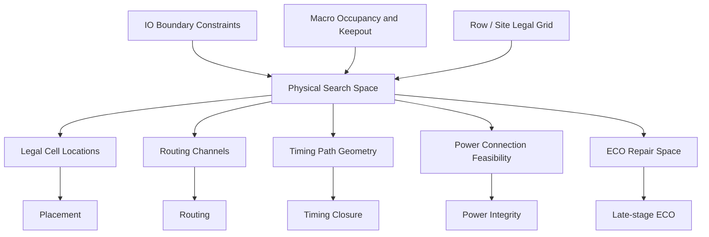
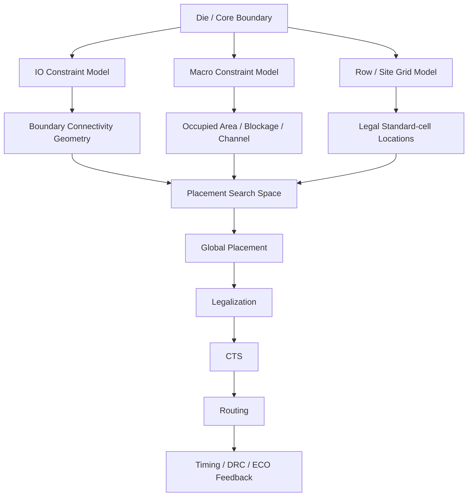
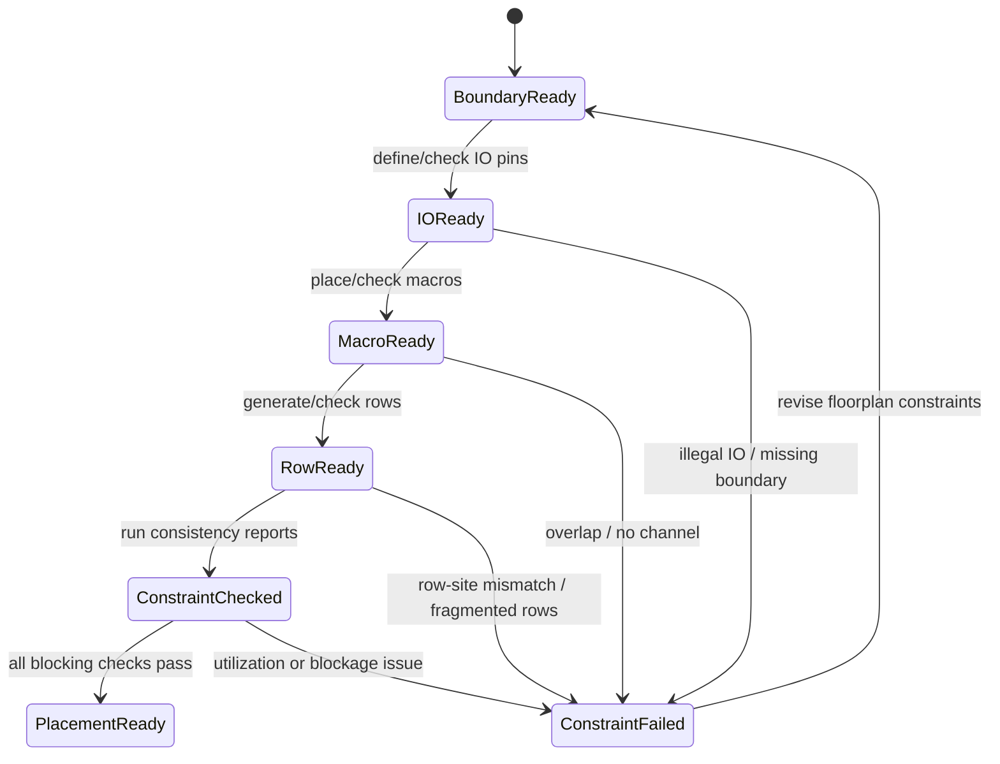

# 14. IO / Macro / Row: How Physical Constraints Define the Backend Implementation Search Space

Author: Darren H. Chen  
Topic: Backend Flow Engineering / Physical Design / EDA Tool Infrastructure  
Demo: `LAY-BE-14_io_macro_row`  
Tags: `Backend Flow`, `EDA`, `Physical Design`, `Floorplan`, `IO Planning`, `Macro Placement`, `Row`, `Site`, `Search Space`, `Physical Constraints`

In backend implementation, placement, CTS, routing, timing closure, and ECO are often discussed as if they were independent algorithmic stages. In practice, they are not independent. They are all constrained by a physical search space that is defined much earlier.

That search space is not only determined by die size or core utilization. It is strongly shaped by three physical constraint systems:

```text
IO     -> boundary connectivity and external interface constraints
Macro  -> large fixed or semi-fixed objects that occupy and block space
Row    -> legal placement grid for standard cells
```

If floorplan defines the physical world, then IO, macro, and row define how objects can legally and efficiently exist inside that world.

This article focuses on one question:

```text
Why do IO, macro, and row directly determine the search space of backend implementation?
```

The answer is not simply that they affect placement. They define the boundary conditions for placement, routing, timing, power distribution, and physical signoff.

---

## 1. What Is a Search Space in Backend Flow?

In a backend flow, an EDA tool rarely solves an unconstrained problem.

Placement does not search every coordinate on the chip. Routing does not search every possible geometric path. CTS does not place buffers anywhere. ECO does not freely modify any object.

Every algorithm operates inside a constrained search space.

For placement, the search space is shaped by:

```text
core area
standard-cell rows
site grid
macro locations
placement blockages
fixed cells
IO pin locations
power structures
density targets
routing resource availability
timing-critical connectivity
```

For routing, the search space is shaped by:

```text
routing layers
track grids
routing blockages
macro obstructions
pin access points
special nets
power stripes
preferred directions
non-default route rules
```

For timing closure, the search space is shaped by:

```text
cell locations
net distances
clock source and sink geometry
available buffer locations
routing detours
macro-induced path topology
IO boundary positions
```

Therefore, backend implementation is not just:

```text
run placement
run CTS
run routing
fix timing
```

It is more accurately:

```text
define the physical search space
verify the constraints
run physical optimization inside that search space
measure the result
adjust the model if necessary
```

The quality of the physical search space often determines whether downstream algorithms are solving a reasonable problem or struggling with an impossible one.

---

## 2. IO / Macro / Row as the Three Primary Spatial Constraint Systems

IO, macro, and row constrain the design from different directions.

| Constraint system | Main location | Primary role | Main downstream impact |
|---|---|---|---|
| IO | Boundary | Defines external connectivity | timing path direction, routing entry/exit, integration |
| Macro | Interior or boundary-adjacent large blocks | Defines large occupied and blocked regions | placement area, routing channels, congestion, timing |
| Row | Core placement area | Defines legal standard-cell sites | placement legality, utilization, legalization quality |

They work together.

A block with good macro locations but poor IO ordering may still produce routing congestion. A block with good IO and macro placement but fragmented rows may fail legalization. A block with dense rows but no macro channels may route poorly.

A backend flow should not treat these as isolated settings. They should be reviewed as a single physical constraint model.



The key idea is simple:

```text
IO tells the tool where the design talks to the outside world.
Macro tells the tool where large internal obstacles and anchors exist.
Row tells the tool where standard cells are legally allowed to land.
```

Together, they define what the implementation engine can and cannot do.

---

## 3. IO: The Boundary Is Not a Shell; It Is a Connectivity Contract

IO pins appear at the boundary of a block or chip. This can make them look like a late physical detail.

That is a dangerous simplification.

An IO pin is a contract between the current design and the outside world.

It defines:

```text
where external signals enter
where output signals leave
where clocks and resets enter
where scan or test interfaces connect
where power/ground enters or exits
how this block connects to the parent level
how package, bump, pad, or neighboring blocks interact with the design
```

IO planning affects not only boundary routing. It affects internal logic placement.

If an input pin is placed on the left boundary but its consuming logic is naturally near the right side of the block, the tool may be forced into longer wires, larger delay, more buffering, and more routing demand.

If a bus is ordered inconsistently with internal datapath direction, routing may cross unnecessarily.

If clock or reset entry points are placed poorly, CTS and timing closure may become harder before CTS even begins.

So IO planning is not cosmetic. It is one of the earliest physical definitions of the design's connectivity geometry.

---

## 4. IO Pins as Boundary Anchors

A useful mental model is to treat IO pins as boundary anchors.

```text
external interface
      ↓
IO pin location
      ↓
internal net topology
      ↓
placement bias
      ↓
routing demand
      ↓
timing / congestion impact
```

For example:

```text
left-side input pins  -> tend to pull related logic toward the left
right-side outputs    -> tend to pull output logic toward the right
top-side bus pins     -> may bias datapath placement upward
clock entry pin       -> affects clock root and early clock topology
```

This does not mean the tool simply places logic near every IO pin. Modern placement engines balance timing, wirelength, congestion, density, and many constraints. However, IO locations strongly influence the geometry of the connectivity graph.

The relationship can be represented as:


When IO constraints are wrong, downstream algorithms may still produce a legal result, but it may be a poor solution to an avoidable problem.

---

## 5. Four Layers of IO Constraints

IO planning has multiple layers.

### 5.1 Direction constraints

A pin may be:

```text
input
output
inout
clock
reset
scan
test
power
ground
```

Different directions and usages have different physical implications. A clock entry pin is not the same as a random input. A reset signal with high fanout is not the same as a local control signal. A power pin is not a signal pin.

### 5.2 Edge constraints

A pin may be constrained to:

```text
left edge
right edge
top edge
bottom edge
specific side
specific slot
specific coordinate range
```

Edge placement determines external interface direction and internal route entry points.

### 5.3 Ordering constraints

Pin ordering matters.

For example:

```text
data[0], data[1], data[2], ...
addr[0], addr[1], addr[2], ...
req, ack, valid, ready
```

A poor ordering may introduce unnecessary route crossing. A good ordering can reduce routing complexity.

### 5.4 Physical constraints

IO pins may also require:

```text
specific metal layer
minimum width
spacing rule
track alignment
offset
shape orientation
shielding
blockage avoidance
```

These constraints connect IO planning to actual manufacturable physical implementation.

---

## 6. IO Planning Failure Patterns

IO-related issues often appear later as placement or routing issues.

| Symptom | Possible IO root cause | Typical downstream impact |
|---|---|---|
| Long input-to-register paths | Input pins placed far from consuming logic | setup timing pressure |
| Excessive routing crossover | Bus ordering mismatch | congestion and detours |
| Clock latency imbalance | Clock entry point poorly located | CTS complexity |
| Port constraint not applied | Port name mismatch | timing constraint failure |
| Pin access DRC near boundary | illegal pin layer or spacing | routing failure |
| Top-level integration mismatch | boundary location inconsistent with parent | handoff or integration issue |

The lesson is:

```text
IO problems are often reported late, but created early.
```

A mature flow should generate IO summary and IO consistency reports before placement.

---

## 7. Macro: A Large Object Is Not Just a Large Cell

Macros are fundamentally different from standard cells.

A standard cell is typically small, repeated many times, and movable during placement.

A macro is large, relatively few in number, and often fixed or semi-fixed. It may represent:

```text
SRAM
ROM
PLL
analog block
hard IP
pre-routed block
embedded memory
custom layout block
```

Macros have strong physical effects:

```text
large occupied area
fixed pin locations
routing obstruction
power connection requirements
orientation restrictions
keepout or halo requirements
clock/reset access concerns
pin access hotspots
```

A macro is not simply a bigger standard cell. It is a large physical obstacle and connectivity anchor.

---

## 8. Macro Placement Defines Global Floorplan Topology

Macro placement influences:

```text
available standard-cell area
routing channels
critical path length
IO-to-logic distance
power grid topology
clock distribution
local congestion
placement density
```

A poorly placed macro can create problems that no placement optimization can fully repair.

For example:

```text
two macros placed too close together
      ↓
narrow channel
      ↓
insufficient routing tracks
      ↓
local congestion
      ↓
routing detours
      ↓
timing degradation and DRC pressure
```

Or:

```text
macro pins facing away from related logic
      ↓
longer local routes
      ↓
pin access congestion
      ↓
extra buffering
      ↓
timing and area penalty
```

Macro placement is one of the main reasons floorplan must come before placement. It defines the coarse topology of the physical problem.

---

## 9. Three Spatial Effects of a Macro

A macro affects more than its rectangular boundary.

### 9.1 Occupied region

The macro body consumes physical area. Standard cells cannot be placed inside it.

### 9.2 Blocked region

The macro may block routing layers above or around it. This reduces available routing resources.

### 9.3 Influence region

The macro may require halo, keepout, power access region, routing channel, or pin access margin.

A macro's real impact region is often larger than the macro itself.

```text
+--------------------------------------------------+
|                  Influence Region                |
|   +------------------------------------------+   |
|   |              Keepout / Halo              |   |
|   |   +----------------------------------+   |   |
|   |   |              MACRO               |   |   |
|   |   |                                  |   |   |
|   |   +----------------------------------+   |   |
|   +------------------------------------------+   |
+--------------------------------------------------+
```

A flow that only checks macro boundary overlap is incomplete. It must also review halo, blockage, channel, and pin access implications.

---

## 10. Macro Pins as Connectivity Hotspots

Macro pins are often concentrated on one or more macro edges.

If many nets connect to those pins, routing demand can become highly localized.

This can cause:

```text
pin access congestion
local route congestion
buffer insertion difficulty
timing path concentration
clock/reset access pressure
DRC hotspots
```

A useful macro planning rule is:

```text
macro pins should face the logic they communicate with,
and enough routing channel should exist near high-connectivity macro edges.
```

This is not always possible, especially under top-level integration constraints, but it is a critical review item.

Macro planning should therefore include:

```text
macro orientation
macro pin side
macro-to-macro spacing
macro-to-boundary spacing
macro-to-logic distance
macro power access
routing channel reservation
```

---

## 11. Row: The Legal Grid for Standard Cells

Rows define where standard cells can legally be placed.

A row is built from sites. A site is the basic legal placement unit for standard cells.

```text
site -> repeated placement unit
row  -> continuous sequence of sites
cell -> placed on row/site-aligned coordinates
```

Rows define:

```text
legal y coordinates
x-alignment
site step
cell orientation
power rail alignment
legalizer movement space
density calculation area
tap/endcap insertion context
```

Without rows, standard-cell placement has no legal physical grid.

---

## 12. Row Is More Than Geometry

Rows encode library and technology assumptions.

A row may imply:

```text
row height
site type
legal orientation
power rail pattern
multi-height compatibility
well/tap requirements
endcap requirements
placement region
```

If rows are wrong, placement may appear to start correctly but fail later.

Common row-related issues include:

```text
cell cannot legalize
multi-height cells cannot be placed
power rails do not align
tap or endcap insertion fails
density report is misleading
row fragments are too short
legalizer pushes cells far from ideal locations
```

A row is therefore not just a visual stripe. It is a core placement data structure.

---

## 13. Row Fragmentation and Legalization Quality

Global placement may initially position cells in a continuous mathematical space. Detailed placement and legalization must snap them onto legal rows and sites.

If rows are fragmented by macros, blockages, keepouts, or power structures, legalization becomes harder.

```text
continuous ideal placement
      ↓
row/site snapping
      ↓
blocked regions removed
      ↓
short row fragments
      ↓
cell displacement
      ↓
wirelength / timing degradation
```

This is why a design may show acceptable global placement metrics but become worse after legalization.

The root cause may be row fragmentation rather than poor placement cost function.

A robust floorplan review should check:

```text
row count
available row area
row continuity
minimum row fragment length
row overlap with blockage
row overlap with macro halo
multi-height row support
```

---

## 14. Coupling Between Row, Macro, and Blockage

Rows, macros, and blockages are tightly coupled.

Macros may remove row regions. Macro halos may require additional row trimming. Routing blockages may not remove rows directly, but they may make nearby placement unattractive. Power switches, power straps, or special regions may modify available placement space.

Typical checks include:

```text
row does not cross macro body
row does not enter macro keepout
row fragments are not too short
row area supports target utilization
row/site matches standard-cell library
row orientation is legal
placement blockage is reflected in usable area calculation
```

If these checks are missing, the tool may try to solve a placement problem whose legal space is smaller or more fragmented than expected.

---

## 15. IO / Macro / Row Combined Model

The following diagram shows how IO, macro, and row interact to define the implementation search space.



A simplified database view looks like this:

```text
PhysicalConstraintState = {
    die_boundary,
    core_boundary,
    io_pins,
    io_guides,
    macro_instances,
    macro_halos,
    macro_blockages,
    rows,
    sites,
    placement_blockages,
    routing_channels,
    utilization_targets
}
```

This state is consumed by placement, CTS, routing, timing analysis, power planning, and ECO.

---

## 16. Constraint Consistency Before Placement

Before placement, a backend flow should verify that IO, macro, and row constraints are self-consistent.

Key checks include:

```text
IO pins are inside legal boundary
IO pin layers are available
IO pins do not overlap illegally
IO order matches interface intent
macro locations are inside die/core as intended
macros do not overlap
macro halos do not close all routing channels
macro orientations are legal
rows do not cross macro bodies
rows do not enter keepout regions
site name matches the library
available row area supports utilization target
power/ground pins have connection strategy
routing channels are not fully blocked
```

This is a gate before placement, not a late-stage debug activity.

---

## 17. Why Constraint Reports Matter

Physical constraints are often visual. Engineers naturally inspect a layout window.

Visual inspection is useful but insufficient.

Many issues are not obvious visually:

```text
halo overlap exists but is not displayed
row fragments are too short
IO pin layer is illegal
site name mismatches library site
available placement area is lower than expected
macro channel has too few routing tracks
a blockage exists on a critical layer
```

Therefore, a mature flow should generate reports.

Recommended reports include:

| Report | Purpose |
|---|---|
| `io_pin_summary.rpt` | Lists ports, directions, edge/layer/location if available |
| `io_order_check.rpt` | Checks interface order and grouping assumptions |
| `macro_summary.rpt` | Lists macro size, location, orientation, status |
| `macro_overlap_check.rpt` | Detects macro-to-macro or macro-to-boundary overlap |
| `macro_channel_check.rpt` | Reviews spacing and possible routing channels |
| `row_site_summary.rpt` | Lists row count, site type, orientation, available area |
| `row_fragment_check.rpt` | Detects short or fragmented rows |
| `placement_area_summary.rpt` | Reports available placement area and utilization implication |
| `constraint_consistency.rpt` | Summarizes pass/warn/fail status before placement |

These reports turn physical intuition into reviewable engineering evidence.

---

## 18. Recommended Constraint Modeling Order

A robust flow should avoid randomly modifying IO, macro, and row constraints in an uncontrolled order.

A clear order is:

```text
1. Define die and core boundary
2. Load or define IO constraints
3. Place macros or import macro locations
4. Apply macro halo / keepout / blockage
5. Generate or adjust rows
6. Check row vs macro / blockage consistency
7. Compute available placement area
8. Review routing channels
9. Generate constraint reports
10. Enter placement
```

This order follows one principle:

```text
large-scale spatial constraints first,
fine-grained placement search second.
```

IO and macro constraints define large-scale topology. Rows define the legal grid. Placement then searches within that model.

---

## 19. IO / Macro / Row Readiness State Machine

A demo or production flow can model readiness as a small state machine.



This state model prevents a flow from entering placement before the physical constraint model is sufficiently valid.

---

## 20. Common Failure Patterns

| Failure pattern | Root cause | Detection report | Recommended response |
|---|---|---|---|
| IO pin unreachable | illegal layer or poor boundary placement | `io_pin_summary.rpt` | adjust pin layer/location |
| Bus routes cross heavily | IO ordering mismatch | `io_order_check.rpt` | reorder pins or guide interface |
| Macro channel too narrow | macros placed too close | `macro_channel_check.rpt` | increase spacing or rotate macro |
| Macro pins congested | pins face crowded channel | `macro_summary.rpt` + congestion review | rotate macro or add channel |
| Rows cross macro keepout | row generation before blockage cleanup | `row_site_summary.rpt` | cut rows around macro/halo |
| Short row fragments | excessive blockage or macro fragmentation | `row_fragment_check.rpt` | remove fragments or adjust constraints |
| Placement utilization too high | available row area overestimated | `placement_area_summary.rpt` | increase core area or reduce blockage |
| Legalization degrades timing | row fragments force displacement | row + placement reports | improve row continuity |

These failures often look like placement or routing failures, but their root cause is floorplan constraint modeling.

---

## 21. Demo 14: What It Should Validate

The `LAY-BE-14_io_macro_row` demo should not try to implement a complex industrial block. Its goal is to validate the physical constraint model.

The demo should answer:

```text
Can the flow identify top-level IO ports?
Can it summarize IO direction and boundary intent?
Can it model macro-like large objects or macro constraints?
Can it generate or inspect rows and sites?
Can it detect row/blockage inconsistencies?
Can it calculate available placement area?
Can it write constraint consistency reports?
```

Suggested inputs:

```text
minimal Verilog / LEF / Liberty
floorplan configuration
IO constraint configuration
macro placement configuration
row/site configuration
```

Suggested outputs:

```text
reports/io_macro_row_precheck.rpt
reports/io_pin_summary.rpt
reports/macro_constraint_summary.rpt
reports/row_site_summary.rpt
reports/placement_area_summary.rpt
reports/constraint_consistency.rpt
logs/LAY-BE-14_io_macro_row.log
logs/LAY-BE-14_io_macro_row.cmd.log
logs/LAY-BE-14_io_macro_row.sum.log
```

The demo is successful when it makes IO / macro / row constraints visible, reportable, and reviewable.

---

## 22. Example Repository Structure

A practical demo structure can be:

```text
LAY-BE-14_io_macro_row/
├─ README.md
├─ data/
│  ├─ netlist/
│  │  └─ demo_top.v
│  ├─ lef/
│  │  └─ demo_stdcell.lef
│  ├─ liberty/
│  │  └─ demo_stdcell.lib
│  └─ config/
│     ├─ floorplan_config.tcl
│     ├─ io_constraints.tcl
│     ├─ macro_constraints.tcl
│     └─ row_site_config.tcl
├─ scripts/
│  ├─ run_demo.csh
│  └─ clean.csh
├─ tcl/
│  ├─ 01_precheck_inputs.tcl
│  ├─ 02_load_design_context.tcl
│  ├─ 03_report_io_model.tcl
│  ├─ 04_report_macro_model.tcl
│  ├─ 05_report_row_site_model.tcl
│  ├─ 06_check_constraint_consistency.tcl
│  └─ 07_write_stage_summary.tcl
├─ logs/
└─ reports/
```

This structure keeps constraint loading, object reporting, and consistency checking separate.

---

## 23. Methodology: Define the Space Before Solving the Placement

The most important methodology is:

```text
define the physical space before optimizing objects inside it.
```

That means:

```text
IO pins should represent interface intent.
Macros should define large-object topology.
Rows should represent legal cell placement space.
Blockages and halos should be included in usable area calculation.
Reports should confirm that the space is valid before placement.
```

This prevents a common anti-pattern:

```text
run placement first
discover congestion or legality issues
guess parameters
rerun repeatedly
```

A better pattern is:

```text
review physical constraints
generate reports
fix the search space
then run placement
```

Backend tools are powerful, but they cannot compensate for a poorly defined problem forever.

---

## 24. Summary

IO, macro, and row are not minor floorplan details.

They define the physical search space for backend implementation.

```text
IO defines how the design connects to the outside world.
Macro defines large occupied regions, blockages, channels, and connectivity anchors.
Row defines the legal placement grid for standard cells.
```

Together, they determine:

```text
where cells can be placed
where cells cannot be placed
where routes can pass
where congestion is likely
where timing paths become long
where power connections are feasible
where ECO repair space remains available
```

Placement and routing quality depends heavily on this constraint model.

A mature backend flow should therefore treat IO / Macro / Row as a formal, reportable stage with precheck, consistency reports, and clear placement-readiness criteria.

---

## Closing Note

IO, macro, and row appear to be three floorplan objects.

At the engineering level, they are the boundary conditions of backend optimization.

If the boundary conditions are unclear, downstream results may be legal but unstable, difficult to explain, and hard to improve.
