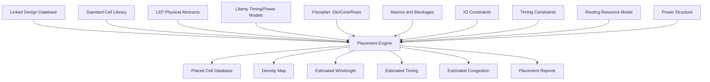
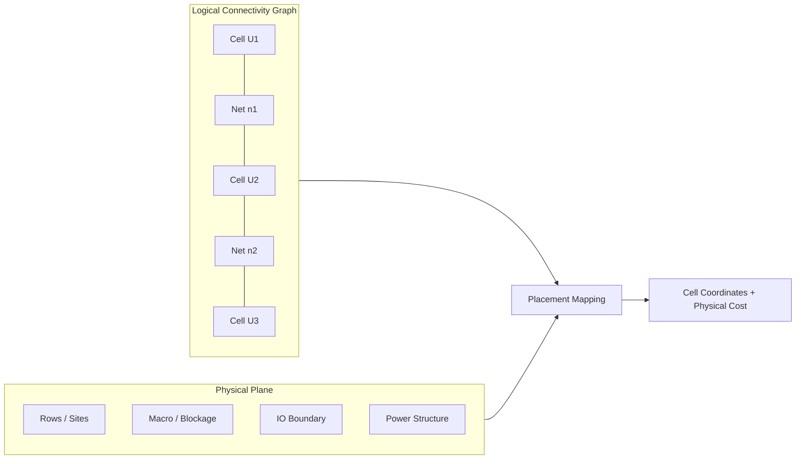
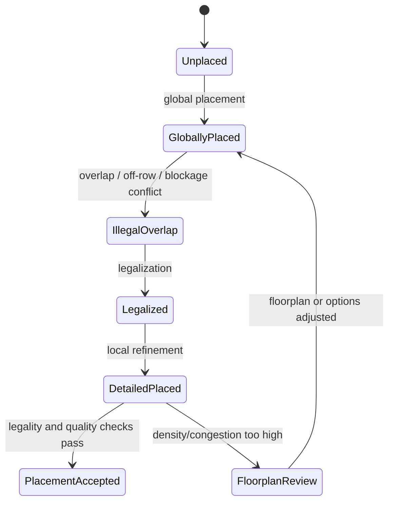
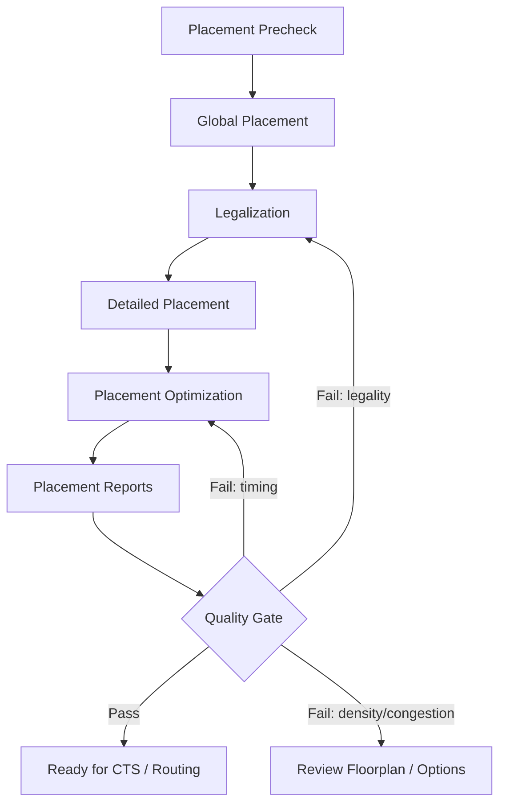
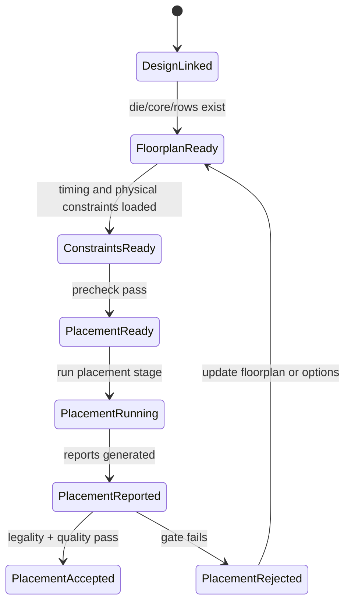
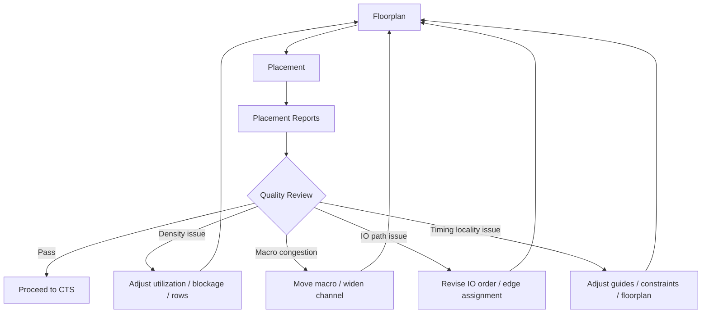

# 15. Placement: Why Placement Optimization Is a Trade-off Between Timing, Congestion, Power, and Legality

Author: Darren H. Chen  
Direction: Backend Flow / Physical Implementation / EDA Tool Engineering / Placement Methodology  
Demo: `LAY-BE-15_placement`  
Tags: `Backend Flow` `EDA` `Placement` `Timing` `Congestion` `Power` `Legalization` `Physical Optimization`

Placement is often introduced as the step that "puts standard cells onto the chip."

That description is not wrong, but it is incomplete. In a real backend flow, placement is not a simple geometric packing problem. It is a constrained optimization stage that maps a logical connectivity graph onto a physical floorplan while respecting rows, sites, macros, blockages, routing resources, timing constraints, library models, power structure, and downstream closure requirements.

A placement result is not just a list of `(x, y)` coordinates. It becomes the physical starting condition for CTS, routing, timing closure, power closure, ECO repair, and physical verification.

The central idea of this article is:

> Placement optimization is a multi-objective trade-off between legality, wirelength, timing, congestion, power, and downstream fixability.

If placement focuses on only one metric, the design may look good locally but fail later. A timing-driven placement may create routing congestion. A congestion-friendly placement may increase wirelength. A highly compact placement may leave no room for hold fixes or ECO buffers. A legal placement may still be a poor placement.

This article explains placement from a backend engineering perspective: what placement consumes, what it changes in the design database, how the placement engine can be modeled internally, why legality is only the first gate, and how a demo should verify placement as an engineering stage rather than as a black-box command.

---

## 1. Placement Is Not Driven by the Netlist Alone

At first glance, placement may appear to consume only a linked netlist. In reality, a placement engine depends on many models that were built in earlier backend stages.

A realistic placement stage needs at least the following inputs:

| Input category | Examples | Why it matters |
|---|---|---|
| Logical design | instances, nets, hierarchy, ports | Defines the connectivity graph to be mapped |
| Project library | LEF abstracts, Liberty models, technology rules | Defines cell size, pin geometry, timing and power behavior |
| Floorplan | die, core, rows, sites, blockages, macros | Defines legal physical search space |
| IO constraints | boundary pins, IO guides, edge constraints | Defines entry and exit points for signals |
| Macro constraints | macro locations, halos, keepouts, fixed blocks | Defines large obstacles and connection anchors |
| Timing constraints | clocks, IO delays, exceptions, timing modes | Defines criticality and optimization priorities |
| Routing resource model | layer directions, tracks, blockages, channel capacity | Estimates congestion and routability |
| Power structure | rails, stripes, rings, power/ground nets | Affects available routing resources and power integrity |
| Tool/runtime parameters | effort level, thread settings, stage options | Controls runtime, optimization depth, and repeatability |

This means placement is a consumer of almost every previous backend model:



A placement issue is often caused by an upstream modeling problem. For example:

| Symptom during placement | Possible upstream root cause |
|---|---|
| Many cells remain unplaced | row/site not created correctly, blockage too restrictive |
| Placement legalizer moves cells too far | row fragments too small, macro keepout too aggressive |
| Timing improves poorly | wrong Liberty corner, missing constraints, poor floorplan locality |
| Congestion is high near macros | macro channels too narrow, pin-side orientation poor |
| Placement looks legal but routing fails | routing resource model or blockage model was not captured |
| Unexpected density hotspot | utilization target too high or region constraints too tight |

Placement should therefore be analyzed not as an isolated algorithm, but as a database stage that tests the correctness of the physical and logical context created earlier.

---

## 2. What Placement Changes in the Design Database

The visible output of placement is cell location. However, the database impact is broader.

After placement, the design database begins to contain meaningful physical state for standard cell instances:

```text
cell instance
  ├─ placement status
  ├─ x/y location
  ├─ orientation
  ├─ row/site alignment
  ├─ fixed or movable state
  ├─ estimated wirelength contribution
  ├─ timing criticality context
  ├─ congestion influence
  └─ downstream optimization opportunity
```

A placement stage may also update or create:

```text
density map
congestion estimation
wirelength estimation
placement groups
cell spreading information
legalization result
timing-driven cost information
physical optimization result
unplaced or illegal object list
```

A useful abstraction is:

```text
PlacementState = {
    cell_locations,
    placement_status,
    row_site_legality,
    density_distribution,
    estimated_wirelength,
    congestion_estimation,
    timing_estimation,
    optimization_annotations,
    downstream_fixability_margin
}
```

This state becomes a prerequisite for downstream stages:

| Downstream stage | What it consumes from placement |
|---|---|
| CTS | clock sink distribution, buffer insertion space, clock-cell placement context |
| Routing | cell pin positions, estimated congestion, routing demand distribution |
| Timing closure | interconnect estimates, physical distance, critical path locality |
| Hold fixing | local free space, buffer insertion opportunities |
| ECO | spare area, movable/fixed status, local density |
| PV handoff | physical object placement, legal location, layout consistency |

A poor placement can be partially improved later, but many downstream problems are much cheaper to prevent during placement than to repair after routing.

---

## 3. Placement Is a Graph-to-Geometry Mapping Problem

The design before placement can be viewed as a logical graph:

```text
cells = graph nodes
nets  = graph hyperedges
ports = boundary terminals
pins  = node/edge connection points
```

Placement maps this graph onto a two-dimensional physical domain:

```text
LogicalGraph(V, E) + PhysicalDomain(Rows, Sites, Obstacles)
    -> PlacedGraph(V with coordinates, E with estimated physical cost)
```

A simplified logical-to-physical model looks like this:



The difficulty is that a single cell participates in multiple nets, and moving it improves some objectives while harming others.

For example:

```text
move U2 closer to U1
  -> net n1 becomes shorter
  -> net n2 may become longer
  -> local density may increase
  -> timing on one path may improve
  -> routing congestion near a macro may worsen
```

Placement is therefore not a deterministic "put cell here" task. It is an optimization over conflicting constraints.

---

## 4. Legality Is the First Gate, Not the Final Goal

Placement must first be legal.

A legal placement normally requires:

```text
all movable cells are placed
cells are aligned to row/site grid
cells do not overlap
cells stay inside legal placement area
cells avoid placement blockages
fixed cells are not moved
macro and standard cell regions are respected
orientation rules are satisfied
multi-height cells are placed consistently
power rail alignment is valid
```

Legality can be expressed as a state gate:



A placement can be legal and still poor. Legality answers:

```text
Can this placement exist in the database?
```

It does not answer:

```text
Is this placement good for timing?
Is it routable?
Does it leave ECO space?
Does it make CTS easier?
Does it avoid power density hotspots?
```

This is why placement quality must be evaluated with multiple reports, not just with an overlap check.

---

## 5. Wirelength: The Most Basic Physical Cost

Wirelength is often the first placement cost function that people learn.

Reducing wirelength usually helps because it can reduce:

```text
net capacitance
interconnect delay
transition degradation
dynamic power
routing resource demand
congestion risk
```

However, wirelength is not a single simple metric. Backend placement commonly reasons about several approximate forms:

| Metric | Meaning | Use |
|---|---|---|
| Bounding-box wirelength | Estimated wire extent based on pin bounding box | Fast global cost estimation |
| Half-perimeter wirelength | Common approximation of net length | Placement optimization |
| Weighted wirelength | Wirelength adjusted by timing or net importance | Timing-driven placement |
| Local route demand | Wirelength projected onto routing grid | Congestion estimation |
| Critical-net physical length | Distance for timing-critical connections | Timing improvement |

A pure wirelength objective can be misleading. For instance:

```text
shortening many non-critical nets may not improve timing;
clustering too aggressively may increase local density;
reducing global wirelength may overload a narrow macro channel;
a slightly longer placement may be much more routable.
```

Wirelength matters, but it must be interpreted together with timing, density, and routing resources.

---

## 6. Timing-Driven Placement: Criticality Changes the Cost Function

Timing-driven placement gives higher importance to timing-sensitive objects.

A timing path is not just a sequence of cells. It includes:

```text
launch element
data path cells
nets and interconnect estimates
capture element
clock path assumptions
constraints and uncertainty
```

Placement affects timing through:

```text
net length
load capacitance
transition
cell delay
interconnect delay
buffer insertion opportunity
clock sink distribution
```

A timing-driven placer tends to make the following decisions:

```text
keep critical path cells physically closer
avoid long detours on timing-critical nets
reserve space for buffering on long nets
reduce load on high-criticality drivers
place clock-related sinks in a more CTS-friendly distribution
```

However, timing-driven placement is also a trade-off.

| Timing action | Potential side effect |
|---|---|
| Pull critical cells together | Local density may increase |
| Spread high-fanout loads | Wirelength for some paths may increase |
| Reserve buffer space | Core utilization pressure may rise |
| Improve setup paths | Hold risk may increase later |
| Move cells away from macro blockage | Non-critical routing demand may increase |

A robust placement methodology should not ask only:

```text
Did WNS improve?
```

It should also ask:

```text
Did TNS improve?
Did congestion remain acceptable?
Did density stay balanced?
Did the placement preserve space for hold fixing and ECO?
Did the improvement survive later routing estimates?
```

---

## 7. Congestion-Driven Placement: Routability Before Routing

Placement occurs before detailed routing, but it must estimate whether the design is likely to be routable.

Congestion happens when routing demand exceeds routing supply in a region.

Typical causes include:

```text
high pin density
too many nets crossing a narrow channel
macro channels too tight
local cell density too high
power stripes consuming routing tracks
IO pin clustering
clock/control signals crossing crowded regions
blockages reducing available layers
```

A congestion-aware placement engine estimates routing demand and may spread cells, move logic away from macro channels, or adjust local density.

A simplified congestion model is:

```text
Congestion(region) = RoutingDemand(region) / RoutingCapacity(region)
```

Where:

```text
RoutingDemand = estimated nets crossing the region
RoutingCapacity = available tracks after blockages, macros, and power shapes
```

If congestion is ignored during placement, the router may later create:

```text
long detours
extra vias
DRC violations
timing degradation
runtime explosion
routing failure
```

A placement that is slightly worse in estimated wirelength may be better if it avoids severe routing hotspots.

---

## 8. Power-Aware Placement: Physical Location Affects Switching Cost and Power Integrity

Placement also affects power.

The most direct mechanism is wire capacitance. Longer wires and detours increase dynamic power because switched capacitance increases.

But placement also affects power through:

```text
clock tree length
buffer count
switching activity distribution
local power density
IR drop sensitivity
power grid access
cell spreading around high-activity regions
```

A high-activity cluster placed too tightly may create local power density problems. A poor clock sink distribution may force a larger clock tree and increase clock power. A placement that ignores power grid topology may create regions that are hard to support electrically.

Power-aware placement therefore looks beyond timing:

| Placement concern | Power impact |
|---|---|
| Long signal nets | Higher switching capacitance |
| Poor clock sink distribution | Larger clock tree and higher clock power |
| High activity clustering | Local power density and IR risk |
| Dense regions near weak PG network | Voltage drop sensitivity |
| Excessive buffering | Higher dynamic and leakage power |

Power optimization cannot be separated from physical distribution.

---

## 9. Fixability: Placement Must Leave Room for Later Closure

A placement result should not only be good now. It should be repairable later.

Backend closure usually continues through:

```text
CTS
post-CTS optimization
routing
post-route optimization
setup fixing
hold fixing
ECO
signoff closure
```

These later stages may need:

```text
space for buffers
space for hold-fix delay cells
room for local cell movement
spare cells
routing detour margin
clock buffer insertion space
macro pin access space
```

If placement uses all available space too aggressively, downstream stages may have no room to fix problems.

A placement that looks optimal by early metrics may be fragile if:

```text
local utilization is too high
critical regions have no spare space
macro pins are surrounded by dense logic
clock sinks are too clustered without CTS space
high-fanout control nets lack buffering corridors
```

A practical placement methodology therefore needs to measure not only quality but also closure margin.

---

## 10. Typical Placement Stages

Different tools use different command names, but placement usually follows a staged architecture.



The stages have different responsibilities:

| Stage | Main goal | Typical checks |
|---|---|---|
| Precheck | Ensure linked design and floorplan are ready | rows exist, no missing library views, placement area valid |
| Global placement | Find approximate cell distribution | wirelength, timing cost, density |
| Legalization | Move cells to legal row/site locations | overlap, off-row, blockage conflict |
| Detailed placement | Improve local quality | local reorder, swap, small displacement |
| Placement optimization | Improve timing/congestion/power | buffer, resize, move, clone, spread |
| Reporting | Convert placement state into evidence | summary, density, congestion, timing, legality |

This staged view is important because placement failures must be diagnosed at the right level. A legalization failure is not the same as a timing optimization failure. A congestion hotspot may require a floorplan change, not just a higher effort option.

---

## 11. Placement Readiness State Machine

Before running placement, the design should pass a readiness gate.

A useful state machine is:



This model prevents a common mistake: running placement before the physical database is ready.

The placement precheck should confirm:

```text
current design exists
design is linked
library views are available
floorplan exists
rows and sites exist
macros/blockages are valid
placement area is non-zero
timing constraints are loaded or intentionally absent
output directories are writable
placement commands are available in the selected tool mode
```

---

## 12. Reports Required After Placement

Placement must be report-driven. A GUI snapshot is useful for visual inspection, but it is not enough for engineering review.

Recommended reports include:

| Report | Purpose |
|---|---|
| `placement_precheck.rpt` | Confirms design, library, floorplan, row/site readiness |
| `placement_stage_summary.rpt` | Records placement stages executed and pass/fail status |
| `placement_summary.rpt` | Summarizes placed/unplaced cells, utilization, cell count |
| `placement_legality_check.rpt` | Reports overlap, off-row, blockage, fixed-object violations |
| `density_summary.rpt` | Shows global and local density distribution |
| `congestion_estimation.rpt` | Summarizes estimated routing hotspots |
| `placement_timing_summary.rpt` | Reports pre/post placement timing trend if available |
| `unplaced_cells.rpt` | Lists unplaced objects and possible causes |
| `macro_region_congestion.rpt` | Checks macro pin/channel congestion risks |
| `placement_quality_summary.rpt` | Aggregates legality, timing, congestion, density and fixability |

A good placement report system answers:

```text
Are all movable cells placed?
Is the placement legal?
Where are density hotspots?
Where are congestion hotspots?
Did timing improve or degrade?
Are critical regions overfilled?
Is there enough space for downstream fixing?
```

---

## 13. Placement Quality Should Be Reviewed as a Multi-Metric Table

A single number is not enough.

A practical placement review table may look like this:

| Metric group | Example metrics | Gate interpretation |
|---|---|---|
| Legality | unplaced cells, overlaps, off-row cells | Must pass before downstream flow |
| Density | average utilization, max local density | Too high indicates routability and ECO risk |
| Congestion | estimated overflow, hotspot regions | High value may require spreading or floorplan update |
| Timing | WNS/TNS trend, critical path length | Must be interpreted with congestion and density |
| Wirelength | HPWL, long-net count | Useful but not sufficient alone |
| Power | wire capacitance trend, clock distribution | Important for dynamic and clock power |
| Fixability | free space near critical regions, spare margin | Predicts post-CTS/post-route repair difficulty |

This prevents metric tunnel vision.

For example:

```text
WNS improves, but congestion explodes.
```

This may not be a good placement because post-route timing may degrade.

```text
Wirelength decreases, but density hotspots exceed routable limits.
```

This is also risky.

```text
Placement is legal, but there are no buffer sites near critical paths.
```

This may fail later during timing closure.

---

## 14. Common Placement Failure Patterns

| Failure pattern | Symptom | Likely cause | Suggested review |
|---|---|---|---|
| Unplaced cells | Cells remain without location | Missing rows, illegal region, oversized cells | Check floorplan and row/site summary |
| Many overlaps | Legalization fails or large displacement | Utilization too high, row fragmentation | Check density and blockage reports |
| Macro channel congestion | Congestion near macro edges | Macro too close, pin-facing conflict | Review macro orientation and channel width |
| IO-driven long paths | Boundary-to-logic paths too long | Poor IO placement or logic locality | Review IO pin order and related logic clustering |
| Timing improves poorly | Critical paths remain long | Wrong constraints, poor floorplan, no buffer space | Review timing summary and physical distance |
| Routing congestion after placement | Router detours heavily | Placement ignored routing resources | Review congestion estimation and layer blockage |
| Hold-fix difficulty later | No room for delay cells | Local density too high | Review fixability margin |
| Clock tree inefficient | Large insertion delay or skew risk | Poor clock sink distribution | Review clock sink placement before CTS |

These patterns are valuable because placement debugging often begins with symptoms that appear in a later stage. A routing failure may be a placement issue. A timing closure issue may be a floorplan or placement locality issue.

---

## 15. Placement and Floorplan Form a Feedback Loop

Placement is also a floorplan diagnostic stage.

If placement results show:

```text
macro channels are congested
IO-to-logic paths are too long
local row capacity is insufficient
power stripe regions block routing demand
critical logic is pulled across the chip
```

Then the correct action may be to revise the floorplan, not simply increase placement effort.

A practical feedback loop is:



This loop should be evidence-driven. Every floorplan adjustment should be justified by a report, not by visual impression alone.

---

## 16. Script Organization for Placement

A placement script should not be a single monolithic command.

A maintainable structure is:

```text
tcl/
  01_place_precheck.tcl
  02_set_place_options.tcl
  03_run_global_place.tcl
  04_run_legalization.tcl
  05_run_place_opt.tcl
  06_report_placement.tcl
  07_check_place_quality.tcl
```

The stage controller should enforce:

```text
precheck before execution
fail-fast for missing design/floorplan/rows
structured reports after each major stage
clear separation between setup, execution, and analysis
command log and main log for replay
summary report for quick review
```

An abstract stage controller may look like this:

```tcl
run_stage place_precheck       ./tcl/01_place_precheck.tcl       fail-fast
run_stage set_place_options    ./tcl/02_set_place_options.tcl    fail-fast
run_stage global_place         ./tcl/03_run_global_place.tcl     fail-fast
run_stage legalize_placement   ./tcl/04_run_legalization.tcl     fail-fast
run_stage place_optimization   ./tcl/05_run_place_opt.tcl        continue-on-error
run_stage report_placement     ./tcl/06_report_placement.tcl     continue-on-error
run_stage check_place_quality  ./tcl/07_check_place_quality.tcl  fail-fast
```

The command names are intentionally generic. The engineering principle is more important than the exact tool syntax:

```text
placement is a stage with prerequisites, execution, reports, and quality gates.
```

---

## 17. Demo 15: Recommended Scope

The `LAY-BE-15_placement` demo does not need to achieve industrial QoR. Its goal is to validate the engineering skeleton of a placement stage.

The demo should prove that:

```text
a linked design exists
floorplan and rows exist
placement-related command availability can be probed
a minimal placement stage can be executed or safely simulated
placement reports are generated
legality and quality checks are recorded
stage status is summarized
```

Recommended demo structure:

```text
LAY-BE-15_placement/
├─ data/
│  ├─ netlist/
│  ├─ lef/
│  ├─ liberty/
│  ├─ sdc/
│  └─ floorplan/
├─ scripts/
│  ├─ run_demo.csh
│  └─ clean.csh
├─ tcl/
│  ├─ 01_place_precheck.tcl
│  ├─ 02_place_command_probe.tcl
│  ├─ 03_run_minimal_place.tcl
│  ├─ 04_report_placement.tcl
│  └─ 05_check_place_quality.tcl
├─ logs/
│  ├─ LAY-BE-15_placement.log
│  ├─ LAY-BE-15_placement.cmd.log
│  └─ LAY-BE-15_placement.stdout.log
├─ reports/
│  ├─ placement_precheck.rpt
│  ├─ placement_command_probe.rpt
│  ├─ placement_summary.rpt
│  ├─ placement_legality_check.rpt
│  ├─ placement_quality_summary.rpt
│  └─ placement_stage_summary.rpt
└─ README.md
```

Recommended report expectations:

| Report | Expected content |
|---|---|
| `placement_precheck.rpt` | input readiness and physical database readiness |
| `placement_command_probe.rpt` | command availability and mode suitability |
| `placement_summary.rpt` | placed/unplaced object count, utilization, major warnings |
| `placement_legality_check.rpt` | overlap/off-row/blockage violations |
| `placement_quality_summary.rpt` | density, timing, congestion and fixability observations |
| `placement_stage_summary.rpt` | stage-level PASS/WARN/FAIL result |

The demo should be judged by whether it creates a reproducible placement analysis frame, not by whether it reaches best-in-class QoR.

---

## 18. Engineering Checklist Before Accepting Placement

Before placement is accepted as ready for CTS or routing, review the following checklist.

### Database readiness

```text
[ ] current design exists
[ ] design is linked
[ ] library physical and timing views are available
[ ] floorplan exists
[ ] rows and sites exist
[ ] macros and blockages are valid
[ ] placement area is sufficient
```

### Placement legality

```text
[ ] all required cells are placed
[ ] no illegal overlap remains
[ ] cells are row/site aligned
[ ] no movable cells are inside forbidden regions
[ ] fixed objects remain fixed
[ ] multi-height cells are legal if present
```

### Quality review

```text
[ ] global density is reasonable
[ ] local density hotspots are reviewed
[ ] congestion hotspots are reviewed
[ ] critical timing paths are physically reasonable
[ ] macro pin regions have routing access
[ ] IO-to-logic paths are not obviously excessive
[ ] space remains for buffers, hold fixes and ECO
```

### Evidence and reproducibility

```text
[ ] placement logs are archived
[ ] command log is saved
[ ] summary report exists
[ ] quality reports exist
[ ] input manifest is recorded
[ ] placement options are explicit
[ ] run can be reproduced from scripts
```

This checklist turns placement acceptance from a visual judgment into an engineering decision.

---

## 19. Summary

Placement is the stage where the logical design graph becomes a physical distribution of cells.

But placement is not merely "putting cells onto the chip." It is a constrained, multi-objective optimization stage that must balance:

```text
legality
wirelength
timing
congestion
power
density
routability
downstream fixability
```

A placement result should be evaluated as a database state:

```text
cell coordinates
placement legality
density distribution
estimated congestion
timing trend
routing readiness
CTS readiness
ECO margin
```

The correct engineering approach is:

```text
precheck the design and floorplan
run placement as a controlled stage
generate structured reports
review multiple metrics
feed placement evidence back into floorplan if needed
accept placement only after legality and quality gates pass
```

Placement is therefore not a decorative physical step. It is one of the central decision points of backend implementation.

---

## Closing Thought

The visible output of placement is a set of cell coordinates.

The real output is more important:

```text
a physical starting condition that determines whether CTS, routing, timing closure and ECO repair can continue to converge.
```

A mature backend flow does not judge placement by whether the layout looks orderly. It judges placement by whether the design remains legal, routable, timing-aware, power-aware and fixable in the stages that follow.
