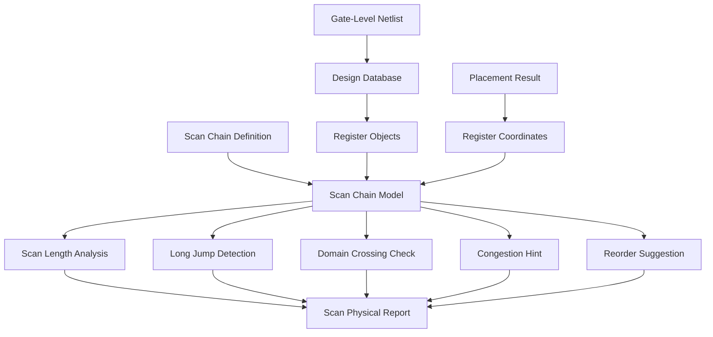
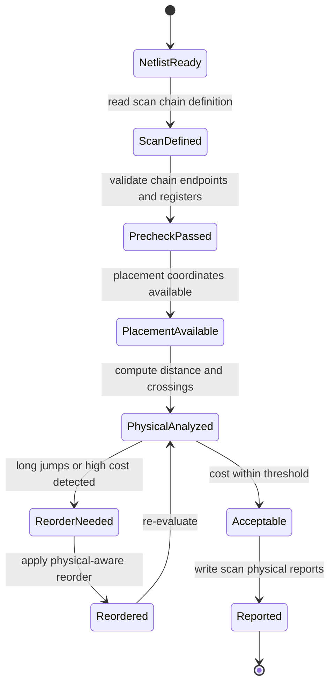

# 16. From Scan Chain to Placement: Why Test Structures Affect Physical Layout

Author: Darren H. Chen  
Demo: `LAY-BE-16_scan_chain_placement`  
Tags: Backend Flow, EDA, DFT, Scan Chain, Placement, Physical-Aware Test, Physical Implementation

Scan chain is often introduced as a DFT concept:

```text
Connect flip-flops into serial chains so that internal state can be controlled and observed during manufacturing test.
```

That statement is correct, but it is not sufficient for backend implementation.

Once scan logic is inserted into the gate-level netlist, it no longer exists only as an abstract test structure. It becomes a real set of cells, pins, nets, clocks, enable signals, scan inputs, scan outputs, and connectivity edges inside the physical design database.

From a backend point of view, this means scan chain is not isolated from placement. It changes the connectivity graph seen by the placement engine, increases routing demand, introduces additional timing modes, affects congestion around register-dense regions, and may constrain later ECO work.

A mature backend flow should therefore treat scan chain as a physical implementation object, not only as a DFT artifact.

This article explains why scan structure affects placement, how scan ordering interacts with physical coordinates, and how a backend flow can build reports and checks around scan-chain placement quality.

---

## 1. Scan Chain as a Logical Test Structure

A normal sequential element is mainly used in functional mode:

```text
D  -->  FF  -->  Q
CLK --> FF
```

A scan register adds a test data path and a test control path:

```text
Functional data path : D  -> FF -> Q
Scan shift path      : SI -> FF -> SO
Control signal       : SE / test_mode
Clock signal         : CLK / test_clock
```

A simplified scan register can be drawn as:

```text
                 +---------------------+
D  ------------> |                     |
SI ------------> |   scan register     | ----> Q
SE ------------> |                     | ----> SO
CLK -----------> |                     |
                 +---------------------+
```

In scan shift mode, multiple scan registers are stitched into a chain:

```text
scan_in -> FF1 -> FF2 -> FF3 -> ... -> FFn -> scan_out
```

At the logic level, this is a test-access structure. At the physical level, every arrow in that chain becomes a real connection between placed registers.

That is where backend placement becomes involved.

---

## 2. Why Scan Chain Becomes a Placement Problem

Placement maps a logical connectivity graph onto a two-dimensional physical layout.

Before scan insertion, a register is mainly connected through functional logic:

```text
logic cone A -> FF1 -> logic cone B -> FF2
```

After scan insertion, additional edges are introduced:

```text
FF1/SO -> FF2/SI
FF2/SO -> FF3/SI
FF3/SO -> FF4/SI
```

These scan edges may have no relationship to functional locality.

For example:

```text
Physical positions:

+-------------------------------+
| FF3                       FF2 |
|                               |
|                               |
| FF1                       FF4 |
+-------------------------------+

Scan order:

FF1 -> FF2 -> FF3 -> FF4
```

This scan order creates long physical jumps:

```text
FF1 -> FF2 : long diagonal path
FF2 -> FF3 : cross-top path
FF3 -> FF4 : long diagonal path
```

The scan chain is logically legal, but physically poor.

The consequences may include:

```text
long scan wires
extra routing demand
local congestion
scan shift timing degradation
additional buffering
more complex hold fixing
harder incremental ECO
```

Therefore, scan order and placement cannot be treated as fully independent decisions.

---

## 3. The Backend Tool Sees a Graph, Not a Test Intention

At the physical implementation level, an EDA tool typically works with a graph-like design representation:

```text
G = (V, E)

V = cells, pins, ports, registers, macros
E = nets, timing arcs, connectivity relationships
```

Scan insertion adds additional edges into this graph:

```text
E_functional : normal functional connectivity
E_scan       : scan shift connectivity
E_control    : scan enable / test mode connectivity
E_clock      : scan clock or shared clock connectivity
```

A placement engine does not automatically understand the designer's intent behind every edge unless the flow models it correctly.

Two extreme approaches are both risky:

| Approach | Risk |
|---|---|
| Treat scan edges exactly like functional critical edges | May disturb functional timing-driven placement |
| Ignore scan edges completely | May create long scan wires and routing congestion |

A practical backend flow should model scan structures with controlled priority:

```text
functional critical paths    : high priority
clock-related constraints    : high priority
scan physical length         : medium priority
scan control fanout          : medium to high priority
scan shift timing            : based on test frequency and mode constraints
congestion impact            : must be visible during placement review
```

The goal is not to make scan dominate placement. The goal is to prevent scan from becoming invisible.

---

## 4. Logical Scan Order Versus Physical Register Order

A scan chain is an ordered list of registers:

```text
SCAN_CHAIN_0 = {FF1, FF2, FF3, FF4, ..., FFn}
```

Placement gives each register a physical location:

```text
FF_i -> (x_i, y_i)
```

The physical cost of a scan chain can be approximated by summing the distance between adjacent scan registers:

```text
ScanLength = sum(distance(FF_i, FF_{i+1}))
```

A common early-stage approximation is Manhattan distance:

```text
D(FF_i, FF_j) = abs(x_i - x_j) + abs(y_i - y_j)
```

This metric is not a replacement for real routing, but it is useful in early physical analysis. It reveals whether the scan order is physically aligned with the placement result.

### Example

| Scan Edge | Distance Type | Risk |
|---|---|---|
| FF1 -> FF2 | short local jump | usually acceptable |
| FF2 -> FF3 | long cross-core jump | potential congestion and delay |
| FF3 -> FF4 | crosses macro channel | routing risk |
| FF4 -> FF5 | crosses power-domain boundary | needs legality review |

A scan chain with many long jumps should be reviewed before routing.

---

## 5. Scan Chain Influences Placement Through Four Main Channels

### 5.1 Wirelength

The most direct physical effect is extra wirelength.

If scan order does not match physical locality, the scan path may repeatedly cross the block. This increases estimated wirelength and routing resource usage.

Wirelength matters because it affects:

```text
capacitance
delay
transition
routing congestion
dynamic power
buffer insertion
```

Even if scan shift frequency is lower than functional frequency, excessive scan wirelength still creates physical implementation cost.

---

### 5.2 Congestion

Scan nets compete with functional nets, clock nets, power structures, and macro pin connections for routing resources.

High-risk regions include:

```text
register-dense clusters
macro edges
narrow macro channels
clock buffer regions
IO entry regions
power stripe intersections
scan compression logic regions
```

A placement result may look acceptable from a pure cell-density point of view while still creating scan-related routing pressure.

Typical congestion symptoms include:

```text
many scan nets crossing the same channel
long scan jumps over macro blockages
scan enable network spreading across the whole block
local pin density around scan compression logic
routing detours after detailed routing
```

---

### 5.3 Timing

Scan logic affects timing in multiple modes.

In functional mode, scan muxes may increase input loading and introduce extra delay around registers.

In scan shift mode, the chain path itself has timing requirements:

```text
SO_i -> SI_{i+1}
```

Depending on test clock frequency, scan shift timing may not be the most aggressive setup constraint, but hold, transition, and clock skew can still matter.

Scan-related timing concerns include:

```text
long SO-to-SI wire delay
hold fixing on short local scan edges
large scan enable fanout
clock skew between scan registers
transition degradation from long scan nets
mode-specific false-path or multicycle modeling errors
```

The backend flow should not assume scan timing is always harmless.

---

### 5.4 ECO and Maintainability

If scan-chain physical problems are discovered too late, fixes may require many changes:

```text
scan reconnect
incremental placement
incremental routing
scan timing update
DFT rule recheck
logic equivalence check
signoff rerun
```

This is why scan chain should be visible during placement review, not only after routing.

Early scan analysis reduces the chance of late physical ECO caused by test-structure connectivity.

---

## 6. Physical-Aware Scan Reordering

Physical-aware scan reordering adjusts the scan register order according to placement and DFT constraints.

At a high level, it tries to solve this problem:

```text
Given:
  scan registers
  physical coordinates
  chain endpoints
  DFT constraints
  clock-domain constraints
  power-domain constraints

Find:
  a scan order that reduces physical cost while preserving test legality
```

This resembles a path optimization problem, but it is not a simple shortest-path exercise.

The scan order must respect many constraints:

| Constraint | Why It Matters |
|---|---|
| Clock-domain legality | Avoid invalid shift paths across incompatible clocking structures |
| Power-domain legality | Avoid unsafe scan links across power intent boundaries |
| Chain endpoint preservation | Maintain scan input/output architecture |
| Chain length balance | Keep test time and compression assumptions stable |
| Lock-up latch rules | Preserve required timing protection between domains |
| Scan compression structure | Avoid breaking compressor/decompressor topology |
| Test protocol | Preserve expected shift/capture behavior |

Therefore, physical-aware scan reordering is best understood as constrained physical optimization.

Its objective is not only:

```text
make scan wires shorter
```

but:

```text
reduce scan physical cost without breaking DFT architecture or implementation legality
```

---

## 7. A Backend Architecture View of Scan-Aware Placement

A scan-aware backend flow needs a data layer that connects DFT structure with physical placement.



The key idea is to create a bridge between:

```text
logical scan order
physical register location
implementation constraints
reportable backend evidence
```

Without this bridge, scan chain remains a hidden structure from the placement review process.

---

## 8. A Practical Scan Chain Data Model

A backend flow can represent scan chain information with a small structured model:

```text
scan_chain_db
├─ chain_id
├─ scan_in
├─ scan_out
├─ ordered_register_list
├─ register_count
├─ clock_domain
├─ power_domain
├─ test_mode
├─ physical_bbox
├─ estimated_wirelength
├─ long_jump_count
├─ crossing_count
├─ congestion_score
└─ timing_status
```

Each field helps answer a specific engineering question.

| Field | Engineering Question |
|---|---|
| `chain_id` | Which scan chain is being analyzed? |
| `ordered_register_list` | What is the scan order? |
| `register_count` | Is chain length balanced? |
| `clock_domain` | Is the chain domain-legal? |
| `power_domain` | Does it cross power boundaries? |
| `physical_bbox` | How widely does the chain spread? |
| `estimated_wirelength` | What is the early physical cost? |
| `long_jump_count` | Are there suspicious scan jumps? |
| `congestion_score` | Does it likely add routing pressure? |
| `timing_status` | Are scan timing checks acceptable? |

This structure allows scan chain to be reviewed like other backend objects.

---

## 9. Scan Chain Physical State Machine

Scan-chain handling can be modeled as a state machine.



This state machine highlights a practical principle:

```text
Scan chain should be checked before placement review is closed.
```

If scan issues are detected, the flow should either reorder, repair, or explicitly waive them with documented reasoning.

---

## 10. Placement Stage Interaction

Scan chain analysis can be inserted before and after placement.

### Before Placement

The flow should check:

```text
scan definition exists
scan endpoints are valid
registers in scan chain exist in the linked design
chain length is reasonable
clock-domain grouping is known
power-domain grouping is known if applicable
```

This prevents placement from proceeding with an inconsistent scan structure.

### After Initial Placement

The flow should extract physical data:

```text
register coordinates
chain bounding box
adjacent scan edge distance
long jumps
macro crossings
partition crossings
local congestion hints
```

This makes scan cost visible before routing.

### After Reordering

The flow should compare before and after:

```text
scan wirelength reduction
long jump reduction
chain length preservation
DFT legality preservation
shift timing impact
```

A reorder that improves physical length but breaks DFT legality is not acceptable.

---

## 11. Scan Chain Reports

A mature backend flow should generate scan-chain reports rather than rely on visual inspection.

Recommended reports include:

```text
scan_chain_summary.rpt
scan_chain_length.rpt
scan_chain_long_jump.rpt
scan_chain_domain_check.rpt
scan_chain_congestion_hint.rpt
scan_chain_reorder_suggestion.rpt
scan_chain_stage_summary.rpt
```

### 11.1 `scan_chain_summary.rpt`

This report should summarize all chains:

| Chain | Registers | Clock Domain | Power Domain | Status |
|---|---:|---|---|---|
| SCAN_CHAIN_0 | 128 | CLK_CORE | PD_CORE | PASS |
| SCAN_CHAIN_1 | 132 | CLK_CORE | PD_CORE | PASS |
| SCAN_CHAIN_2 | 97 | CLK_PERIPH | PD_PERIPH | WARN |

### 11.2 `scan_chain_long_jump.rpt`

This report should list suspicious adjacent register pairs:

| Chain | From | To | Estimated Distance | Reason | Suggested Action |
|---|---|---|---:|---|---|
| SCAN_CHAIN_2 | `u_core/u_reg_128` | `u_periph/u_reg_007` | 1820 um | cross-region jump | consider physical reorder |
| SCAN_CHAIN_3 | `u_mem/u_reg_031` | `u_ctl/u_reg_002` | 1430 um | macro-channel crossing | review macro pin/channel |

### 11.3 `scan_chain_reorder_suggestion.rpt`

This report should not blindly modify the design. It should provide reviewable evidence:

```text
chain_id              : SCAN_CHAIN_2
original_length       : 15420 um
estimated_new_length  : 9820 um
long_jump_reduction   : 11 -> 4
constraint_status     : clock-domain preserved
recommendation        : review physical-aware reorder candidate
```

The report should separate measurement from decision.

---

## 12. Common Failure Patterns

| Failure Pattern | Symptom | Likely Root Cause | Engineering Response |
|---|---|---|---|
| Long scan jumps | Large SO-to-SI distances | Scan order ignores physical locality | Physical-aware reorder |
| Macro-channel crossing | Many scan nets cross a narrow channel | Macro placement and scan order conflict | Review macro channel and scan order |
| Chain imbalance | One chain much longer than others | Poor scan partitioning | Rebalance scan chains |
| Cross-domain chain | Registers from incompatible domains stitched together | DFT constraints incomplete | Review scan domain rules |
| Scan enable congestion | High fanout control net spreads widely | SE distribution not modeled physically | Buffering or regional control strategy |
| Late scan ECO | Scan issue found after routing | Scan physical check missing before route | Add scan report after placement |

This kind of classification makes scan-chain debug more systematic.

---

## 13. Methodology: Make Test Structures Physically Visible

The key methodology is simple:

```text
Do not wait until route or signoff to discover scan-chain physical cost.
```

A practical backend sequence is:

```text
DFT netlist ready
↓
scan chain precheck
↓
import and link design
↓
placement
↓
scan physical analysis
↓
physical-aware scan reorder if needed
↓
incremental placement / legalization
↓
routing
↓
scan mode timing and DFT rule checks
```

The flow should maintain both DFT correctness and physical implementation quality.

This is not a replacement for DFT signoff. It is a backend implementation layer that helps scan structure remain physically manageable.

---

## 14. Demo Design: `LAY-BE-16_scan_chain_placement`

The purpose of this demo is not to run a full industrial DFT flow. It is to demonstrate how scan-chain structure can be modeled, connected to placement coordinates, and reported as a backend physical concern.

Recommended directory structure:

```text
LAY-BE-16_scan_chain_placement/
├─ data/
│  ├─ scan_chain.def
│  ├─ registers.csv
│  └─ placement_after.csv
├─ scripts/
│  ├─ run_scan_physical_check.csh
│  └─ clean.csh
├─ tcl/
│  ├─ 01_read_design.tcl
│  ├─ 02_read_scan_chain.tcl
│  ├─ 03_report_scan_chain.tcl
│  ├─ 04_analyze_scan_distance.tcl
│  └─ 05_write_reorder_suggestion.tcl
├─ reports/
│  ├─ scan_chain_summary.rpt
│  ├─ scan_chain_length.rpt
│  ├─ scan_chain_long_jump.rpt
│  ├─ scan_chain_reorder_suggestion.rpt
│  └─ scan_chain_stage_summary.rpt
└─ README.md
```

The run entry can remain generic:

```csh
#!/bin/csh -f

setenv EDA_TOOL_BIN /path/to/eda_tool
setenv DESIGN_ROOT  /path/to/LAY-BE-16_scan_chain_placement

$EDA_TOOL_BIN -batch $DESIGN_ROOT/tcl/03_report_scan_chain.tcl \
  >&! $DESIGN_ROOT/reports/run_scan_chain.log
```

The command names should be adapted to the actual EDA tool environment, but the engineering structure should remain stable:

```text
read scan structure
read register placement
compute physical scan cost
detect long jumps
write reviewable reports
```

---

## 15. Demo Input and Output

### 15.1 Inputs

| Input | Purpose |
|---|---|
| `scan_chain.def` | Describes scan chain order or chain membership |
| `registers.csv` | Lists scan registers and metadata |
| `placement_after.csv` | Provides register coordinates after placement |
| linked design database | Provides cell/pin/net object context if available |

### 15.2 Outputs

| Output | Purpose |
|---|---|
| `scan_chain_summary.rpt` | Overall chain count, length, and status |
| `scan_chain_length.rpt` | Estimated chain physical length |
| `scan_chain_long_jump.rpt` | Adjacent scan register pairs with high distance |
| `scan_chain_reorder_suggestion.rpt` | Candidate reorder hints for review |
| `scan_chain_stage_summary.rpt` | Stage-level pass/warn/fail summary |

The demo should prove three things:

```text
scan chain can be represented as structured data
scan chain can be associated with physical placement
scan chain physical quality can be reported and compared
```

---

## 16. Review Checklist

Before closing scan-aware placement review, check:

```text
[ ] All scan chain endpoints are known.
[ ] All scan registers exist in the linked design.
[ ] Chain length distribution is reasonable.
[ ] Register coordinates are available after placement.
[ ] Long scan jumps are reported.
[ ] Cross-domain scan links are reviewed.
[ ] Macro-channel crossings are reviewed.
[ ] Scan enable fanout is visible.
[ ] Reorder suggestions preserve DFT legality.
[ ] Reports are archived with placement results.
```

This checklist keeps scan-chain physical quality from becoming an informal visual judgment.

---

## 17. Engineering Takeaways

Scan chain affects placement because it adds real physical connectivity to the design.

The backend implementation impact can be summarized as:

```text
scan chain changes the connectivity graph
connectivity affects placement cost
placement affects routing demand
routing affects timing and signoff
late scan repair affects ECO complexity
```

A mature backend flow should therefore make scan-chain structure visible as part of placement review.

The key is not to over-optimize scan at the expense of functional implementation. The key is to avoid treating scan as invisible.

---

## 18. Summary

Scan chain is a DFT structure at the methodology level, but it becomes a backend physical object once it enters the netlist and database.

It affects:

```text
wirelength
congestion
scan shift timing
control signal distribution
routing resource usage
incremental ECO complexity
```

Physical-aware scan handling requires:

```text
scan chain precheck
register coordinate extraction
scan length estimation
long jump detection
constraint-aware reorder review
scan physical reports
```

The central backend principle is:

```text
Test structure, placement, timing, routing, and signoff must be visible to each other through the design database and reports.
```

Backend implementation is not only about placing functional logic. It must also place and route the structures that make the chip testable.
