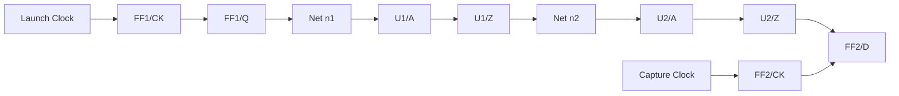
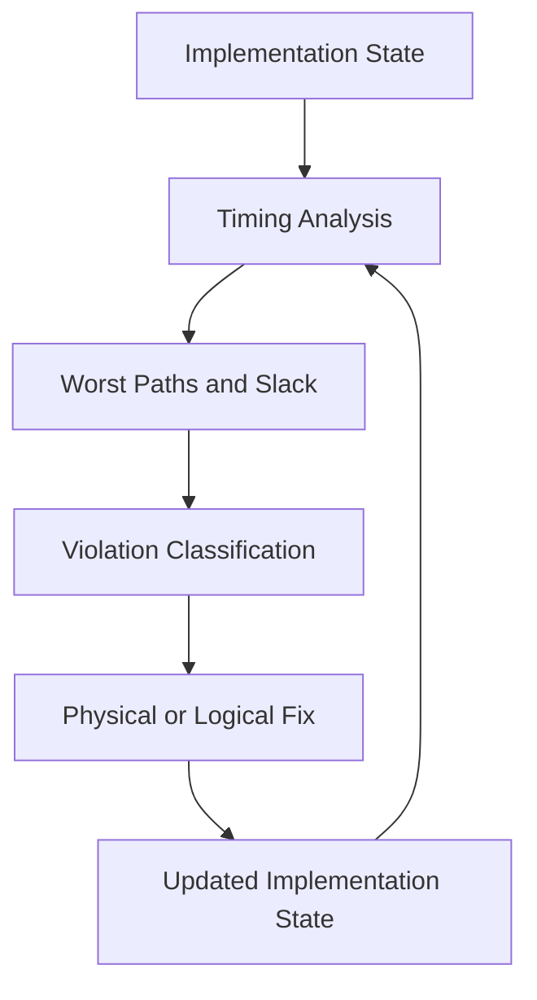
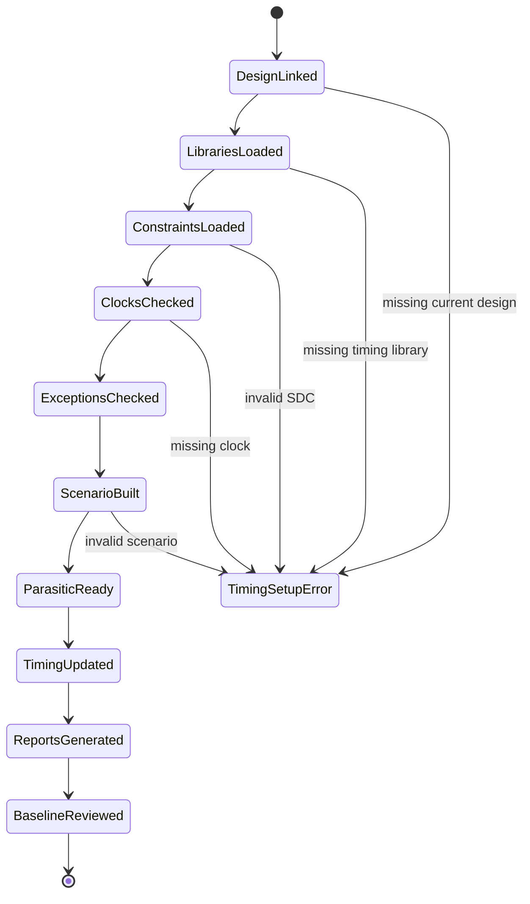

# 17. Timing Analysis: Why Every Backend Flow Stage Revolves Around Slack and Paths

Author: Darren H. Chen

Demo: `LAY-BE-17_timing_analysis`

Tags: `Backend Flow` `EDA` `Static Timing Analysis` `Timing Path` `Slack` `MCMM` `Timing Closure` `Physical Implementation`

---

## 1. Timing Analysis Is the Evaluation Backbone of Backend Flow

Backend implementation contains many visible stages:

```text
floorplan
placement
clock tree synthesis
routing
physical optimization
ECO
signoff preparation
```

At first glance, these stages look very different. Floorplan defines the physical space. Placement assigns cells to legal locations. Clock tree synthesis distributes clocks. Routing creates wires and vias. ECO applies late-stage fixes.

However, behind these different operations, one question keeps returning:

```text
Which timing paths are still violating constraints, why are they violating, and which implementation change can reduce or remove the violation?
```

This is why timing analysis is not merely a late-stage check. It is the continuous evaluation system of backend implementation.

A backend tool moves cells because timing paths are too long or congestion is too high. It inserts buffers because transition, capacitance, or path delay is unacceptable. It builds a clock tree because clock latency and skew directly affect setup and hold. It updates parasitics after routing because wire RC changes timing. It runs ECO because remaining violations need localized repair.

The common language of these decisions is:

```text
path
slack
arrival time
required time
setup
hold
scenario
```

Without timing analysis, backend implementation would be only geometric construction. With timing analysis, geometry becomes measurable against clock constraints and performance requirements.

---

## 2. Timing Analysis Checks Time Consistency, Not Just Frequency

It is common to describe timing analysis as checking whether a chip can run at a target frequency. That description is useful, but incomplete.

A more precise statement is:

```text
Timing analysis checks whether data transitions arrive and remain stable within the required time windows under specified clocks, modes, process corners, voltage corners, temperature corners, constraints, and parasitic conditions.
```

The central issue is time consistency.

For a synchronous setup path, the simplified data movement is:

```text
launch register
  -> clock-to-Q delay
  -> combinational cell delay
  -> interconnect delay
  -> capture register setup requirement
```

For a hold path, the question is different. The data must not change too soon after the capture clock edge.

The same physical implementation therefore has to satisfy two opposite-looking requirements:

```text
setup: data must not arrive too late
hold : data must not arrive too early
```

This is why timing closure is difficult. Many fixes that improve setup timing can make hold timing worse. Many hold fixes add area, capacitance, power, or routing pressure.

---

## 3. The Timing Graph Is the Time-Domain Model of the Design

After design import and link, the EDA tool has a design database containing cells, nets, pins, ports, libraries, constraints, and physical state. Static timing analysis builds a timing graph on top of this database.

A simplified model is:

```text
Timing Graph = Timing Nodes + Timing Arcs
```

Typical nodes are:

```text
ports
pins
timing points
clock points
register endpoints
```

Typical arcs are:

```text
cell delay arcs
net delay arcs
setup/hold check arcs
clock propagation arcs
constraint arcs
```

A timing graph can be visualized as follows:



Timing analysis propagates values through this graph.

Two propagated values are especially important:

| Concept | Meaning |
|---|---|
| Arrival time | When data or clock actually reaches a timing point |
| Required time | The latest or earliest allowed time for that timing point |

Slack is the difference between what happened and what was required.

For setup:

```text
setup_slack = required_time - arrival_time
```

For hold:

```text
hold_slack = arrival_time - required_time
```

Negative slack means that the implementation does not satisfy the timing requirement for that path under that scenario.

---

## 4. Why Paths Matter More Than Individual Cells

A timing violation is a path-level phenomenon. A single slow cell does not necessarily cause a violation. A single fast cell does not necessarily create a hold issue. The result depends on the complete path equation.

A timing path can be described as:

```text
Timing Path =
    launch clock path
  + clock-to-Q delay
  + data cell delay
  + data net delay
  + capture clock path
  + setup/hold requirement
  + uncertainty
  + derate / variation
  + exceptions and mode conditions
```

This explains why backend changes affect timing in different ways.

| Backend action | Timing component affected |
|---|---|
| Move cells closer | Data net delay, capacitance, transition |
| Resize cells | Cell delay, output slew, input capacitance |
| Insert buffer | Net delay, transition, load distribution |
| Clone driver | Fanout load, local net delay |
| Build clock tree | Clock latency, skew, clock transition |
| Route nets | Real wire RC, coupling, delay |
| Insert hold buffer | Minimum data delay |
| Apply ECO | Logic structure, cell delay, net delay |

This is why a timing report is not just a scorecard. It is a diagnostic map of the implementation.

---

## 5. Slack Is the Feedback Signal of Timing Closure

Backend implementation is an iterative optimization process.

A simplified timing closure loop is:



In this loop, slack is the primary feedback signal.

It tells the tool and the engineer:

```text
which path group is failing
which scenario is failing
how large the violation is
whether the problem is setup or hold
whether the design is improving or regressing
whether a fix is sufficient or harmful
```

Slack must be interpreted with context. A single worst negative slack value is useful, but it does not describe the whole timing state.

A better timing baseline includes:

```text
WNS: worst negative slack
TNS: total negative slack
NVP: number of violating paths
violating endpoint count
path group summary
scenario summary
setup/hold split
unconstrained path count
transition/capacitance violation count
```

---

## 6. Setup and Hold Are Different Physical Problems

Setup and hold violations should not be debugged with the same mental model.

### 6.1 Setup Timing

Setup checks whether data arrives before the capture edge plus setup requirement.

Common causes of setup violation include:

```text
long combinational path
large net delay
slow cell delay
large load capacitance
poor placement
bad routing detour
unfavorable skew
large uncertainty
wrong or overly tight constraint
```

Common setup fixes include:

```text
cell resizing
buffer insertion
driver cloning
cell movement
logic restructuring
critical net routing improvement
useful skew adjustment
constraint review
```

### 6.2 Hold Timing

Hold checks whether data remains stable long enough after the capture edge.

Common causes of hold violation include:

```text
short data path
fast cell corner
unfavorable clock skew
insufficient minimum delay
clock tree imbalance
incorrect mode setup
```

Common hold fixes include:

```text
delay buffer insertion
cell downsizing or delay increase
small route detour
clock skew adjustment
localized ECO
```

### 6.3 Why the Distinction Matters

Setup fixes often try to speed up the data path. Hold fixes often try to slow down the data path. These objectives can conflict.

For example:

```text
A setup fix inserts a stronger driver.
The faster transition improves setup slack.
The same change may reduce minimum delay and create hold pressure.
```

Timing closure must therefore track setup and hold separately, by scenario and by path group.

---

## 7. Timing Context Determines Whether a Report Is Trustworthy

A timing report is only as trustworthy as its timing context.

Timing analysis depends on more than the netlist. A complete timing context may include:

```text
linked design database
Liberty timing libraries
operating conditions
SDC constraints
clock definitions
clock uncertainty
clock latency
input/output delays
false paths
multicycle paths
case analysis
mode settings
parasitic models or extracted parasitics
OCV/AOCV/POCV derates
scenario definitions
```

If any of these are missing or wrong, the report may be misleading.

Examples:

| Missing or wrong context | Possible symptom |
|---|---|
| Missing clock | Paths become unconstrained or incorrectly grouped |
| Wrong top port name | Input/output delay does not bind |
| Missing case analysis | Impossible functional paths are analyzed |
| Wrong false path | Real path is ignored or false path is optimized unnecessarily |
| Missing parasitics | Post-route timing changes unexpectedly |
| Wrong corner | Setup/hold risk appears in the wrong scenario |
| Missing generated clock | Clock relationships become incorrect |

This is why a mature timing stage begins with timing setup checks before interpreting slack numbers.

---

## 8. Multi-Scenario Timing: Why One Report Is Not Enough

A real chip does not operate under one condition only. Backend flow usually analyzes multiple combinations of:

```text
process corner
voltage
temperature
functional mode
test mode
power state
clock mode
RC corner
analysis type
```

This leads to multi-corner multi-mode timing analysis.

A simplified scenario matrix may look like this:

| Scenario | Mode | Corner | Voltage | Temperature | RC | Primary risk |
|---|---|---|---:|---:|---|---|
| FUNC_SS_SETUP | Functional | Slow | Low | High | Worst RC | Setup |
| FUNC_FF_HOLD | Functional | Fast | High | Low | Best RC | Hold |
| SCAN_SS_SETUP | Scan shift/capture | Slow | Low | High | Worst RC | Scan setup |
| SCAN_FF_HOLD | Scan shift/capture | Fast | High | Low | Best RC | Scan hold |
| LOW_POWER_RET | Retention mode | Slow | Low | High | Worst RC | State retention timing |

The same path may pass in one scenario and fail in another. A timing fix must therefore be evaluated across all relevant scenarios.

A backend flow that optimizes only the current worst report can easily create regressions elsewhere.

---

## 9. Graph-Based and Path-Based Analysis

Timing engines often use different analysis strategies at different stages.

### 9.1 Graph-Based Analysis

Graph-based analysis propagates arrival and required times through the timing graph efficiently.

It is suitable for:

```text
large-scale analysis
optimization loops
early and mid-stage timing guidance
endpoint screening
path group ranking
```

Advantages:

```text
fast
capacity-friendly
good for repeated optimization
```

Limitations:

```text
may be conservative
may not fully explain a specific path
may require path-level review for final debug
```

### 9.2 Path-Based Analysis

Path-based analysis examines specific paths more precisely.

It is suitable for:

```text
worst path debug
late-stage timing confirmation
signoff-oriented review
fix prioritization
```

Advantages:

```text
more precise path explanation
better for final diagnosis
more useful for engineer review
```

Limitations:

```text
more expensive
not ideal for every optimization iteration
```

A practical methodology is:

```text
use graph-based analysis for broad convergence;
use path-based analysis for critical path confirmation and late-stage debug.
```

---

## 10. Timing Debug Should Decompose the Path

A useful timing debug process does not stop at slack.

For each critical path, it should ask:

```text
Is the path group correct?
Are launch and capture clocks correct?
Is the constraint valid?
Is it setup or hold?
Which scenario fails?
Is cell delay dominant?
Is net delay dominant?
Is skew helping or hurting?
Is uncertainty or derate excessive?
Is the path affected by high fanout?
Is there transition or capacitance violation?
Does the path cross macro, partition, or voltage-domain boundary?
Is the path intended to be false or multicycle?
```

A structured path debug table can look like this:

| Field | Meaning |
|---|---|
| scenario | Failing mode/corner |
| path_group | Clock or path group |
| startpoint | Launch point |
| endpoint | Capture point |
| check_type | Setup or hold |
| slack | Violation or margin |
| arrival_time | Actual arrival |
| required_time | Timing requirement |
| data_cell_delay | Cell delay contribution |
| data_net_delay | Net delay contribution |
| launch_clock_latency | Launch clock path timing |
| capture_clock_latency | Capture clock path timing |
| skew | Capture minus launch relation |
| uncertainty | Constraint margin |
| dominant_factor | Likely root cause category |
| suggested_fix_class | Resize, move, buffer, reroute, constraint review, etc. |

This transforms timing analysis from report reading into engineering diagnosis.

---

## 11. Timing Analysis Across Backend Stages

Timing analysis appears at many points in backend implementation.

| Stage | Timing role |
|---|---|
| After import/link | Check clocks, constraints, unconstrained paths |
| After floorplan | Estimate macro/IO distance impact |
| During placement | Guide timing-driven placement |
| After placement | Establish pre-CTS timing baseline |
| After CTS | Analyze clock latency, skew, transition, setup/hold |
| After routing | Use routed parasitics for more realistic timing |
| During ECO | Verify incremental timing fixes |
| Before signoff handoff | Confirm final timing status and report completeness |

Timing analysis is therefore not a single stage. It is a repeated measurement and correction loop.

---

## 12. Timing Readiness State Machine

A robust backend flow should not run timing reports blindly. It should pass through readiness states.



This state machine is useful because many timing problems are setup problems rather than implementation problems.

For example, a large number of unconstrained endpoints should not be treated as a physical optimization issue. It should first be treated as a timing context issue.

---

## 13. Timing Baseline Before Optimization

Before timing optimization, a flow should establish a timing baseline.

A baseline should answer:

```text
Are all clocks defined?
Are generated clocks recognized?
Are input and output delays bound?
Are there unconstrained paths?
Are false paths and multicycle paths intentional?
What is WNS/TNS/NVP per scenario?
Which path groups dominate violations?
Are violations cell-delay dominated or net-delay dominated?
Are transition and capacitance violations present?
Which paths should be fixed first?
```

Without this baseline, optimization can become blind trial and error.

A recommended baseline report set is:

```text
timing_context_check.rpt
clock_summary.rpt
constraint_check.rpt
unconstrained_paths.rpt
scenario_summary.rpt
setup_baseline.rpt
hold_baseline.rpt
path_group_summary.rpt
transition_capacitance_summary.rpt
worst_path_debug_summary.rpt
```

---

## 14. Failure Patterns in Timing Analysis

Timing failures are not all the same. Classifying them improves debug efficiency.

| Failure pattern | Symptom | Likely root cause | First action |
|---|---|---|---|
| Missing clocks | Many unconstrained endpoints | Clock not defined or not propagated | Check SDC and clock report |
| Invalid path group | Paths appear under wrong group | Clock or exception issue | Review path grouping |
| Net-delay dominated setup | Large interconnect delay | Placement or routing issue | Inspect physical distance and congestion |
| Cell-delay dominated setup | Large logic delay | Cell sizing or logic depth issue | Check resize or restructuring options |
| Hold dominated by short path | Very small data delay | Minimum delay issue | Insert delay or review skew |
| Skew-related violation | Clock path dominates slack | CTS or clock constraint issue | Inspect clock latency and skew |
| Transition violation | Slow slew | Weak driver or high load | Resize/buffer/reduce fanout |
| Capacitance violation | Load too high | High fanout or long net | Buffer/clone/fanout split |
| Scenario-only failure | One mode/corner fails | MCMM condition issue | Compare scenario context |
| Constraint anomaly | Timing looks unrealistic | Wrong exception or clock relation | Review constraints before optimizing |

The goal is not only to report violations, but to classify them into fixable engineering categories.

---

## 15. Methodology: Path-First, Context-Aware Timing Closure

A practical timing methodology can be summarized as:

```text
1. Build a valid timing context.
2. Check clocks and constraints before fixing paths.
3. Separate setup and hold.
4. Analyze by scenario and path group.
5. Classify dominant delay contributors.
6. Fix high-impact path classes first.
7. Re-run timing after each physical state change.
8. Track WNS/TNS/NVP trends, not only one worst path.
9. Avoid fixing invalid or unintended paths.
10. Preserve reports for comparison and handoff.
```

This methodology prevents a common mistake: spending time optimizing paths that are caused by incorrect constraints or incomplete scenario setup.

---

## 16. Demo 17: Timing Analysis

The corresponding demo is:

```text
LAY-BE-17_timing_analysis
```

The purpose of the demo is not to replace a signoff STA flow. The goal is to build a timing-analysis engineering skeleton that can be inspected, repeated, and compared.

A recommended structure is:

```text
LAY-BE-17_timing_analysis/
├─ data/
│  ├─ sample_timing_setup.rpt
│  ├─ sample_timing_hold.rpt
│  └─ scenario_config.csv
├─ scripts/
│  ├─ run_timing_demo.csh
│  └─ clean.csh
├─ tcl/
│  ├─ 01_check_timing_context.tcl
│  ├─ 02_report_timing_baseline.tcl
│  ├─ 03_report_worst_paths.tcl
│  ├─ 04_classify_timing_paths.tcl
│  └─ 05_write_timing_debug_summary.tcl
├─ logs/
│  ├─ timing_analysis.log
│  ├─ timing_analysis.cmd.log
│  └─ timing_analysis.stdout.log
├─ reports/
│  ├─ timing_context_check.rpt
│  ├─ timing_baseline.rpt
│  ├─ worst_setup_paths.rpt
│  ├─ worst_hold_paths.rpt
│  ├─ path_group_summary.rpt
│  └─ timing_debug_summary.rpt
└─ README.md
```

The demo should verify:

```text
timing context can be checked;
setup and hold reports can be separated;
worst paths can be extracted;
slack, arrival, and required time can be summarized;
path groups and scenarios can be reported;
path diagnosis can be written into a structured report.
```

---

## 17. Demo Inputs and Outputs

### Inputs

| Input | Purpose |
|---|---|
| linked design database | Provides timing graph objects |
| Liberty timing model | Provides cell delay and timing arc data |
| constraints | Defines clocks, IO delays, exceptions, path groups |
| scenario configuration | Defines mode/corner context |
| parasitic or estimated RC data | Provides interconnect delay model |
| timing report templates | Defines what should be captured |

### Outputs

| Output | Purpose |
|---|---|
| `timing_context_check.rpt` | Confirms readiness of timing setup |
| `timing_baseline.rpt` | Captures WNS/TNS/NVP by scenario |
| `worst_setup_paths.rpt` | Lists setup-critical paths |
| `worst_hold_paths.rpt` | Lists hold-critical paths |
| `path_group_summary.rpt` | Shows violation distribution by group |
| `timing_debug_summary.rpt` | Classifies dominant root-cause patterns |

---

## 18. Engineering Takeaways

Timing analysis is the central evaluation mechanism of backend implementation.

Its key ideas are:

```text
Timing analysis checks time consistency, not just frequency.
The timing graph is the time-domain model of the design.
A violation is a path-level problem, not merely a cell-level problem.
Slack is the feedback signal of timing closure.
Setup and hold have different physical meanings and fix strategies.
Timing context must be validated before report interpretation.
MCMM analysis makes timing a scenario-dependent problem.
A timing baseline should be established before optimization.
Path classification turns timing reports into engineering decisions.
```

Backend flow decisions become more explainable when every physical change can be traced back to path and slack impact.

---

## 19. Closing Note

Backend implementation is not only about placing cells, building clocks, and routing wires. Each physical action changes the time relationship between launch and capture events.

To understand backend flow at an engineering level, one must understand how paths are formed, how slack is computed, and how timing reports guide physical changes.

In that sense, timing analysis is not a side report. It is the control feedback system of timing closure.
