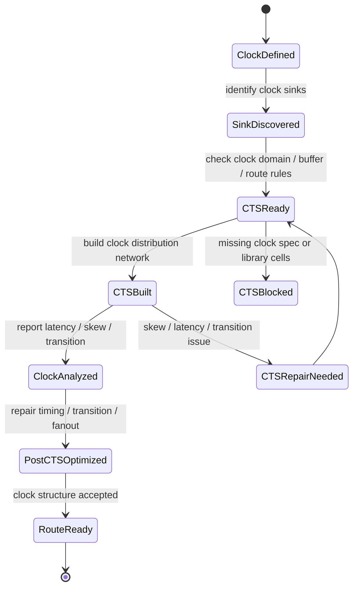
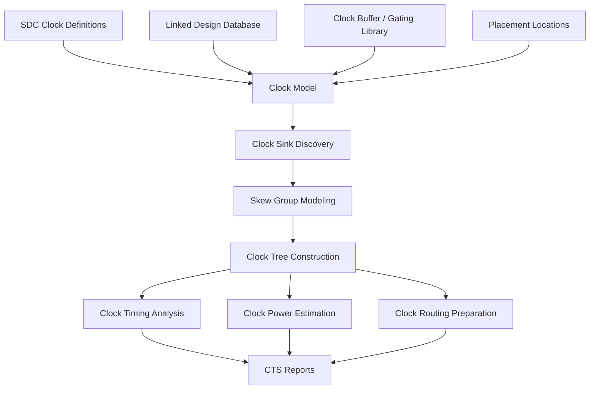

# 18. Clock Tree: Why the Clock Network Is Not a Regular Net, but the Rhythm System of Backend Implementation

Author: Darren H. Chen

Demo: `LAY-BE-18_clock_tree_concept`

Tags: `Backend Flow` `EDA` `Clock Tree` `CTS` `Skew` `Latency` `Clock Network` `Timing Closure` `Physical Implementation`

---

## 1. The Clock Network Is a Timing System, Not Just a Signal Net

In a digital chip, many nets simply transfer data values from one point to another.

A data net usually has a clear functional meaning:

```text
source pin -> load pins
```

It carries a logic value. The backend tool needs to make sure that the connection is legal, routable, and fast enough.

A clock net is different.

A clock net does not merely deliver a logic value. It delivers a timing event. It defines when registers capture data, when pipeline stages advance, when scan chains shift, and when synchronous state changes occur.

That is why a clock network should not be treated as a regular high-fanout net. It is the rhythm system of a synchronous design.

A clock tree must answer questions that a normal net usually does not need to answer:

```text
When does the clock arrive at each sink?
How different are the arrival times across sinks?
How large is the insertion delay?
How clean is the clock transition?
How much power does the clock network consume?
How stable is the clock route after routing?
How does clock latency affect setup and hold slack?
How are generated clocks, gated clocks, scan clocks, and clock domains represented?
```

The key idea is this:

```text
A data net affects the delay of data movement.
A clock net defines the time reference used to judge that data movement.
```

This makes clock tree construction one of the most important phase changes in backend implementation.

Before clock tree synthesis, the clock is often modeled as ideal or partially estimated. After clock tree synthesis, the clock becomes a real physical network made of buffers, inverters, wires, vias, gating cells, branches, and sink pins.

That transition changes the timing model of the entire design.

---

## 2. Data Nets and Clock Nets Have Different Engineering Objectives

A regular signal net usually focuses on connectivity, delay, capacitance, transition, and routing legality.

A clock net must satisfy all of those requirements, but it also has additional system-level objectives.

| Aspect | Regular Data Net | Clock Network |
|---|---|---|
| Primary role | Transfer logic value | Distribute timing event |
| Typical source | One driver pin | Clock source, clock port, PLL, generated clock point |
| Typical sinks | Logic input pins | Register clock pins, latch clock pins, gating cells, generated clock nodes |
| Main concerns | Delay, transition, capacitance, routing | Latency, skew, transition, power, balancing, clock domain correctness |
| Fanout | Often moderate, sometimes high | Often very high |
| Physical treatment | Routed as signal net unless special | Often uses dedicated buffers, shielding, NDR, route constraints |
| Timing role | Part of data path | Defines launch and capture timing references |
| Failure impact | Local or path-specific | Can affect an entire clock domain |

A data net can be optimized locally in many cases. A clock network is global by nature.

If a data net has poor routing, the impact may be limited to a path or a group of paths. If a clock tree has poor skew, latency, or transition, the impact can appear across thousands or millions of sequential endpoints.

Therefore, clock tree synthesis is not just buffer insertion. It is a controlled construction of a physical timing reference network.

---

## 3. Clock Arrival Is Part of the Timing Equation

To understand why clock tree is so important, we need to look at setup and hold timing.

A synchronous timing path can be simplified as:

```text
launch flip-flop -> data path -> capture flip-flop
```

The setup check can be written conceptually as:

```text
launch_clock_arrival
+ clock_to_Q
+ data_path_delay
+ setup_time
+ uncertainty
<=
capture_clock_arrival
+ clock_period
```

The hold check can be written conceptually as:

```text
launch_clock_arrival
+ clock_to_Q_min
+ data_path_delay_min
>=
capture_clock_arrival
+ hold_time
+ uncertainty
```

Both equations contain clock arrival times.

This means the clock tree is not a background object. It directly participates in slack calculation.

For setup:

```text
setup_slack = required_time - arrival_time
```

For hold:

```text
hold_slack = arrival_time - required_time
```

When the clock tree changes, both required time and arrival time relationships can change.

That is why timing before CTS and timing after CTS can be very different.

Before CTS, the tool may use an ideal clock model or an estimated latency model. After CTS, the tool sees actual buffer stages, actual clock net topology, estimated or routed clock wires, and real sink arrival differences.

This is why CTS is a major transition point in backend flow.

---

## 4. Clock Latency: The Clock Does Not Arrive Instantly

Clock latency is the time required for a clock signal to travel from its source to a clock sink.

A simplified clock path looks like this:

```text
clock source
  -> clock buffer
  -> clock inverter or buffer
  -> branch wire
  -> leaf buffer
  -> sink pin
```

Clock latency may include:

```text
source latency
network latency
clock buffer delay
clock inverter delay
clock net delay
via and wire RC delay
clock gating delay
clock mux delay
generated clock path delay
```

In backend implementation, clock latency is not simply minimized. It is managed.

A very small latency may not be the best result if it causes poor transition, high power, excessive buffering, or routing congestion. A slightly larger but more balanced and stable latency may produce better overall timing closure.

The engineering question is not:

```text
How do we make the clock arrive as fast as possible?
```

The better question is:

```text
How do we distribute the clock with controlled latency, acceptable skew, clean transition, reasonable power, and routable topology?
```

Clock latency is therefore a design variable, not merely a side effect.

---

## 5. Clock Skew: The Difference Between Clock Sink Arrivals

Skew is the difference in clock arrival time between related clock sinks.

Conceptually:

```text
skew = clock_arrival_time(sink_B) - clock_arrival_time(sink_A)
```

If two registers are connected by a timing path, the relative clock arrival times at the launch and capture registers affect both setup and hold.

Skew can help or hurt.

For setup, if the capture clock arrives later, the data path may receive more time:

```text
capture clock later -> setup required time later -> setup slack can improve
```

For hold, the same situation can make the check harder:

```text
capture clock later -> hold requirement later -> hold slack can worsen
```

This is why zero skew is not always the only goal.

In a simple educational model, zero skew sounds attractive. In real implementation, the goal is usually controlled skew under multiple constraints.

The tool may aim for:

```text
low skew inside a skew group
controlled latency across related groups
reasonable transition at sinks
manageable clock power
stable post-route behavior
acceptable setup and hold tradeoff
```

This is also why clock tree synthesis is tightly connected to timing closure.

---

## 6. Useful Skew and Harmful Skew

Skew is often described as bad, but that is too simple.

There are two broad types of skew from an engineering perspective:

```text
harmful skew
useful skew
```

Harmful skew worsens timing without providing a compensating benefit. It may create setup or hold violations, unstable timing margins, or large scenario-to-scenario variation.

Useful skew intentionally or naturally improves timing on a difficult path by shifting clock arrival relationships.

For example, if a setup-critical path needs more time, a later capture clock arrival can improve setup slack. But the same change must be checked against hold.

The tradeoff can be summarized as:

| Skew direction | Setup effect | Hold effect | Engineering meaning |
|---|---|---|---|
| Capture later | Often helps setup | Often hurts hold | May be useful if hold margin remains safe |
| Capture earlier | Often hurts setup | Often helps hold | May help hold but can damage setup |
| Launch later | Often hurts setup | Often helps hold | Needs path-specific review |
| Launch earlier | Often helps setup | Often hurts hold | Needs hold protection |

This is why clock tree strategy cannot be separated from setup and hold analysis.

A clock tree that looks balanced in isolation may not be optimal for timing closure. A clock tree that improves setup but destroys hold is also unacceptable.

The right target is not a visually symmetric tree. The right target is a timing-safe, physically stable, and routable clock distribution network.

---

## 7. Why a Clock Network Becomes a Tree

A clock net usually has many sinks. Directly connecting one clock source to all sinks is usually not feasible.

A direct high-fanout connection would create:

```text
large capacitance
poor transition
large delay
uncontrolled skew
routing congestion
excessive noise sensitivity
high power
```

Clock tree synthesis solves this by building a hierarchy of clock distribution stages.

```text
                    clock source
                         |
                    root buffer
                  /             \
             branch buffer    branch buffer
             /        \        /        \
        leaf buf    leaf buf leaf buf   leaf buf
          |           |        |          |
         FF          FF       FF         FF
```

The tree structure converts one huge fanout problem into many smaller fanout problems.

The tree controls:

```text
load seen by each driver
arrival time to sink groups
transition at intermediate and sink pins
branch topology
routing shape
buffer distribution
```

However, a clock tree is not always a perfect mathematical tree. Real designs may contain:

```text
clock gates
clock muxes
generated clock points
divider cells
integrated clock gating cells
clock domain crossings
scan clock structures
multiple roots or source points
local meshes or trunk structures in some designs
```

The word tree is still useful because the main idea is hierarchical distribution, but practical clock networks often include additional structures.

---

## 8. Clock Domains and Skew Groups

A chip often contains multiple clocks:

```text
core_clk
bus_clk
scan_clk
debug_clk
pll_clk
generated_clk
low_power_clk
```

Each clock can define a clock domain.

A clock domain is not only a name. It is a timing region with its own source, period, relationships, generated clocks, exceptions, mode constraints, and sink set.

Inside a clock domain, not all sinks necessarily require the same balancing strategy. This is where skew groups become important.

A skew group can be understood as:

```text
a set of clock sinks that should be balanced according to a common skew objective
```

A skew group may be formed based on:

```text
clock domain
clock source
register relationship
physical region
hierarchical block
clock gating structure
latency target
mode or scenario requirement
```

Poor skew group definition can cause serious problems:

```text
unrelated sinks may be over-balanced
related sinks may not be balanced enough
clock latency can become uneven
buffer count may increase unnecessarily
setup/hold tradeoff can become unstable
clock power can increase
```

Clock tree design therefore starts before buffer insertion. It starts with clock relationship modeling.

---

## 9. Clock Gating Is Part of the Clock Network

Clock gating is widely used to reduce dynamic power. When a block does not need to switch, its clock can be disabled through a clock gating structure.

A simplified clock gating structure is:

```text
clock -----> clock gating cell -----> gated clock sinks
enable ----> control input
```

Once a clock gating cell appears in the clock path, it becomes part of the clock network.

This introduces several engineering questions:

```text
Where should the gating cell be placed?
Should the gating cell be cloned?
How many sinks should each gating cell drive?
How does the enable signal meet timing?
How is the gated branch balanced?
How does the gating cell affect latency?
How does the tool separate clock path timing from enable path timing?
```

Clock gating also affects power and routing.

If a gating cell is too close to the root, it can save more clock power but may create a large gated branch with difficult balancing. If it is too close to the sinks, it may save less power and increase local complexity.

Clock gating is therefore not a side detail. It is a structural element of the clock network.

---

## 10. Clock Tree and Power

Clock networks often consume a significant portion of dynamic power.

A simplified dynamic power relationship is:

```text
P ≈ C × V² × f × activity
```

For clock networks:

```text
frequency is high
activity is close to 100 percent
fanout is large
wire capacitance can be large
buffer count can be large
```

This makes clock power very sensitive to topology and buffering.

Reducing skew by adding many buffers may improve timing but increase power. Improving transition by upsizing buffers may also increase dynamic power and leakage. Using wider clock wires can reduce resistance and improve stability, but may increase capacitance and routing resource usage.

Clock tree synthesis is therefore a power-aware physical timing problem.

A mature flow should track clock-related metrics such as:

```text
clock buffer count
clock inverter count
clock net capacitance
clock wirelength
clock switching power
clock gating coverage
sink transition distribution
clock tree depth
```

Without these reports, it is easy to improve skew while silently increasing clock power too much.

---

## 11. Clock Routing Rules and Post-Route Stability

Clock nets are sensitive to delay variation, coupling, transition, and routing topology.

Therefore, clock nets often use dedicated routing rules or non-default rules.

Typical clock routing constraints may include:

```text
preferred routing layers
wider wire width
larger spacing
shielding for selected nets
via control
routing topology constraints
trunk and leaf layer strategy
reduced coupling target
```

The reason is not cosmetic. The goal is to make clock delay more predictable and less sensitive to noise and routing variation.

If the clock route is too different from the CTS estimate, post-route timing can shift significantly.

This leads to a common problem:

```text
pre-route CTS timing looks acceptable
post-route clock latency changes
setup and hold results shift
more ECO loops are required
```

A good clock routing strategy reduces the gap between estimated clock behavior and routed clock behavior.

This is why clock tree concept should be understood together with routing resources, not only timing equations.

---

## 12. Pre-CTS and Post-CTS: A Major State Transition

Clock tree synthesis creates a major state transition in the backend database.

Before CTS, the clock is often represented as:

```text
ideal clock
estimated latency
estimated uncertainty
logical clock definition
sink list
constraint object
```

After CTS, the clock becomes:

```text
clock buffers
clock inverters
clock gating branches
clock route guides or clock routes
clock sink insertion delays
real or estimated clock net parasitics
skew group results
post-CTS timing context
```

This transition can be represented as a state machine:



This state transition is why CTS cannot be treated as a single command.

It is a stage with readiness checks, construction, reporting, repair, and acceptance criteria.

---

## 13. Clock Tree Architecture in the Backend Database

From a database perspective, clock tree is a network of objects and properties.

A simplified clock tree data model may include:

```text
ClockTreeModel = {
    clock_name,
    root_source,
    clock_domain,
    generated_clock_relations,
    sink_collection,
    skew_groups,
    clock_cells,
    gating_cells,
    branch_nets,
    latency_targets,
    route_rules,
    transition_limits,
    fanout_limits,
    power_metrics,
    report_objects
}
```

A useful architecture view is:



This model shows that clock tree construction consumes timing constraints, design objects, library cells, and physical locations at the same time.

It then produces clock network objects and reports that influence post-CTS timing, routing, and physical optimization.

---

## 14. CTS Readiness: What Must Be Checked Before Building the Clock Tree

A mature backend flow should not enter CTS blindly.

Before CTS, the following questions should be checked:

```text
Are all clocks defined?
Are generated clocks defined correctly?
Are clock ports or clock sources resolved?
Are clock sinks identifiable?
Are there unconstrained sequential cells?
Are clock domains and clock groups clear?
Are clock gating cells recognized?
Are valid clock buffers and inverters available?
Are dont_use settings compatible with CTS?
Are route rules or layer constraints prepared?
Are transition and capacitance limits defined?
Is pre-CTS timing reasonable enough to proceed?
Are scan/test clocks separated from functional clocks where needed?
```

These checks should be written into a report, not left as informal judgment.

Recommended readiness reports include:

```text
clock_definition_check.rpt
clock_sink_summary.rpt
clock_domain_summary.rpt
clock_buffer_library_check.rpt
clock_gating_summary.rpt
clock_route_rule_check.rpt
pre_cts_timing_summary.rpt
cts_readiness_summary.rpt
```

The purpose of CTS readiness is to prevent the tool from building a clock tree on top of incomplete or inconsistent clock intent.

---

## 15. Key Clock Tree Reports

A clock tree stage should generate structured reports.

At minimum, useful reports include:

| Report | Purpose |
|---|---|
| `clock_definition_check.rpt` | Check whether clock definitions are complete and resolvable |
| `clock_sink_summary.rpt` | Count sinks per clock and identify abnormal sinks |
| `clock_domain_summary.rpt` | Summarize clock domains, generated clocks, and clock groups |
| `skew_group_summary.rpt` | Show skew group membership and targets |
| `clock_latency_summary.rpt` | Report source-to-sink latency distribution |
| `clock_skew_summary.rpt` | Report skew within each clock or skew group |
| `clock_transition_summary.rpt` | Check clock slew at internal nodes and sinks |
| `clock_cell_usage.rpt` | Count clock buffers, inverters, and gating cells |
| `clock_power_summary.rpt` | Estimate clock network power contribution |
| `cts_stage_summary.rpt` | Provide stage-level PASS/WARN/FAIL summary |

These reports should answer:

```text
Which clocks exist?
How many sinks does each clock drive?
What is the latency distribution?
What is the skew distribution?
Are clock transitions acceptable?
How many clock cells were inserted?
Is clock power reasonable?
Are any clock domains suspicious?
Is the design ready for routing?
```

Without these reports, CTS becomes a black box.

---

## 16. Common Clock Tree Failure Patterns

Clock tree issues are often misdiagnosed as placement, timing, or routing problems. A structured failure pattern table helps isolate the cause.

| Failure pattern | Common symptom | Likely root cause | Review direction |
|---|---|---|---|
| Missing clock definition | Sequential cells not timed | Missing or incorrect clock constraint | Check clock definition and clock source |
| Unresolved generated clock | Incorrect path grouping | Generated clock relation missing | Check source pin and divide/multiply relation |
| Abnormal sink count | Too few or too many sinks | Clock not propagated to intended endpoints | Check clock net, gating, hierarchy |
| Large skew | Setup/hold instability | Poor balancing, wrong skew group, physical spread | Review skew group and sink distribution |
| Excessive latency | Large insertion delay | Too many buffers, long route, poor root selection | Review topology and physical distance |
| Poor transition | Slew violations on clock pins | Buffer strength, fanout, wire RC issue | Review buffer selection and load distribution |
| High clock power | Power increase after CTS | Too many buffers or excessive wire capacitance | Review clock cell count and route strategy |
| Post-route clock shift | Timing changes after routing | Clock route differs from CTS estimate | Review clock routing rules and parasitics |
| Hold explosion after CTS | Many hold violations | Skew relationship changed | Review launch/capture latency and useful skew |

This table is important because clock problems often appear as timing report symptoms. The report may say slack is bad, but the root cause may be clock topology or skew group definition.

---

## 17. Clock Tree Methodology: Build a Time Distribution System, Then Optimize Timing Around It

A good clock tree methodology can be summarized as:

```text
1. Define clocks clearly.
2. Resolve clock sources and generated clocks.
3. Identify clock sinks.
4. Define or infer skew groups.
5. Check available clock cells.
6. Check clock gating structures.
7. Prepare route rules.
8. Build the clock tree.
9. Report latency, skew, transition, power, and cell usage.
10. Repair post-CTS setup/hold/transition issues.
11. Prepare for clock routing and post-route timing.
```

The most important principle is:

```text
Clock tree is not a routing detail. It is the physical realization of the design's timing reference.
```

A weak clock tree can make an otherwise good placement difficult to close. A well-controlled clock tree can give later optimization stages a stable timing foundation.

---

## 18. Demo Design: `LAY-BE-18_clock_tree_concept`

This demo should not try to reproduce a full industrial CTS run. Its purpose is to make the clock tree concept observable and report-driven.

Recommended directory structure:

```text
LAY-BE-18_clock_tree_concept/
├─ data/
│  ├─ clock_sinks.csv
│  ├─ clock_domains.csv
│  ├─ skew_groups.csv
│  └─ sample_clock_report.rpt
├─ scripts/
│  ├─ run_clock_tree_demo.csh
│  └─ clean.csh
├─ tcl/
│  ├─ 01_check_clock_definitions.tcl
│  ├─ 02_report_clock_sinks.tcl
│  ├─ 03_report_clock_domains.tcl
│  ├─ 04_build_clock_tree_model.tcl
│  └─ 05_report_clock_tree_summary.tcl
├─ logs/
│  ├─ clock_tree_demo.log
│  ├─ clock_tree_demo.cmd.log
│  └─ clock_tree_demo.stdout.log
├─ reports/
│  ├─ clock_definition_check.rpt
│  ├─ clock_sink_summary.rpt
│  ├─ clock_domain_summary.rpt
│  ├─ skew_group_summary.rpt
│  ├─ clock_tree_model_summary.rpt
│  └─ cts_readiness_summary.rpt
└─ README.md
```

The demo should verify:

```text
clock definitions can be represented
clock sinks can be counted
clock domains can be summarized
skew groups can be modeled
clock tree metrics can be reported
CTS readiness can be judged from structured reports
```

The demo should focus on the data model and report structure:

```text
clock name
clock source
sink count
sink region
clock domain
skew group
latency target
skew target
transition target
readiness status
```

This makes the clock tree stage inspectable even before a full physical CTS run is available.

---

## 19. What to Check in Demo Reports

A useful Demo 18 report set should allow the reader to answer the following questions:

```text
How many clocks are present?
Which clock has the largest sink count?
Are generated clocks represented?
Are scan/test clocks separated from functional clocks?
Are skew groups defined or inferred?
Are there sinks without a clear clock domain?
Are clock buffer candidates available?
Are route rules documented?
Does the clock tree model have enough information to proceed to CTS?
```

A compact readiness summary may look like:

```text
CLOCK_DEFINITION_CHECK      : PASS
CLOCK_SINK_DISCOVERY        : PASS
CLOCK_DOMAIN_SUMMARY        : PASS
SKEW_GROUP_MODEL            : WARN
CLOCK_BUFFER_LIBRARY_CHECK  : PASS
CLOCK_ROUTE_RULE_CHECK      : WARN
CTS_READINESS               : REVIEW_REQUIRED
```

This type of summary is better than a vague statement such as:

```text
Clock tree setup looks OK.
```

The purpose is to turn clock tree preparation into a reviewable engineering state.

---

## 20. Engineering Takeaways

The clock network is not a regular net because it carries the timing reference of the synchronous system.

A clock tree must be understood through several connected layers:

```text
clock constraint layer
clock domain layer
sink collection layer
skew group layer
clock cell library layer
physical distribution layer
routing rule layer
timing analysis layer
power analysis layer
```

The key takeaways are:

1. Clock arrival is part of setup and hold equations.
2. Clock latency must be controlled, not simply minimized.
3. Skew can help or hurt depending on path direction and check type.
4. Clock tree topology converts huge fanout into manageable distribution stages.
5. Clock gating cells are structural elements of the clock network.
6. Clock power is significant because frequency and activity are high.
7. Clock routing rules are needed for stable post-route behavior.
8. CTS is a state transition from ideal clock modeling to physical clock distribution.
9. Clock tree quality must be judged through reports, not only by visual inspection.
10. A robust clock tree stage requires readiness checks, construction, analysis, repair, and acceptance criteria.

---

## 21. Conclusion

Data paths determine what the chip computes. The clock network determines when the chip computes.

That is why clock tree is not just another routing object. It is the physical implementation of the design's timing rhythm.

A backend flow that treats clock as a regular net will struggle with setup, hold, power, routing stability, and signoff correlation.

A mature backend flow treats clock tree as a dedicated timing distribution system, with clear clock definitions, sink modeling, skew groups, clock cell rules, routing constraints, structured reports, and post-CTS timing feedback.

The clock tree stage is where abstract clock constraints become a physical network that the rest of the backend flow must live with.
