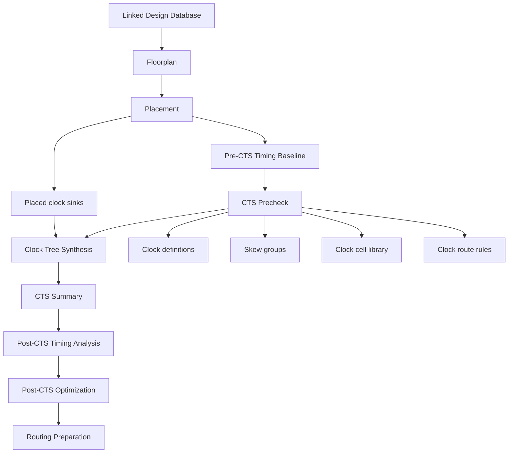
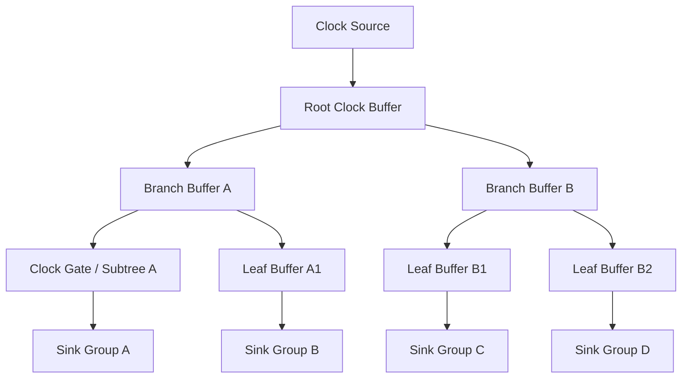
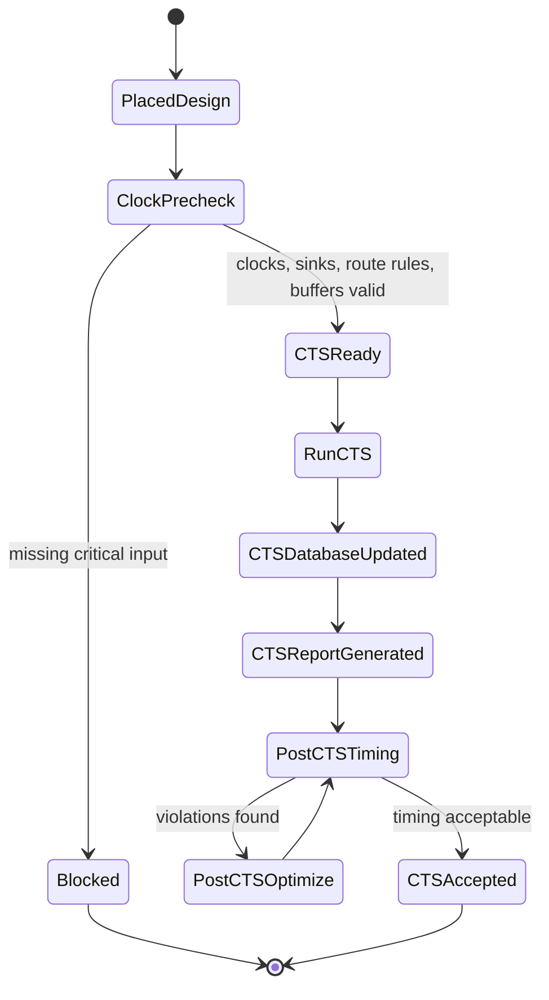

# 19. CTS Flow: What Clock Tree Synthesis Actually Synthesizes from Skew Groups to Clock Route Rules

Author: Darren H. Chen  
Topic: Backend Flow / Physical Implementation / Clock Tree Synthesis / Timing Closure  
Demo: `LAY-BE-19_cts_flow`

Clock Tree Synthesis is often described as the stage that inserts clock buffers and connects the clock to all sequential elements.

That description is technically true, but it is far too shallow for backend engineering.

A real CTS stage does not merely build a visible tree. It converts an abstract clock constraint into a physical time-distribution network under library, placement, timing, routing, power, and manufacturability constraints.

Before CTS, the clock is often treated as an ideal or partially estimated timing reference. After CTS, the clock becomes a real physical network made of cells, nets, branches, wire segments, transition constraints, route rules, latency distribution, and skew behavior.

This is why CTS is one of the most important phase transitions in backend flow.

The key question is not simply:

```text
How do we connect the clock to all sinks?
```

The real question is:

```text
How do we synthesize a physically realizable clock network that can distribute time predictably across many sinks while preserving setup, hold, power, routing, and reliability constraints?
```

This article explains CTS from the perspective of backend flow architecture, data models, optimization objectives, engineering reports, and demo design.

---

## 1. CTS Is Not Just Buffer Insertion

A clock tree is not an arbitrary buffered net. It is a timing infrastructure.

A data net usually carries a logic value from one driver to one or more loads. Its quality is judged by connectivity, delay, transition, capacitance, routability, and rule compliance.

A clock net must satisfy all of those requirements, but it must also satisfy something more fundamental: it must distribute a common time reference to a large number of sequential endpoints.

A clock network has to manage:

```text
clock latency
clock skew
clock transition
clock fanout
clock capacitance
clock buffer topology
clock gating structure
clock route rules
clock power
clock reliability
clock-domain relationships
post-CTS setup and hold behavior
```

Therefore CTS is not merely a physical net construction problem. It is a timing-system synthesis problem.

A simplified statement is:

```text
CTS synthesizes the physical implementation of clock arrival times.
```

The inserted buffers, inverters, clock routes, branches, and route rules are implementation mechanisms. The engineering target is controlled time distribution.

---

## 2. CTS Inputs: More Than a Clock Net Name

A mature CTS stage requires a broad input context. The clock net name alone is not sufficient.

| Input Category | Typical Content | Why It Matters |
|---|---|---|
| Clock definitions | primary clocks, generated clocks, clock period, waveform | define the timing reference |
| Clock sources | input ports, PLL outputs, generated clock points | define where distribution starts |
| Clock sinks | register clock pins, latch pins, integrated clock-gating outputs | define where distribution ends |
| Skew groups | groups of sinks that need common skew targets | define balancing intent |
| Clock cell library | buffers, inverters, clock gates, useful clock cells | defines legal construction elements |
| Placement state | sink locations, macro positions, blockages, rows | defines physical geometry |
| Timing context | setup/hold constraints, modes, corners, exceptions | defines timing objective |
| Route rules | preferred layers, width, spacing, shielding, NDR | defines expected physical implementation |
| Power constraints | clock power goals, gating structure, power domains | affects buffer and topology choices |
| Design rules | max transition, max cap, max fanout, DRC rules | constrains legal network construction |

If any of these inputs are wrong, CTS may still produce a result, but the result may not be meaningful.

For example:

```text
If clock sinks are incomplete, some sequential endpoints may not receive a real clock.
If skew groups are wrong, the tool may balance sinks that should not be balanced together.
If clock buffers are poorly selected, transition or power can become unacceptable.
If route rules are missing, post-route clock latency can drift far from CTS estimates.
If placement is poor, CTS may be forced into excessive detours and buffer stages.
```

CTS is therefore a context-sensitive stage. Its quality depends heavily on the correctness of the design state before it starts.

---

## 3. CTS Outputs: A Real Clock Distribution Network

CTS modifies the design database in many ways.

It may create or modify:

```text
clock buffer instances
clock inverter instances
clock gate cloning or restructuring
clock net segmentation
clock branch topology
clock sink connections
clock tree hierarchy
clock route guides
clock route rule assignments
clock latency distribution
clock skew distribution
clock transition distribution
post-CTS timing landscape
```

After CTS, the clock is no longer only a timing constraint. It has become a physical implementation object.

The database changes from:

```text
Clock = abstract timing reference
```

to:

```text
Clock = physical network of cells, nets, branches, sinks, delays, and constraints
```

This is why CTS is a major transition point in backend flow.

---

## 4. The Architectural Position of CTS in Backend Flow

CTS normally occurs after placement and before routing.

The reason is structural:

```text
CTS needs placed clock sinks.
CTS needs macro and blockage information.
CTS must build the clock before detailed signal routing.
CTS changes timing enough to require post-CTS optimization.
```

A simplified flow is:



Before CTS, many timing reports are based on ideal or estimated clock assumptions.

After CTS, timing includes real clock insertion delay, clock buffer delay, clock branch delay, clock net delay, real skew, and clock transition behavior.

This is why post-CTS timing must always be analyzed again.

---

## 5. The Core Timing Equation Behind CTS

Clock tree behavior directly enters setup and hold equations.

For a setup check, a simplified relationship is:

```text
launch_clock_arrival
+ clock_to_Q
+ data_path_delay
+ setup_time
+ uncertainty
<= capture_clock_arrival
+ clock_period
```

For a hold check, a simplified relationship is:

```text
launch_clock_arrival
+ clock_to_Q_min
+ data_path_delay_min
>= capture_clock_arrival
+ hold_time
+ uncertainty
```

Both `launch_clock_arrival` and `capture_clock_arrival` are created by the clock network.

Therefore CTS changes slack.

A clock tree can improve setup by making capture clock later or launch clock earlier in selected relationships. However, the same skew can hurt hold. Conversely, changes that help hold can reduce setup margin.

This is one of the main reasons CTS is a balancing problem rather than a simple shortest-delay problem.

---

## 6. Skew Group: The First Key to CTS Modeling

A skew group is a set of clock sinks that should be balanced under a shared skew target.

This concept is critical because not all sinks should be balanced together.

A design can contain:

```text
core functional clocks
bus clocks
scan clocks
generated clocks
clock-gated branches
divided clocks
low-power domain clocks
asynchronous clocks
```

If the tool balances sinks across unrelated domains, the resulting topology can be wrong.

If the tool fails to balance sinks within a synchronous relationship, timing can become unstable.

A skew group is therefore a timing relationship object, not merely a physical cluster.

| Skew Group Issue | Typical Consequence |
|---|---|
| Missing skew group | sinks may not be balanced correctly |
| Overly broad skew group | unrelated sinks are forced into the same balancing objective |
| Overly narrow skew group | related sinks may drift apart |
| Wrong generated-clock grouping | generated-clock timing can be mis-modeled |
| Scan clock mixed with functional clock | functional and test-mode objectives can conflict |
| Clock-gating branch not modeled | gated subtrees may receive poor balancing treatment |

CTS must synthesize clock topology according to timing relationships, not just according to geometric proximity.

---

## 7. CTS Objective Function: A Multi-Constraint Optimization Problem

At a high level, CTS can be viewed as a constrained optimization problem.

```text
Minimize:
  skew cost
  latency cost
  transition cost
  capacitance cost
  fanout cost
  clock power cost
  congestion cost
  route-rule violation cost
  post-CTS timing degradation cost

Subject to:
  all sinks connected
  legal clock cell usage
  legal placement
  max transition constraints
  max capacitance constraints
  max fanout constraints
  skew group constraints
  route layer constraints
  blockage constraints
  scenario constraints
  clock-gating constraints
```

These goals conflict.

For example:

```text
Reducing skew may require more buffers.
More buffers can increase dynamic power.
Reducing clock latency can worsen congestion.
Using stronger buffers can improve transition but increase input loading.
Using wider routes can stabilize delay but consume routing resources.
Reducing buffer count can reduce power but worsen transition and skew.
```

A good CTS result is not a single-metric optimum. It is an engineering compromise that remains stable across timing, power, route, and rule checks.

---

## 8. Clock Buffer Selection: Why Bigger Is Not Always Better

Clock buffers drive clock load. However, the strongest buffer is not always the best choice.

A large clock buffer can provide:

```text
stronger drive
better transition
lower output resistance
possibly lower stage delay
```

But it can also create:

```text
larger input capacitance
higher switching power
larger cell area
local placement pressure
potential EM concerns
larger downstream impact if overused
```

A smaller buffer can save area and power, but it may require more stages or produce poor transition.

CTS buffer selection must consider:

```text
sink load
branch load
clock transition target
buffer delay
power cost
placement legality
route congestion
library availability
scenario behavior
```

This is why a clock buffer list is an important CTS input. The list should not be an arbitrary set of cells; it should be a curated clock construction library.

---

## 9. Clock Topology: Ideal Trees Versus Engineering Trees

Textbook clock structures include:

```text
H-tree
balanced binary tree
fishbone
mesh-like structure
hybrid tree
```

These structures are useful mental models, but real CTS rarely produces a perfect textbook tree.

Actual designs have:

```text
irregular sink distribution
macros and hard blockages
IO constraints
power straps
routing congestion
voltage domains
hierarchy boundaries
clock gates
scan/test structures
non-uniform placement density
```

The practical CTS topology is therefore a feasible engineering topology.

It must distribute time while respecting the physical world created by floorplan and placement.

A simplified topology model is:



This diagram is not meant to imply a fixed shape. It illustrates that clock topology is a hierarchy of distribution decisions.

---

## 10. Clock Route Rules: Why CTS Cannot Be Separated from Routing

CTS estimates clock delay before detailed routing. However, real clock delay depends heavily on routed wire RC.

If CTS assumes one physical implementation while routing uses another, post-route clock timing can shift significantly.

Clock route rules help align CTS estimation with routing implementation.

Typical clock route rules include:

```text
preferred routing layers
minimum and maximum routing layers
non-default width
non-default spacing
shielding requirements
via rule preferences
routing blockage awareness
trunk/leaf layer separation
coupling control
```

The role of a clock route rule is to make the physical realization of the clock predictable.

Without route rules, a CTS result may look acceptable in the CTS report but become unstable after routing.

---

## 11. Pre-CTS Timing Versus Post-CTS Timing

Pre-CTS timing and post-CTS timing can differ dramatically.

Before CTS, clocks may be:

```text
ideal
estimated
propagated only partially
modeled with simplified latency
```

After CTS, clocks include:

```text
real clock buffers
real branch nets
real sink latency
real insertion delay
real skew
clock transition
clock net RC estimation
clock reconvergence behavior
```

The timing equation has changed.

This explains common post-CTS observations:

```text
setup WNS changes
hold violations increase
clock transition violations appear
skew outliers become visible
some paths improve due to useful skew
some paths degrade due to unfavorable skew
clock power increases
```

A mature flow treats CTS as a measurable timing event. It does not simply run CTS and move on.

---

## 12. Post-CTS Optimization: What Is Being Fixed?

After CTS, the design often needs post-CTS optimization.

Typical targets include:

```text
setup violations
hold violations
clock transition violations
clock capacitance violations
clock fanout violations
skew outliers
data path degradation caused by real clock behavior
local congestion caused by clock buffers
placement disturbance caused by inserted clock cells
```

Hold fixing is especially important after CTS.

Before CTS, hold timing may be based on incomplete clock assumptions. After CTS, real skew appears, and short data paths can become critical.

Post-CTS optimization may include:

```text
insert delay cells on data paths
resize data path cells
perform incremental placement
repair clock transition
adjust local clock buffering
rebalance skew outliers
update timing reports
```

This shows that CTS is not the end of clock work. CTS creates a real clock network, and post-CTS optimization repairs the design under that new reality.

---

## 13. CTS as a State Machine

CTS can be modeled as a state transition process.



This state machine emphasizes that CTS is not one command. It is a gated engineering stage.

A robust CTS stage should have:

```text
precheck gate
CTS execution
summary report
post-CTS timing
pre/post comparison
post-CTS optimization loop
acceptance gate
```

---

## 14. CTS Precheck: What Must Be Verified Before Running CTS

A CTS stage should not begin blindly.

A recommended CTS precheck includes:

| Check Item | Purpose |
|---|---|
| Clock definitions exist | ensure clocks are known |
| Clock sources are valid | ensure distribution starts correctly |
| Clock sinks are detected | ensure sequential endpoints are visible |
| Skew groups are defined | ensure balancing intent is clear |
| Clock buffer list exists | ensure legal cells are available |
| Clock gating cells are recognized | ensure gating structure is handled |
| Route rules are assigned | ensure physical clock routing is predictable |
| Placement is legal | ensure sinks have stable locations |
| Macro and blockage data are valid | ensure CTS respects physical obstacles |
| Pre-CTS timing baseline exists | ensure comparison is possible |

A precheck report may look like:

```text
[PASS] clock definition found: CORE_CLK
[PASS] sink count: 12893
[PASS] clock buffer list found
[WARN] skew group CORE_CLK has large sink spread
[FAIL] no clock route rule assigned for SCAN_CLK
[BLOCK] CTS should not proceed until route rule is assigned
```

The goal is to move CTS failures earlier in the flow, where they are cheaper to diagnose.

---

## 15. CTS Reports: What to Read After CTS

A CTS run should produce structured reports.

Important report categories include:

```text
clock tree summary
clock sink summary
clock buffer count
clock inverter count
clock gate summary
latency distribution
skew distribution
transition distribution
capacitance violations
fanout violations
clock route rule usage
clock power estimate
worst skew group
outlier sinks
post-CTS timing summary
```

A useful CTS summary should answer:

```text
Which clocks are hardest to close?
Which skew groups have the worst skew?
Are too many clock buffers inserted?
Is latency larger than expected?
Are there transition outliers?
Are route rules applied correctly?
Did setup improve or degrade after CTS?
Did hold violations increase?
Which clocks should be debugged first?
```

CTS reports are not administrative output. They are the basis for clock network diagnosis.

---

## 16. Pre/Post CTS Delta: The Most Important Engineering View

The most useful CTS analysis is often not the CTS report alone.

It is the delta between pre-CTS and post-CTS design states.

Recommended comparisons include:

| Metric | Pre-CTS | Post-CTS | Why It Matters |
|---|---:|---:|---|
| Setup WNS | value | value | shows setup impact |
| Setup TNS | value | value | shows total setup degradation/improvement |
| Hold WNS | value | value | shows hold risk |
| Hold violations | count | count | shows short-path impact |
| Clock latency max | estimated | real | shows insertion delay |
| Clock skew max | estimated | real | shows balancing quality |
| Clock transition violations | count | count | shows clock slew quality |
| Clock buffer count | 0/estimated | real | shows network cost |
| Clock power estimate | estimated | real | shows power impact |
| Congestion hotspots | before | after | shows physical side effects |

A `cts_delta_summary.rpt` converts CTS from a black-box tool execution into an explainable engineering event.

---

## 17. Failure Patterns in CTS

CTS failures can be grouped into several patterns.

| Failure Pattern | Typical Symptom | Likely Root Cause | Debug Direction |
|---|---|---|---|
| Missing clock sinks | low or zero sink count | clock definition or sequential recognition issue | check SDC and linked design |
| Large skew outlier | one sink group much worse than others | poor sink distribution, blockage, wrong skew group | inspect sink location and group definition |
| Excessive latency | clock arrives too late | too many stages, detours, weak buffers | review topology and buffer choices |
| Poor transition | slew violations on clock pins | weak buffers, large load, bad branch split | review buffer sizing and cap limits |
| Too many buffers | clock power and area high | over-constrained skew or transition | relax targets or improve topology |
| Hold explosion | many hold violations post-CTS | real skew revealed short paths | run hold-focused post-CTS repair |
| Route-rule mismatch | post-route timing changes heavily | CTS and routing assumptions differ | verify clock route rules |
| Congestion around clock trunks | route pressure increases | poor trunk placement or layer selection | inspect route guide and macro channels |

Classifying CTS issues is important because different symptoms require different fixes.

---

## 18. Demo Design: `LAY-BE-19_cts_flow`

The purpose of this demo is not to build an industrial CTS engine. It is to demonstrate how a CTS stage should be organized, observed, and compared.

A recommended structure is:

```text
LAY-BE-19_cts_flow/
├─ data/
│  ├─ sample_pre_cts_timing.rpt
│  ├─ sample_cts_summary.rpt
│  ├─ sample_post_cts_timing.rpt
│  └─ clock_config.csv
├─ scripts/
│  ├─ run_demo.csh
│  └─ clean.csh
├─ tcl/
│  ├─ 01_cts_precheck.tcl
│  ├─ 02_run_cts_stage.tcl
│  ├─ 03_report_cts_summary.tcl
│  ├─ 04_report_post_cts_timing.tcl
│  └─ 05_compare_pre_post_cts.tcl
├─ logs/
│  ├─ LAY-BE-19_cts_flow.log
│  ├─ LAY-BE-19_cts_flow.cmd.log
│  └─ LAY-BE-19_cts_flow.sum.log
├─ reports/
│  ├─ cts_precheck.rpt
│  ├─ cts_summary.rpt
│  ├─ post_cts_timing.rpt
│  ├─ cts_delta_summary.rpt
│  └─ hold_fix_risk_summary.rpt
└─ README.md
```

The demo should verify:

```text
CTS entry conditions are checked.
Clock sinks and skew groups can be summarized.
Clock route rules are recorded.
CTS summary metrics can be extracted.
Post-CTS timing can be compared against pre-CTS timing.
Hold-risk increase can be reported.
```

The key output is not a visually beautiful clock tree. The key output is an auditable CTS engineering record.

---

## 19. Example CTS Stage Checklist

A practical CTS stage checklist can be organized as follows:

| Stage | Required Evidence |
|---|---|
| Before CTS | legal placement, valid clocks, valid sinks, valid skew groups, clock cells, route rules |
| During CTS | command log, stage log, clock insertion summary |
| After CTS | latency report, skew report, transition report, buffer count, clock power estimate |
| Timing review | post-CTS setup report, post-CTS hold report, pre/post delta summary |
| Acceptance gate | no blocking CTS errors, controlled skew, acceptable transition, repairable timing |

This checklist makes CTS review repeatable.

Without such evidence, CTS quality is often judged only by whether the command completed, which is not enough.

---

## 20. Engineering Methodology: CTS as a Quality Gate

CTS should be treated as a quality gate between placement and routing.

A recommended method is:

```text
1. Establish pre-CTS timing baseline.
2. Run CTS precheck.
3. Verify clock definitions, sinks, skew groups, and route rules.
4. Run CTS.
5. Generate CTS summary.
6. Run post-CTS timing analysis.
7. Compare pre/post timing and clock metrics.
8. Classify setup, hold, transition, skew, and congestion issues.
9. Run post-CTS optimization if necessary.
10. Accept CTS only when timing and clock quality are explainable.
```

This method keeps CTS from becoming a blind execution step.

It also makes post-CTS failures easier to trace:

```text
Is this a clock definition problem?
Is this a skew group problem?
Is this a buffer selection problem?
Is this a route rule problem?
Is this a placement quality problem?
Is this a hold repair problem?
```

CTS debug becomes much clearer when each question has a report artifact.

---

## 21. Summary

CTS synthesizes much more than a set of clock buffers.

It synthesizes a physical time-distribution network from:

```text
clock definitions
clock sinks
skew groups
clock cell libraries
placement geometry
routing assumptions
timing constraints
power and rule constraints
```

The resulting network determines:

```text
clock latency
clock skew
clock transition
clock power
post-CTS setup timing
post-CTS hold timing
routing readiness
post-CTS repair effort
```

A mature backend flow therefore treats CTS as a controlled engineering stage with:

```text
precheck
execution
summary reporting
post-CTS timing
pre/post comparison
post-CTS optimization
acceptance criteria
```

The practical conclusion is simple:

```text
CTS does not merely connect a clock net.
CTS turns an abstract clock constraint into a real physical timing network.
```

If this network is not well modeled, reported, and compared, timing closure becomes unstable in the next stages.

