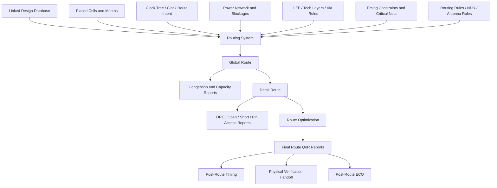
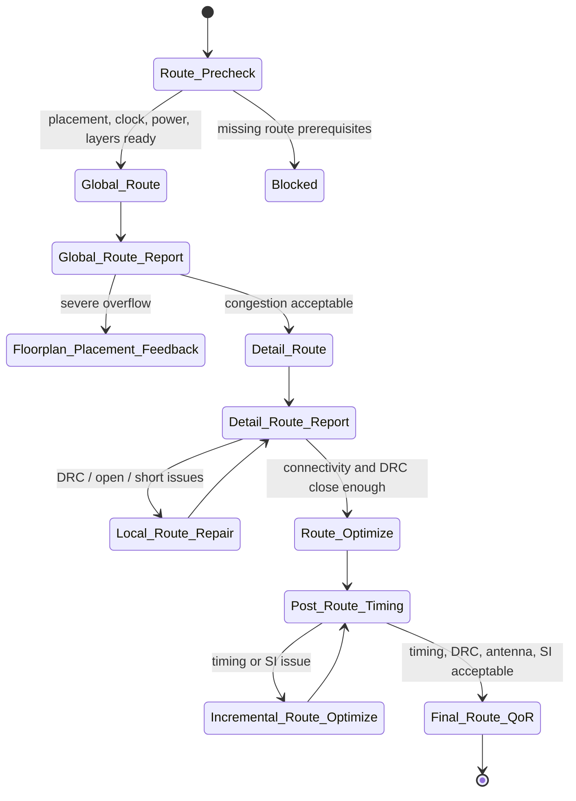

# 20. Routing: What Global Route, Detail Route, and Route Optimization Solve in Backend Flow

Author: Darren H. Chen  
Topic: Backend Flow / Physical Implementation / Routing / Congestion / DRC / Timing Closure  
Demo: `LAY-BE-20_routing`

Routing is often described as the backend stage that connects cells and macros with wires.

That description is correct, but it hides most of the engineering difficulty.

A placed design already has cells, pins, macros, rows, blockages, clock trees, power structures, and timing constraints. The remaining task is not simply to draw wires between pins. The routing stage must transform logical connectivity into manufacturable metal and via geometry under capacity, design-rule, timing, antenna, signal-integrity, and signoff constraints.

This is why routing is rarely a single action. It is usually separated into several levels:

```text
global route
↓
detail route
↓
route optimization
```

These stages solve different problems.

Global route answers:

```text
Where should each net roughly go, and is the routing resource sufficient?
```

Detail route answers:

```text
How can each net be implemented as exact tracks, wires, vias, and legal geometries?
```

Route optimization answers:

```text
After connectivity exists, does the routed design still satisfy timing, DRC, antenna, SI, and final QoR goals?
```

Understanding this separation is essential. Many routing failures are misunderstood because engineers treat routing as one black-box command. A mature backend flow should inspect global route, detail route, and route optimization separately, with separate reports, separate quality checks, and separate fallback decisions.

---

## 1. Routing Converts Connectivity into Manufacturing Geometry

Before routing, a net is a logical connectivity object.

For example:

```text
net N1 connects:
  U1/Z
  U2/A
  U3/B
```

After placement, the tool knows where `U1`, `U2`, and `U3` are located. It also knows the approximate or exact pin geometries from LEF and design database objects.

But the net is not yet a manufacturable shape.

Routing must convert it into:

```text
metal segments
vias
layers
wire widths
wire spacings
routing topology
pin access connections
legal geometry
```

A simplified transformation is:

```text
logical net
  ↓
placed pins
  ↓
routing topology
  ↓
track assignment
  ↓
wire and via geometry
  ↓
DRC-clean routed layout
```

This is the point where the backend database becomes much closer to final layout. Placement determines where objects are. Routing determines how those objects are physically connected.

A useful mental model is:

```text
placement maps cells into space;
routing maps nets into metal resources.
```

---

## 2. The Routing Problem Is a Multi-Layer Resource Allocation Problem

Routing is not performed on an unlimited blank canvas.

The routing fabric is constrained by:

```text
metal layers
preferred directions
routing tracks
via rules
blockages
macro obstructions
power stripes
clock routing structures
spacing rules
width rules
antenna rules
manufacturing grid
```

A simplified multi-layer model looks like this:

```text
M1: local connection layer / pin access layer
M2: preferred vertical routing
M3: preferred horizontal routing
M4: preferred vertical routing
M5: preferred horizontal routing
...
VIA12: connects M1 to M2
VIA23: connects M2 to M3
...
```

Routing can be abstracted as a graph search problem:

```text
RoutingGraph = Nodes + Edges + Capacities + Costs + Rules
```

Where:

| Element | Meaning |
|---|---|
| Node | routing grid point, gcell, track point, pin access point |
| Edge | possible wire segment or layer transition |
| Capacity | available routing resource in a region or track |
| Cost | wirelength, congestion, via count, timing cost, rule risk |
| Rule | spacing, width, via, blockage, antenna, NDR, layer constraint |

A router must find paths for many nets while sharing limited resources.

The difficult part is coupling:

```text
one net consumes resources;
resource consumption affects other nets;
detours affect timing;
timing fixes affect congestion;
DRC repair changes geometry;
geometry changes parasitics;
parasitics change slack.
```

This is why routing cannot be understood as a drawing operation. It is a constrained resource allocation and physical realization problem.

---

## 3. Routing Architecture in Backend Flow

A routing stage typically consumes the output of placement and CTS, then produces the physical connectivity needed for signoff preparation.



This architecture shows a key point: routing is not isolated. It sits at the intersection of placement, clock implementation, power structure, technology rules, timing constraints, and signoff requirements.

A routing flow that only checks whether a command finished is too shallow. A routing flow must check whether the physical connectivity is healthy.

---

## 4. Global Route: Planning Routing Corridors and Capacity

Global route does not usually produce final detailed metal shapes.

It solves a coarser problem:

```text
Which approximate regions, layers, and corridors should each net use?
```

The routing area is often divided into coarse regions or grid cells. The global router estimates demand and capacity across those regions.

A simple grid example:

```text
+------+------+------+
| G1   | G2   | G3   |
+------+------+------+
| G4   | G5   | G6   |
+------+------+------+
| G7   | G8   | G9   |
+------+------+------+
```

If many nets need to pass through `G5`, demand may exceed available routing capacity.

Global route reports this as congestion or overflow.

Global route mainly answers:

```text
Which regions are overloaded?
Which nets are likely to be difficult?
Which layers are overused?
Which macro channels are too narrow?
Which pin-dense areas are risky?
Is the placement routable at a global level?
```

Typical global route outputs include:

```text
routing guides
congestion map
edge overflow report
estimated wirelength
estimated via count
layer usage summary
critical net routing estimate
```

A good global route result does not guarantee clean detail route, but a bad global route result is a strong warning that detail route will struggle.

---

## 5. What Global Route Does Not Solve

Global route is intentionally approximate.

It does not fully solve:

```text
exact track assignment
exact pin access
exact via placement
all local spacing rules
all end-of-line rules
all cut spacing rules
all min-area rules
all detailed DRC interactions
```

That is why a global route can look acceptable while detail route still fails locally.

For example:

```text
Global route says a net can pass through a macro channel.
Detail route discovers that pin access and local tracks are blocked.
```

Or:

```text
Global route sees enough capacity in a region.
Detail route sees a via spacing conflict near a dense pin cluster.
```

Therefore global route should be interpreted as a routability planning stage, not as final routing success.

---

## 6. Global Route Metrics

Global route reports should be interpreted with clear metrics.

| Metric | Meaning | Engineering Use |
|---|---|---|
| Total overflow | total amount of demand exceeding capacity | overall routability risk |
| Max overflow | worst local overflow | hotspot severity |
| Overflow edges | number of over-capacity grid edges | spread of congestion |
| Layer usage | demand per routing layer | layer imbalance diagnosis |
| Estimated wirelength | approximate route length | timing and power proxy |
| Estimated via count | approximate layer transitions | delay, reliability, and DRC proxy |
| Critical net detour | detour on timing-sensitive nets | timing risk |
| Macro channel overflow | congestion near macros | floorplan feedback |

The most important point is trend analysis.

A single global route report is useful. But comparing global route reports across placement or floorplan iterations is much more useful.

For example:

```text
Iteration A: max overflow high near macro channel
Iteration B: macro moved, max overflow reduced
Iteration C: local density reduced, overflow edges reduced
```

This kind of comparison turns routing from a late-stage surprise into an early physical feedback loop.

---

## 7. Detail Route: Turning Routing Intent into Legal Geometry

Detail route uses the global route intent and creates exact routing geometry.

It decides:

```text
which track to use
which layer to use
where to enter each pin
where to place each via
how to avoid blockages
how to satisfy spacing rules
how to resolve shorts and opens
how to repair local DRCs
```

Detail route is where abstract connectivity becomes actual layout geometry.

It must solve many local constraints that global route does not fully model:

```text
pin access
track assignment
via enclosure
cut spacing
end-of-line spacing
minimum area
short avoidance
open avoidance
macro obstruction avoidance
route blockage compliance
```

This stage is usually much more rule-sensitive.

If detail route fails, the reason may be very local:

```text
a pin has no legal access point;
a macro blockage blocks all available tracks;
a via cannot be legally placed;
two dense nets create unavoidable spacing conflicts;
a small detour creates min-area or notch issues;
local power and clock structures consume too many tracks.
```

---

## 8. Pin Access Is Often the First Local Routing Bottleneck

A router must connect wires to pins.

This sounds simple, but pin access is frequently difficult.

A standard cell or macro pin may have limited shapes, limited layers, and nearby obstructions. If many pins are packed in a small region, legal access points can be scarce.

Typical pin access problems include:

```text
pin shape too small
pin blocked by cell obstruction
pin blocked by macro obstruction
adjacent pin spacing conflict
no legal via access
wrong routing layer preference
high local pin density
```

Pin access is especially important near:

```text
standard-cell pin clusters
macro boundaries
clock buffers
scan register clusters
power strap intersections
high-density placement regions
```

A route failure near a pin is not always a router weakness. It may indicate poor placement density, difficult library pin geometry, macro channel issues, or excessive blockage.

---

## 9. Detail Route Metrics

A detail route report should not only say `route completed`.

It should summarize physical health.

| Metric | Meaning | Risk Indicated |
|---|---|---|
| Open count | nets not fully connected | functional failure |
| Short count | unintended connections | functional and signoff failure |
| DRC count by type | rule violations | manufacturability risk |
| Pin access failures | pins with no legal route access | library / placement / macro channel issue |
| Via count | number of vias | delay, reliability, and DRC risk |
| Wirelength by layer | route length distribution | layer overuse or timing risk |
| Detour estimate | route path longer than expected | timing and congestion risk |
| Antenna risk count | potential antenna violations | manufacturing reliability risk |
| Local hotspot list | regions with repeated repair | routing convergence risk |

A healthy detail route is not simply connected. It should also be DRC-clean or close to clean, timing-aware, not excessively detoured, and not dominated by local route repair loops.

---

## 10. Route Optimization: Fixing the Routed Design

After detail route, the design has real or near-real routing geometry.

This exposes issues that earlier stages could only estimate.

Route optimization addresses questions such as:

```text
Did routing degrade timing?
Are transition and capacitance still acceptable?
Are there antenna risks?
Are there DRC hotspots?
Are critical nets routed with excessive detours?
Are coupling effects significant?
Can via count be improved?
Can selected nets be widened or spaced?
Can incremental reroute improve QoR?
```

Route optimization may include:

```text
timing-driven reroute
wire spreading
wire widening
via optimization
antenna fixing
buffer insertion
cell resizing
incremental placement repair
crosstalk-aware cleanup
DRC cleanup
hold/setup repair
```

This stage is highly coupled.

For example:

```text
fixing a DRC may increase wirelength;
reducing coupling may increase congestion;
adding a buffer may require placement space;
fixing hold may worsen power and area;
fixing antenna may add diode cells or layer jumps;
rerouting one net may create new violations nearby.
```

Therefore route optimization should be measured as a convergence process, not a one-command cleanup step.

---

## 11. Why Timing Changes After Routing

Before detailed routing, net delay is usually estimated.

After routing, wire geometry becomes more realistic. The tool can calculate or estimate more accurate RC.

Timing changes because routing changes:

```text
wirelength
layer assignment
via count
wire resistance
wire capacitance
coupling capacitance
route detour
pin access path
clock route realization
shielding or spacing
```

In timing equations, net delay affects both data paths and clock paths.

Therefore post-route timing can differ significantly from pre-route timing.

A path that looked acceptable after placement may fail after routing if:

```text
the routed net detours around a macro;
the net uses lower-resistance assumptions before route;
the final via count is high;
coupling capacitance is larger than estimated;
clock path and data path change differently.
```

This is why post-route timing is not optional. It is the first timing analysis based on much more concrete physical connectivity.

---

## 12. Routing and DRC Are Tightly Coupled

Detail route must obey design rules.

These rules may include:

```text
minimum width
minimum spacing
end-of-line spacing
minimum area
via enclosure
cut spacing
parallel run length rules
antenna rules
density-related rules
non-default route rules
blockage rules
```

At advanced nodes, rule interactions can be highly complex.

A route that is topologically correct may still be illegal.

For example:

```text
The net is connected, but spacing is violated.
The wire is legal alone, but illegal near a via.
The route avoids shorts, but creates min-area violations.
The detour fixes congestion, but creates antenna risk.
```

This is why route DRC reports must be part of the routing evidence chain.

Routing is not complete just because connectivity exists. It is complete only when connectivity, legality, timing, and signoff readiness are all acceptable.

---

## 13. Routing and Antenna Effects

Antenna risk appears during manufacturing when long metal segments connected to gate inputs accumulate charge before a discharge path exists.

Routing can affect antenna in several ways:

```text
long metal segment length
layer usage
via jumping strategy
connection order
presence of diode cells
connection to diffusion
```

Antenna repair may require:

```text
jumping to higher layers
inserting antenna diodes
changing route topology
adding vias
rerouting selected nets
```

These repairs can affect:

```text
timing
area
congestion
DRC
power
```

Therefore antenna fixing should not be treated as a disconnected final cleanup. It is part of post-route convergence.

---

## 14. Routing and Signal Integrity

After routing, wires have real neighborhood relationships.

This introduces coupling and crosstalk effects.

Signal integrity concerns include:

```text
coupling capacitance
crosstalk delay
noise glitch
aggressor/victim interaction
clock sensitivity
hold degradation
setup degradation
```

Possible mitigation methods include:

```text
wire spacing
shielding
critical net protection
slew control
layer reassignment
reroute
buffer insertion
```

SI cannot be fully understood before routing because adjacency is not yet concrete.

This is another reason why post-route analysis often reopens timing and optimization loops.

---

## 15. Routing and Congestion Feedback

Congestion means routing demand exceeds available routing resources.

It can arise from:

```text
high placement density
narrow macro channels
high pin density
limited routing layers
power stripes consuming tracks
clock routes consuming preferred resources
scan chains crossing regions
bus structures crossing the chip
IO placement mismatch
floorplan constraints
```

Routing congestion should be treated as feedback to earlier stages.

A router can repair some local issues, but it cannot always fix a fundamentally over-constrained floorplan or placement.

For example:

```text
If macro spacing is too narrow, detail route cannot invent routing tracks.
If pin density is too high, route optimization may only move violations around.
If placement packs too many cells near a blocked region, global route overflow may persist.
```

Mature routing debug asks:

```text
Is this a routing problem?
Or is it a floorplan / placement / macro / IO / power-structure problem exposed by routing?
```

---

## 16. Timing-Driven Routing versus Congestion-Driven Routing

Routing resources are limited.

Timing-driven routing tries to give important nets better routing resources:

```text
shorter path
higher metal layer
fewer vias
less coupling
better shielding
less detour
```

Congestion-driven routing tries to spread demand and avoid overflow.

These goals can conflict.

For example:

```text
A critical net wants the shortest path through a congested region.
Congestion avoidance wants to detour it around the region.
```

A mature routing strategy classifies nets:

| Net Type | Typical Routing Priority |
|---|---|
| clock net | controlled route rule, skew and latency sensitivity |
| critical data net | timing-aware resource priority |
| high-fanout control net | capacitance and congestion awareness |
| scan chain net | routability and test-mode timing awareness |
| power/ground net | special routing and reliability priority |
| non-critical data net | flexible detour tolerance |

The key engineering question is:

```text
Which nets deserve scarce routing resources, and which nets can tolerate lower-quality paths?
```

That question cannot be answered by connectivity alone. It needs timing, physical, and design-intent context.

---

## 17. Routing State Machine

Routing can be represented as a stage state machine.



This state machine is useful because it prevents a common mistake: forcing all routing problems into local detail-route repair.

Some problems should go back to floorplan or placement. Some should be fixed by route optimization. Some should be fixed by constraint correction. Some may need library or pin-access investigation.

---

## 18. Route Precheck

Before routing, the flow should verify that the design is ready.

A route precheck should include:

```text
placement legality
cell overlap status
unplaced cell count
clock tree availability
power network availability
routing layer definition
via rule availability
macro obstruction status
route blockage status
NDR / route rule availability
critical net marking
antenna rule availability
pre-route timing baseline
congestion estimate
```

A route precheck report may look like:

```text
[PASS] placement legal
[PASS] clock tree exists
[PASS] routing layers defined
[PASS] via rules loaded
[WARN] macro channel congestion near u_sram0
[WARN] high pin density near region R12
[FAIL] route rule CLK_NDR is referenced but not defined
```

If route precheck fails, running global or detail route may waste time and create confusing logs.

---

## 19. Reports Required for a Mature Routing Stage

Routing needs a report stack, not one final log.

Recommended reports include:

| Report | Purpose |
|---|---|
| `route_precheck.rpt` | verifies routing entry conditions |
| `global_route_summary.rpt` | summarizes guides, overflow, layer usage, estimated wirelength |
| `congestion_summary.rpt` | identifies routing hotspots and capacity issues |
| `detail_route_summary.rpt` | summarizes opens, shorts, DRC categories, pin-access issues |
| `route_drc_summary.rpt` | classifies remaining route-related violations |
| `antenna_fix_summary.rpt` | records antenna risk and repair actions |
| `route_opt_summary.rpt` | records timing/DRC/SI optimization changes |
| `post_route_timing.rpt` | reports timing after route parasitic impact |
| `final_route_qor.rpt` | consolidates route health metrics |

These reports answer different questions.

A single `route completed` message cannot replace them.

---

## 20. How to Judge Routing Health

A routed design should be evaluated from multiple angles.

A good final route health checklist includes:

```text
all nets connected
no shorts
open count is zero
DRC count is acceptable or zero
antenna violations are resolved or planned
post-route timing is acceptable
transition and capacitance are acceptable
route detours are not excessive
via count is not abnormal
critical nets are not over-detoured
clock route rules are respected
congestion hotspots are explained
SI risk is acceptable
route reports are reproducible
```

Routing health should not be judged by one metric.

For example:

```text
DRC-clean but timing-broken is not healthy.
Timing-clean but severe antenna violations are not healthy.
Connected but excessive detour is not healthy.
Low congestion but many pin-access failures is not healthy.
```

Routing is healthy only when connectivity, manufacturability, timing, and handoff readiness are simultaneously acceptable.

---

## 21. Common Failure Patterns

| Failure Pattern | Symptom | Likely Root Cause | Typical Action |
|---|---|---|---|
| Global overflow | high routing demand in selected gcells | placement density, macro channel, insufficient layers | floorplan or placement adjustment |
| Pin access failure | pins cannot be legally connected | cell pin geometry, local density, obstruction | placement spreading, library review, local reroute |
| Persistent DRC hotspot | same region repeatedly violates rules | local over-constraint, macro boundary, power/clock interference | local blockage/routing strategy review |
| Post-route timing degradation | WNS/TNS worse after route | detours, RC, coupling, via count | route optimize, placement/timing feedback |
| High via count | many layer transitions | routing topology, obstruction, layer strategy | via optimization, NDR review |
| Antenna violations | long metal connected to gates | route topology and manufacturing sequence | diode insertion, layer jump, reroute |
| Open nets | incomplete connectivity | pin access, blockage, router failure | local debug and reroute |
| Shorts | unintended metal contact | DRC/routing conflict, rule issue | route cleanup and rule inspection |
| Clock route deviation | clock net not following expected rule | missing route rule or NDR setup | route-rule precheck and reroute |
| Recurrent route ECO churn | one fix creates another failure | over-constrained region | step back to placement/floorplan |

The table is important because it separates symptoms from root causes.

Not every route failure should be fixed by rerouting. Some failures are only exposed by routing but caused earlier.

---

## 22. Methodology: Separate Planning, Realization, and Cleanup

A robust routing flow separates three concepts:

```text
planning
realization
cleanup
```

Global route is planning.

```text
It estimates resource demand and routing corridors.
```

Detail route is realization.

```text
It creates exact manufacturable geometry.
```

Route optimization is cleanup and convergence.

```text
It repairs and improves timing, DRC, antenna, SI, and final QoR.
```

When these three are mixed together, debug becomes difficult.

When they are separated, each stage can have its own entry conditions, reports, failure classification, and corrective action.

---

## 23. Demo Design: LAY-BE-20_routing

The goal of `LAY-BE-20_routing` is not to reproduce a full industrial route. The goal is to demonstrate how routing should be observed as a staged engineering process.

Recommended repository structure:

```text
LAY-BE-20_routing/
├─ data/
│  ├─ sample_global_route.rpt
│  ├─ sample_detail_route.rpt
│  ├─ sample_congestion.rpt
│  ├─ sample_route_drc.rpt
│  └─ sample_post_route_timing.rpt
├─ scripts/
│  ├─ run_routing_demo.csh
│  └─ clean.csh
├─ tcl/
│  ├─ 01_route_precheck.tcl
│  ├─ 02_run_global_route.tcl
│  ├─ 03_report_congestion.tcl
│  ├─ 04_run_detail_route.tcl
│  ├─ 05_run_route_optimize.tcl
│  └─ 06_report_route_qor.tcl
├─ reports/
│  ├─ route_precheck.rpt
│  ├─ global_route_summary.rpt
│  ├─ congestion_summary.rpt
│  ├─ detail_route_summary.rpt
│  ├─ route_opt_summary.rpt
│  └─ final_route_qor.rpt
└─ README.md
```

A generic shell entry can be:

```csh
#!/bin/csh -f

set nonomatch

setenv EDA_TOOL_BIN /path/to/eda_tool
setenv DESIGN_ROOT  /path/to/LAY-BE-20_routing

$EDA_TOOL_BIN -batch $DESIGN_ROOT/tcl/01_route_precheck.tcl \
  >&! $DESIGN_ROOT/reports/run_route_precheck.log

$EDA_TOOL_BIN -batch $DESIGN_ROOT/tcl/02_run_global_route.tcl \
  >&! $DESIGN_ROOT/reports/run_global_route.log

$EDA_TOOL_BIN -batch $DESIGN_ROOT/tcl/04_run_detail_route.tcl \
  >&! $DESIGN_ROOT/reports/run_detail_route.log
```

The demo should verify:

```text
global route and detail route are reported separately;
congestion is independently summarized;
route optimization has before/after evidence;
post-route timing is archived;
route QoR is judged from multiple metrics;
routing failures are classified by likely root cause.
```

---

## 24. Demo Input and Output

### Inputs

The demo can use either a minimal design or sample reports.

Recommended inputs:

```text
linked and placed design database
floorplan and routing layer context
clock tree or clock route intent
sample global route report
sample detail route report
sample congestion report
sample route DRC report
sample post-route timing report
```

### Outputs

Recommended outputs:

```text
route_precheck.rpt
global_route_summary.rpt
congestion_summary.rpt
detail_route_summary.rpt
route_drc_summary.rpt
route_opt_summary.rpt
post_route_timing_summary.rpt
final_route_qor.rpt
```

The most important output is `final_route_qor.rpt`.

It should summarize:

```text
connectivity status
open / short count
DRC count by category
congestion hotspots
wirelength / via metrics
timing impact
antenna risk
SI risk
route stage PASS / WARN / FAIL
```

This report makes routing review systematic.

---

## 25. From Routing to Signoff

Routing is a major milestone, but it is not the end of backend flow.

After routing, the design moves toward signoff-oriented checks:

```text
post-route timing
physical verification
antenna check
parasitic extraction
signal integrity analysis
IR / EM analysis
metal fill
ECO
final export
```

Routing quality strongly affects all of these.

A poor route may appear connected but later fail because:

```text
post-route timing is too poor;
DRC violations are difficult to clean;
antenna repairs change timing;
extraction produces worse parasitics than expected;
SI effects degrade critical paths;
ECO has no routing space left.
```

Therefore routing should be treated as the gateway from implementation to signoff preparation.

---

## 26. Summary

Routing is the process of converting design connectivity into manufacturable metal and via geometry.

It should be understood in layers:

```text
global route  -> routing plan and congestion visibility
detail route  -> legal track/via/pin-access geometry
route optimize -> timing/DRC/antenna/SI/QoR convergence
```

The key conclusions are:

1. Routing is a multi-layer resource allocation and geometry realization problem.
2. Global route plans routing corridors and exposes congestion risk.
3. Detail route creates exact legal geometry and handles pin access, vias, tracks, opens, shorts, and DRC.
4. Route optimization repairs timing, DRC, antenna, SI, and other post-route issues.
5. Post-route timing changes because routed RC and coupling are much more concrete.
6. Congestion may originate from floorplan, placement, macro, power, clock, IO, or scan structure issues.
7. A mature routing flow requires separate precheck, global route report, detail route report, optimization report, and final QoR report.
8. Routing is not the end of backend flow; it is the gateway into signoff preparation.

---

## Final Takeaway

Global route decides where the roads should roughly go.

Detail route decides how the roads are actually built.

Route optimization decides whether the built roads satisfy timing, manufacturability, signal integrity, antenna, and signoff goals.

A mature backend routing flow must inspect these three layers separately, because each layer answers a different engineering question.
