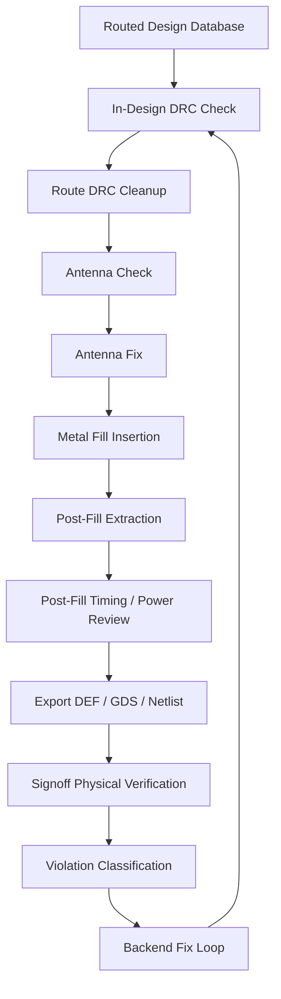
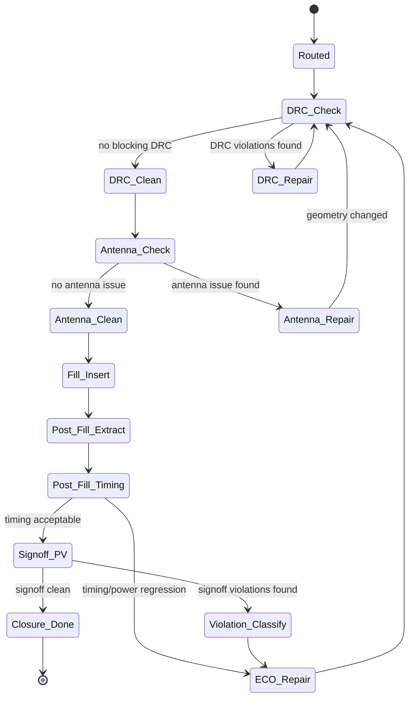

# 21. DRC, Antenna, and Metal Fill: Why Routing Completion Is Not Layout Closure

Author: Darren H. Chen

Demo: `LAY-BE-21_drc_antenna_fill`

Tags: Backend Flow, EDA, Routing, DRC, Antenna, Metal Fill, Physical Verification, Signoff, Layout Closure

After routing, a backend design finally has physical wires and vias. Nets are no longer only logical connectivity. They now have metal segments, via stacks, layer assignments, pin-access shapes, detours, shielding segments, and route topology.

This can easily create a misleading impression:

```text
floorplan done
placement done
CTS done
routing done
layout done
```

In a real backend flow, routing completion is not layout closure. Routing produces a candidate physical implementation. That implementation still needs to satisfy manufacturing rules, reliability rules, density rules, extraction consistency, and signoff handoff requirements.

Three post-route topics are especially important:

```text
DRC         physical geometry must satisfy manufacturing design rules
Antenna     routed conductors must not damage gate oxide during manufacturing
Metal Fill  metal density must satisfy process uniformity requirements
```

These are not cosmetic cleanup tasks. They determine whether a routed design can move toward physical verification, parasitic extraction, post-fill timing, and final signoff closure.

The central idea of this article is:

> Routing closes connectivity. DRC, antenna, and metal fill move the design toward manufacturable physical closure.

---

## 1. Routing closes connectivity, not manufacturing legality

Routing converts logical connectivity into physical geometry.

A logical net such as:

```text
N1 connects:
  U1/Y
  U2/A
  U3/B
```

becomes physical routing objects:

```text
metal segments
vias
layer transitions
pin-access segments
branch topology
route guides
local detours
```

However, electrical connectivity alone is not enough. A net may be connected but still illegal from a manufacturing or reliability point of view.

Examples include:

```text
metal spacing violation
minimum area violation
via enclosure violation
end-of-line spacing violation
notch violation
antenna ratio violation
metal density violation
macro boundary conflict
pin access shape violation
routing blockage violation
```

This distinction is fundamental:

| Closure type | Main question | Typical evidence |
|---|---|---|
| Connectivity closure | Are all required pins connected? | open/short report, route summary |
| Geometric closure | Are shapes legal under design rules? | DRC report |
| Reliability closure | Are manufacturing and electrical reliability risks controlled? | antenna, EM, IR, SI reports |
| Density closure | Is metal density within process windows? | fill density report |
| Signoff closure | Can the layout pass independent physical verification? | signoff DRC/LVS/PEX results |

Routing is necessary, but it is only one layer of closure.

---

## 2. Post-route closure as a staged physical verification loop

A route-complete design typically goes through a sequence of checks and repair loops.



This loop is important because every physical change can create new side effects.

For example:

```text
Fixing a spacing violation may increase wirelength.
Fixing antenna may insert a diode or add jumper vias.
Inserting fill may increase coupling capacitance.
Post-fill extraction may change timing slack.
Timing repair may trigger incremental routing.
Incremental routing may introduce new DRC violations.
```

Post-route closure is therefore not a single command. It is a dependency-controlled loop.

---

## 3. DRC: translating process limits into geometric constraints

DRC means Design Rule Check. At the surface level, it checks whether layout geometry satisfies foundry design rules.

At a deeper level, DRC is a geometric constraint system derived from manufacturing capability.

A process technology imposes limits related to:

```text
lithography
etching
chemical mechanical polishing
via formation
metal spacing
metal density
reliability
manufacturing variability
```

An EDA tool or signoff checker sees layout as layer-based geometry:

```text
M1 polygons
VIA1 cuts
M2 wires
M3 shields
blockages
pins
obstructions
cell boundaries
```

DRC evaluates these geometry sets against a rule deck.

Typical rule classes include:

| Rule class | What it checks | Example risk |
|---|---|---|
| Width | Metal or cut feature is wide enough | open, high resistance, manufacturing failure |
| Spacing | Shapes are far enough apart | shorts, yield loss |
| Enclosure | Metal properly surrounds via/cut | weak via connection |
| End-of-line | Wire ends have enough spacing | lithography weakness |
| Minimum area | Small metal islands are large enough | process instability |
| Notch | Concave geometry is not too narrow | lithography hotspot |
| Density | Local metal density is within range | CMP non-uniformity |
| Boundary | Shapes respect macro/block boundary | integration mismatch |

DRC is not text processing. It is rule-driven geometry computation.

---

## 4. A simplified DRC computation model

A minimum spacing check can be modeled as:

```text
Input:
  Layer geometry set L
  Minimum spacing Smin

Process:
  extract edges from all polygons on L
  compute distances between nearby edges
  detect cases where distance < Smin

Output:
  violation markers with location, rule name, and affected shapes
```

A via enclosure check can be modeled as:

```text
Input:
  via cut geometry V
  lower metal geometry M_lower
  upper metal geometry M_upper
  enclosure requirement Emin

Process:
  for each via cut:
    check whether lower and upper metal cover the cut with enough margin

Output:
  enclosure violation markers
```

The architecture can be represented as:


This is why DRC closure often requires both tool support and engineering classification. A violation marker tells where the rule failed; engineering judgment determines whether the root cause is local routing, pin access, blockage strategy, power planning, macro placement, or floorplan topology.

---

## 5. In-design DRC versus signoff DRC

A backend implementation tool may provide in-design DRC checks. A signoff physical verification tool performs final DRC with signoff rule decks.

They are related, but not identical.

| Aspect | In-design DRC | Signoff DRC |
|---|---|---|
| Main purpose | Support implementation and repair | Support final manufacturing signoff |
| Speed | Faster, often incremental | More complete and usually heavier |
| Rule coverage | Practical implementation subset | Full signoff rule deck coverage |
| Use stage | During route and ECO loops | Final verification and formal closure |
| Output | Repair-oriented markers/reports | Signoff result database and formal reports |

It is common for a design to look clean in implementation-stage checks but still show violations in signoff verification. This does not necessarily mean one tool is wrong. It often reflects different rule coverage, data representation, hierarchy handling, or signoff deck interpretation.

A mature backend flow should use both:

```text
in-design DRC  -> early and frequent repair guidance
signoff DRC    -> final manufacturing closure evidence
```

---

## 6. DRC closure should classify violations, not only count them

A raw violation count is not enough.

```text
DRC violations: 128
```

This number does not tell whether the design has a few easy min-area issues or a systematic routing failure around a macro boundary.

A useful DRC report should classify violations by:

```text
rule type
layer
region
net
cell/macro proximity
severity
repair strategy
source stage
```

Example classification:

| Violation type | Likely root cause | Repair direction | Escalation level |
|---|---|---|---|
| Spacing | Local congestion, narrow channel, NDR conflict | reroute, spacing adjustment | route / floorplan |
| Min area | small dangling segment, patch shape | local route cleanup | route |
| Via enclosure | via/metal mismatch | via replacement, local patch | route |
| Notch | complex patch geometry | shape cleanup | route |
| Boundary | macro/block integration issue | abstract/blockage review | library / floorplan |
| Density | insufficient local metal density | fill insertion | fill stage |
| Antenna | long conductor connected to gate | diode or jumper | antenna fix |

The most important question is not only:

```text
How many violations exist?
```

It is:

```text
What type of closure problem does each violation represent?
```

---

## 7. Region-based DRC analysis

DRC distribution often reveals root cause.

A few scattered violations may be local repair issues. A dense cluster of violations may indicate an upstream physical planning issue.

Typical suspicious regions include:

```text
macro channels
macro corners
power stripe intersections
IO pin regions
clock trunk corridors
high-density placement areas
scan or bus crossing regions
voltage-domain boundaries
block edges
```

A region-based summary can look like:

```text
Region: u_sram0_right_channel
  spacing violations       : 54
  via enclosure violations : 7
  min-area violations      : 3
  likely root cause        : macro channel congestion
  suggested action         : review macro spacing / routing layer allocation
```

This kind of summary prevents a common mistake: trying to fix systematic floorplan or congestion issues as if they were isolated detail-route problems.

---

## 8. Antenna: a manufacturing reliability problem, not just a route rule

Antenna effect is different from ordinary width or spacing DRC.

During manufacturing, plasma etching can cause long metal structures to collect charge. If the collected charge is connected to a thin MOS gate oxide before there is a safe discharge path, the gate oxide may be damaged.

A simplified model:

```text
large conductor area
        ↓
charge accumulation during plasma process
        ↓
connected gate oxide stress
        ↓
potential device damage
```

Antenna rules typically compare conductor area to gate area:

```text
antenna_ratio = connected_conductor_area / connected_gate_area
```

If the ratio exceeds the allowed limit, the net may violate antenna rules.

Unlike simple spacing checks, antenna depends on manufacturing sequence and net topology.

---

## 9. Why antenna problems often appear after routing

Antenna risk cannot be fully determined before routing because the final conductor shape is not known.

Before routing, the flow may know:

```text
cell locations
input pins
gate pins
logical nets
estimated wirelength
```

After routing, the flow knows:

```text
actual metal area
layer sequence
via locations
branch topology
which conductor is connected before diffusion discharge
net length by layer
actual gate connection exposure
```

Typical antenna-risk cases include:

```text
long wire connected to standard-cell input gate
macro-to-cell long signal route
high-fanout enable/reset/test net
upper-layer long segment before lower-layer diffusion connection
large metal area connected to a small gate load
```

This is why antenna analysis belongs naturally to the post-route closure loop.

---

## 10. Antenna repair methods

Two common antenna repair strategies are diode insertion and metal jumping.

### 10.1 Diode insertion

A diode provides a discharge path.

```text
Before:

Long metal ---------------- Gate

After:

Long metal ---------+------ Gate
                    |
                  Diode
```

Advantages:

```text
simple conceptual repair
localized topology change
works well for many input-gate antenna cases
```

Costs:

```text
adds cell area
adds input load
may affect timing
needs legal placement site
needs power/ground connection
may require incremental routing
```

### 10.2 Metal jumper / layer hopping

A jumper changes the manufacturing exposure sequence by moving part of the route to another layer.

```text
Before:

M2 ------------------------------ Gate

After:

M2 ----- VIA ----- M4 ----- VIA ----- Gate
```

Advantages:

```text
may avoid adding diode cell
can reduce antenna exposure on a specific layer
```

Costs:

```text
uses routing resource
adds vias
changes parasitics
may introduce new DRC issues
may affect timing
```

Antenna repair is therefore not an isolated operation. It must be followed by DRC, extraction, and timing review when the change is significant.

---

## 11. Metal fill: density closure for manufacturability

Metal fill inserts dummy metal shapes to satisfy density requirements.

The reason is manufacturing uniformity, especially chemical mechanical polishing.

If local metal density is too low or too high, polishing and process behavior can become non-uniform. Foundry rules therefore define density constraints over sliding windows.

A simplified rule:

```text
For each 100um x 100um window:
  M3 density must be between 20% and 80%
```

Before fill:

```text
+--------------------------------+
|                                |
|     ===== routed wire          |
|                                |
|                    =====       |
|                                |
+--------------------------------+
```

After fill:

```text
+--------------------------------+
|  []  []  []  []                |
|     ===== routed wire   []     |
|  []      []      []            |
|                    =====       |
|  []  []  []  []                |
+--------------------------------+
```

Fill shapes are usually not part of logical connectivity, but they are real metal. This is why fill can affect extraction and timing.

---

## 12. Why metal fill affects parasitics and timing

Dummy fill adds nearby conductor area around real signal wires.

This can change:

```text
wire-to-fill capacitance
wire-to-ground capacitance
coupling environment
effective capacitance
noise behavior
net delay
slew
```

As a result, post-fill timing can differ from pre-fill timing.

A robust flow therefore includes:

```text
post-fill extraction
post-fill STA
post-fill power review
post-fill SI review when needed
```

Metal fill is not a visual decoration. It is a manufacturing-driven geometry transformation with electrical consequences.

---

## 13. Dependency ordering after route

Post-route fixes should not be performed in arbitrary order.

A recommended dependency-aware order is:

```text
1. Connectivity and gross DRC
2. Route DRC cleanup
3. Antenna check and fix
4. Metal fill insertion
5. Post-fill extraction
6. Post-fill timing and power review
7. Signoff physical verification
8. ECO loop if needed
```

The reason is dependency control:

| Step | Why it should be ordered carefully |
|---|---|
| Connectivity | Other checks are unreliable if connectivity is wrong |
| Gross DRC | Severe geometry problems can invalidate extraction or signoff checks |
| Antenna | Fixes may change routing or insert diode cells |
| Fill | Fill changes density and parasitic environment |
| Extraction | Should reflect near-final geometry |
| Timing | Should be checked with realistic post-fill parasitics |
| Signoff PV | Should run on the intended handoff database |

A poor order can create a loop such as:

```text
fix antenna -> create DRC
fix DRC -> change antenna ratio
insert fill -> change timing
fix timing -> change route
change route -> create DRC
```

A disciplined closure plan reduces unnecessary iteration.

---

## 14. Post-route closure state machine

Post-route closure can be modeled as a state machine.



This model makes an important point: if a repair modifies geometry, the flow usually returns to at least DRC checking, and often to extraction and timing as well.

---

## 15. Report architecture for post-route closure

A mature post-route flow should produce layered reports, not just a final pass/fail message.

Recommended reports:

```text
route_drc_summary.rpt
route_drc_by_type.rpt
route_drc_by_region.rpt
antenna_by_net.rpt
antenna_fix_plan.rpt
metal_density_by_window.rpt
fill_insertion_summary.rpt
post_fill_extraction_summary.rpt
post_fill_timing_delta.rpt
post_route_closure_summary.rpt
```

Their roles:

| Report | Main purpose |
|---|---|
| `route_drc_summary.rpt` | overall DRC status after route |
| `route_drc_by_type.rpt` | classify DRC by rule type |
| `route_drc_by_region.rpt` | locate systematic physical hotspots |
| `antenna_by_net.rpt` | identify nets with antenna risk |
| `antenna_fix_plan.rpt` | rank antenna repair actions |
| `metal_density_by_window.rpt` | identify density-deficient windows |
| `fill_insertion_summary.rpt` | record fill impact and coverage |
| `post_fill_timing_delta.rpt` | compare pre-fill and post-fill timing |
| `post_route_closure_summary.rpt` | summarize readiness for PV handoff |

A good report structure turns post-route closure from reactive debug into evidence-based engineering.

---

## 16. Root-cause classification table

Post-route issues should be classified by likely root cause and repair layer.

| Symptom | Likely root cause | First repair layer to inspect |
|---|---|---|
| Many spacing violations in one macro channel | channel too narrow, routing resource overused | floorplan / routing resource |
| Repeated pin-access violations | poor pin access, blockage conflict | library abstract / routing |
| Many antenna violations on long control nets | high fanout and long route topology | antenna fix / net topology |
| Density failures in sparse regions | insufficient dummy fill | fill stage |
| Post-fill setup regression | fill capacitance increased delay | extraction / timing ECO |
| Post-fill hold regression | coupling or clock/data delay shift | timing ECO |
| DRC appears after antenna repair | jumper or diode route changed geometry | route DRC cleanup |
| Signoff-only DRC failures | implementation check coverage insufficient | signoff PV classification |

This classification helps decide whether to repair locally, rerun route optimization, adjust floorplan, or update handoff assumptions.

---

## 17. Demo design: `LAY-BE-21_drc_antenna_fill`

The demo for this article should not try to replace a signoff physical verification tool. Its purpose is to show the engineering structure of post-route closure.

Recommended directory structure:

```text
LAY-BE-21_drc_antenna_fill/
├─ data/
│  ├─ routed_layout_summary.csv
│  ├─ abstract_drc_rules.csv
│  ├─ antenna_rules.csv
│  └─ density_windows.csv
├─ scripts/
│  ├─ run_post_route_check.csh
│  └─ clean.csh
├─ tcl/
│  ├─ 01_post_route_precheck.tcl
│  ├─ 02_check_abstract_drc.tcl
│  ├─ 03_check_antenna_ratio.tcl
│  ├─ 04_check_metal_density.tcl
│  └─ 05_report_closure_plan.tcl
├─ reports/
│  ├─ post_route_precheck.rpt
│  ├─ drc_summary.rpt
│  ├─ antenna_summary.rpt
│  ├─ fill_density_summary.rpt
│  └─ post_route_closure_plan.rpt
└─ README.md
```

The demo should verify:

```text
route result can be inspected as physical geometry summary
DRC issues can be classified by rule type
antenna ratio can be reported by net
metal density can be evaluated by window
closure actions can be prioritized
```

A minimal run entry can remain generic:

```csh
#!/bin/csh -f

setenv EDA_TOOL_BIN /path/to/eda_tool
setenv DESIGN_ROOT  /path/to/LAY-BE-21_drc_antenna_fill

$EDA_TOOL_BIN -batch $DESIGN_ROOT/tcl/01_post_route_precheck.tcl \
  >&! $DESIGN_ROOT/reports/run_post_route_check.log
```

The important part is not the exact tool command. The important part is the report contract:

```text
precheck -> DRC summary -> antenna summary -> fill density summary -> closure plan
```

---

## 18. Practical review checklist

Before declaring a routed design ready for handoff, review at least the following:

```text
Are all nets connected without opens or shorts?
Are blocking route DRC violations classified and addressed?
Are DRC violations grouped by type and region?
Are antenna violations checked by net and by severity?
Are antenna fixes followed by DRC recheck?
Is metal density evaluated per layer and per window?
Is fill inserted with controlled rules?
Is post-fill extraction completed?
Is post-fill timing compared against pre-fill timing?
Are remaining violations justified, waived, or repaired?
Is the signoff handoff package consistent?
```

This checklist prevents treating route completion as layout closure.

---

## 19. Engineering takeaways

DRC, antenna, and metal fill represent three different dimensions of post-route closure.

```text
DRC        asks whether geometry satisfies manufacturing rules.
Antenna    asks whether manufacturing charge accumulation can damage devices.
Metal Fill asks whether local metal density supports process uniformity.
```

They interact with each other and with timing, routing, extraction, and signoff.

The key engineering lesson is:

> Post-route closure is a managed loop of physical rule checking, reliability repair, density closure, extraction update, and timing revalidation.

A backend flow that stops at routing is incomplete. A backend flow that records DRC, antenna, fill, post-fill extraction, timing delta, and signoff readiness becomes a traceable physical closure system.

---

## 20. Summary

Routing completes physical connectivity, but it does not guarantee manufacturability, reliability, density compliance, or signoff readiness.

After routing, the design must still pass through:

```text
DRC cleanup
antenna checking and repair
metal fill insertion
post-fill extraction
post-fill timing and power review
signoff physical verification
```

DRC converts process manufacturing constraints into geometric checks. Antenna analysis checks manufacturing charge-risk paths. Metal fill balances local metal density for process uniformity, but also changes parasitic behavior.

A mature backend flow treats these tasks as a structured closure loop, not as final cosmetic cleanup.

The practical principle is:

```text
Routing answers whether the design is connected.
DRC, antenna, and metal fill help answer whether it can be manufactured and signed off.
```
