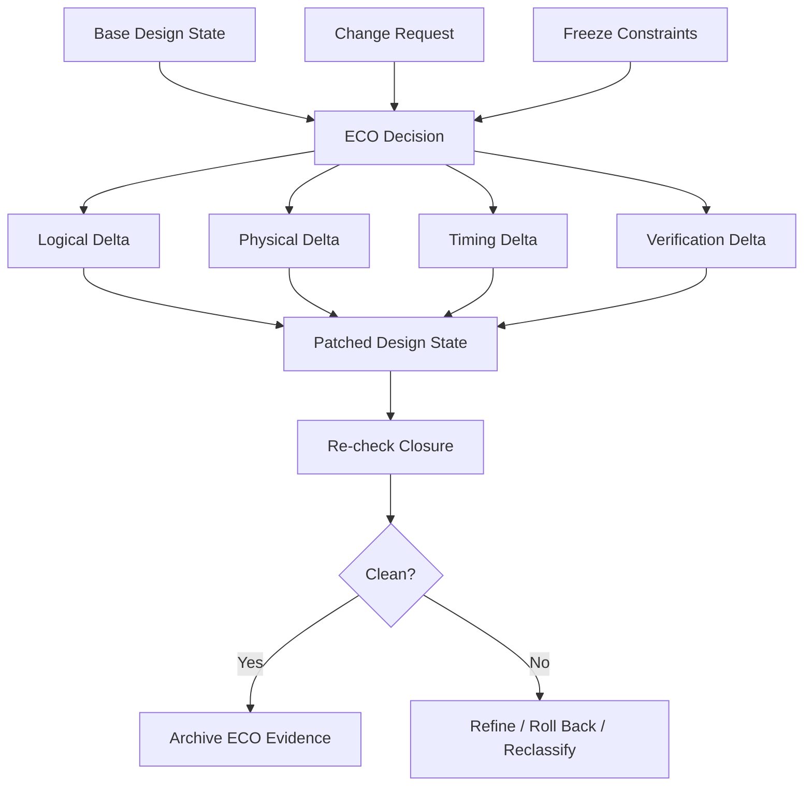
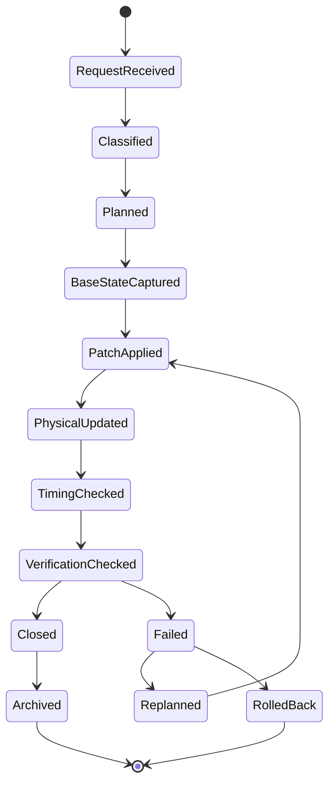
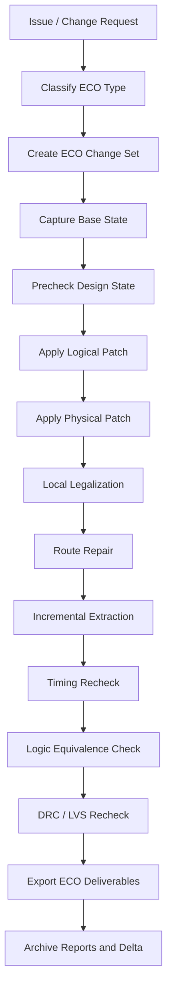

# 22. ECO: Why Backend Changes Must Preserve Logical, Physical, Timing, and Verification Consistency

**Author:** Darren H. Chen  
**Direction:** Backend Flow / Physical Implementation / EDA Tool Engineering / ECO Closure  
**Demo:** `LAY-BE-22_eco`  
**Tags:** Backend Flow, EDA, ECO, Timing ECO, Metal-only ECO, Engineering Change Order, Physical Implementation, LEC, LVS, DRC, Timing Closure

---

## 1. ECO Is Not a Late-Stage Patch

In backend implementation, ECO is often described casually as a late-stage fix:

```text
The design is almost done.
A problem appears.
Apply a small patch.
Continue signoff.
```

That view is too shallow.

An ECO is not just a patch. It is a constrained engineering change applied to a design state that is already partially or mostly closed. At this stage, the design database may already contain:

```text
linked logical netlist
placed standard cells
macro placement
clock tree structure
routed signal nets
power network
fillers / taps / decaps / spare cells
extracted parasitics
signoff reports
verification baselines
```

Changing one piece of this state may affect many others. A new buffer changes physical placement, routing, parasitic load, timing, power, DRC, LVS, and sometimes equivalence checking. A metal-only reconnection changes route topology, extraction, LVS, antenna behavior, and timing. A functional ECO changes the expected logical behavior, which changes the equivalence target.

The real problem is therefore not simply:

```text
Can the change be applied?
```

The real problem is:

```text
After the change, do logical function, physical implementation, timing behavior,
and verification evidence still describe the same design?
```

That is why ECO is one of the most engineering-sensitive stages in a backend flow.

---

## 2. The Core Definition: ECO Under Freeze Constraints

A normal implementation stage has relatively high freedom. Placement can move many cells. Routing can rebuild many wires. Optimization can resize or insert many buffers. Timing closure can modify many parts of the design.

ECO happens under much stronger freeze constraints.

At ECO time, many parts of the design should remain stable:

```text
floorplan should not be reopened unless necessary
macro placement should remain unchanged
power structure should remain stable
clock tree should not be rebuilt unless required
already clean routing should not be disturbed widely
already closed timing should not regress globally
already passed PV regions should not be reopened unnecessarily
already verified logic should remain traceable
```

So ECO is best modeled as:

```text
ECO = Controlled Delta(Base Design State, Change Request, Freeze Constraints)
```

The goal is not maximum optimization freedom. The goal is a minimal, explainable, verifiable delta.

A useful mental model is:



This diagram captures the essential ECO principle: an ECO is not only a command sequence. It is a controlled transition from one design state to another.

---

## 3. Why ECO Cannot Be Viewed as Netlist Editing Only

A functional ECO often starts from a logical change:

```text
add a condition
invert a control signal
change a mux select
patch a reset path
add a gate-level correction
replace one expression with another
```

It is tempting to think that once the netlist is modified, the ECO is done.

In backend implementation, that is false.

A netlist cell has multiple meanings after implementation:

```text
logical node
library cell instance
physical object
placed object
routed object
timing object
power object
verification object
```

A net has multiple meanings too:

```text
logical connection
routed wire topology
parasitic RC network
coupling environment
antenna-related conductor
LVS connectivity object
timing propagation object
```

If the netlist changes but the physical database is not updated, the design becomes inconsistent:

```text
new logic exists in source, but not in layout
new connection exists logically, but route still follows old topology
STA graph may not match the patched implementation
LVS may report mismatch
LEC may compare against the wrong reference
PEX may extract parasitics for the wrong connectivity
```

Therefore, ECO must be treated as a multi-view database update, not as text editing.

---

## 4. The Four Consistency Domains of ECO

Every ECO should be checked against four domains.

| Domain | What Must Stay Consistent | Typical Evidence |
|---|---|---|
| Logical consistency | patched netlist matches intended function | LEC / formal comparison / netlist delta |
| Physical consistency | placed/routed database matches patched netlist | DEF/GDS update, LVS, DRC |
| Timing consistency | setup/hold/slew/cap remain acceptable | STA reports, timing delta, path summaries |
| Verification consistency | all required checks refer to the same design revision | manifest, reports, signoff checklist |

The difficulty is that these domains are coupled.

For example:

```text
logical ECO adds a cell
  -> physical placement needed
  -> routing repair needed
  -> parasitics change
  -> timing changes
  -> LVS and LEC targets change
```

Another example:

```text
timing ECO inserts delay buffer
  -> hold improves
  -> setup may degrade
  -> area/power increases
  -> routing changes
  -> DRC may change
```

A mature ECO flow must make these dependencies visible.

---

## 5. Main ECO Types

ECO can be classified by the intent of the change and by the physical layers allowed to change.

### 5.1 Functional ECO

A functional ECO changes the intended logic behavior.

Typical examples:

```text
add an enable condition
fix an incorrect control signal
change mux selection
insert missing inversion
patch reset or scan control
add small corrective logic
```

Primary risks:

```text
wrong reference design for equivalence checking
new cells without legal placement
new connections without route repair
timing regression from added logic
LVS mismatch if physical update is incomplete
```

Key checks:

```text
new reference vs patched implementation
logical delta review
placement legality
route repair
setup/hold recheck
LVS / DRC recheck
```

### 5.2 Timing ECO

A timing ECO changes implementation to fix setup, hold, slew, capacitance, or transition issues without changing intended logic.

Typical operations:

```text
buffer insertion
hold delay insertion
cell resizing
Vt swap
gate cloning
load splitting
local placement adjustment
incremental route repair
```

Primary risks:

```text
fixing setup may break hold
fixing hold may hurt setup
resizing may increase load upstream
buffer insertion may increase congestion
route repair may change parasitics
```

Key checks:

```text
setup delta
hold delta
slew/cap/fanout delta
power delta
local DRC
incremental STA across relevant corners
```

### 5.3 Metal-only ECO

A metal-only ECO changes only metal and via layers, while base layers remain unchanged. It is common when mask cost or tapeout schedule makes diffusion-layer modification undesirable.

Typical operations:

```text
reconnect spare cells
change metal routes
modify tie connections
patch local nets with existing spare logic
cut and reconnect metal topology
```

Primary risks:

```text
spare cell may be too far away
routing resources may be insufficient
LVS mismatch if netlist/layout delta is not aligned
antenna or DRC violations may be introduced
parasitics may degrade timing
```

Key checks:

```text
spare cell availability
metal layer change scope
route DRC
LVS
incremental extraction
STA with patched parasitics
```

### 5.4 Physical ECO

A physical ECO addresses implementation or signoff issues without necessarily changing logical function.

Typical operations:

```text
move cell
legalize local placement
repair route
fix antenna
fix DRC
adjust filler / decap / tap
repair local density or spacing issue
```

Primary risks:

```text
local geometry fix may cause new DRC
cell movement may affect timing
route repair may affect parasitics
fill adjustment may affect extraction
```

Key checks:

```text
local DRC
LVS if connectivity changes
incremental STA
post-fix extraction
closure summary
```

---

## 6. ECO Type Matrix

A practical ECO flow should classify a change before applying it.

| ECO Type | Logic Changes? | Physical Changes? | Typical Scope | Main Verification Focus |
|---|---:|---:|---|---|
| Functional ECO | Yes | Usually yes | local to moderate | LEC target, LVS, STA |
| Setup ECO | No | yes | local timing cone | setup improvement, hold regression |
| Hold ECO | No | yes | short paths | hold improvement, setup regression |
| Metal-only ECO | Maybe | metal/via only | highly constrained | LVS, DRC, extraction, STA |
| DRC ECO | No | geometry/local route | local region | DRC clean, no timing regression |
| Antenna ECO | No | route/diode | affected nets | antenna clean, STA, DRC |
| Fill ECO | No | dummy metal | density windows | density, extraction, STA delta |

This classification prevents a common mistake: using the same flow for fundamentally different ECO problems.

---

## 7. ECO Data Model: The Change Set

A mature ECO should be represented as a change set, not as an undocumented series of commands.

A change set is a structured description of what will change and how it will be verified.

```text
ECO Change Set
├─ metadata
│  ├─ eco_id
│  ├─ owner
│  ├─ reason
│  ├─ base_revision
│  └─ target_revision
├─ logical_delta
│  ├─ add_cell
│  ├─ remove_cell
│  ├─ replace_cell
│  ├─ reconnect_net
│  └─ change_constant
├─ physical_delta
│  ├─ place_new_cell
│  ├─ use_spare_cell
│  ├─ move_cell
│  ├─ repair_route
│  └─ modify_metal
├─ timing_delta
│  ├─ setup_paths_affected
│  ├─ hold_paths_affected
│  ├─ slew_cap_affected
│  └─ expected_slack_change
└─ verification_plan
   ├─ lec
   ├─ sta
   ├─ drc
   ├─ lvs
   ├─ pex
   └─ rollback_checkpoint
```

This structure makes ECO reviewable.

Without a change set, a team may know that “some commands were run,” but it may not know:

```text
what changed
why it changed
what was intentionally allowed to change
which checks were required
which reports prove closure
how to roll back
```

---

## 8. ECO State Machine

ECO should follow a controlled state machine.



This model matters because ECO is risky. A failed ECO should not leave the design in an undefined state.

At any point, the flow should be able to answer:

```text
What base state was used?
What patch was applied?
Which checks passed?
Which checks failed?
Can we safely roll back?
```

---

## 9. Why Spare Cells Matter

Spare cells are pre-placed cells reserved for future ECO.

Common spare cell types include:

```text
spare inverter
spare buffer
spare NAND
spare NOR
spare mux
spare flop
spare tie-high / tie-low
```

They are especially useful for metal-only ECO because the physical transistor structures already exist. Later, metal layers can reconnect them into the functional design.

Before ECO:

```text
spare cell exists physically
inputs tied or parked
output unused or parked
```

After ECO:

```text
existing spare cell becomes part of patched logic
only metal/via connections are changed
```

Spare cells create ECO flexibility, but they are not free.

They add:

```text
area overhead
leakage overhead
placement density pressure
power rail connection requirements
management complexity
```

The most important spare cell question is not only how many spare cells exist. It is where they are located.

A spare cell that is too far from the ECO target may be unusable for timing or routing reasons.

A useful spare-cell report should include:

```text
spare cell name
cell type
location
nearest target region
power domain
clock domain if sequential
availability status
estimated routing distance
```

---

## 10. Why Timing ECO Is Dangerous

Timing ECO looks local, but timing impact often propagates through cones.

For setup repair, common fixes include:

```text
resize driver
insert buffer
clone driver
move cells closer
reduce load
change Vt
```

For hold repair, common fixes include:

```text
insert delay buffer
increase minimum delay
adjust local routing
use slower cell variant
```

The danger is that setup and hold often pull in opposite directions.

```text
setup repair wants faster data arrival
hold repair may need slower data arrival
```

A local hold buffer can improve one short path but degrade setup on a related path. A resized driver can improve a downstream path while increasing input capacitance and hurting upstream timing.

Therefore, a timing ECO should never report only the target path. It should report:

```text
target path delta
neighbor path delta
fanout cone impact
fanin cone impact
setup regression
hold regression
slew/cap/fanout changes
multi-corner impact
multi-mode impact
```

A timing ECO is not closed until regression is checked.

---

## 11. Why Functional ECO Requires Careful Equivalence Strategy

A functional ECO changes intended behavior. That means equivalence checking must be set up carefully.

There are two common cases.

### Case 1: Non-functional ECO

Timing ECO, buffering, resizing, or metal-only reconnection that preserves logic should prove:

```text
old implementation == patched implementation
```

or, depending on the flow:

```text
same reference == patched implementation
```

### Case 2: Functional ECO

A functional bug fix means the old reference and new reference may not be equivalent. The correct target becomes:

```text
new reference == patched implementation
```

If the verification target is wrong, a correct ECO may be reported as false failure, or an incorrect ECO may be accepted.

A functional ECO verification plan should explicitly define:

```text
reference design revision
implementation design revision
allowed functional differences
black-box strategy
scan/test handling
constant and tie handling
clock/reset assumptions
comparison points
```

Equivalence checking is not just a tool invocation. It is part of ECO specification.

---

## 12. Why ECO Requires LVS and DRC Re-check

Any physical ECO can change layout behavior.

Examples:

```text
new route segment -> spacing risk
new via -> enclosure / cut spacing risk
metal reconnection -> LVS risk
antenna diode insertion -> netlist/layout consistency risk
cell movement -> placement overlap risk
fill adjustment -> density / extraction impact
```

So ECO closure must include physical verification appropriate to the change.

A small local ECO may start with incremental checks:

```text
incremental DRC
incremental LVS
localized extraction
local STA
```

But before final handoff, the project may still require full-chip signoff checks.

The rule is:

```text
If the ECO changes what the layout represents, verification must prove that the
new layout represents the intended design.
```

---

## 13. ECO Flow Architecture

A robust ECO flow can be organized as follows:



This architecture separates intent, patching, implementation update, and verification.

It also prevents ECO from becoming an uncontrolled set of manual edits.

---

## 14. Recommended ECO Reports

A serious ECO flow should produce structured reports.

| Report | Purpose |
|---|---|
| `eco_change_set.rpt` | What is intended to change |
| `eco_classification.rpt` | ECO type and required checks |
| `eco_precheck.rpt` | Whether base state is ready |
| `eco_cell_delta.rpt` | Added/removed/replaced cells |
| `eco_net_delta.rpt` | Added/removed/reconnected nets |
| `eco_spare_cell_usage.rpt` | Spare cells selected and consumed |
| `eco_route_repair.rpt` | Local routing modifications |
| `eco_timing_delta.rpt` | Setup/hold/slew/cap change |
| `eco_lec_summary.rpt` | Logical verification status |
| `eco_lvs_summary.rpt` | Layout/source consistency status |
| `eco_drc_summary.rpt` | Physical rule status |
| `eco_final_summary.rpt` | Final closure decision |

The final summary should not simply say “ECO done.”

It should say:

```text
base revision
patch revision
ECO type
changed objects
modified regions
verification completed
open risks
rollback checkpoint
final status
```

---

## 15. Common ECO Failure Patterns

| Failure Pattern | Typical Cause | Recommended Response |
|---|---|---|
| Patch applied but LVS fails | netlist/layout mismatch | compare logical delta and physical delta |
| Timing fix creates hold violation | setup/hold tradeoff ignored | run setup/hold regression across scenarios |
| Metal-only ECO cannot route | spare cell too far or congestion too high | reselect spare, adjust route, or reclassify ECO |
| LEC fails unexpectedly | wrong reference or unsupported difference | review ECO type and equivalence target |
| DRC increases after route repair | local geometry fix not rule-clean | run incremental DRC immediately after repair |
| ECO uses wrong library cell | library version or cell naming issue | validate ECO against project library baseline |
| Patch is not reproducible | manual edits not captured | convert actions into ECO script and change set |
| Cannot roll back safely | missing checkpoint | enforce base-state capture before ECO |

Failure classification is important because ECO debug is expensive. A clear taxonomy prevents teams from treating every failure as a generic tool issue.

---

## 16. Methodology: Classify First, Then Modify

A mature ECO flow should not begin by editing the design.

It should begin with classification:

```text
Does the ECO change intended function?
Does it require new cells?
Can it be metal-only?
Does it touch clock paths?
Does it affect scan structures?
Does it cross power domains?
Does it affect critical timing paths?
Does it require full-chip verification?
```

Only after classification should the flow select a repair strategy.

A simple decision table:

| Question | If Yes | If No |
|---|---|---|
| Functional behavior changes? | use functional ECO flow | use non-functional ECO flow |
| Base layers frozen? | use metal-only strategy | physical cell changes may be allowed |
| Spare cell available nearby? | consider spare-based patch | consider new cell or reclassify |
| Timing critical area? | require STA regression | local checks may be enough initially |
| Connectivity changes? | require LVS | DRC-only may be sufficient for geometry ECO |
| Reference changes? | compare against new reference | compare against same reference |

This avoids one of the worst ECO habits: fixing first and asking what was changed later.

---

## 17. Methodology: Every ECO Must Be Reversible

Rollback is not optional.

ECO usually happens late in the schedule, when the design is valuable and fragile. A failed ECO must not destroy a known-good state.

Before ECO, archive:

```text
base database
base netlist
base DEF / GDS if available
base timing reports
base PV reports
base extraction state
base tool/environment manifest
base ECO script version
```

After ECO, archive:

```text
patched database
patched netlist
patched DEF / GDS
ECO change set
ECO command log
verification reports
timing delta reports
rollback notes
```

The maturity of an ECO system is not measured only by whether it can apply changes quickly. It is measured by whether it can safely return to a clean base state when the change is rejected.

---

## 18. Demo Design: `LAY-BE-22_eco`

The purpose of this demo is not to perform a real foundry-level ECO. The goal is to model the engineering structure of ECO closure.

### Suggested Directory Structure

```text
LAY-BE-22_eco/
├─ data/
│  ├─ base_design_summary.csv
│  ├─ eco_change_request.csv
│  ├─ spare_cell_inventory.csv
│  ├─ timing_path_summary.csv
│  └─ pv_status_summary.csv
├─ scripts/
│  ├─ run_eco_demo.csh
│  └─ clean.csh
├─ tcl/
│  ├─ 01_read_base_state.tcl
│  ├─ 02_classify_eco.tcl
│  ├─ 03_generate_change_set.tcl
│  ├─ 04_estimate_physical_delta.tcl
│  ├─ 05_estimate_timing_impact.tcl
│  └─ 06_write_verification_plan.tcl
├─ reports/
│  ├─ eco_base_state.rpt
│  ├─ eco_classification.rpt
│  ├─ eco_change_set.rpt
│  ├─ eco_physical_delta.rpt
│  ├─ eco_timing_impact.rpt
│  ├─ eco_verification_checklist.rpt
│  └─ eco_final_plan.rpt
└─ README.md
```

### Suggested csh Entry

```csh
#!/bin/csh -f

setenv EDA_TOOL_BIN /path/to/eda_tool
setenv DESIGN_ROOT  /path/to/LAY-BE-22_eco

$EDA_TOOL_BIN -batch $DESIGN_ROOT/tcl/02_classify_eco.tcl \
  >&! $DESIGN_ROOT/reports/run_eco_demo.log
```

The exact command interface depends on the tool. The demo principle is tool-neutral:

```text
read change request
classify ECO type
build change set
estimate affected objects
estimate timing/PV impact
write verification checklist
archive ECO plan
```

### Demo Readiness Checklist

| Check | Expected Result |
|---|---|
| Base design summary exists | PASS |
| ECO request is readable | PASS |
| ECO type is classified | PASS |
| Logical delta is generated | PASS |
| Physical delta is estimated | PASS |
| Timing impact is estimated | PASS |
| Verification checklist is generated | PASS |
| Final ECO plan is archived | PASS |

This demo emphasizes the ECO control model rather than a specific commercial tool command.

---

## 19. Engineering Takeaways

ECO is where backend flow maturity becomes visible.

A weak ECO process looks like this:

```text
apply quick patch
run some reports
fix new errors
repeat manually
hope final checks pass
```

A mature ECO process looks like this:

```text
classify change
capture base state
create change set
apply controlled patch
update physical implementation
run targeted checks
run regression checks
archive evidence
preserve rollback path
```

The difference is not only efficiency. It is risk control.

ECO is late-stage design surgery. The tool commands are only part of the problem. The real challenge is preserving consistency across multiple representations of the same design.

---

## 20. Summary

ECO is not a small afterthought at the end of backend implementation. It is a constrained engineering change mechanism applied to a design that may already be close to closure.

Its essential goal is:

```text
change only what must be changed,
preserve everything else as much as possible,
and prove that the patched design remains logically, physically, temporally,
and verification-wise consistent.
```

A robust ECO flow needs:

```text
ECO classification
base-state capture
structured change set
logical delta tracking
physical delta tracking
timing impact analysis
LEC / LVS / DRC / STA checklist
rollback plan
final closure report
```

The key point is simple:

```text
ECO success is not defined by whether a patch was applied.
ECO success is defined by whether the patched design can be verified, signed off,
reproduced, and safely archived.
```

---

## Closing Sentence

ECO is the backend flow stage where every design view must agree again: logic must match intent, layout must match logic, timing must remain closed, and verification evidence must prove that the change is controlled.
