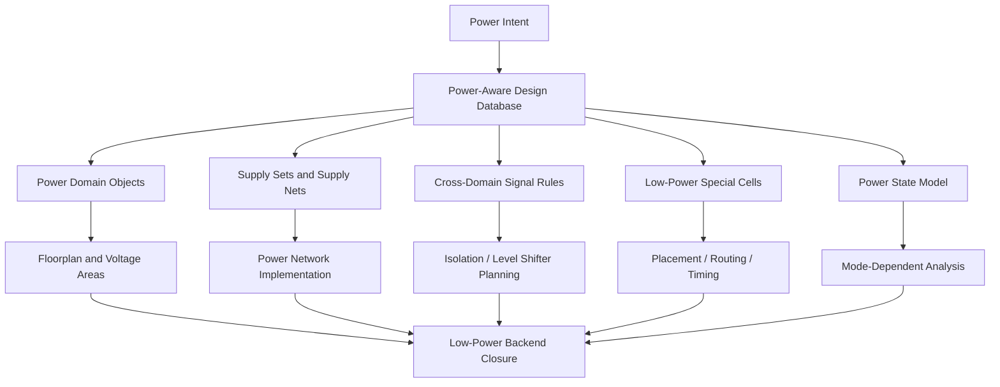
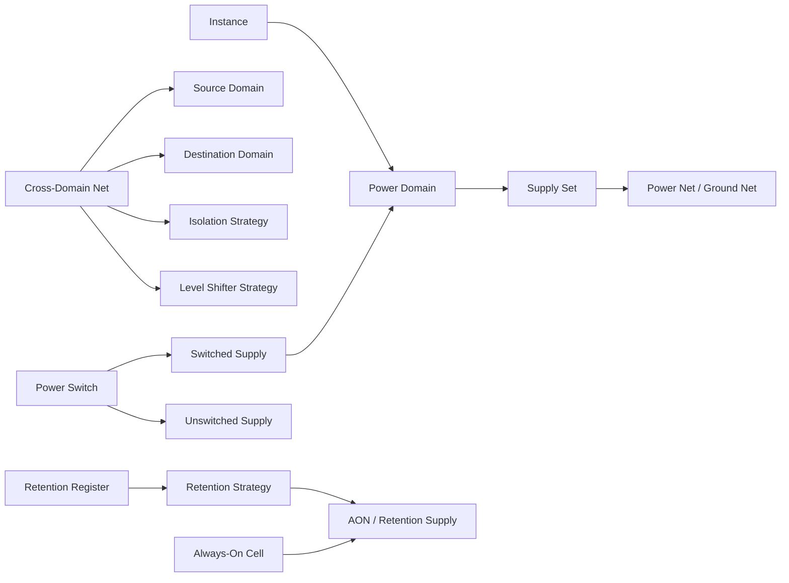
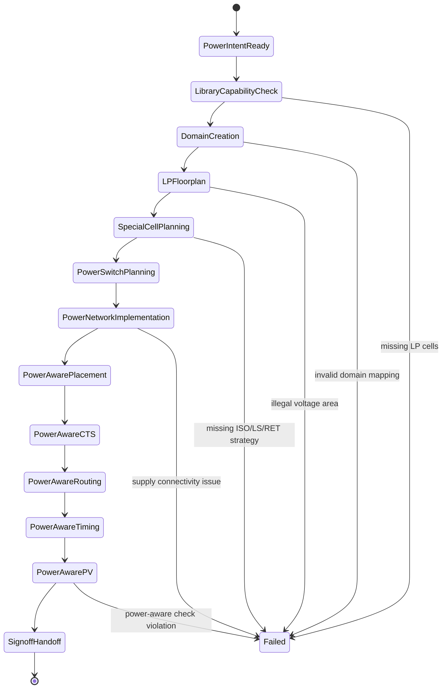

# 24. Low Power Flow: How Power Domains, Always-On Logic, Retention, Isolation, Level Shifters, and Power Switches Enter Backend Implementation

Author: Darren H. Chen
A
demo: `LAY-BE-24_low_power_flow`

Tags: Backend Flow, EDA, Low Power, Power Domain, Always-On, Retention, Isolation, Level Shifter, Power Switch, Power Intent, Physical Implementation

Low-power implementation is not just a matter of reducing signal switching in RTL.

In modern SoC implementation, low power becomes a physical implementation problem. It affects floorplan, power network design, placement, cell insertion, clock tree construction, routing, timing analysis, physical verification, logic equivalence, and signoff handoff.

The reason is simple: once a design contains multiple power domains, switchable supplies, retention registers, always-on control paths, isolation boundaries, and voltage crossings, the backend database can no longer treat the entire chip as one uniform electrical space.

The backend tool must understand questions such as:

```text
Which instances belong to which power domain?
Which nets cross from one power domain to another?
Which domain may be turned off?
Which logic must remain powered when other domains are off?
Which signals require isolation?
Which crossings require level shifting?
Which registers must retain state?
Which power switches create the switched supply rail?
Which power state makes a path valid or invalid?
```

A low-power backend flow therefore converts power intent into physical, timing, routing, and verification constraints. It is not an additional report at the end of the flow. It is a design dimension that must be carried through the entire backend implementation database.

---

## 1. Low Power Flow Converts Power Semantics into Physical Structures

A conventional backend implementation flow may begin with a linked design database, standard-cell libraries, physical abstracts, timing constraints, a floorplan, placement rows, routing rules, and timing scenarios.

A low-power flow adds another semantic layer:

```text
power intent
```

Power intent defines the electrical behavior of the design under different power states. It describes:

```text
which logic can be switched off
which logic must remain on
which signals cross power-domain boundaries
which state elements must be retained
which voltage crossings require conversion
which outputs must be clamped when a domain is off
which switches control a switched supply rail
which modes are legal power states
```

Backend implementation cannot leave these definitions as documentation. The flow must convert them into physical objects and implementation constraints:

```text
power domain region
voltage area
always-on cell
isolation cell
level shifter
retention register
power switch cell
switched power rail
always-on route
secondary supply connection
power-aware timing scenario
power-aware physical verification rule
```

The conceptual transformation is:



This is the fundamental backend view:

> low power flow is the process of turning electrical power-management semantics into database objects, physical regions, special cells, supply routes, analysis scenarios, and signoff checks.

---

## 2. Why Low Power Is a Backend Database Problem

A low-power structure is not only a logical concept.

For example, an isolation cell is not just an RTL behavior. In backend implementation, it becomes:

```text
a real library cell
a real instance
a real placement object
a real timing arc
a real power connection
a real routing object
a real LVS/DRC/PV object
```

A level shifter is not just a crossing annotation. It becomes a physical cell that may require two supplies. It must be placed in a legal region, connected to the correct supply nets, and included in timing, routing, extraction, and verification.

A power switch is not just a control concept. It becomes part of the power network. Its placement density, width, enable routing, switched output rail, and IR-drop behavior all influence whether the switchable domain can operate correctly.

This is why a low-power flow must manage object relationships, not just file syntax.

A simplified low-power backend object graph looks like this:



If any of these relationships are wrong, the backend result may look legal in a narrow view but fail in functional low-power mode, timing, LVS, power connectivity, or signoff.

---

## 3. Power Domain: Logical Group, Physical Region, and Electrical Supply Context

A power domain is one of the most important low-power objects.

It is not merely a hierarchy name. A power domain has at least three meanings:

| View | Meaning | Backend impact |
|---|---|---|
| Logical view | Which instances belong to the domain | Instance grouping, crossing detection |
| Physical view | Where the domain is placed | Voltage area, floorplan partitioning |
| Electrical view | Which supply set powers the domain | Power routing, LVS, power-aware checks |
| Timing view | Which paths are valid under which power states | STA scenario setup |
| Verification view | Which checks apply to this domain | Power connectivity, isolation, retention checks |

This is why power domain definition must be consistent across the design database.

For example:

```text
Instance u_cpu/u_core belongs to CPU_PD.
CPU_PD is placed inside a defined voltage area.
CPU_PD is powered by VDD_CPU / VSS.
CPU_PD may be off in SLEEP mode.
Signals from CPU_PD to AON_PD need isolation when CPU_PD is off.
```

If the logical membership, physical voltage area, and supply connection are not aligned, implementation becomes unstable.

Common failure modes include:

```text
a cell logically belongs to one domain but is placed in another voltage area
a domain uses the wrong supply net
a crossing net is not recognized as a domain crossing
a special low-power cell is inserted but connected to the wrong rail
a power-off domain still drives an always-on receiver without isolation
```

The key engineering principle is:

```text
Power domain definition must be checked as an object relationship, not only as a syntax line in a power-intent file.
```

---

## 4. Always-On Logic: Control Paths That Must Survive Power-Off States

When a switchable domain is powered off, the chip still needs control logic to manage wake-up, isolation, retention, reset, and power sequencing.

This logic belongs to an always-on context.

Typical always-on logic includes:

```text
power controller
wake-up controller
reset controller
retention save/restore controller
isolation enable controller
power switch enable logic
clock/power management interface
debug or emergency control path
```

Always-on objects have special backend requirements:

```text
they must be powered by an always-on supply
they must remain valid when switchable domains are off
they may drive signals into or around power-off domains
their buffers and repeaters must also be always-on
their routes must not depend on switchable supply structures
```

A simplified control path is:


If an always-on buffer is accidentally powered by the switchable domain, the control signal disappears exactly when it is needed most. This can cause isolation to fail, retention sequencing to fail, or power switch control to behave incorrectly.

Always-on implementation must therefore check:

| Check item | Purpose |
|---|---|
| Always-on cell list | Confirm which instances must remain powered |
| Always-on supply connection | Ensure correct supply pins |
| Always-on route continuity | Ensure control signal remains valid |
| Domain crossing | Confirm signal behavior across off/on domains |
| Timing scenario | Analyze always-on control paths in relevant modes |
| PV connectivity | Verify supply and layout connectivity |

Always-on logic is a control infrastructure, not just a group of ordinary cells.

---

## 5. Isolation: Protecting Still-On Logic from Powered-Off Outputs

When a power domain is off, its internal outputs may be unknown, floating, or invalid. If these outputs directly drive a domain that remains powered, the invalid value can propagate into active logic.

Isolation cells solve this problem.

They clamp a signal to a known value when the source domain is being powered down or is off.

A typical structure is:

```text
Switchable Domain                         Still-On Domain

source logic ───── isolation cell ───────► receiver logic
                         ▲
                         │
                  isolation enable
```

During normal operation:

```text
isolation cell passes the signal
```

During power-off or shutdown transition:

```text
isolation cell clamps the output to 0 or 1
```

Backend implementation must decide where the isolation cell is placed and how it is powered.

There are two common placement philosophies:

| Placement choice | Meaning | Risk |
|---|---|---|
| Source-side isolation | Close to the switchable source domain boundary | Cell supply must remain valid when source powers down |
| Sink-side isolation | Close to the receiving still-on domain | More predictable supply, but may increase route length |
| Boundary isolation region | Dedicated placement region near domain boundary | Requires floorplan planning |

Isolation is more than adding a cell. It affects:

```text
logical netlist structure
power-domain boundary definition
placement region
control signal routing
timing delay
clamp value correctness
logic equivalence setup
power-aware simulation
LVS and power connectivity
```

A practical isolation report should include:

```text
crossing net
source domain
destination domain
source power state
destination power state
isolation required or not
isolation cell inserted or missing
clamp value
control signal
cell supply
placement region
```

Isolation failure is often not a routing failure. It is usually a semantic failure in domain crossing, control, supply, or placement.

---

## 6. Level Shifter: Converting Voltage Semantics into Physical Cells

When two domains operate at different voltage levels, direct signal connection may be unsafe or unreliable.

For example:

```text
Domain A: 0.8 V
Domain B: 1.2 V
```

A low-voltage signal may not reliably drive a high-voltage receiver. A high-voltage signal may overstress a low-voltage receiver. A level shifter converts the voltage level safely.

A simplified crossing is:

```text
0.8 V domain ─── level shifter ───► 1.2 V domain
```

Level shifters are special because they often need supply connections from both sides of the voltage boundary.

A level shifter object must answer:

```text
source domain
destination domain
source voltage
destination voltage
low-to-high or high-to-low conversion
valid level shifter library cell
legal placement region
required supply pins
timing arc
control or enable behavior if applicable
```

Common backend problems include:

```text
level shifter missing for a voltage crossing
wrong direction level shifter selected
level shifter placed in an illegal voltage area
one of the supply pins left unconnected
level shifter inserted too late and creates placement congestion
timing path delay becomes worse after insertion
LVS fails due to supply-pin mismatch
```

A robust backend flow therefore treats level shifter planning as an early floorplan and placement concern, not as a late-stage patch.

---

## 7. Retention: Preserving State Across Power-Off Modes

Power gating saves leakage by turning off a domain. But turning off a domain destroys state unless special retention structures are used.

Retention is used when a block must resume quickly after power-up without full reinitialization.

A retention register usually has:

```text
normal functional state
retention storage
save control
restore control
main supply
retention supply
```

A conceptual flow is:

```text
normal operation
      ↓
save state
      ↓
power off main domain
      ↓
retention storage remains powered
      ↓
power on main domain
      ↓
restore state
```

Retention has both functional and physical implications.

Backend implementation must check:

| Retention object | Backend requirement |
|---|---|
| Retention register | Correct replacement or insertion |
| Save/restore signal | Routed and timed correctly |
| Retention supply | Connected to always-on or retention rail |
| Power state sequence | Consistent with operating modes |
| Timing check | Save/restore path constraints |
| Verification | Power-aware simulation and equivalence setup |

A retention error may not appear in ordinary functional mode. It may only appear during a power state transition. This is why retention must be tied to power state modeling and low-power verification, not just to placement.

---

## 8. Power Switch: Turning Power Gating into a Real Supply Network

Power gating is physically implemented by power switch cells.

A power switch connects an unswitched supply to a switched supply rail under the control of an enable signal.

A simple model is:

```text
Unswitched VDD
      │
      ▼
Power Switch Cell
      │
      ▼
Switched VDD
      │
      ▼
Switchable Domain
```

Power switch planning directly affects:

```text
IR drop
inrush current
wake-up time
power grid topology
switch density
enable signal routing
physical placement
power verification
```

A power switch is not an ordinary logic cell. It is part of the power delivery network.

Backend implementation must answer:

```text
How many switches are needed?
Where should they be placed?
How wide should the effective switch network be?
How is the switched rail connected?
How is the enable signal distributed?
Are the switches inside legal regions?
Does the switch network meet IR-drop constraints?
Does the power state model match the switch behavior?
```

If the switch network is too weak, the domain may suffer supply droop. If it is placed poorly, power routing becomes difficult. If enable routing is unreliable, wake-up behavior may fail.

Power switch planning therefore connects low-power intent, floorplan, PDN, routing, timing, and signoff.

---

## 9. How Low Power Changes Floorplan

Low power has strong floorplan impact.

A conventional floorplan primarily manages:

```text
die/core boundary
row/site
macro placement
placement blockage
routing channel
power grid
utilization
```

A low-power floorplan also manages:

```text
power domain boundary
voltage area
switchable region
always-on region
isolation boundary
level shifter zone
retention supply region
power switch placement
AON routing corridor
domain-specific power grid
```

A conceptual low-power floorplan may look like this:

```text
+--------------------------------------------------+
| AON Domain                                       |
|  +-------------------+                           |
|  | Power Controller  |                           |
|  +-------------------+                           |
|                                                  |
|  Isolation / Level Shifter Boundary              |
|  +--------------------------------------------+  |
|  | Switchable Domain                           |  |
|  |                                            |  |
|  | logic + retention registers                |  |
|  |                                            |  |
|  +--------------------------------------------+  |
|  Power Switch Row / Switched Supply Boundary     |
+--------------------------------------------------+
```

If these structures are not planned early, later stages may encounter:

```text
no legal space for level shifters
isolation cells placed in the wrong supply region
always-on buffers accidentally connected to switched supply
power switch cells too sparse or too far away
retention rail not routable
domain boundary crossings scattered randomly
power-aware LVS mismatch
```

Floorplan is therefore the first stage where low-power intent becomes physically visible.

---

## 10. How Low Power Changes Placement

Placement must respect low-power constraints.

It cannot freely place every cell anywhere in the core area.

Placement must consider:

```text
domain membership
voltage area legality
special-cell placement rules
always-on supply reachability
level-shifter boundary rules
isolation placement rules
retention register constraints
power-switch rows or columns
domain-specific cell availability
```

A normal standard cell may only need a placement row. A low-power special cell may need:

```text
specific power rails
multiple supply pins
domain boundary location
special legal region
control signal proximity
verification rule compatibility
```

A placement legality check for low power should include:

| Object | Placement check |
|---|---|
| Normal cell | Inside its power domain voltage area |
| Always-on cell | Powered by AON supply |
| Isolation cell | Placed in a region where clamp behavior remains valid |
| Level shifter | Placed at or near voltage boundary with correct supplies |
| Retention register | Connected to retention supply and control |
| Power switch | Placed according to power grid topology |
| Domain crossing net | Receives required low-power structure |

Without these checks, the design may be physically placed but electrically invalid.

---

## 11. How Low Power Changes Timing Analysis

Low-power implementation changes the timing graph.

Special low-power cells add delay, capacitance, transition constraints, and sometimes additional control checks.

For example:

```text
Before:
U1/Q ─────────────► U2/D

After isolation:
U1/Q ── ISO ──────► U2/D

After level shifting:
U1/Q ── LS ───────► U2/D
```

This affects:

```text
setup slack
hold slack
transition
load capacitance
path group behavior
mode-dependent path validity
power-state-dependent timing
```

Low-power timing is also mode dependent.

For example:

```text
when a domain is off, ordinary functional paths through that domain may be invalid
isolation enable paths must be valid before shutdown
retention save paths must be valid before power-off
restore paths must be valid after power-up
always-on control paths must remain valid across modes
```

This means timing analysis must be connected to the power state model.

A low-power timing checklist should include:

```text
special low-power cells included in timing graph
isolation control timing checked
retention save/restore timing checked
level shifter timing arcs valid
always-on control paths analyzed
domain-off paths excluded or constrained correctly
multi-mode scenarios defined
```

A timing report without power-mode context can be misleading.

---

## 12. How Low Power Changes Routing and Physical Verification

Routing must implement low-power structures correctly.

Key routing concerns include:

```text
AON control net routing
retention supply routing
level shifter multiple-supply connection
isolation enable distribution
power switch enable routing
switched power rail construction
domain boundary route restrictions
power-domain-aware shielding or spacing
```

Physical verification also becomes power-aware.

The design must pass not only ordinary geometric and connectivity checks, but also low-power structural consistency checks such as:

```text
domain instances connected to correct supply
always-on cells powered by AON supply
level shifters connected to required supplies
isolation cells placed and powered correctly
retention cells connected to retention rail
power switches connected between correct rails
switched supply does not short to unswitched supply
power/ground naming consistent across layout and netlist
```

Low-power physical verification is where many hidden power intent problems become visible.

This is why backend handoff to PV must include power-domain information, power nets, special-cell lists, and domain/supply mapping.

---

## 13. Low Power Flow Architecture

A practical low-power backend flow can be organized as follows:



This state machine emphasizes that low-power backend closure is not a single command. It is a sequence of readiness gates.

Each gate must produce evidence before the next stage is trusted.

---

## 14. Library Capability Check Comes First

Before inserting or implementing low-power structures, the library must support them.

The backend flow should check whether the library contains:

```text
isolation cells
level shifters
retention flops
always-on buffers
power switch cells
tie cells
clamp-capable cells
multi-supply cell definitions
valid timing and power arcs
physical abstracts
```

A missing low-power library cell means the power intent cannot be physically implemented.

A library capability report should include:

| Capability | Required evidence |
|---|---|
| Isolation | Cell name, clamp function, enable pin, supply pins |
| Level shifter | Direction, voltage compatibility, supply pins |
| Retention | Save/restore pins, retention supply, timing arcs |
| Always-on buffer | AON supply compatibility |
| Power switch | Input supply, switched output, enable pin |
| Physical abstract | LEF view available |
| Timing model | Liberty view available |
| Verification model | LVS/PV consistency support |

Many low-power issues begin as library capability mismatches.

---

## 15. Low Power Implementation Reports

Low-power implementation should not rely on visual inspection or a single summary message.

A mature flow should generate reports such as:

```text
power_domain_summary.rpt
domain_instance_map.rpt
supply_set_summary.rpt
cross_domain_net.rpt
isolation_plan.rpt
level_shifter_plan.rpt
retention_plan.rpt
always_on_cell_summary.rpt
power_switch_plan.rpt
power_network_summary.rpt
low_power_placement_check.rpt
low_power_timing_check.rpt
power_connectivity_check.rpt
low_power_final_checklist.rpt
```

These reports answer:

```text
Which domains exist?
Which instances belong to each domain?
Which supplies power each domain?
Which nets cross domains?
Which crossings require isolation?
Which crossings require level shifting?
Which registers require retention?
Which cells are always-on?
Where are the power switches?
Are supplies connected correctly?
Are special cells placed legally?
Are timing paths analyzed in the right power states?
```

The reports turn power intent from an abstract file into backend engineering evidence.

---

## 16. Common Failure Patterns

Low-power backend failures often appear late, but their root causes are usually structural.

| Failure pattern | Typical symptom | Likely root cause |
|---|---|---|
| Missing isolation | X propagation in power-off mode | Crossing not recognized or strategy missing |
| Wrong isolation supply | Isolation fails when source domain off | Isolation cell placed/powered incorrectly |
| Missing level shifter | Multi-voltage path unsafe | Voltage crossing not modeled |
| Wrong level shifter direction | Timing or functional mismatch | Source/destination voltage reversed |
| Retention restore failure | State not recovered after wake-up | Retention control or supply error |
| AON signal disappears | Control path invalid in off mode | AON buffer connected to switched rail |
| Power switch under-sized | IR drop or wake-up instability | Insufficient switch network |
| Domain placement violation | Power-aware PV fail | Instance placed outside legal voltage area |
| Supply short | PV/LVS failure | Switched and unswitched rails confused |
| Timing regression | New negative slack after LP insertion | ISO/LS/RET delay not budgeted |

A failure should not be debugged only at the stage where it appears. The root cause may be in domain definition, library capability, floorplan planning, supply routing, or scenario setup.

---

## 17. Demo 24: LAY-BE-24_low_power_flow

The purpose of `LAY-BE-24_low_power_flow` is not to implement a full industrial low-power SoC. The purpose is to make low-power backend relationships observable.

The demo should validate the minimum data model:

```text
instance -> power domain
power domain -> supply set
cross-domain net -> isolation / level shifter requirement
retention register -> save/restore control
always-on cell -> AON supply
power switch -> switched supply domain
power state -> valid domain status
```

A recommended directory structure is:

```text
LAY-BE-24_low_power_flow/
├─ data/
│  ├─ domain_instance_map.csv
│  ├─ supply_set.csv
│  ├─ cross_domain_nets.csv
│  ├─ retention_registers.csv
│  ├─ always_on_cells.csv
│  ├─ power_switch_plan.csv
│  └─ power_states.csv
├─ scripts/
│  ├─ run_low_power_demo.csh
│  └─ clean.csh
├─ tcl/
│  ├─ 01_check_power_domains.tcl
│  ├─ 02_check_supply_sets.tcl
│  ├─ 03_check_cross_domain_nets.tcl
│  ├─ 04_check_retention.tcl
│  ├─ 05_check_always_on.tcl
│  ├─ 06_check_power_switches.tcl
│  └─ 07_write_low_power_summary.tcl
├─ reports/
│  ├─ power_domain_summary.rpt
│  ├─ supply_set_summary.rpt
│  ├─ cross_domain_net.rpt
│  ├─ isolation_plan.rpt
│  ├─ level_shifter_plan.rpt
│  ├─ retention_plan.rpt
│  ├─ always_on_cell_summary.rpt
│  ├─ power_switch_plan.rpt
│  └─ low_power_checklist.rpt
└─ README.md
```

A generic shell entry can be:

```csh
#!/bin/csh -f

setenv EDA_TOOL_BIN /path/to/eda_tool
setenv DESIGN_ROOT  /path/to/LAY-BE-24_low_power_flow

$EDA_TOOL_BIN -batch $DESIGN_ROOT/tcl/07_write_low_power_summary.tcl \
  >&! $DESIGN_ROOT/reports/run_low_power_flow.log
```

The demo should focus on report quality:

```text
Can each instance be mapped to a power domain?
Can each domain be mapped to a supply set?
Can each crossing be classified?
Can required isolation or level shifting be reported?
Can retention registers be checked against save/restore control?
Can always-on cells be checked against AON supply?
Can power switches be tied to switched domains?
```

This demo turns low-power implementation from an abstract concept into a set of inspectable backend objects.

---

## 18. Methodology: Start from Object Relationships

Low-power debugging should begin with object relationships.

Do not start by asking only:

```text
Did the low-power command run successfully?
```

Start by asking:

```text
Are the power domains correct?
Are the domain instances correct?
Are supply sets mapped correctly?
Are cross-domain nets classified correctly?
Are special cells inserted where required?
Are special cells powered correctly?
Are the placement regions legal?
Are power states reflected in timing and PV checks?
```

A relationship-first checklist is:

```text
instance -> domain
domain -> voltage area
domain -> supply set
supply set -> power/ground net
net crossing -> isolation or level shifter
register -> retention requirement
control signal -> always-on source
power switch -> switched rail
power state -> valid domain status
```

This method avoids late-stage confusion. Many low-power failures are not tool execution failures. They are object-relationship failures.

---

## 19. Methodology: Low Power Closure Must Be Cross-Stage

Low-power closure cannot be isolated in one stage.

For example, an isolation failure may originate from:

```text
power intent missing a crossing rule
library missing a valid isolation cell
domain boundary poorly defined
placement region illegal
control signal not always-on
supply connection wrong
PV rule mismatch
```

A retention failure may involve:

```text
wrong register selection
wrong retention cell replacement
missing save/restore timing
incorrect retention supply
incorrect power state sequence
```

A power switch failure may involve:

```text
floorplan
PDN
IR drop
enable routing
power connectivity
PV
```

Therefore, every low-power structure must be tracked across stages:

```text
definition
library support
insertion
placement
power connection
routing
timing
verification
handoff
```

This is the correct engineering view of low-power backend implementation.

---

## 20. Summary

Low Power Flow is not an isolated backend add-on.

It is the process of converting power intent into backend database objects, physical structures, supply connections, timing scenarios, routing constraints, and verification evidence.

Power domain defines how logic is grouped and powered.

Always-on logic keeps essential control paths alive when other domains are off.

Isolation prevents invalid values from powered-off domains from contaminating still-on logic.

Level shifters make voltage crossings electrically valid.

Retention preserves selected state through power-off periods.

Power switches implement power gating as a real supply network.

The central backend principle is:

```text
Power semantics must become implementation objects.
```

If power intent remains abstract, low-power closure will fail late. If it becomes a consistent object model early, floorplan, placement, routing, timing, physical verification, and signoff handoff can operate on the same low-power design truth.

Low-power backend implementation is therefore a cross-stage consistency problem:

```text
logical domain
physical region
electrical supply
timing mode
verification rule
```

All five must describe the same design.

