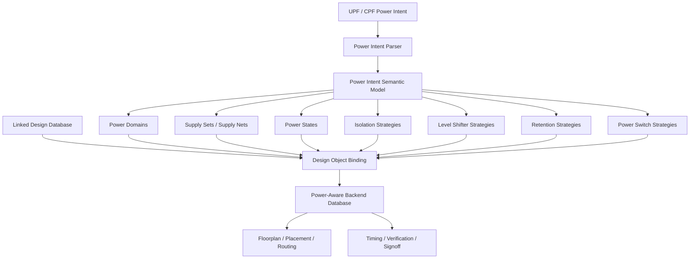
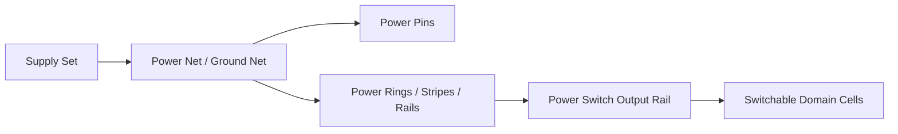
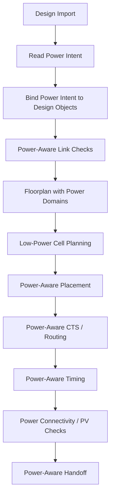
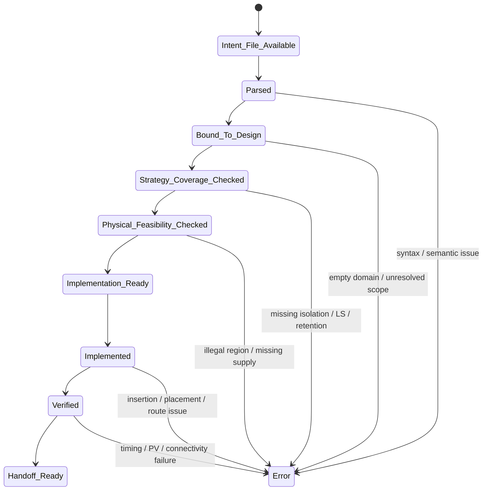

# 25. UPF / CPF: Why Low-Power Intent Must Be Explicitly Understood by Backend Tools

Author: Darren H. Chen

demo: `LAY-BE-25_upf_cpf`

Tags: Backend Flow, EDA, UPF, CPF, Low Power, Power Intent, Power Domain, Isolation, Retention, Level Shifter, Power Switch, Power-Aware Implementation

Low-power implementation is not only a matter of inserting a few special cells into a gate-level netlist.

In a modern backend flow, low-power intent affects how the design database is interpreted, how objects are grouped, how supply nets are connected, how timing scenarios are built, how physical regions are planned, how placement legality is checked, how routing is constrained, and how physical verification is closed.

The key question is:

```text
How does a backend tool know which part of the design can be powered off,
which part must remain on,
which crossing needs isolation,
which crossing needs level shifting,
which state must be retained,
and which supply configuration is legal in each power state?
```

RTL alone usually does not carry all of this information. A Verilog netlist describes logic connectivity. It can tell the tool how gates, registers, ports, and nets are connected. But it does not fully describe the electrical power-management policy of the chip.

That missing semantic layer is called power intent.

UPF and CPF are power-intent formats. Their role in backend flow is not simply to provide a configuration file. Their deeper role is to turn power-management architecture into tool-readable design semantics.

Once power intent is loaded and bound to the design database, backend implementation changes from:

```text
logic + timing + physical implementation
```

to:

```text
logic + timing + physical implementation + power-state semantics
```

This article explains why UPF / CPF must be explicitly understood by backend tools, how power intent enters the backend database, and how it affects implementation, timing, routing, verification, and engineering closure.

---

## 1. Power Intent Is Design Semantics, Not a Side File

It is tempting to view UPF / CPF as an additional input file that simply tells the tool where to insert low-power cells.

That view is too narrow.

Power intent defines a semantic layer of the design. It answers questions that cannot be reliably derived from the netlist alone:

```text
Which instances belong to each power domain?
Which supply net powers each domain?
Which power domains can be switched off?
Which logic remains powered during sleep?
Which signals leave a switchable domain?
Which signals cross between different voltage domains?
Which registers need state retention?
Which power modes are legal?
Which supplies are ON, OFF, or partially active in each mode?
```

Without this information, a backend tool sees a normal connected design. It can place cells, route nets, analyze timing, and export layout, but it cannot know whether those operations are correct under different power states.

For example, a net from a switchable domain to an always-on domain looks like an ordinary signal connection in the netlist:

```text
PD_CPU/output_signal  -->  PD_AON/control_logic
```

But electrically, when `PD_CPU` is off, the output may become unknown. The receiving always-on logic must not consume an uncontrolled value. That crossing needs isolation.

Similarly, a net crossing from a 0.8 V domain to a 1.2 V domain may look like ordinary connectivity:

```text
PD_LOW/data_out  -->  PD_HIGH/data_in
```

But electrically, the voltage levels are not equivalent. That crossing may need a level shifter.

In both cases, the netlist shows connectivity, but power intent gives the connection its electrical meaning.

That is the central idea:

> UPF / CPF gives backend tools the power-state semantics required to interpret ordinary design objects correctly.

---

## 2. Why RTL Alone Cannot Carry the Whole Low-Power Model

RTL is designed to describe functional behavior. It is excellent for describing registers, combinational logic, hierarchy, data flow, state machines, and module interfaces.

Low-power implementation, however, also depends on physical and electrical decisions:

```text
supply rails
voltage areas
power switches
retention supplies
always-on routes
level shifter legal regions
isolation control signals
power-state tables
power-aware timing scenarios
physical verification connectivity
```

Placing all of that directly into RTL would create several engineering problems.

### 2.1 Functional Logic Would Be Tightly Coupled to Implementation Policy

The same IP block may be reused in several chips with different power strategies.

For example:

| Product Context | Possible Power Strategy |
|---|---|
| High-performance SoC | Multiple voltage domains and power gating |
| Low-cost chip | Clock gating only |
| Mobile chip | Retention and deep-sleep modes |
| Automotive chip | Some domains kept active for safety response |
| Test chip | Simplified always-on implementation |

If power-management structures were hard-coded into RTL, reuse would become difficult. The logic would no longer represent only function; it would also encode one specific implementation strategy.

UPF / CPF allows the functional design and the power-management implementation policy to be managed as related but distinct layers.

### 2.2 Physical Power Structures Are Library- and Technology-Dependent

Low-power implementation uses cells and structures from specific libraries:

```text
isolation cells
level shifters
retention flops
always-on buffers
power switch cells
power management cells
```

The exact library cells depend on the process node, voltage, cell library, available views, and foundry methodology. These choices are usually not fixed at high-level RTL architecture time.

A power intent file can express the strategy first and allow the implementation details to be refined later:

```text
strategy level:  signals leaving PD_CPU require isolation
implementation level: use ISO clamp-low cells from library X
physical level: place them near the PD_CPU boundary and power them from AON supply
```

### 2.3 Backend Flow Requires Gradual Refinement

Low-power implementation is refined across multiple stages:

```text
architecture
RTL integration
synthesis
design import
floorplan
placement
routing
timing analysis
physical verification
signoff
```

Early in the project, the team may know that a domain can be switched off. Later, the team determines switch placement, isolation locations, supply routing, retention storage, and signoff checks.

A useful power-intent model must support that gradual refinement.

---

## 3. What UPF / CPF Adds to the Backend Database

From a backend perspective, UPF / CPF introduces several classes of objects and relationships.

```text
power domain
supply set
supply net
power state
isolation strategy
level shifter strategy
retention strategy
power switch strategy
always-on strategy
power-aware check rule
```

These are not isolated text entries. They must be bound to the design database.

A backend design database already contains objects such as:

```text
module
instance
cell
net
pin
port
clock
region
row
shape
route
property
scenario
```

Power intent adds relationships on top of those objects:

```text
instance belongs to power domain
power domain uses supply set
supply set maps to physical supply nets
net crosses from one domain to another
crossing requires isolation
crossing requires level shifting
register requires retention
power switch controls switched supply
power state determines which domains are ON or OFF
```

The transformation can be shown as:



The important step is `Design Object Binding`.

If the power intent exists but is not correctly bound to design instances, nets, ports, and supplies, the flow is not power-aware in a meaningful sense.

---

## 4. The Four-Layer Architecture of Power Intent in Backend Flow

A robust backend methodology can treat power intent as four layers.

```text
Specification layer
Semantic layer
Design binding layer
Physical implementation layer
```

### 4.1 Specification Layer

This is the external power-intent description.

It may include:

```text
power domains
supply declarations
power state definitions
isolation policies
level shifter policies
retention policies
power switch definitions
```

This layer is readable by the tool but still external to the design database.

### 4.2 Semantic Layer

The tool parses the file and creates internal power-intent objects.

At this layer, the tool understands concepts such as:

```text
PD_AON is always on
PD_CPU is switchable
PD_CPU uses a switched supply
PD_CPU outputs need isolation when PD_CPU is off
signals from PD_LOW to PD_HIGH require voltage conversion
selected registers need retention
```

### 4.3 Design Binding Layer

The semantic objects are bound to actual design objects.

Examples:

```text
PD_CPU extent -> instances under u_cpu/*
PD_AON extent -> u_pmu/* and wakeup logic
isolation strategy -> output ports and nets crossing from PD_CPU to PD_AON
retention strategy -> state registers under u_cpu/regfile/*
level shifter strategy -> nets crossing PD_LOW to PD_HIGH
```

This is where many low-power issues appear.

A domain may be defined correctly in the power-intent file but fail to bind to the intended instances because hierarchy names changed. A retention rule may be syntactically valid but select too many or too few registers. A level shifter rule may miss a crossing because the source or sink domain was not correctly inferred.

### 4.4 Physical Implementation Layer

Once the semantic model is bound to design objects, backend implementation can act on it.

Examples:

```text
create voltage areas
insert isolation cells
insert level shifters
map retention registers
place power switches
connect always-on supplies
route switched rails
check power-aware timing
export power-aware verification data
```

The backend tool can implement low-power structures only after the first three layers are correct.

A common mistake is to debug physical insertion while ignoring semantic binding. If the power-intent model is not bound correctly, physical implementation is only treating symptoms.

---

## 5. Power Domain: Logical Group First, Physical Region Second

A power domain is often visualized as a physical region in the floorplan, but its first meaning is logical.

A power domain is a set of design objects that share a power-management policy.

For example:

```text
PD_AON
  always-on controller
  wakeup logic
  reset control
  power-management interface

PD_CPU
  CPU core
  local controller
  register file
  selected local memories

PD_PERI
  peripheral bus
  UART / SPI / GPIO logic
```

This logical grouping then influences physical implementation.

```text
Power domain extent
      ↓
Voltage area / physical region
      ↓
Supply net assignment
      ↓
Power routing
      ↓
Special cell placement
      ↓
Power-aware timing and verification
```

A good power-domain definition should satisfy several criteria:

| Criterion | Reason |
|---|---|
| Clear logical extent | Instances must be consistently assigned |
| Clear supply relation | Each domain must have a known power and ground source |
| Clear boundary | Cross-domain nets must be enumerable |
| Physical feasibility | The domain must be placeable and routable |
| Verification visibility | Reports must show coverage and exceptions |

If the domain boundary is too broad, the design may receive unnecessary isolation, level shifters, or retention cells. If the boundary is too narrow, some unsafe crossings may be missed.

Domain definition is therefore not only an architectural decision. It is a backend implementation constraint.

---

## 6. Supply Sets and Supply Nets: From Abstract Power to Physical Connectivity

Power intent does not stop at grouping instances. It must also define how domains are powered.

A low-power design may contain several types of supplies:

```text
primary power
primary ground
always-on power
retention power
switch input power
switch output power
isolation supply
level-shifter low-side supply
level-shifter high-side supply
```

The tool must map those abstract supply concepts to real design and physical objects.



Supply mapping errors are some of the most dangerous low-power implementation failures.

Examples:

```text
an always-on buffer is connected to a switchable rail
an isolation cell loses power when the source domain turns off
a retention cell does not connect to the retention supply
a level shifter high-voltage pin is connected to the low-voltage rail
a power switch output rail is not recognized as the switched supply
```

These errors may not look like ordinary netlist connectivity bugs. They may only appear in power-aware checks, LVS, electrical rule checks, or low-power functional verification.

A mature backend flow should always generate supply reports:

```text
supply_set_summary.rpt
supply_net_binding.rpt
power_domain_supply_map.rpt
always_on_supply_check.rpt
retention_supply_check.rpt
level_shifter_supply_check.rpt
power_switch_supply_check.rpt
```

---

## 7. Isolation Strategy: Power-Off Outputs Must Not Pollute Active Logic

When a switchable domain is powered off, its outputs may no longer carry valid logic values.

If such outputs drive an active domain, the active domain may receive unknown or unstable values.

Isolation prevents that by clamping signals to a known value.

```text
Switchable Domain                 Active Domain

source logic ---- isolation ----> receiver logic
                    |
                    +-- isolation enable
```

An isolation strategy must answer several questions:

```text
Which source domain can be powered off?
Which destination domain remains active?
Which output signals require isolation?
Where should the isolation cell be inserted?
What clamp value should it use?
Which supply powers the isolation cell?
Which signal controls isolation enable?
In which power states should isolation be active?
```

This is not a local cell insertion issue. It is a power-state boundary issue.

### Isolation Placement Choices

Isolation may be placed near the source side, near the destination side, or in a dedicated boundary region.

Each choice affects implementation:

| Location | Benefit | Risk |
|---|---|---|
| Source-side boundary | Clear relation to source domain | Cell may lose power if placed inside switchable supply |
| Destination-side boundary | Easier to power from active domain | Longer route from source may remain uncontrolled |
| Boundary region | Good implementation control | Requires floorplan planning |

For backend implementation, the isolation cell must be physically powered when it needs to clamp the signal. This is why isolation cannot be treated as an ordinary buffer.

---

## 8. Level Shifter Strategy: Cross-Voltage Nets Need Electrical Interpretation

A net crossing between voltage domains may require voltage conversion.

For example:

```text
PD_LOW  : 0.75 V
PD_HIGH : 1.10 V
```

A signal from `PD_LOW` to `PD_HIGH` may need a low-to-high level shifter. A signal from `PD_HIGH` to `PD_LOW` may need a high-to-low or tolerant receiver strategy, depending on the libraries and technology.

The backend tool must combine several sources of information:

```text
net connectivity
source domain
sink domain
source voltage
sink voltage
level shifter strategy
library candidate cells
legal placement region
supply connection
```

The insertion decision can be represented as:

```text
Cross-Domain Net
  + domain voltage relation
  + level-shifter rule
  + available library cell
  + placement legality
  + supply availability
  = level shifter implementation
```

Level shifters are physically more complex than ordinary signal buffers because they may require multiple supplies. They also introduce timing delay and placement constraints.

A good backend report should include:

```text
level_shifter_required_crossings.rpt
level_shifter_inserted_cells.rpt
level_shifter_missing_coverage.rpt
level_shifter_supply_check.rpt
level_shifter_timing_impact.rpt
```

The most important question is not simply whether level shifters were inserted. The real question is whether every required voltage crossing is covered and whether every inserted level shifter is legal, powered, and timed.

---

## 9. Retention Strategy: Power-Off Does Not Always Mean State Loss

Power gating reduces leakage by turning off a domain. But turning off power normally destroys register state.

Retention allows selected state elements to preserve their values across power-down and wake-up.

A retention strategy must define:

```text
which registers need retention
which retention cells should be used
which supply keeps retention storage alive
which signals control save and restore
which power states trigger save / restore behavior
how scan and reset interact with retention
```

A simplified lifecycle is:

```text
Normal Mode
    |
    v
Save State
    |
    v
Power Off Main Domain
    |
    v
Retention Storage Remains Powered
    |
    v
Power On Main Domain
    |
    v
Restore State
```

This lifecycle affects both functional behavior and backend implementation.

Retention cells may require:

```text
main supply
retention supply
save signal
restore signal
scan handling
special timing checks
power-aware verification
```

Retention insertion can affect scan chains, clocking, timing paths, and placement density. It also creates supply-connectivity requirements that must be checked before signoff.

A backend tool must explicitly understand retention intent. Otherwise, it cannot safely decide which registers need retention mapping and which supplies must remain active.

---

## 10. Power Switch Strategy: Power Gating Becomes a Real Supply Network

A power switch is the physical mechanism that turns a switchable domain on or off.

Conceptually:

```text
Unswitched Supply
        |
        v
Power Switch Cell
        |
        v
Switched Supply Rail
        |
        v
Switchable Domain Logic
```

A power switch strategy must describe:

```text
which domain is controlled
which input supply feeds the switch
which output supply powers the domain
which control signal enables the switch
how many switches are needed
where switches are placed
how switched rails are connected
how inrush current and IR drop are handled
```

Power switches are not just logic cells. They are part of the power delivery network.

If too few switches are used, the domain may suffer voltage drop or wake-up instability. If switch placement is poor, the switched rail may be difficult to route. If control routing is unreliable, the domain may enter an unsafe partial-power state.

Therefore, a power switch strategy affects:

```text
floorplan
power grid
placement rows
special routing
IR / EM analysis
wake-up behavior
physical verification
```

The backend flow should generate reports such as:

```text
power_switch_instance.rpt
power_switch_control_net.rpt
switched_supply_connection.rpt
power_switch_region_check.rpt
power_switch_coverage.rpt
```

---

## 11. Power State Model: Not Every ON/OFF Combination Is Legal

A low-power chip has multiple operating modes.

Example:

```text
ACTIVE
IDLE
CPU_SLEEP
GPU_SLEEP
DEEP_SLEEP
WAKEUP
TEST
```

Each mode defines a legal combination of domain states.

| Mode | PD_AON | PD_CPU | PD_GPU | PD_PERI |
|---|---|---|---|---|
| ACTIVE | ON | ON | ON | ON |
| CPU_SLEEP | ON | OFF | ON | ON |
| GPU_SLEEP | ON | ON | OFF | ON |
| DEEP_SLEEP | ON | OFF | OFF | OFF |
| TEST | ON | ON | ON | ON |

This table affects backend analysis.

For example:

```text
A path inside PD_CPU is not functionally active when PD_CPU is OFF.
An isolation control path must remain active before PD_CPU turns OFF.
A retention save path must be valid before power-down.
A wake-up path in PD_AON must remain valid during DEEP_SLEEP.
A level shifter is relevant only for power states where both domains are active or one side observes the other.
```

Power states tell the tool which scenarios are meaningful. Without a power state model, the tool may analyze impossible states or miss required states.

This is why power intent is tied to MCMM, timing constraints, mode setup, and signoff verification.

---

## 12. How Power Intent Affects Backend Flow Stages

UPF / CPF is not read once and forgotten. It should remain active throughout the flow.



### 12.1 Import / Link

The tool must load the power-intent file and bind domains, supplies, and strategies to the design database.

Checks include:

```text
Are all domains defined?
Are domain extents non-empty?
Are supplies bound to real nets?
Are strategies valid for existing objects?
Are power states defined and consistent?
```

### 12.2 Floorplan

Power domains may require physical voltage areas, supply regions, switch rows, level shifter regions, or isolation boundaries.

Checks include:

```text
Can each domain map to a feasible physical region?
Are always-on regions planned?
Are boundary cells placeable?
Is there room for power switches?
```

### 12.3 Placement

The flow must place normal cells and low-power special cells legally.

Checks include:

```text
Are isolation cells placed in powered regions?
Are level shifters placed where both supply connections are legal?
Are retention cells connected to retention supply?
Are always-on buffers powered by always-on rail?
```

### 12.4 Routing

Routing must handle supply and signal connectivity with power semantics.

Checks include:

```text
Are switched rails connected correctly?
Are always-on nets preserved?
Are retention supplies routed?
Are level shifter supplies connected?
Are power switch outputs tied to the correct domain rails?
```

### 12.5 Timing / Verification

Timing and verification must understand power modes and inserted structures.

Checks include:

```text
Are power-aware scenarios defined?
Are isolation and retention controls timed?
Are cross-domain paths analyzed under valid states?
Does LVS understand inserted low-power cells?
Does physical verification see correct power connectivity?
```

---

## 13. Backend Readiness State Machine for UPF / CPF

A low-power backend flow should not move directly from reading a power-intent file to implementation. It should pass through readiness states.



This state machine is useful because low-power errors are often discovered late. A structured readiness model moves many errors earlier.

For example:

```text
If a domain extent is empty, stop before floorplan.
If isolation coverage is missing, stop before placement.
If level shifter supply connectivity is impossible, stop before routing.
If retention supply is not defined, stop before signoff.
```

The goal is to avoid discovering semantic errors only after layout and verification.

---

## 14. Common Failure Patterns

Low-power failures are often cross-stage failures. They rarely belong to a single command or one file.

| Failure Pattern | Typical Symptom | Likely Root Cause |
|---|---|---|
| Empty power domain | Domain report shows no instances | Hierarchy scope changed or extent rule is wrong |
| Missing isolation | Active domain receives signal from off domain | Crossing rule is incomplete or direction is wrong |
| Wrong isolation supply | Isolation cannot clamp when source is off | Cell placed/powered inside switchable domain |
| Missing level shifter | Cross-voltage path has no converter | Voltage relation or LS strategy not defined |
| Illegal level shifter placement | Inserted LS cannot connect both supplies | Region planning or supply availability issue |
| Retention mismatch | State not restored after wake-up | Retention elements or save/restore controls incomplete |
| Power switch mismatch | Domain rail not controlled as expected | Switch input/output supply mapping wrong |
| Always-on failure | Wake-up/control path unavailable in sleep | AON cell connected to switched supply |
| Power-state inconsistency | STA/PV scenario confusion | Power state table incomplete or contradictory |
| LVS power mismatch | Layout/source power nets differ | Supply aliases or special cells not passed correctly |

The most important debugging rule is:

> Do not debug low-power physical failures only at the geometry level. First verify the power-intent binding and strategy coverage.

---

## 15. Report System for Power Intent Visibility

A low-power flow must make power intent visible through reports.

Recommended reports include:

```text
power_intent_parse_summary.rpt
power_domain_summary.rpt
power_domain_instance_map.rpt
supply_set_summary.rpt
supply_net_binding.rpt
power_state_table.rpt
cross_domain_signal.rpt
isolation_strategy_coverage.rpt
level_shifter_strategy_coverage.rpt
retention_strategy_coverage.rpt
power_switch_strategy_summary.rpt
always_on_cell_check.rpt
low_power_physical_feasibility.rpt
low_power_verification_checklist.rpt
```

Each report answers a different engineering question.

| Report | Main Question |
|---|---|
| `power_domain_summary.rpt` | What domains exist and are they non-empty? |
| `power_domain_instance_map.rpt` | Which instances belong to each domain? |
| `supply_set_summary.rpt` | Which supplies power each domain? |
| `cross_domain_signal.rpt` | Which nets cross domain boundaries? |
| `isolation_strategy_coverage.rpt` | Are off-domain outputs safely covered? |
| `level_shifter_strategy_coverage.rpt` | Are voltage crossings covered? |
| `retention_strategy_coverage.rpt` | Are required state elements retained? |
| `power_switch_strategy_summary.rpt` | How are switchable rails controlled? |
| `always_on_cell_check.rpt` | Are always-on cells powered correctly? |
| `low_power_verification_checklist.rpt` | Is the design ready for power-aware checks? |

Without these reports, power intent remains invisible. A script may execute, but the engineering team cannot tell whether the backend database actually understands the low-power architecture.

---

## 16. Demo Design: LAY-BE-25_upf_cpf

The purpose of this demo is not to implement a full low-power SoC. The purpose is to show how power intent can be represented, bound, checked, and reported in a backend-style engineering flow.

A recommended directory structure is:

```text
LAY-BE-25_upf_cpf/
├─ data/
│  ├─ netlist/
│  │  └─ sample_top.v
│  ├─ power_intent/
│  │  └─ sample_power_intent.upf
│  ├─ config/
│  │  ├─ power_domains.csv
│  │  ├─ supply_sets.csv
│  │  ├─ power_states.csv
│  │  └─ crossings.csv
│  └─ library/
│     └─ low_power_cell_catalog.csv
├─ scripts/
│  ├─ run_upf_cpf_demo.csh
│  └─ clean.csh
├─ tcl/
│  ├─ 01_read_design.tcl
│  ├─ 02_read_power_intent.tcl
│  ├─ 03_report_power_domains.tcl
│  ├─ 04_check_supply_binding.tcl
│  ├─ 05_check_strategy_coverage.tcl
│  └─ 06_write_low_power_summary.tcl
├─ reports/
│  ├─ power_intent_parse_summary.rpt
│  ├─ power_domain_summary.rpt
│  ├─ supply_set_summary.rpt
│  ├─ cross_domain_signal.rpt
│  ├─ strategy_coverage.rpt
│  └─ low_power_checklist.rpt
└─ README.md
```

The demo should verify:

```text
power intent file exists and can be parsed
power domains are non-empty
supply sets are declared and bound
power states are explicit
cross-domain signals are identified
isolation coverage is checked
level shifter coverage is checked
retention candidates are reported
power switch strategy is visible
low-power checklist is generated
```

The main output should not be a graphical layout. The main output should be a set of reports proving that power intent is visible and checkable.

---

## 17. Minimal C-Shell Entry Pattern

A backend demo should make paths and logs explicit.

```csh
#!/bin/csh -f

set nonomatch

set ROOT_DIR = `pwd`
set LOG_DIR  = "$ROOT_DIR/logs"
set RPT_DIR  = "$ROOT_DIR/reports"
set TCL_DIR  = "$ROOT_DIR/tcl"

mkdir -p "$LOG_DIR"
mkdir -p "$RPT_DIR"

setenv DESIGN_ROOT "$ROOT_DIR"
setenv POWER_INTENT_FILE "$ROOT_DIR/data/power_intent/sample_power_intent.upf"
setenv POWER_DOMAIN_CONFIG "$ROOT_DIR/data/config/power_domains.csv"
setenv SUPPLY_SET_CONFIG "$ROOT_DIR/data/config/supply_sets.csv"
setenv POWER_STATE_CONFIG "$ROOT_DIR/data/config/power_states.csv"
setenv CROSSING_CONFIG "$ROOT_DIR/data/config/crossings.csv"
setenv EDA_TOOL_BIN /path/to/eda_tool

$EDA_TOOL_BIN \
    -batch "$TCL_DIR/06_write_low_power_summary.tcl" \
    -log "$LOG_DIR/upf_cpf.log" \
    >&! "$LOG_DIR/upf_cpf.stdout.log"
```

The specific tool options may vary. The engineering pattern is stable:

```text
explicit input files
explicit power-intent file
explicit configuration files
explicit reports
explicit logs
```

This matters because low-power debug becomes extremely difficult when power intent is loaded from implicit search paths or unstated project settings.

---

## 18. Methodology: Verify Power Intent Binding Before Physical Insertion

A practical low-power flow should not start by asking:

```text
Were isolation cells inserted?
```

It should first ask:

```text
Did the tool understand which signals require isolation?
```

Likewise, do not first ask:

```text
Were level shifters inserted?
```

First ask:

```text
Did the tool identify all cross-voltage crossings?
```

This ordering is critical.

Recommended checking order:

```text
1. parse power intent
2. check power domain extents
3. check supply bindings
4. check power state table
5. identify cross-domain nets
6. check isolation coverage
7. check level shifter coverage
8. check retention coverage
9. check power switch strategy
10. check physical feasibility
11. proceed to implementation
```

This method avoids a common late-stage problem: inserted cells are present, but the underlying low-power semantics are incomplete or wrong.

---

## 19. Methodology: Treat Power Intent as a Versioned Engineering Asset

Power intent changes when the design changes.

Common triggers include:

```text
RTL hierarchy update
module instance rename
new clock/reset structure
new voltage domain
new sleep mode
new retention requirement
new interface crossing
library cell update
floorplan region update
ECO netlist update
```

Every such change can affect power-intent binding.

Therefore, power intent should be versioned and reviewed like netlist, constraints, and floorplan data.

A mature project should track:

```text
power intent version
matched netlist version
matched library version
matched floorplan version
matched scenario setup
strategy coverage report
known exceptions
signoff status
```

A power-intent file that is not matched to the current design hierarchy can be syntactically valid and still semantically wrong.

---

## 20. Summary

UPF / CPF is not just an extra input file for low-power implementation.

It is the format through which power architecture becomes an explicit design semantic layer inside the backend tool.

This semantic layer tells the tool:

```text
which logic belongs to each power domain
which supplies power each domain
which states are legal
which domain crossings need isolation
which voltage crossings need level shifters
which registers need retention
which cells must remain always on
which switches control switched supplies
which checks are meaningful in each power state
```

Once that semantic layer is bound to the design database, backend implementation can correctly perform floorplan planning, special-cell insertion, placement, routing, timing analysis, physical verification, and signoff handoff.

The central methodology is:

```text
Do not treat low-power implementation as special-cell insertion first.
Treat it as power-intent binding first.
```

If the backend tool cannot query, report, and check power intent, then the flow does not yet have full control of low-power implementation.

---

## Closing Note

UPF / CPF turns power architecture from an engineering agreement into a tool-readable, database-bound, implementation-aware design semantic model.

That is why low-power intent must be explicitly understood by backend tools before it can be implemented, verified, and signed off.
