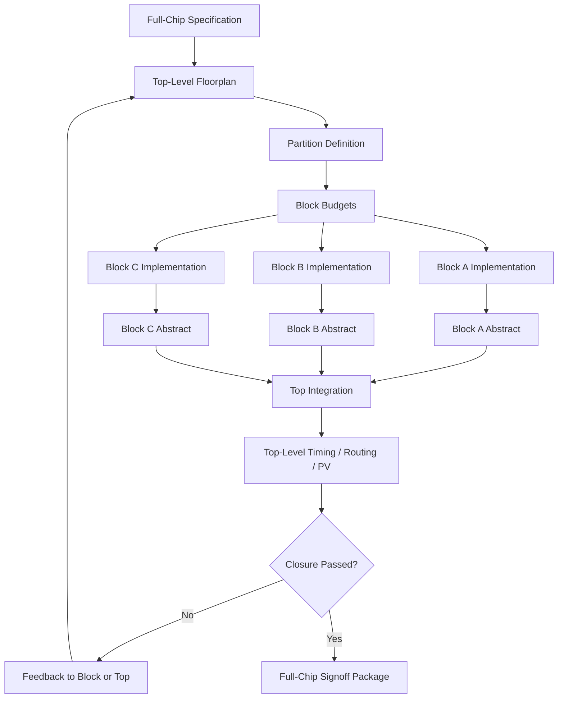
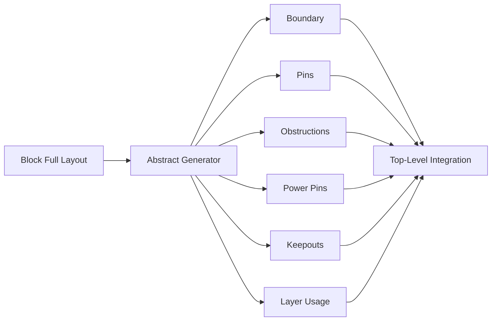
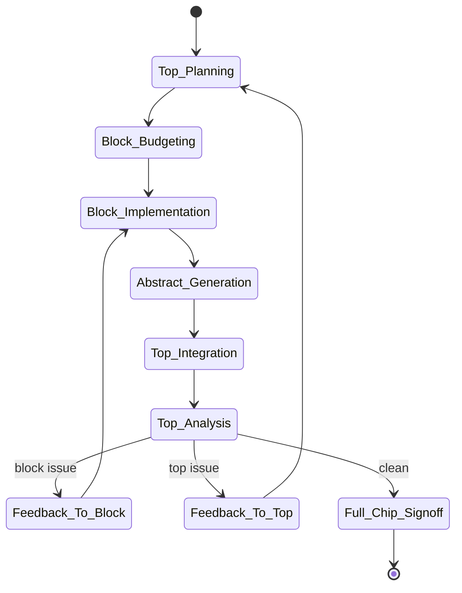
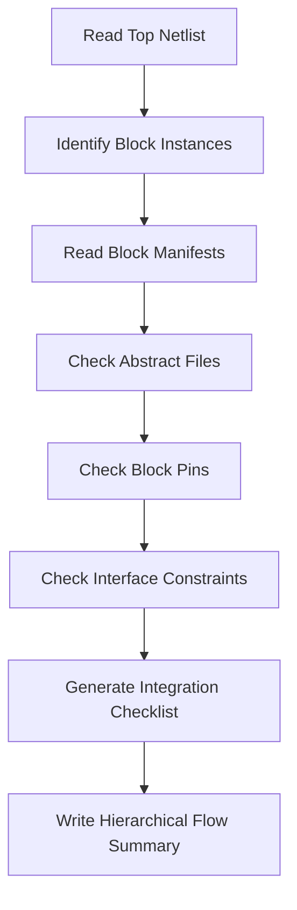

# 26. Hierarchical Design Flow: Why Large-Chip Backend Implementation Needs Partitioning, Abstraction, Merge, and Signoff

Author: Darren H. Chen

demo: `LAY-BE-26_hierarchical_flow`

Tags: `Backend Flow` `EDA` `Hierarchical Flow` `Physical Abstract` `Top-Down` `Bottom-Up` `Partition` `Merge` `Signoff` `Large SoC`

---

As chip scale grows, backend implementation stops being a problem that can be solved by simply running a larger flat flow.

For a small block, a flat sequence may be sufficient:

```text
import design
floorplan
placement
CTS
routing
signoff
```

For a large SoC, the design may contain:

```text
multiple CPU clusters
multiple DSP / NPU / GPU blocks
large SRAM and ROM arrays
analog or mixed-signal macros
high-speed interface IPs
multiple power domains
multiple clock domains
multiple physical partitions
multiple external vendor IP blocks
```

If every cell, every net, every pin, every clock, every macro, every route, every timing arc, and every physical verification marker is handled in one flat database, the flow quickly reaches practical limits.

The key problem is not only tool capacity. The deeper problem is engineering controllability.

A large chip backend flow needs a way to:

```text
divide the design into manageable units
preserve the correct interface information
hide internal detail where possible
merge block results into the top level
verify consistency across multiple views
close timing and physical verification at both block and full-chip levels
```

That is the purpose of hierarchical design flow.

A hierarchical backend flow is not just “splitting a big design into smaller pieces.” It is an engineering system that transfers logical, physical, timing, power, and verification information between blocks and the top level through well-defined abstraction and release contracts.

---

## 1. Why Flat Flow Has a Practical Limit

A flat flow has one major advantage: simplicity.

All objects exist in one design database:

```text
all instances
all nets
all pins
all ports
all macros
all clocks
all routes
all constraints
all scenarios
all reports
```

For small and medium designs, this is convenient. The tool sees the complete design state, and commands can operate on the entire database directly.

However, as design size increases, flat flow hits several structural limits.

---

## 2. Capacity Limit

Backend tools maintain large object graphs internally.

A physical implementation database may include:

```text
instances
library masters
nets
pins
ports
rows
sites
macros
blockages
vias
wire shapes
route guides
timing arcs
clock paths
power structures
constraints
scenarios
physical verification markers
```

These objects are not independent. They are connected by dense relationships.

For timing analysis, the tool constructs a timing graph:

```text
pin nodes
cell arcs
net arcs
clock arcs
constraint edges
scenario-specific arrival times
scenario-specific required times
derates
exceptions
```

For routing, the tool maintains a routing resource graph:

```text
routing tracks
layer capacity
gcell capacity
blockages
preferred directions
via rules
spacing rules
congestion maps
DRC windows
```

When all of these are loaded and optimized flat at full-chip scale, memory usage, runtime, and debug complexity can grow rapidly.

Flat implementation may still be possible for some designs, but it becomes increasingly difficult to control.

---

## 3. Convergence Limit

Large SoCs are not just larger. They are more heterogeneous.

Different regions of the chip may have very different implementation characteristics:

| Region / Block Type | Typical Backend Challenge |
|---|---|
| CPU cluster | tight timing, dense logic, aggressive clocking |
| GPU / NPU block | high data-path density, routing pressure |
| NoC / bus fabric | wide interconnect, long global routes |
| SRAM region | macro pin access, channel planning |
| analog / mixed-signal macro | keepout, boundary rules, integration constraints |
| low-power island | isolation, level shifter, power switch, retention |
| high-speed interface | IO alignment, clocking, special route rules |

If all of these problems are solved in one flat run, debug becomes difficult.

A timing violation may be caused by:

```text
a block-internal critical path
a top-level interconnect path
an unrealistic timing budget
a poor boundary pin location
a clock latency mismatch
an outdated block timing model
```

A routing congestion issue may be caused by:

```text
a macro channel that is too narrow
top-level routes crossing block boundaries
block pins concentrated on one edge
incomplete block obstruction data
excessive use of upper routing layers inside a block
```

A DRC issue may be caused by:

```text
block-internal routing
top-level routing
boundary spacing between block and top shapes
GDS merge mismatch
wrong abstract obstruction data
```

Flat flow makes these causes harder to separate.

Hierarchical flow improves convergence by giving each block a clearer local closure target while preserving a controlled top-level integration path.

---

## 4. Collaboration Limit

Large SoCs are not usually implemented by one person or one team.

Different teams may own:

```text
CPU block
interconnect block
memory subsystem
peripheral subsystem
top integration
clocking
power network
PV signoff
timing signoff
ECO closure
```

If the full chip exists only as one flat backend database, parallel work becomes difficult.

Hierarchical flow enables block teams to work independently while the top-level team controls integration.

The key is not only directory separation. The key is interface discipline:

```text
what each block receives
what each block must deliver
what top can assume about each block
what must be rechecked at merge time
```

---

## 5. The Core Idea of Hierarchical Flow

Hierarchical flow transforms one large implementation problem into multiple block-level problems plus one integration problem.

A simplified structure looks like this:

```text
Top Design
├── Block A
│   ├── local standard cells
│   ├── local macros
│   ├── local clock tree
│   ├── local routing
│   └── local reports
├── Block B
│   ├── local placement
│   ├── local timing closure
│   └── local physical verification
├── Block C
│   └── local implementation database
└── Top-Level Implementation
    ├── block placement
    ├── top-level routing
    ├── global power network
    ├── global clock / reset
    └── full-chip signoff
```

The top does not need to see every internal detail of every block during every iteration.

Instead, each block provides abstract views.

The top-level flow uses these views to complete integration.

This creates a controlled separation:

```text
block internal implementation
        ↓
block abstraction
        ↓
top-level integration
        ↓
full-chip verification
        ↓
feedback to blocks if needed
```

---

## 6. Hierarchical Flow Architecture



This architecture shows why hierarchical flow is an iterative system.

It is not enough to implement blocks once and paste them into the top. The top and blocks exchange constraints, abstracts, reports, and feedback until both local and global closure are consistent.

---

## 7. Three Keywords: Partition, Abstract, Integration

Hierarchical flow can be understood through three core concepts:

```text
Partition
Abstract
Integration
```

---

## 8. Partition: Cutting the Design into Engineering Units

Partitioning defines the block structure.

A good partition should consider more than logical hierarchy.

Common partitioning criteria include:

```text
logical function
team ownership
clock domain
power domain
macro grouping
physical region
dataflow direction
timing criticality
routing channel availability
IP reuse boundary
verification boundary
```

A poor partition may create many top-level problems.

For example:

```text
too many signals crossing block boundaries
critical paths frequently crossing partitions
block pins concentrated in one area
power domains cut across physical partitions
clock trees forced to cross awkward boundaries
top-level routing channels overloaded
```

A good partition reduces cross-boundary complexity.

The goal is not simply to make blocks small. The goal is to make them independently implementable and cleanly integratable.

---

## 9. Partition Quality Checklist

| Question | Why It Matters |
|---|---|
| Are cross-block nets limited and well understood? | Too many crossings create routing and timing pressure. |
| Are critical paths mostly contained or budgeted? | Uncontrolled cross-block timing is difficult to close. |
| Do physical regions match logical hierarchy reasonably well? | Poor mapping causes pin and routing chaos. |
| Are power domains respected? | Low-power structures need consistent domain boundaries. |
| Are clock domains handled cleanly? | Clock distribution and skew groups depend on boundary choices. |
| Are macros grouped naturally? | Macro placement strongly affects channels and block shape. |
| Can the block be owned and released by a team? | Hierarchical flow is also a collaboration model. |

---

## 10. Abstract: Representing a Block Without Exposing Everything

A block abstract is a simplified but sufficient model of a completed or partially completed block.

The top-level tool does not always need the block’s internal standard cells, routes, and timing graph.

But it must know enough to integrate the block correctly.

A block abstract may include:

```text
physical boundary
pin locations
routing obstructions
placement obstructions
power pins
clock pins
block-level timing model
logical black-box model
power intent fragment
PV-relevant layout view
```

The purpose of abstraction is controlled information compression.

Too little information makes top integration unsafe.

Too much information makes top integration heavy and defeats the purpose of hierarchy.

---

## 11. Physical Abstract

A physical abstract represents the block in top-level physical implementation.

It typically provides:

```text
block boundary
block origin and size
block pins
pin layers
pin shapes
routing blockages
placement blockages
macro obstructions
power pin shapes
keepout regions
allowed routing layers
```

The top-level tool needs this information to:

```text
place block instances
connect top-level nets to block pins
avoid routing through blocked areas
build top-level power structures
check boundary legality
avoid pin access issues
```

A physical abstract is not just a picture of the block outline. It is the top-level physical contract of the block.

---

## 12. Physical Abstract Model



The abstract must preserve information that affects top-level placement, routing, power connectivity, and PV merge.

---

## 13. Timing Abstract

A timing abstract compresses block-internal timing behavior into a model usable by the top-level flow.

It may describe:

```text
input-to-register timing requirements
register-to-output timing behavior
input-to-output combinational paths
generated clocks
clock latency assumptions
interface constraints
mode/corner/scenario-specific timing data
```

The top cannot ignore block timing.

But it also cannot always expand every block’s full timing graph.

Timing abstraction balances capacity and accuracy.

A useful timing abstract should answer:

```text
what timing does the block require at its inputs?
what timing does the block provide at its outputs?
which clocks are generated or propagated?
which paths are purely internal and already closed?
which paths are interface-sensitive?
```

---

## 14. Logical Abstract

A logical abstract defines the block interface at netlist level.

It may contain:

```text
module name
port list
port directions
bus definitions
black-box declaration
power/ground ports
test ports
clock/reset ports
interface constraints
```

The logical abstract allows top-level netlist integration without exposing internal implementation.

But it must remain consistent with:

```text
RTL module interface
physical abstract pins
timing abstract ports
LVS source netlist
block GDS top cell
```

If logical and physical abstracts disagree, top integration may pass early checks but fail at LVS or timing signoff.

---

## 15. Power Abstract

For low-power SoCs, each block may need a power abstract.

This can include:

```text
power domains inside the block
power pins
ground pins
always-on supply requirements
isolation boundary assumptions
level shifter requirements
retention supply requirements
power switch interface
power state assumptions
```

This information is critical for top-level power network construction and power-aware verification.

A block may be physically integrated correctly but still fail power-aware checks if its supply semantics are unclear.

---

## 16. Integration: Rebuilding the Top-Level Context

Top-level integration uses block abstracts to build a full-chip design context.

It must resolve:

```text
block placement
top-level connectivity
global clock and reset
top-level routing
global power network
cross-block timing
block boundary DRC
full-chip LVS
PV merge
top-level ECO
```

Integration is not a file concatenation step.

It is a multi-view consistency reconstruction.

The top must ensure that each block abstract, top netlist, top constraints, power intent, GDS, DEF, and timing model all describe the same design.

---

## 17. Top-Down and Bottom-Up Must Work Together

Hierarchical flow is not purely top-down or purely bottom-up.

It needs both directions.

---

## 18. Top-Down Planning

Top-down planning starts from the full chip.

It defines:

```text
block placement
block size
block aspect ratio
block boundary
pin planning
timing budget
routing channel
power distribution strategy
clock distribution strategy
IO alignment
inter-block connection plan
```

Top-down planning prevents block-level implementation from breaking the global design.

For example, if a block is implemented without top-level pin planning, its pins may end up in locations that make top-level routing extremely difficult.

---

## 19. Bottom-Up Implementation

Bottom-up implementation closes each block locally.

It focuses on:

```text
block floorplan
block placement
block CTS
block routing
block timing
block DRC
block LVS
block abstract generation
block release package
```

Bottom-up implementation makes the overall problem manageable by ensuring that each block is a credible implementation unit.

---

## 20. Iteration Between Top and Block

The real flow is iterative:



This state machine is important.

Hierarchical flow is not a one-pass pipeline. It is a controlled exchange of constraints and implementation evidence.

---

## 21. Boundary Pins Are Interface Contracts

Block pins are one of the most important parts of hierarchical flow.

They define how the top connects to the block.

Block pin planning affects:

```text
top-level route quality
inter-block timing
pin access
boundary congestion
clock/reset entry
power connectivity
cross-domain signal handling
ECO impact
```

A poor pin plan can make top integration extremely difficult.

Common pin planning problems include:

```text
pins concentrated on one edge
high-speed signals far from their source or destination
clock pins placed in inconvenient regions
bus bits ordered poorly
power pins not aligned with top-level grid
pins blocked by internal obstructions
insufficient routing channels near pin groups
```

Block pin planning should be treated as an engineering contract, not a cosmetic layout detail.

---

## 22. Budgeting: Distributing Global Targets to Blocks

A hierarchical flow needs budgets.

Budgets translate top-level goals into block-level targets.

Typical budgets include:

```text
area budget
timing budget
power budget
pin budget
routing layer budget
clock latency budget
congestion budget
IR drop budget
PV cleanliness target
```

Without budgets, each block may optimize locally but fail the full-chip target.

For example:

```text
a block may close internal timing but place boundary pins poorly
a block may use too many top routing layers
a block may consume too much power
a block may expand area and squeeze global routing channels
a block may assume unrealistic clock latency
```

Budgeting is the governance mechanism of hierarchical backend flow.

---

## 23. Example Budget Table

| Budget Type | Block-Level Meaning | Top-Level Risk if Missing |
|---|---|---|
| Timing budget | input/output delay target | inter-block timing fails |
| Area budget | block size and utilization limit | floorplan grows uncontrollably |
| Power budget | dynamic/leakage target | IR drop and thermal risk |
| Pin budget | pin count and pin side planning | boundary congestion |
| Routing budget | allowed layer usage | top-level routing resource shortage |
| Clock budget | latency/skew assumptions | post-integration timing mismatch |
| PV budget | DRC/LVS cleanliness target | merge signoff delay |

---

## 24. Merge Is Not Simple Concatenation

Merge is often misunderstood as:

```text
combine top GDS and block GDS
```

In reality, merge must preserve consistency across many views.

A merge operation must check:

```text
coordinate system
database units
origin alignment
cell naming
hierarchy naming
layer mapping
block boundary
top route to block pin connection
power/ground net naming
physical obstruction consistency
abstract versus full-view consistency
```

If any of these are wrong, full-chip signoff may fail.

Common merge failures include:

```text
GDS overlap
missing block layout
wrong top cell
cell name collision
short/open at block boundary
boundary DRC violation
wrong power net stitching
LVS mismatch caused by hierarchy mismatch
top route entering blocked block area
```

Merge is therefore a signoff-critical operation.

---

## 25. Abstract-to-Full Consistency

One of the most important checks in hierarchical flow is whether the abstract view matches the final full block implementation.

For example:

| Abstract Item | Full Block Item | Risk if Inconsistent |
|---|---|---|
| block boundary | final GDS boundary | overlap or gap at merge |
| pin location | final layout pin | top route connects wrong area |
| obstruction | internal metal shapes | top route violates DRC |
| power pin | actual power geometry | power connectivity mismatch |
| timing model | final block timing | top STA is inaccurate |
| logical port | final netlist port | LVS or connectivity failure |

A block release should not be accepted by top integration unless abstract-to-full consistency is verified.

---

## 26. Hierarchical Signoff

Hierarchical signoff has two levels:

```text
block-level signoff
top-level signoff
```

Block-level signoff checks:

```text
block timing
block DRC
block LVS
block antenna
block extraction
block IR/EM
block abstract correctness
block release completeness
```

Top-level signoff checks:

```text
inter-block timing
top-level DRC
top-level LVS
global power network
top-level routing
boundary DRC
top-level extraction
full-chip PV merge
full-chip timing
```

A block can be clean by itself but still create a top-level issue.

Typical boundary-level issues include:

```text
spacing between top route and block shape
incorrect block obstruction
pin access conflict
power connection mismatch
top-level clock route conflict
inter-block timing budget violation
```

Therefore:

```text
block clean + top clean + boundary clean = hierarchical closure
```

All three are required.

---

## 27. Hierarchical Data Architecture

A maintainable hierarchical flow should organize data explicitly.

A typical structure may look like:

```text
backend-flow-engineering-practice/
  blocks/
    block_a/
      input/
      scripts/
      db/
      abstract/
      reports/
      logs/
      release/
    block_b/
      input/
      scripts/
      db/
      abstract/
      reports/
      logs/
      release/

  top/
    input/
    scripts/
    db/
    reports/
    logs/
    integration/
    signoff/

  common/
    tech/
    libraries/
    constraints/
    pv_config/
    methodology/
```

The directory structure should reflect engineering ownership:

```text
block implementation data stays with the block
abstract data is released to top
top integration uses released views
reports record version and closure status
```

---

## 28. Block Release Contract

A block release should not be just a database file.

A robust block release package should include:

```text
release manifest
block netlist or black-box model
block DEF
block LEF / physical abstract
block GDS / OASIS
timing abstract
SDC fragment or interface constraints
power intent fragment
PV summary
STA summary
known issues
version tag
change log
owner information
```

A release manifest should answer:

```text
what is the block version?
what files are included?
which tool and library versions were used?
what is the top cell / module name?
what timing scenarios are covered?
what PV checks passed?
what known limitations remain?
```

Without a release contract, hierarchical integration becomes fragile.

---

## 29. Top Integration Contract

The top-level flow should also have an integration contract.

For each block, the top should check:

```text
required files exist
manifest is present
abstract can be loaded
pin names match top netlist
pin locations are valid
block boundary matches placement
power pins are declared
timing abstract matches scenario setup
GDS cell name is unique
PV views are available
known issues are reviewed
```

A block should not be integrated just because “the file is available.”

It should be integrated only after the release package passes a structured check.

---

## 30. Demo Design: LAY-BE-26_hierarchical_flow

The purpose of `LAY-BE-26_hierarchical_flow` is to demonstrate the engineering skeleton of a hierarchical backend flow.

It does not need to implement a full SoC. It should show how top/block structure, abstract files, manifests, and integration checks work together.

### Suggested Input Data

```text
data/top/sample_top.v
data/blocks/block_a_blackbox.v
data/blocks/block_b_blackbox.v
data/blocks/block_a.abstract.lef
data/blocks/block_b.abstract.lef
data/blocks/block_a.interface.sdc
data/blocks/block_b.interface.sdc
data/manifests/block_a_manifest.yaml
data/manifests/block_b_manifest.yaml
```

### Suggested Scripts

```text
scripts/run_hierarchical_demo.csh
scripts/clean.csh
tcl/01_read_top_structure.tcl
tcl/02_check_block_manifest.tcl
tcl/03_check_abstract_files.tcl
tcl/04_check_top_block_pins.tcl
tcl/05_generate_integration_report.tcl
```

### Suggested Reports

```text
reports/hierarchy_tree.rpt
reports/block_manifest_check.rpt
reports/abstract_file_check.rpt
reports/abstract_pin_check.rpt
reports/top_block_interface.rpt
reports/integration_checklist.rpt
reports/hierarchical_flow_summary.rpt
```

The demo should verify:

```text
the top design contains block instances
each block has a release manifest
each block has required abstract views
block pins match top-level connections
top integration has a checklist
release and integration status are reportable
```

---

## 31. Demo Flow Diagram



This demo is intentionally focused on engineering structure.

A hierarchical flow fails more often because of missing or inconsistent views than because of a single command failure.

The demo should make these dependencies explicit.

---

## 32. Common Failure Patterns

| Failure Pattern | Typical Root Cause | Engineering Action |
|---|---|---|
| Block abstract missing | block release incomplete | reject release, request manifest update |
| Pin mismatch | top netlist and block abstract out of sync | regenerate abstract or update top netlist |
| Boundary DRC after merge | abstract obstruction incomplete | update physical abstract and rerun merge |
| Timing mismatch | outdated timing abstract | regenerate timing model from latest block |
| GDS cell collision | duplicate cell names across blocks | enforce naming convention |
| Power net mismatch | inconsistent VDD/VSS naming | define global power net map |
| Top route enters block | missing obstruction in abstract | fix abstract generation |
| LVS mismatch | hierarchy or black-box policy inconsistent | align LVS source and layout hierarchy |
| Wrong block version | release tracking missing | enforce manifest and version checks |

These are not random errors. They are symptoms of weak hierarchical contracts.

---

## 33. Methodology: Treat Hierarchy as a Contract System

A mature hierarchical backend flow is built around contracts.

### Partition Contract

```text
which logic belongs to which block
which team owns which block
which boundaries are stable
```

### Abstract Contract

```text
which views a block must provide
what information each view must preserve
how abstract-to-full consistency is checked
```

### Budget Contract

```text
what timing, area, power, route, and clock targets each block must meet
```

### Release Contract

```text
what files and reports define a valid block release
```

### Merge Contract

```text
what checks must pass before a block is accepted by top integration
```

### Signoff Contract

```text
which checks are closed at block level
which checks are closed at top level
which checks require full-chip verification
```

Thinking in contracts makes hierarchical flow manageable.

Without contracts, hierarchy becomes a collection of disconnected files.

---

## 34. Methodology: Separate Local Closure from Global Closure

A block can be locally clean but globally problematic.

Therefore, closure must be evaluated in two dimensions.

| Closure Type | Main Question |
|---|---|
| Local block closure | Is the block internally legal, timed, routed, and verified? |
| Interface closure | Are the block boundary, pins, timing model, and power pins correct? |
| Top integration closure | Can the top route, time, power, and verify the full chip with this block? |
| Full-chip signoff closure | Does the merged layout pass final signoff checks? |

This is one of the most important hierarchical flow concepts:

```text
local success is not automatically global success
```

The interface contract is what connects the two.

---

## 35. Engineering Takeaways

Hierarchical design flow is necessary because large-chip backend complexity cannot be managed as a scaled-up flat flow.

The key engineering ideas are:

```text
partition the design into manageable blocks
abstract each block with the right level of information
budget global targets into local implementation goals
release blocks with manifests and reports
merge blocks through structured checks
verify both block-level and top-level consistency
feed integration failures back to the correct owner
```

The real value of hierarchy is not only runtime reduction. It is engineering control.

A well-designed hierarchical flow makes it possible to reason about:

```text
where a problem belongs
which view is inconsistent
which team owns the fix
which report proves closure
which release version is safe to integrate
```

---

## 36. Summary

A large SoC backend flow cannot be treated as a small block flow with more instances.

As scale increases, flat implementation faces capacity, convergence, and collaboration limits.

Hierarchical design flow addresses these limits by introducing:

```text
partitioning
block implementation
physical abstraction
timing abstraction
power abstraction
top integration
block release contracts
merge checks
hierarchical signoff
feedback loops
```

The core idea is:

```text
block internals are implemented locally
block interfaces are abstracted and released
top-level integration uses these abstracts
full-chip signoff verifies the combined result
```

A mature hierarchical backend flow is not just a technical flow. It is an engineering system for controlling complexity.

---

## Final Thought

Large-chip backend implementation is not a flat-flow scaling problem.

It is a complexity-management problem.

Partitioning, abstraction, merging, and signoff are the mechanisms that turn an unmanageable full-chip database into a controlled engineering closure loop.
