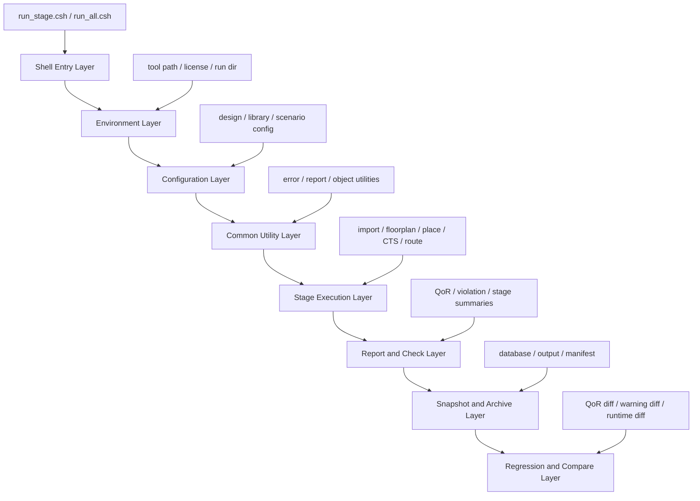
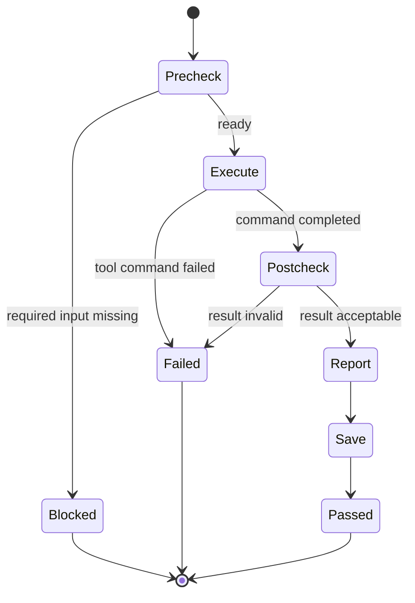
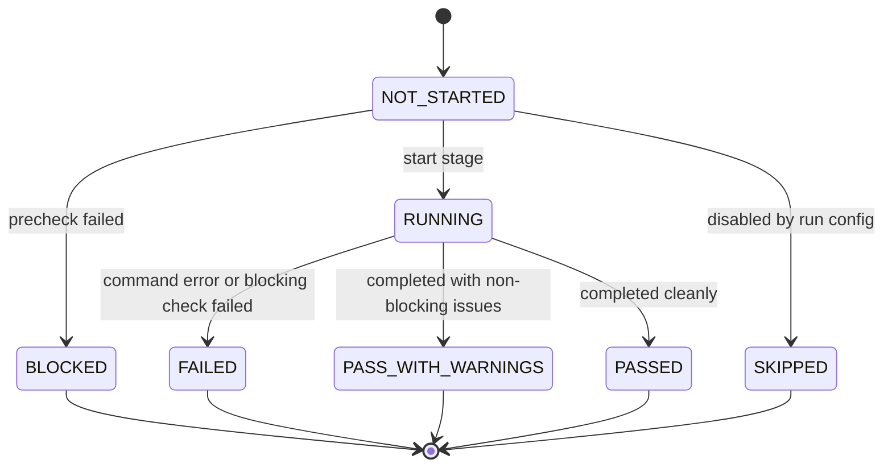
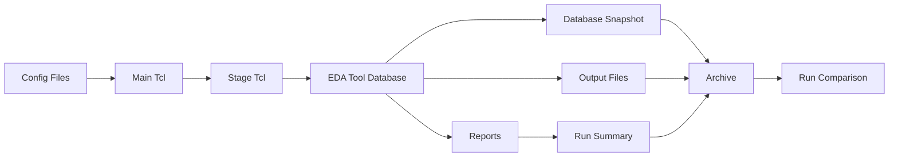

# 27. Backend Script Template: How Should a Maintainable Backend Flow Script System Be Organized?

Author: Darren H. Chen

Demo: `LAY-BE-27_backend_script_template`

Keywords: Backend Flow, EDA, Tcl, Script Template, Flow Architecture, Report System, Log System, Parameter Management, Regression, Engineering Methodology

A backend flow may start with one simple script:

```text
run.tcl
```

In an early experiment, this may be enough. The script loads libraries, imports a small design, runs a few commands, generates a report, and exits.

In a real project, however, the script set grows quickly:

```text
library setup
technology setup
design import
link
floorplan
placement
clock tree
routing
post-route checks
ECO
export
PV handoff
report collection
multi-mode / multi-corner setup
run comparison
archive
```

If the flow has no architecture, the script directory soon becomes a collection of emergency files:

```text
run_all.tcl
run_new.tcl
run_final.tcl
run_final2.tcl
run_final_fix.tcl
run_final_fix_new.tcl
```

This is not a script quantity problem. It is a flow architecture problem.

A maintainable backend script system is not a large command list. It is an engineering control system. It must separate configuration, stage execution, error handling, reporting, logging, parameter capture, version tracking, result comparison, and archive packaging.

The central question of this article is:

```text
How should a backend script template be organized so that it remains reproducible, inspectable, maintainable, and extensible as the design grows?
```

---

## 1. A Backend Script Is Not a Command List

A weak backend script is usually organized as a direct sequence of tool commands:

```tcl
read_library
read_lef
read_verilog
link_design
create_floorplan
run_placement
run_clock_tree
run_routing
write_reports
```

This style may run once, but it does not answer the engineering questions that appear after the first successful run:

```text
Which library version was used?
Which constraint file was used?
Which stage failed?
Which warnings are new?
Which reports are required before moving to the next stage?
Which parameters were changed?
Which database snapshot corresponds to this result?
Can another engineer reproduce the same run?
Can two runs be compared?
Can the flow be extended without rewriting everything?
```

A backend script system must therefore do more than execute commands. It must manage a run as an engineering object.

A complete run has at least four dimensions:

| Dimension | What it controls | Example artifacts |
|---|---|---|
| Execution | Which stages run and in what order | stage Tcl, run scripts, status files |
| Observation | What the run reports | QoR reports, summaries, error reports |
| Reproduction | How the run can be recreated | manifest, config snapshot, command log |
| Comparison | How the run is judged against others | QoR diff, violation diff, runtime diff |

If the script only handles execution, the flow remains fragile.

---

## 2. The Backend Script Stack

A maintainable backend script system can be modeled as a layered stack.



Each layer has a clear responsibility.

| Layer | Main responsibility | Typical files |
|---|---|---|
| Shell entry | Start the tool in a controlled way | `run_stage.csh`, `run_all.csh` |
| Environment | Fix run directories and external state | `env_check.tcl`, `run.env.log` |
| Configuration | Describe design-specific inputs | `design_config.tcl`, `library_config.tcl` |
| Common utilities | Provide reusable procedures | `report_utils.tcl`, `error_utils.tcl` |
| Stage execution | Run each backend stage | `01_import.tcl`, `03_place.tcl` |
| Report/check | Convert tool state into evidence | `report_place.tcl`, `check_route.tcl` |
| Snapshot/archive | Preserve results and identity | `run_manifest.yaml`, `db/`, `output/` |
| Compare | Track differences between runs | `qor_compare.rpt`, `runtime_compare.rpt` |

The purpose of this structure is not cosmetic. It prevents design-specific variables, tool execution logic, report generation, error handling, and archive policy from being mixed into one unreadable file.

---

## 3. Recommended Repository Structure

A practical backend script template can start with this layout:

```text
backend_flow/
├─ README.md
├─ config/
│  ├─ design_config.tcl
│  ├─ library_config.tcl
│  ├─ scenario_config.tcl
│  ├─ floorplan_config.tcl
│  ├─ placement_config.tcl
│  ├─ cts_config.tcl
│  ├─ route_config.tcl
│  └─ export_config.tcl
├─ scripts/
│  ├─ run_stage.csh
│  ├─ run_all.csh
│  ├─ clean.csh
│  ├─ archive_run.csh
│  └─ compare_runs.csh
├─ tcl/
│  ├─ main.tcl
│  ├─ common/
│  │  ├─ env_check.tcl
│  │  ├─ config_loader.tcl
│  │  ├─ stage_runner.tcl
│  │  ├─ report_utils.tcl
│  │  ├─ error_utils.tcl
│  │  ├─ object_utils.tcl
│  │  ├─ file_utils.tcl
│  │  └─ manifest_utils.tcl
│  ├─ stages/
│  │  ├─ 01_import.tcl
│  │  ├─ 02_floorplan.tcl
│  │  ├─ 03_place.tcl
│  │  ├─ 04_cts.tcl
│  │  ├─ 05_route.tcl
│  │  ├─ 06_post_route_check.tcl
│  │  ├─ 07_eco.tcl
│  │  └─ 08_export.tcl
│  ├─ reports/
│  │  ├─ report_import.tcl
│  │  ├─ report_floorplan.tcl
│  │  ├─ report_place.tcl
│  │  ├─ report_cts.tcl
│  │  ├─ report_route.tcl
│  │  ├─ report_eco.tcl
│  │  ├─ report_export.tcl
│  │  └─ report_final_summary.tcl
│  └─ checks/
│     ├─ check_import.tcl
│     ├─ check_floorplan.tcl
│     ├─ check_place.tcl
│     ├─ check_cts.tcl
│     ├─ check_route.tcl
│     └─ check_export.tcl
├─ logs/
├─ reports/
├─ output/
├─ db/
├─ tmp/
└─ regression/
```

The key idea is separation:

```text
config/      describes what changes between projects
scripts/     starts and controls runs from the shell
common/      provides reusable Tcl infrastructure
stages/      changes the design database
reports/     observes the design database
checks/      determines whether a stage is ready or passed
db/          stores stage snapshots
output/      stores handoff deliverables
regression/  stores comparisons across runs
```

A backend flow becomes maintainable when a new engineer can answer these questions without asking the original author:

```text
Where is the top name defined?
Where are libraries listed?
Where is placement executed?
Where is placement checked?
Where is the placement report generated?
Where is the run manifest written?
Which output files belong to this run?
```

---

## 4. Configuration Layer: Separate Variables from Execution

One of the most common script failures is hardcoding project-specific values directly inside stage scripts.

A weak stage script may contain:

```tcl
set TOP_NAME my_chip_top
set LIB_PATH /project/lib/slow.lib
set CORE_UTIL 0.68
set MAX_ROUTING_LAYER M8
```

This makes the stage file difficult to reuse. The stage now mixes two different concerns:

```text
what the design is
what the stage does
```

A better structure is:

```text
config/design_config.tcl      -> top, netlist, ports, reset, clock names
config/library_config.tcl     -> LEF, Liberty, tech, GDS, RC model
config/scenario_config.tcl    -> modes, corners, SDC, operating conditions
config/floorplan_config.tcl   -> die, core, utilization, macro constraints
config/route_config.tcl       -> layers, NDR, route rules, antenna options
```

Then the stage script reads a stable configuration interface:

```tcl
source $::env(FLOW_ROOT)/config/design_config.tcl
source $::env(FLOW_ROOT)/config/library_config.tcl
source $::env(FLOW_ROOT)/config/scenario_config.tcl
```

This has several advantages:

| Benefit | Why it matters |
|---|---|
| Reuse | The same stage logic can serve different designs |
| Review | Design-specific changes are concentrated in config files |
| Debug | A run can capture and archive its config snapshot |
| Comparison | Two runs can be compared by config diff |
| Regression | Stage scripts remain stable while inputs change |

A stable configuration layer is the first step toward a stable backend flow.

---

## 5. Environment Layer: Control External State

Backend tool behavior depends on external state:

```text
tool binary
working directory
license environment
shell variables
search path
temporary directory
log directory
user HOME configuration
```

A maintainable script template should not assume these are correct. It should check them explicitly.

The shell entry script can define a controlled run environment:

```csh
#!/bin/csh -f

set nonomatch

set FLOW_ROOT = `pwd`
set RUN_ID = `date +%Y%m%d_%H%M%S`

set LOG_DIR = "$FLOW_ROOT/logs/$RUN_ID"
set RPT_DIR = "$FLOW_ROOT/reports/$RUN_ID"
set DB_DIR  = "$FLOW_ROOT/db/$RUN_ID"
set TMP_DIR = "$FLOW_ROOT/tmp/$RUN_ID"

mkdir -p "$LOG_DIR" "$RPT_DIR" "$DB_DIR" "$TMP_DIR"

setenv FLOW_ROOT "$FLOW_ROOT"
setenv RUN_ID "$RUN_ID"
setenv LOG_DIR "$LOG_DIR"
setenv RPT_DIR "$RPT_DIR"
setenv DB_DIR  "$DB_DIR"
setenv TMP_DIR "$TMP_DIR"
setenv EDA_TOOL_BIN /path/to/eda_tool

$EDA_TOOL_BIN -batch "$FLOW_ROOT/tcl/main.tcl" \
  >&! "$LOG_DIR/run.stdout.log"
```

The important pattern is:

```text
create a unique run id
create unique run directories
export explicit environment variables
capture stdout
never depend on a hidden current directory
```

The Tcl side should also write an environment summary:

```text
reports/<run_id>/environment_summary.rpt
```

It should include:

```text
run id
host
user
tool binary
tool version
working directory
log directory
report directory
database directory
temporary directory
key environment variables
```

This makes the run reproducible and auditable.

---

## 6. Stage Lifecycle: Precheck, Execute, Postcheck, Report, Save

Every backend stage should follow the same lifecycle:

```text
precheck
execute
postcheck
report
save
```



This lifecycle turns each stage into a controlled engineering transaction.

### 6.1 Precheck

Precheck determines whether a stage should start.

For placement, precheck may verify:

```text
design is linked
floorplan exists
rows exist
standard cells are recognized
placement blockages are valid
timing scenario exists
output directories are writable
```

### 6.2 Execute

Execute runs the core stage commands.

For placement, this may include:

```text
global placement
legalization
detailed placement
placement optimization
```

### 6.3 Postcheck

Postcheck determines whether execution produced a valid stage state.

For placement:

```text
no unplaced standard cells
no severe overlap
row/site legality passed
utilization within expected range
major congestion warning reviewed
required reports generated
```

### 6.4 Report

Report turns tool state into reviewable evidence.

For placement:

```text
placement_summary.rpt
utilization_after_place.rpt
placement_legality_check.rpt
placement_timing_snapshot.rpt
placement_congestion_snapshot.rpt
```

### 6.5 Save

Save preserves the stage result:

```text
stage database
DEF snapshot
stage manifest
stage status file
```

This structure prevents a stage from being treated as successful merely because a command returned control to the shell.

---

## 7. A Generic Stage Interface

A maintainable template can give each stage the same procedure interface:

```tcl
proc stage_precheck {} {
    # Verify inputs and previous stage state.
}

proc stage_execute {} {
    # Run the stage commands.
}

proc stage_postcheck {} {
    # Verify output state.
}

proc stage_report {} {
    # Write reports.
}

proc stage_save {} {
    # Save database or output snapshot.
}
```

A common runner can then execute any stage in a consistent way:

```tcl
proc run_stage {stage_name stage_file} {
    puts "STAGE_BEGIN: $stage_name"

    if {![file exists $stage_file]} {
        error "Stage file not found: $stage_file"
    }

    source $stage_file

    foreach step {stage_precheck stage_execute stage_postcheck stage_report stage_save} {
        puts "STEP_BEGIN: $stage_name.$step"

        set rc [catch {
            $step
        } msg]

        if {$rc != 0} {
            puts "STEP_ERROR: $stage_name.$step"
            puts "ERROR: $msg"
            puts "ERRORINFO: $::errorInfo"
            error "Stage failed: $stage_name at $step"
        }

        puts "STEP_END: $stage_name.$step"
    }

    puts "STAGE_END: $stage_name"
}
```

This interface gives every stage the same shape.

The benefit is significant:

```text
new stages are easier to add
stage behavior is easier to inspect
error handling is unified
report generation is predictable
stage status can be summarized
run comparison becomes easier
```

---

## 8. Report Layer: Reports Are Stage Interfaces

Reports should not be treated as optional output. In a backend flow, reports are the interface between stages and engineers.

A stage report should answer:

```text
What did this stage consume?
What did this stage change?
What quality metrics were produced?
What warnings or violations remain?
Can the flow move to the next stage?
```

A recommended report contract is:

| Stage | Required reports | Main purpose |
|---|---|---|
| Import | `import_summary.rpt`, `unresolved_reference.rpt` | Verify design database creation |
| Floorplan | `floorplan_summary.rpt`, `row_site_summary.rpt` | Verify physical world setup |
| Placement | `placement_summary.rpt`, `legality_check.rpt` | Verify cell placement quality |
| CTS | `cts_summary.rpt`, `clock_skew_summary.rpt` | Verify real clock network quality |
| Routing | `route_summary.rpt`, `route_drc_summary.rpt` | Verify routed design health |
| Post-route | `antenna_summary.rpt`, `fill_summary.rpt` | Verify post-route closure tasks |
| ECO | `eco_delta_summary.rpt`, `eco_verification_checklist.rpt` | Verify controlled design change |
| Export | `export_manifest.rpt`, `file_inventory.rpt` | Verify handoff package completeness |

The report system should also include a top-level status summary:

```text
reports/<run_id>/flow_status.rpt
```

Example:

```text
Stage                Status        Blocking Issues
--------------------------------------------------
01_import            PASS          0
02_floorplan         PASS          0
03_place             PASS_WARN     congestion hotspot near macro U_MEM0
04_cts               PASS          0
05_route             FAIL          27 spacing violations
```

This file should let a reviewer understand the run without opening every detailed log.

---

## 9. Error and Warning Extraction

Backend logs are large. A script template should extract error and warning summaries into structured reports.

A simple extraction policy may look for patterns such as:

```text
ERROR
FATAL
WARN
unresolved
missing
illegal
mismatch
violation
failed
not found
out of range
```

The flow should generate:

```text
error_summary.rpt
warning_summary.rpt
blocking_issue_summary.rpt
```

A useful error summary should include:

```text
stage
source log
line number if available
message
classification
blocking or non-blocking
suggested owner or next action
```

This is not just convenience. It changes how the team reviews a run.

Without extraction:

```text
Engineers manually inspect thousands of log lines.
```

With extraction:

```text
Engineers review a prioritized list of actionable issues.
```

A flow becomes easier to maintain when its failure modes become visible.

---

## 10. Parameter Snapshot: Capture the Hidden Causes of QoR Change

Backend tools have many parameters. Some are explicit in scripts, some come from defaults, and some are inherited from previous setup.

Parameter changes can affect:

```text
placement density behavior
timing cost weight
clock tree balancing
routing layer selection
DRC repair strategy
report thresholds
runtime and memory
```

Therefore, each run should capture parameter snapshots:

```text
parameter_snapshot.rpt
non_default_parameter.rpt
stage_parameter_summary.rpt
```

A parameter report can be organized by stage:

| Stage | Parameter class | Example content |
|---|---|---|
| Placement | density / timing / congestion | target density, effort, padding |
| CTS | skew / latency / buffer | skew target, buffer list, route rule |
| Routing | layers / DRC / timing | min/max layer, NDR, repair effort |
| Export | format / naming / hierarchy | DEF version, GDS map, hierarchy policy |

When QoR changes between two runs, parameter snapshots help answer:

```text
Did the design change?
Did the library change?
Did the script change?
Did the parameter set change?
Did the tool version change?
```

Without this evidence, flow debug often becomes guesswork.

---

## 11. Manifest: The Identity Card of a Run

Every backend run should generate a manifest.

The manifest is the identity card of the run.

A practical manifest can be YAML-like:

```yaml
run_id: LAY_RUN_20260427_101500
project: backend_flow_demo
top: demo_top
user: darren
host: eda_server_01
tool: eda_tool
tool_version: 2026.x
flow_root: /path/to/backend_flow
script_version: abc1234
config_version: def5678
library_version: demo_lib_v1
constraint_version: demo_sdc_v1
stages:
  - 01_import
  - 02_floorplan
  - 03_place
status: PASS_WITH_WARNINGS
reports:
  - reports/20260427_101500/flow_status.rpt
  - reports/20260427_101500/qor_summary.rpt
outputs:
  - output/20260427_101500/demo_top.def
  - output/20260427_101500/demo_top.v
known_issues:
  - congestion warning near memory boundary
```

The manifest allows later engineers to answer:

```text
What produced this result?
Which inputs were used?
Which scripts were used?
Which outputs belong to this run?
Was the run clean or only conditionally acceptable?
```

Without a manifest, a backend output directory is just a pile of files.

With a manifest, it becomes a traceable engineering deliverable.

---

## 12. Regression and Comparison Layer

A backend flow is rarely run once. It is run repeatedly as the design evolves.

Therefore, a script template must support run comparison.

Important comparison targets include:

```text
area
utilization
cell count
buffer count
WNS / TNS / violation count
setup / hold status
clock skew
route length
via count
congestion score
DRC count
antenna count
warning count
runtime
memory
```

A comparison report can look like:

```text
Metric                    Previous        Current         Delta
----------------------------------------------------------------
Instance count             120,340         120,925          +585
Design area                1.82e6          1.85e6           +1.6%
WNS setup                  -0.041          -0.018           +0.023
TNS setup                  -12.4           -3.1             +9.3
Hold violations            88              31               -57
Route DRC                  142             27               -115
Runtime                    07:42:10        08:11:45         +00:29:35
```

Comparison changes the review question from:

```text
Did the current run finish?
```

to:

```text
What changed compared with the previous known run?
```

This is essential for flow development, tool version evaluation, script cleanup, parameter tuning, and design update review.

---

## 13. Status Model for a Backend Stage

A backend stage should not only be `done` or `not done`.

A more useful status model is:

```text
NOT_STARTED
BLOCKED
RUNNING
FAILED
PASS_WITH_WARNINGS
PASSED
SKIPPED
```



This status model is useful because backend stages often complete with warnings.

A placement stage may be acceptable with mild congestion warnings.

A route stage may not be acceptable with remaining opens or shorts.

A post-route stage may be acceptable with known waived DRC markers, but only if the waiver database is versioned and reviewed.

The stage status should be based on explicit rules, not subjective interpretation.

---

## 14. Data Flow Through the Script System

The script system should make data movement visible.



This helps clarify an important principle:

```text
stage scripts change database state
report scripts observe database state
archive scripts preserve database state
compare scripts evaluate state differences
```

Mixing these responsibilities makes flow behavior difficult to understand.

For example, a report script should not unexpectedly change placement or routing.

A stage script should not silently overwrite final handoff outputs without updating the manifest.

A compare script should not depend on a live tool session if all required metrics are already captured in reports.

---

## 15. Naming Methodology

File naming is part of flow design.

Use stable stage numbers:

```text
01_import.tcl
02_floorplan.tcl
03_place.tcl
04_cts.tcl
05_route.tcl
06_post_route_check.tcl
07_eco.tcl
08_export.tcl
```

Avoid ambiguous names:

```text
run_new.tcl
run_final.tcl
try.tcl
fix.tcl
new2.tcl
latest.tcl
```

The same rule applies to reports:

```text
placement_summary.rpt
placement_legality_check.rpt
placement_timing_snapshot.rpt
```

is better than:

```text
report1.rpt
place_new.rpt
check_final.rpt
```

A good file name should answer:

```text
which stage produced it?
what does it summarize?
is it a check, a summary, a snapshot, or a handoff file?
```

Naming discipline reduces communication cost.

---

## 16. Demo 27: `LAY-BE-27_backend_script_template`

The purpose of this demo is not to finish a full chip implementation. It is to demonstrate the architecture of a maintainable backend script system.

The demo should focus on:

```text
standard directory structure
configuration loading
stage registration
stage precheck
stage status reporting
manifest generation
report contract generation
archive manifest generation
```

### 16.1 Recommended Demo Directory

```text
LAY-BE-27_backend_script_template/
├─ README.md
├─ config/
│  ├─ design_config.tcl
│  ├─ library_config.tcl
│  └─ stage_config.tcl
├─ scripts/
│  ├─ run_stage.csh
│  ├─ run_all.csh
│  └─ clean.csh
├─ tcl/
│  ├─ main.tcl
│  ├─ common/
│  │  ├─ env_check.tcl
│  │  ├─ stage_runner.tcl
│  │  ├─ report_utils.tcl
│  │  └─ manifest_utils.tcl
│  ├─ stages/
│  │  ├─ 01_import.tcl
│  │  ├─ 02_floorplan.tcl
│  │  └─ 03_place.tcl
│  └─ reports/
│     ├─ report_template_structure.tcl
│     ├─ report_stage_list.tcl
│     └─ report_contract.tcl
├─ logs/
├─ reports/
├─ output/
├─ db/
└─ tmp/
```

### 16.2 Demo Inputs

The demo inputs are not industrial design data. They are template control inputs:

```text
config/design_config.tcl
config/library_config.tcl
config/stage_config.tcl
stage Tcl files
common utility Tcl files
shell entry scripts
```

### 16.3 Demo Outputs

The demo should generate:

```text
reports/template_structure_check.rpt
reports/stage_list.rpt
reports/run_manifest.rpt
reports/report_contract.rpt
reports/archive_manifest.rpt
logs/run.summary.log
```

### 16.4 Demo Checks

The demo should verify:

```text
required directories exist
required config files exist
required common utility files exist
stage files follow the expected naming rule
stage list is readable
run manifest can be generated
report contract can be generated
archive manifest can be generated
```

This demo turns the script template itself into something that can be inspected and tested.

---

## 17. Failure Patterns in Backend Script Systems

A backend script system usually fails in predictable ways.

| Failure pattern | Symptom | Root cause | Better practice |
|---|---|---|---|
| Monolithic script | One huge `run.tcl` controls everything | No layer separation | Split config, stage, report, check |
| Hardcoded paths | Flow only works for one user | Design variables embedded in scripts | Use config and environment layer |
| Hidden state | Same script behaves differently | HOME, PATH, or previous session dependency | Record environment and reset state |
| No stage gates | Later stages run after earlier failure | No precheck/postcheck | Use stage lifecycle |
| Log-only review | Engineers grep huge logs manually | No summary reports | Generate structured summaries |
| No manifest | Outputs cannot be traced | No run identity | Write run manifest |
| No comparison | QoR regression not detected early | No diff framework | Generate compare reports |
| Weak naming | Nobody knows latest script | Ad hoc file names | Use numbered stages and contracts |
| Mixed responsibilities | Report script changes design | No role separation | Keep observe/modify/archive separate |

These failure patterns are not rare. They are the normal outcome when script growth is not guided by architecture.

---

## 18. Review Checklist for a Maintainable Script Template

A backend script template can be reviewed with the following checklist.

### Entry and environment

```text
Is there a clear shell entry?
Is the tool path explicit?
Is every run assigned a run id?
Are log/report/db/tmp directories unique per run?
Is stdout captured?
Is tool version recorded?
```

### Configuration

```text
Are design variables separated from stage execution?
Are library files centralized?
Are scenarios centralized?
Can config files be archived with a run?
```

### Stage control

```text
Does each stage have precheck?
Does each stage have postcheck?
Does each stage write reports?
Does each stage save status?
Can a single stage be rerun?
Can the whole flow be run in sequence?
```

### Reports and logs

```text
Are required reports defined per stage?
Is there a top-level flow status report?
Are warnings and errors summarized?
Are command logs preserved?
Are reports placed under the run id?
```

### Release and comparison

```text
Is there a run manifest?
Are outputs inventoried?
Can two runs be compared?
Is archive packaging defined?
Is the flow result reviewable without opening the tool?
```

If these questions are answered cleanly, the backend script system is moving from personal scripting toward an engineering-grade flow.

---

## 19. Engineering Takeaways

A backend script template is not only a coding style. It is a method for preserving engineering control over a complex implementation process.

The key principles are:

```text
separate configuration from execution
separate stage actions from reports
separate observation from modification
make every stage checkable
make every run identifiable
make every result comparable
make every output traceable
```

A mature backend flow is not defined by the number of commands it can run. It is defined by whether the run can be reproduced, inspected, compared, handed off, and safely extended.

---

## 20. Summary

A maintainable backend script system should be organized as a layered engineering framework:

```text
Environment Layer
Configuration Layer
Common Utility Layer
Stage Execution Layer
Report and Check Layer
Snapshot and Archive Layer
Regression and Compare Layer
```

Each backend stage should follow a standard lifecycle:

```text
Precheck -> Execute -> Postcheck -> Report -> Save
```

Each run should produce:

```text
logs
reports
stage status
parameter snapshot
error summary
warning summary
run manifest
output inventory
comparison-ready metrics
```

The goal is not to make scripts look formal. The goal is to prevent backend implementation knowledge from being trapped in unstable personal scripts.

A well-designed script template turns a backend flow into a reproducible, inspectable, report-driven engineering system.

