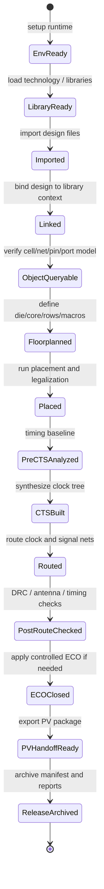
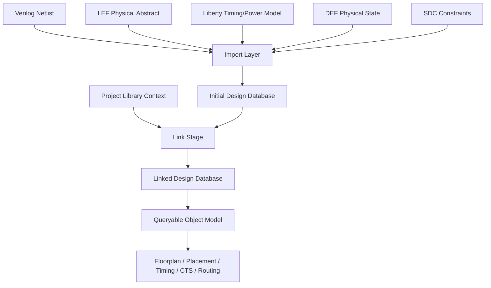
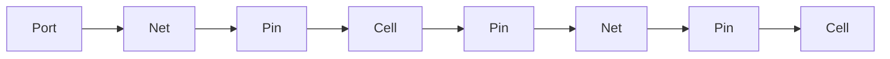
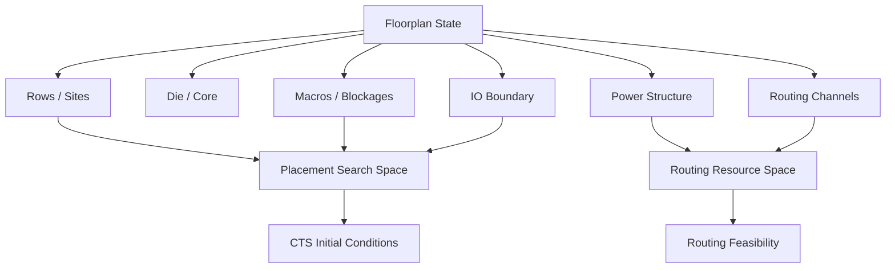
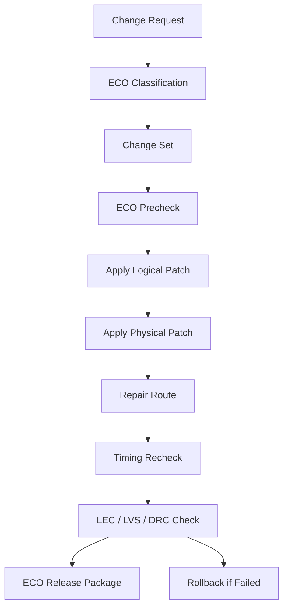
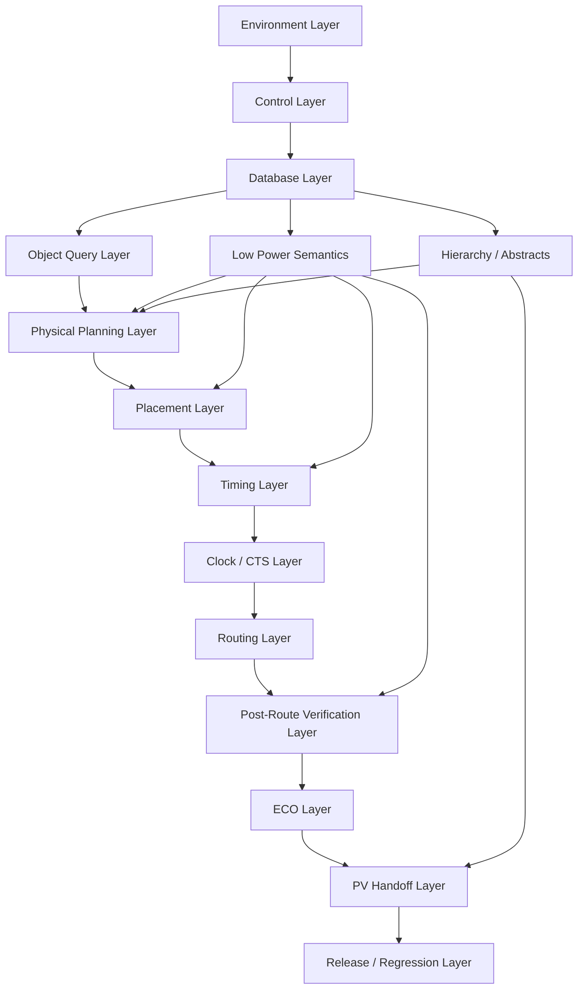
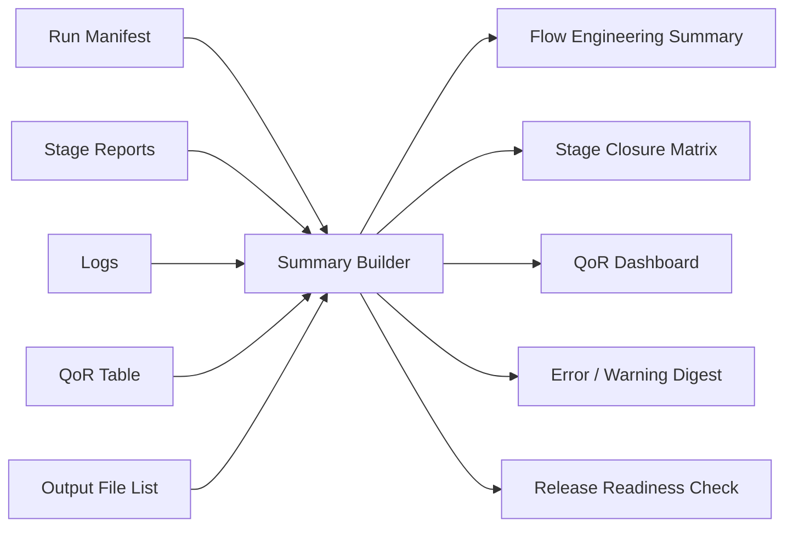

# 28. Backend Flow Engineering Summary: From Scripts, Logs, and Reports to Engineering Closure

**Author:** Darren H. Chen  
**Area:** Backend Flow / Physical Implementation / EDA Tool Engineering / Flow Engineering  
**demo:** `LAY-BE-28_backend_flow_engineering_summary`  
**Tags:** Backend Flow, EDA, Flow Engineering, Script, Log, Report, QoR, Signoff, Regression, Engineering Closure

Backend implementation is often introduced as a sequence of physical design stages:

```text
import
link
floorplan
placement
CTS
routing
DRC
ECO
PV handoff
signoff
export
```

This sequence is useful, but it hides the most important engineering idea: a backend flow is not just a list of tool commands. It is a controlled state transition system built around a design database, a library context, physical constraints, timing feedback, verification results, and release evidence.

A script that can run once is not yet a flow. A flow becomes an engineering system only when it is reproducible, observable, checkable, comparable, and maintainable.

This article summarizes Backend Flow Engineering as a complete system. The focus is not on a single command or one isolated stage, but on how runtime environment, Tcl control, logs, reports, design objects, physical implementation stages, signoff handoff, ECO, and regression evidence work together as one closure loop.

---

## 1. Backend Flow Is a State Transition System

A simple flow diagram looks like this:

```text
Netlist
  ↓
Floorplan
  ↓
Placement
  ↓
CTS
  ↓
Routing
  ↓
Signoff
```

This is easy to remember, but it is too static for real engineering work.

A backend flow is better understood as a state transition system:

```text
S0  environment initialized
S1  library context ready
S2  design imported
S3  design linked
S4  design objects queryable
S5  floorplan initialized
S6  placement legal
S7  timing baseline available
S8  clock tree built
S9  route completed
S10 post-route violations checked
S11 ECO applied if needed
S12 PV handoff package generated
S13 signoff-ready release archived
```

Each stage changes the design database. Each transition has preconditions, actions, side effects, reports, and exit criteria.

A mature flow must answer these questions for every state transition:

```text
What state am I in?
What inputs are required to leave this state?
What command sequence performs the transition?
What database objects are changed?
What reports prove the new state?
What conditions block the next stage?
How can this run be reproduced later?
```

This perspective changes how backend scripts should be written. The script should not only execute commands; it should control state transitions and preserve evidence for each transition.



---

## 2. The First Closure Loop: Reproducible Runtime Environment

The first backend closure problem is not placement, CTS, or routing. It is the runtime environment.

Two runs using the same script may behave differently if any of the following are different:

```text
tool version
license availability
working directory
HOME initialization file
PATH / LD_LIBRARY_PATH
library search path
temporary directory
shell environment
startup options
input file versions
report output location
```

A backend run starts before the design is imported. It starts when the tool session is created.

A reproducible environment should record at least:

| Item | Why It Matters |
|---|---|
| tool binary path | avoids accidentally using another installed version |
| tool version | explains command behavior and report differences |
| working directory | controls relative paths and output location |
| input manifest | records which netlist, LEF, Liberty, DEF, SDC, UPF were used |
| environment variables | captures hidden runtime dependencies |
| startup script | records session initialization behavior |
| log paths | preserves execution evidence |
| report paths | keeps stage results stable and reviewable |

A flow that cannot reproduce its environment cannot reliably reproduce its results.

The first engineering rule is:

```text
Define the runtime environment before running the flow.
```

---

## 3. Control Layer: Tcl as the Flow Control Plane

Backend tools expose internal capabilities through a command interface. In most EDA environments, Tcl is the practical control plane.

Tcl is not only used to execute commands. In backend flow engineering, it connects several layers:

```text
command system
design database
object query model
parameter system
stage execution
report generation
error handling
log and replay mechanism
```

A backend Tcl script should therefore be viewed as a control program over an EDA database, not as a text macro.

The difference is important:

| Weak Script Style | Engineering Script Style |
|---|---|
| hard-coded command sequence | stage lifecycle with precheck and postcheck |
| relies on manual inspection | writes structured reports |
| assumes current context | checks current design and object availability |
| ignores failed optional commands | records pass/fail/warn results |
| uses names as plain strings | uses object collections and properties |
| only writes a main log | writes log, command trace, summary, manifest |

A robust control layer should support:

```text
stage selection
precheck execution
fail-fast boundary
continue-on-warning policy
report registration
summary generation
run manifest generation
archive preparation
```

The second engineering rule is:

```text
Backend scripts should control tool state, not merely call tool commands.
```

---

## 4. Command Baseline: Knowing What the Tool Can Actually Do

A backend script is only as reliable as its command assumptions.

A reference script may contain a command that works in one version, one license mode, or one runtime context, but fails elsewhere. Therefore, a mature flow should establish a command help baseline.

A command baseline records:

```text
available commands
important command families
help output for key commands
unsupported or missing commands
context-sensitive commands
high-side-effect commands
version and mode information
```

A simple command family map may look like this:

| Command Family | Typical Responsibility |
|---|---|
| session | startup, exit, log, environment, help |
| import | read design and library files |
| link | bind design references to library masters |
| object query | get cells, nets, pins, ports, properties |
| floorplan | create die, core, rows, blockages, IOs |
| placement | place, legalize, optimize, check density |
| timing | create clocks, analyze paths, report slack |
| CTS | define clocks, synthesize tree, report skew |
| routing | global route, detail route, optimize route |
| PV support | DRC, antenna, fill, export, handoff |
| ECO | apply local logical or physical changes |
| report | write summaries and QoR evidence |

Command baseline is not documentation decoration. It supports script verification, version upgrade checks, and controlled flow development.

The third engineering rule is:

```text
Before relying on a command, capture its availability, syntax, and context requirements.
```

---

## 5. Database Layer: Libraries, Formats, Import, and Link

Backend tools do not operate directly on raw files forever. They parse files, create objects, bind references, and build a design database.

Important formats include:

| Format | Main Meaning in Backend Flow |
|---|---|
| Verilog | module, instance, net, port, hierarchy, logical connectivity |
| LEF | physical abstract, macro boundary, pin geometry, blockage, site, layer |
| Liberty | timing arc, power model, pin direction, function, cell attributes |
| DEF | die/core, rows, components, placement, routing, special nets |
| SDC | clock, delay, uncertainty, false/multicycle path, timing context |
| SPEF/DSPF | extracted parasitic resistance and capacitance |
| GDS/OASIS | final layout geometry for signoff and manufacturing handoff |
| UPF/CPF | power intent, domain, supply, isolation, retention, level shifter |

The design database becomes meaningful only when these views are consistent.

A Verilog instance such as:

```verilog
INVX1 U123 (.A(n1), .Y(n2));
```

is not fully understood until the tool can answer:

```text
Does INVX1 exist in the library?
Does it have a Liberty timing model?
Does it have a LEF physical abstract?
Are pins A and Y consistent across views?
Can U123 be placed on the current site/row grid?
Can its pins be routed?
Can timing arcs be analyzed?
```

This is the purpose of linking. Import brings data into the tool. Link binds that data to the project library context.



The fourth engineering rule is:

```text
Backend import is not file reading; it is database construction.
```

---

## 6. Object Query Layer: Cells, Nets, Pins, Ports, Collections, Properties, Filters

Once the design is imported and linked, the flow operates on database objects:

```text
cell
net
pin
port
clock
row
site
shape
violation
power domain
scenario
```

The core object model begins with cell, net, pin, and port:



A mature script should not rely on plain text search when the database provides object queries.

Backend object query is built around three capabilities:

```text
Collection: a set of database objects
Property: observable state of an object
Filter: selection rule based on properties or relationships
```

Example reasoning pattern:

```text
get all cells
filter sequential cells
query location and reference name
find cells near a congestion region
write a report
use the result to guide a next-stage check
```

This is different from grepping a netlist. It is database-driven flow engineering.

| Concept | Engineering Meaning |
|---|---|
| object name | textual identifier, often hierarchical |
| object handle | database reference to a real design object |
| collection | object set returned by a query |
| property | object state, type, relation, location, status |
| filter | condition that turns engineering intent into object selection |

The fifth engineering rule is:

```text
A backend flow becomes maintainable when it is built around object queries rather than hard-coded names.
```

---

## 7. Physical Layer: Floorplan Defines the Search Space

Placement does not start from an empty two-dimensional plane. It starts from a floorplan-defined physical world.

Floorplan establishes:

```text
coordinate system
die boundary
core boundary
site and row grid
macro placement
IO location
placement blockage
routing blockage
power structure
utilization target
routing channel
keepout region
```

This layer defines the search space for placement, CTS, and routing.

If floorplan is wrong, later stages may fail for reasons that appear unrelated:

| Later Symptom | Possible Floorplan Root Cause |
|---|---|
| placement overlap | invalid row/site definition or blocked area |
| routing congestion | macro channel too narrow |
| poor timing | IO/macro placement creates long physical paths |
| CTS skew outlier | clock sinks spread by poor macro/floorplan structure |
| route DRC cluster | power stripe or blockage cuts routing resources |
| ECO difficulty | no spare placement space remains |

Floorplan is not a visual drawing. It is the physical state foundation of the design database.



The sixth engineering rule is:

```text
Backend implementation does not begin with placement; it begins with defining the physical search space.
```

---

## 8. Placement Layer: Multi-Objective Physical Mapping

Placement maps the logic graph into physical space.

It must balance:

```text
legality
wirelength
timing
congestion
power
scan chain impact
clock readiness
routing feasibility
ECO repair space
```

A legal placement is not necessarily a good placement. It can still have:

```text
excessive wirelength
high local density
macro pin congestion
critical path spreading
poor clock sink distribution
low ECO margin
high routing overflow
```

A placement stage should therefore produce more than cell coordinates. It should produce evidence:

```text
placement_summary.rpt
utilization_summary.rpt
legality_check.rpt
unplaced_cell.rpt
congestion_estimate.rpt
timing_snapshot.rpt
scan_chain_physical_summary.rpt
```

Placement is a feedback stage. If placement reports show systemic congestion, the fix may be floorplan adjustment, not only placement option tuning.

The seventh engineering rule is:

```text
Placement quality must be judged by downstream feasibility, not by visual density alone.
```

---

## 9. Timing Layer: Slack and Path as the Flow Feedback Signal

Timing analysis is not an isolated final check. It is the feedback signal for backend closure.

Timing is based on paths:

```text
launch clock path
clock-to-Q delay
data path cell delay
data path net delay
capture clock path
setup/hold requirement
uncertainty and variation
```

Slack expresses whether a path satisfies its required time relationship.

For setup:

```text
setup_slack = required_time - arrival_time
```

For hold:

```text
hold_slack = arrival_time - required_time
```

Every major backend stage changes timing:

| Stage | Timing Impact |
|---|---|
| floorplan | changes macro distance, IO distance, path geography |
| placement | changes estimated wirelength and load |
| CTS | changes real clock latency and skew |
| routing | changes real RC and coupling |
| ECO | changes cell delay, net delay, logic structure |
| fill/PEX | changes parasitic capacitance and extracted delay |

A reliable flow should build timing baselines:

```text
post-link timing context check
post-floorplan timing snapshot
post-placement pre-CTS timing
post-CTS timing
post-route timing
post-ECO timing
post-fill timing
signoff timing
```

The eighth engineering rule is:

```text
Timing is the control language of backend closure, not the last report in the flow.
```

---

## 10. Clock Layer: Clock Tree as the Physical Time Distribution Network

Clock is not a normal signal net. It is the time reference of synchronous design.

CTS changes the timing model from ideal or estimated clock to real physical clock:

```text
clock source
  ↓
clock buffer / inverter
  ↓
branch net
  ↓
leaf buffer
  ↓
sink clock pin
```

CTS must consider:

```text
clock definitions
clock sources
clock sinks
skew groups
buffer/inverter library
clock gating cells
clock route rules
placement state
blockages
routing layer constraints
timing scenarios
power impact
```

The output of CTS is not simply inserted buffers. It is a physical time distribution network with latency, skew, transition, capacitance, route expectation, and timing consequences.

CTS is a major phase transition:


A mature CTS stage should compare pre-CTS and post-CTS timing, not just report that CTS completed.

The ninth engineering rule is:

```text
CTS builds the physical rhythm of the chip; it must be verified as a timing event, not only as a clock routing event.
```

---

## 11. Routing Layer: From Connectivity to Manufacturable Geometry

Routing turns logical connectivity into real metal and via geometry.

It is usually layered into:

```text
global route
detail route
route optimize
```

These stages solve different problems.

| Routing Stage | Main Question |
|---|---|
| global route | which regions and layers should each net use? |
| detail route | which exact tracks, vias, and geometries implement the net? |
| route optimize | after routing, can timing, DRC, antenna, SI, and QoR be improved? |

Routing is constrained by:

```text
track capacity
preferred direction
pin access
via rules
width and spacing rules
macro obstruction
power structure
clock route rule
antenna rule
coupling and SI
critical path priority
```

A completed route only proves that connectivity has been attempted. It does not automatically prove signoff readiness.

Routing reports should include:

```text
global_route_summary.rpt
congestion_summary.rpt
detail_route_summary.rpt
route_drc_summary.rpt
antenna_summary.rpt
post_route_timing.rpt
route_opt_summary.rpt
final_route_qor.rpt
```

The tenth engineering rule is:

```text
Routing closure means connectivity, geometry, timing, rule compliance, and manufacturability moving together.
```

---

## 12. Post-Route Verification Layer: DRC, Antenna, Fill, Extraction

Route completion is not layout closure.

Post-route closure includes:

```text
in-design DRC
signoff DRC
antenna check and repair
metal fill insertion
post-fill extraction
post-fill STA
PV handoff
LVS / PEX / signoff feedback
```

DRC checks whether geometry satisfies manufacturing rules.

Antenna checks whether manufacturing process charge accumulation may damage gates.

Metal fill checks and repairs density requirements, but it also changes parasitic capacitance.

These tasks interact:

```text
fixing DRC can change antenna
fixing antenna can create routing or timing impact
adding fill changes parasitic and timing
post-fill extraction changes STA inputs
signoff PV results may require ECO
```

A robust post-route closure plan should classify issues by type, region, root cause, and repair cost.

The eleventh engineering rule is:

```text
After routing, the goal shifts from implementation completion to physical verification closure.
```

---

## 13. PV Handoff Layer: Multi-View Signoff Transfer

Backend-to-PV handoff is not only exporting GDS.

A complete PV handoff package may include:

```text
GDS / OASIS
DEF
Verilog or LVS source netlist
LEF
layer map
DRC runset
LVS runset
PEX runset
power/ground net mapping
macro and blackbox list
waiver database
handoff manifest
```

The goal is multi-view consistency:

```text
logical view
physical view
geometry view
technology view
verification view
parasitic view
```

A handoff manifest should identify:

```text
top cell / top module
run id
file versions
export time
tool version summary
technology version
rule deck version
layer map version
power/ground aliases
macro/IP handling
known limitations
expected checks
```

Without a manifest, handoff becomes a collection of files without context.

The twelfth engineering rule is:

```text
Backend handoff delivers a verification context, not just output files.
```

---

## 14. ECO Layer: Controlled Change Under Frozen Constraints

ECO is not casual patching. It is controlled change under constraints.

At ECO stage, many parts of the design are already expensive to disturb:

```text
floorplan
macro placement
power grid
clock tree
route topology
signoff-clean regions
timing-closed paths
validated logic
```

An ECO should be represented as a change set:

```text
logical delta
physical delta
timing delta
verification delta
rollback information
```



ECO types include:

| ECO Type | Main Goal | Key Verification |
|---|---|---|
| functional ECO | change logic behavior | LEC against new reference, STA, LVS |
| setup ECO | improve late paths | setup, hold regression, power, DRC |
| hold ECO | slow short paths | hold, setup regression, route impact |
| metal-only ECO | patch using existing diffusion | LVS, routing DRC, spare cell validity |
| physical ECO | fix layout/signoff issue | DRC/LVS/PEX/timing impact |

The thirteenth engineering rule is:

```text
ECO success means consistency is preserved across logic, physical, timing, and verification views.
```

---

## 15. Low Power Layer: Power Intent as First-Class Design Semantics

Low-power implementation introduces additional semantic layers:

```text
power domain
supply set
always-on logic
isolation
level shifter
retention
power switch
power state
```

These are not comments. They affect implementation.

Power intent changes:

```text
object ownership
cross-domain signal strategy
library cell insertion
placement legality
power routing
STA scenario definition
PV connectivity checks
ECO consistency
```

A low-power flow should be able to report:

```text
power_domain_summary.rpt
supply_connectivity_summary.rpt
cross_domain_signal.rpt
isolation_plan.rpt
level_shifter_plan.rpt
retention_plan.rpt
power_switch_plan.rpt
low_power_checklist.rpt
```

The four key binding relationships are:

| Binding | Meaning |
|---|---|
| instance -> power domain | which logic belongs to which power behavior |
| power domain -> supply set | which supply powers the domain |
| crossing net -> strategy | isolation or level shifter decision |
| low-power cell -> physical supply | whether the inserted cell is actually powered correctly |

The fourteenth engineering rule is:

```text
Low-power intent must become queryable database semantics before it can become reliable physical implementation.
```

---

## 16. Hierarchical Layer: Partition, Abstract, Merge, Signoff

Large chips cannot always be handled as one flat database.

Hierarchical flow introduces:

```text
partition
block implementation
physical abstract
timing abstract
power abstract
block release
top integration
merge check
hierarchical signoff
```

The top design does not need every internal detail of each block at all times, but it must receive enough abstract information to integrate correctly.

Important block release contents include:

```text
block boundary
block pins
block LEF abstract
block GDS/OASIS
block timing model
block logical blackbox
block power information
block signoff summary
block manifest
known issues
```

Hierarchical closure is based on three simultaneous conditions:

```text
block internal closure
block interface correctness
top-level integration closure
```

The fifteenth engineering rule is:

```text
Large-chip backend flow is not a scaled-up flat flow; it is a contract-based integration system.
```

---

## 17. Script Template Layer: From Personal Scripts to Maintainable Flow

Backend scripts become unmaintainable when configuration, execution, reporting, and debugging are mixed in one file.

A maintainable script architecture separates:

```text
environment layer
configuration layer
common utility layer
stage execution layer
report layer
check layer
manifest layer
archive layer
regression layer
```

A recommended directory structure:

```text
backend_flow/
├─ config/
│  ├─ design_config.tcl
│  ├─ library_config.tcl
│  ├─ scenario_config.tcl
│  ├─ floorplan_config.tcl
│  └─ route_config.tcl
├─ scripts/
│  ├─ run_stage.csh
│  ├─ run_all.csh
│  ├─ clean.csh
│  └─ archive.csh
├─ tcl/
│  ├─ common/
│  │  ├─ env_check.tcl
│  │  ├─ report_utils.tcl
│  │  ├─ error_utils.tcl
│  │  └─ object_utils.tcl
│  ├─ stages/
│  │  ├─ 01_import.tcl
│  │  ├─ 02_floorplan.tcl
│  │  ├─ 03_place.tcl
│  │  ├─ 04_cts.tcl
│  │  ├─ 05_route.tcl
│  │  ├─ 06_post_route_check.tcl
│  │  └─ 07_export.tcl
│  └─ reports/
├─ logs/
├─ reports/
├─ output/
├─ db/
├─ tmp/
└─ README.md
```

Each stage should follow a lifecycle:

```text
precheck
execute
postcheck
report
save
```

This lifecycle makes stages predictable and reviewable.

The sixteenth engineering rule is:

```text
A backend script template should standardize stage behavior, not only command order.
```

---

## 18. Reports as Stage Interfaces

Reports are not optional decoration. Reports are the interface between stages and between engineers.

A stage should not be considered complete merely because a command returned. It should be considered complete when its required reports prove that its exit criteria are satisfied.

Example stage report contracts:

| Stage | Required Evidence |
|---|---|
| import/link | file list, top summary, unresolved references, used libraries |
| object model | cell/net/pin/port count, property availability |
| floorplan | die/core, row/site, macro, blockage, utilization |
| placement | legality, density, timing snapshot, congestion estimate |
| CTS | sink count, buffer count, skew, latency, transition, post-CTS timing |
| routing | global route, congestion, detail route, DRC, antenna, timing |
| ECO | change set, timing delta, LEC/LVS/DRC result |
| PV handoff | file inventory, manifest, DRC/LVS/PEX checklist |
| release | output manifest, final QoR, known issues, archive path |

The seventeenth engineering rule is:

```text
A stage without a report is not an engineering boundary.
```

---

## 19. Manifest and Regression: Turning Runs into Engineering Assets

Every run should have a manifest.

A manifest records:

```text
run id
run date
user / host
tool version
design version
library version
constraint version
script revision
configuration revision
stage list
input files
output files
known issues
status
```

Regression compares runs.

Important comparison metrics include:

```text
area
utilization
WNS / TNS / violation count
setup / hold status
congestion score
DRC count
antenna count
route length
via count
runtime
memory
warning count
error count
output file completeness
```

Without regression, flow development becomes guesswork.

The eighteenth engineering rule is:

```text
A backend flow becomes an engineering asset when each run can be identified, compared, explained, and reproduced.
```

---

## 20. Complete Backend Flow Engineering Architecture

The full system can be summarized as a layered architecture:



This architecture explains why backend engineering is not a simple linear pipeline. Multiple semantic layers feed into physical implementation and verification.

The flow is mature only when every layer is observable and every transition is reviewable.

---

## 21. Engineering Maturity Levels

Backend flow maturity can be described in four levels.

| Level | Capability | Typical Evidence |
|---|---|---|
| Level 1: Can Run | commands execute and generate outputs | main log, basic output files |
| Level 2: Can Observe | results can be inspected | reports, summaries, warnings, errors |
| Level 3: Can Reproduce | run can be recreated | command log, manifest, input/output inventory |
| Level 4: Can Evolve | flow can be maintained and improved | regression, diff reports, templates, release contracts |

Many flows stop at Level 1. They can run, but they cannot explain themselves.

A professional backend flow should target Level 4.

---

## 22. Demo 28 Design

The purpose of `LAY-BE-28_backend_flow_engineering_summary` is to summarize a backend run into a structured engineering closure view.

This demo does not need to implement a full chip. It should collect and organize evidence from a flow run.

Recommended inputs:

```text
data/sample_run_manifest.yaml
data/sample_stage_summary.rpt
data/sample_error_warning.log
data/sample_qor_table.csv
data/sample_output_file_list.txt
data/sample_stage_checklist.csv
```

Recommended processing steps:

```text
1. read run manifest
2. parse stage completion status
3. collect error and warning summary
4. summarize QoR metrics
5. check expected output files
6. build stage closure matrix
7. generate release readiness checklist
8. write final engineering summary
```

Recommended outputs:

```text
reports/flow_engineering_summary.rpt
reports/stage_closure_matrix.rpt
reports/qor_dashboard.rpt
reports/error_warning_digest.rpt
reports/output_manifest_check.rpt
reports/release_readiness_check.rpt
logs/flow_summary.log
```

The demo verifies that a run can be transformed from scattered files into a reviewable engineering state.



---

## 23. Stage Closure Matrix

A useful final summary is a stage closure matrix.

| Stage | Precheck | Execute | Report | Exit Criteria | Status |
|---|---:|---:|---:|---|---|
| Environment | PASS | PASS | PASS | version, path, log dir recorded | PASS |
| Library | PASS | PASS | PASS | LEF/Liberty loaded and summarized | PASS |
| Import / Link | PASS | PASS | PASS | top resolved, no missing critical master | PASS |
| Object Query | PASS | PASS | PASS | cell/net/pin/port queryable | PASS |
| Floorplan | PASS | PASS | PASS | die/core/rows/macros valid | PASS |
| Placement | PASS | PASS | PASS | legal placement, no unplaced cells | PASS |
| Timing | PASS | PASS | PASS | baseline WNS/TNS recorded | WARN |
| CTS | PASS | PASS | PASS | skew/latency reported | PASS |
| Routing | PASS | PASS | PASS | route summary and DRC snapshot present | WARN |
| Post-Route | PASS | PASS | PASS | DRC/antenna/fill plan generated | WARN |
| ECO | PASS | SKIP | PASS | no ECO required or ECO closed | PASS |
| PV Handoff | PASS | PASS | PASS | manifest and checklist generated | PASS |
| Release | PASS | PASS | PASS | archive and manifest complete | PASS |

This matrix is valuable because it separates execution success from engineering readiness.

A stage may execute successfully but still exit with warning status if its QoR or verification evidence is incomplete.

---

## 24. Final Engineering Principles

The 28-part backend flow can be summarized into a small set of engineering principles.

| No. | Principle |
|---:|---|
| 1 | Define runtime state before design state. |
| 2 | Treat Tcl as a control plane over the design database. |
| 3 | Build command baselines before relying on commands. |
| 4 | Treat import/link as database construction, not file reading. |
| 5 | Use object queries, properties, and filters instead of raw text assumptions. |
| 6 | Define physical search space before placement. |
| 7 | Evaluate placement through downstream feasibility. |
| 8 | Use timing as a feedback signal across all stages. |
| 9 | Treat CTS as physical time distribution, not buffer insertion. |
| 10 | Separate global route, detail route, and route optimization. |
| 11 | Treat post-route checks as the beginning of signoff closure. |
| 12 | Deliver PV context, not only GDS. |
| 13 | Handle ECO as controlled multi-view consistency change. |
| 14 | Make power intent queryable and verifiable. |
| 15 | Use hierarchy as a contract system: partition, abstract, release, merge. |
| 16 | Standardize scripts by stage lifecycle. |
| 17 | Make reports the formal interface between stages. |
| 18 | Use manifest and regression to turn runs into engineering assets. |

---

## 25. Conclusion

Backend Flow Engineering is not about memorizing more commands. It is about building a system that can control, observe, verify, reproduce, compare, and evolve physical implementation runs.

A mature backend flow has these qualities:

```text
environment is reproducible
commands are controlled
objects are queryable
inputs are verified
state transitions are explicit
reports are archived
errors are summarized
QoR is comparable
handoff is traceable
release is reviewable
```

The endpoint of a backend flow is not merely a completed run.

The endpoint is an engineering closure package: scripts, logs, reports, manifests, QoR summaries, verification evidence, handoff files, and enough context for another engineer to reproduce, review, debug, and continue the work.

Backend flow maturity begins when the question changes from:

```text
Did the script run?
```

to:

```text
Can the result be explained, reproduced, verified, handed off, and improved?
```

That is the difference between a command sequence and an engineering system.
